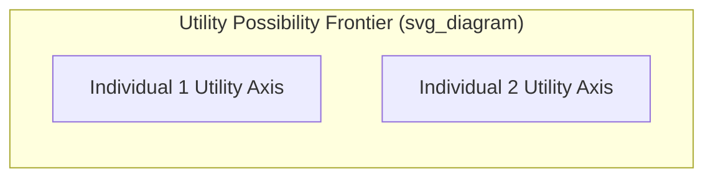

## Pareto Efficiency

### Definition

**Pareto efficiency** (also called Pareto optimality) describes an allocation of resources in which it is impossible to make any one individual better off without making at least one other individual worse off. It is named after economist Vilfredo Pareto and serves as a foundational efficiency criterion in welfare economics.

**Formal Definition**

An allocation $A$ is Pareto efficient if there exists no alternative feasible allocation $A'$ such that:

$$U_i(A') \geq U_i(A) \text{ for all individuals } i, \quad \text{with strict inequality for at least one } i$$

If such an allocation $A'$ exists, then $A'$ is called a **Pareto improvement** over $A$, and $A$ is said to be Pareto **inefficient** (or Pareto dominated).

### Pareto Improvement vs. Pareto Efficiency

**Key Points**

- A **Pareto improvement** is a *change* from one allocation to another that makes at least one person better off without making anyone worse off
- **Pareto efficiency** is a *property* of a specific allocation — namely, that no further Pareto improvement is possible from that point
- An economy can have **multiple** Pareto-efficient allocations, each corresponding to a different distribution of welfare among individuals

**Example**

Suppose two roommates split a pizza with 8 slices. If Roommate A currently has 3 slices and Roommate B has 5, and Roommate A actually prefers salad while Roommate B loves pizza, then trading some of A's remaining pizza for some of B's hypothetical salad portion (if available) could make both better off — this trade constitutes a Pareto improvement. Once no such further mutually beneficial trade is possible, the allocation is Pareto efficient.

### Pareto Efficiency Does Not Imply Equity

**Key Points**

- Pareto efficiency is a criterion concerning the elimination of *waste* (unrealized mutual gains), not a criterion of fairness or equality
- A highly unequal allocation — for instance, one individual holding almost all resources — can still be Pareto efficient, provided no further trade could make someone better off without harming another
- This distinction is central to welfare economics: **efficiency and equity are separate dimensions** of evaluating an allocation, and a policymaker must apply additional value judgments (via a social welfare function) to choose among the many Pareto-efficient outcomes

[Inference] Because Pareto efficiency is compatible with a very wide range of distributional outcomes, using it as the sole criterion for evaluating economic policy is generally considered insufficient by most economists for questions where distributional consequences are a central concern; additional normative criteria are typically invoked in those cases.

### Pareto Efficiency in Exchange (Edgeworth Box Context)

In a pure exchange economy between two consumers and two goods, Pareto efficiency in exchange requires:

$$MRS^1_{XY} = MRS^2_{XY}$$

Both consumers' marginal rates of substitution between the two goods must be equal. Graphically, this corresponds to points of **tangency** between the two consumers' indifference curves within the Edgeworth box, tracing out the **contract curve** — the complete locus of Pareto-efficient allocations in the exchange economy.

### Pareto Efficiency in Production

In production, Pareto efficiency (productive efficiency) requires that inputs be allocated across industries such that no reallocation of inputs could increase output of one good without decreasing output of another.

$$MRTS^X_{LK} = MRTS^Y_{LK}$$

This condition places the economy **on** its Production Possibilities Frontier (PPF) — any point inside the PPF is Pareto inefficient in production, since resources could be reallocated to produce more of at least one good without reducing output of the other.

### Overall (Full) Pareto Efficiency in a General Equilibrium

Achieving Pareto efficiency across an *entire* economy (not just within exchange or within production separately) requires **three simultaneous conditions**:

1. **Efficiency in exchange**: $MRS^1_{XY} = MRS^2_{XY}$
2. **Efficiency in production**: $MRTS^X_{LK} = MRTS^Y_{LK}$
3. **Efficiency in product mix (top-level allocative efficiency)**: $MRT_{XY} = MRS_{XY}$, where $MRT_{XY}$ (marginal rate of transformation) is the slope of the PPF, ensuring the specific combination of goods produced matches what consumers value at the margin

**Key Points**

If any one of these three conditions fails, the overall economy is not fully Pareto efficient, even if the other two conditions hold — for instance, an economy could be efficient in both exchange and production, yet still produce the "wrong" mix of goods relative to consumer preferences, violating the third condition.

### The First Fundamental Theorem of Welfare Economics

**Statement**: Under standard assumptions (complete markets, perfect competition, no externalities, no public goods, and no informational asymmetries), any competitive (Walrasian) equilibrium is Pareto efficient.

**Key Points**

- This theorem provides the formal justification for the claim that competitive markets, under idealized conditions, achieve efficient outcomes without centralized coordination
- The theorem is a statement about **efficiency only** — it makes no claim regarding the fairness or desirability of the resulting distribution of welfare

### The Second Fundamental Theorem of Welfare Economics

**Statement**: Under similar standard assumptions (with the important addition of convex preferences and convex production sets), any Pareto-efficient allocation can be achieved as a competitive equilibrium outcome, provided the initial endowments are first redistributed appropriately via **lump-sum transfers**.

**Key Points**

- This theorem separates the **efficiency question** from the **equity question**: society can, in principle, select any Pareto-efficient (and thus non-wasteful) allocation it considers fair, and then rely on competitive markets to actually implement that allocation, given the correct initial redistribution
- The practical feasibility of implementing purely lump-sum, non-distortionary transfers is a significant real-world limitation of this theorem [Inference], since real-world redistribution mechanisms (taxes, subsidies) typically create their own distortions and deadweight losses, unlike the idealized lump-sum transfers assumed in the theorem

### Conditions Required for Pareto Efficiency to Hold in Competitive Markets

The First Welfare Theorem's conclusion depends on several idealized assumptions, each of which, if violated, can prevent competitive equilibrium from achieving Pareto efficiency:

| Assumption | Consequence if Violated |
| --- | --- |
| No externalities | External costs/benefits not reflected in market prices, leading to over- or under-production |
| Perfect competition (no market power) | Firms with market power restrict output below the competitive/efficient level |
| Complete markets | Missing markets for certain goods/risks prevent efficient allocation |
| No public goods | Free-rider problems lead to underprovision of non-excludable, non-rival goods |
| name | No information asymmetries |

**Example**

A factory that pollutes a river without bearing the cost of that pollution represents a **negative externality**. The market outcome (private equilibrium) fails to be Pareto efficient because a Pareto improvement is available: reducing pollution and compensating affected parties could make the affected parties better off without necessarily making the factory owner worse off, once the true social costs and benefits are accounted for.

### Market Failures and the Breakdown of Pareto Efficiency

Situations that prevent competitive markets from achieving Pareto efficiency are collectively known as **market failures**, including:

- **Externalities**: Costs or benefits affecting third parties not reflected in market transactions
- **Public goods**: Non-excludable, non-rival goods leading to free-riding and underprovision
- **Market power**: Monopoly, oligopoly, or monopsony power restricting output relative to the competitive/efficient level
- **Information asymmetries**: Adverse selection and moral hazard distorting incentives and outcomes
- **Incomplete markets**: Absence of markets for certain goods, risks, or future contingencies

### Pareto Efficiency vs. Kaldor-Hicks Efficiency

Because the strict Pareto criterion requires that **no one** be made worse off, it is often too restrictive to evaluate real-world policy changes, which typically create both winners and losers. The **Kaldor-Hicks efficiency criterion** relaxes this requirement.

**Kaldor-Hicks Criterion**

A change is Kaldor-Hicks efficient if the gainers from the change could, **hypothetically**, fully compensate the losers and still remain better off — regardless of whether that compensation is actually paid.

**Key Points**

- Kaldor-Hicks efficiency is a **weaker** and more broadly applicable standard than Pareto efficiency, since it does not require compensation to actually occur, only that it be theoretically possible
- This criterion underlies most cost-benefit analysis used in practical policy evaluation, since virtually all real-world policies generate both winners and losers
- [Inference] Critics note that because compensation is often not actually paid under Kaldor-Hicks reasoning, applying this criterion in practice can mask real distributional harms to specific groups, even when aggregate net benefits are positive

### Pareto Frontier / Utility Possibility Frontier

The **Pareto frontier** (or utility possibility frontier) is the set of all Pareto-efficient utility combinations attainable in an economy, typically illustrated with one individual's utility on each axis.

**Verbal description:**

- The frontier is generally downward-sloping and often drawn as concave to the origin, since increasing one individual's utility along the efficient frontier typically requires decreasing another's, given fixed total resources
- Points inside the frontier are Pareto inefficient (a Pareto improvement is available, moving toward the frontier)
- Points on the frontier are Pareto efficient
- Points outside the frontier are currently unattainable given the economy's resources and technology
- A **social welfare function** can be used to select a specific point along this frontier as the socially "best" outcome, incorporating explicit value judgments about the relative importance of different individuals' utility

### Common Pitfalls and Misconceptions

- **Equating Pareto efficiency with social optimality or fairness**: Pareto efficiency is silent on distributional justice; an extremely unequal allocation can be Pareto efficient
- **Assuming a unique Pareto-efficient outcome exists**: There is typically an entire set (frontier or contract curve) of Pareto-efficient allocations, not a single one
- **Conflating Pareto efficiency with Kaldor-Hicks efficiency**: Pareto efficiency requires no one be made worse off; Kaldor-Hicks only requires that the gainers *could* compensate the losers, a substantially weaker and more commonly applied practical standard
- **Assuming competitive markets always achieve Pareto efficiency in practice**: The First Welfare Theorem depends on a specific set of idealized conditions (no externalities, no market power, complete markets, no informational asymmetries) that frequently do not hold in real-world markets, meaning market failures are common in practice, not merely theoretical curiosities

**Related Topics**

- Edgeworth box and exchange efficiency
- Efficiency in production and the production possibilities frontier
- First and Second Fundamental Theorems of Welfare Economics
- Kaldor-Hicks efficiency and cost-benefit analysis
- Externalities and market failure
- Public goods and the free-rider problem
- Social welfare functions and equity-efficiency tradeoffs
- Partial vs general equilibrium analysis