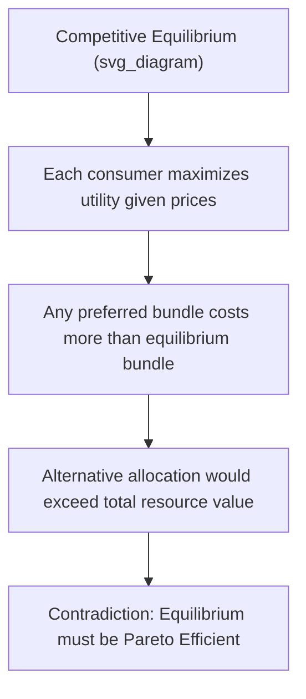

## First and Second Welfare Theorems

### Overview and Significance

The **Fundamental Theorems of Welfare Economics** formally establish the relationship between competitive market equilibria and Pareto efficiency. They represent the mathematical foundation for the classical economic argument (traceable to Adam Smith's "invisible hand") that decentralized, self-interested market behavior can achieve socially efficient outcomes without centralized planning — while also clarifying the precise limits of that claim.

**Key Points**

- The **First Theorem** moves from markets to efficiency: it shows that competitive equilibria are efficient
- The **Second Theorem** moves from efficiency to markets: it shows that efficient allocations can be achieved through markets, provided endowments are appropriately redistributed first
- Together, the two theorems separate the analysis of **efficiency** from the analysis of **equity**, a distinction central to modern welfare economics

### The First Fundamental Theorem of Welfare Economics

**Formal Statement**

Under a specified set of conditions, every competitive (Walrasian) equilibrium allocation is Pareto efficient.

**Required Assumptions**

- **Perfect competition**: All agents (consumers and firms) are price-takers, with no market power
- **Complete markets**: Markets exist for all goods and services relevant to consumers' and firms' decisions, including markets spanning all relevant time periods and states of the world
- **No externalities**: Production and consumption decisions do not impose uncompensated costs or benefits on third parties
- **No public goods**: All goods are excludable and rival, avoiding free-rider problems
- **No informational asymmetries**: All relevant information is available to all market participants (or informational imperfections do not distort market outcomes)
- **Local non-satiation of preferences**: Consumers always prefer at least slightly more of some good, ensuring no consumer would voluntarily leave income unspent

**Intuition Behind the Proof**

The proof proceeds by contradiction. Suppose a competitive equilibrium allocation were *not* Pareto efficient. Then there would exist an alternative feasible allocation making at least one consumer better off without making any other consumer worse off. However, because each consumer at the competitive equilibrium is already choosing their utility-maximizing bundle subject to their budget constraint, any bundle that would make them better off must cost more than their current equilibrium expenditure. Aggregating this logic across all consumers implies the alternative allocation would cost more, in aggregate, than the total value of the economy's resources — violating feasibility. This contradiction establishes that the competitive equilibrium must be Pareto efficient.

**Graphical Illustration (Edgeworth Box)**

In a two-consumer, two-good exchange economy, the First Theorem is illustrated by showing that the competitive equilibrium allocation — where both consumers' budget lines intersect at a common price ratio and each consumer chooses their utility-maximizing point along that line — necessarily lies on the **contract curve**, since both consumers independently set their marginal rate of substitution equal to the same price ratio:

$$MRS^1_{XY} = \frac{P_X}{P_Y} = MRS^2_{XY}$$

Since both equal the same price ratio, $MRS^1_{XY} = MRS^2_{XY}$ — precisely the tangency condition defining a point on the contract curve.

### The Second Fundamental Theorem of Welfare Economics

**Formal Statement**

Under a specified set of conditions (which include those for the First Theorem plus additional convexity requirements), any Pareto-efficient allocation can be supported as a competitive equilibrium outcome, provided society first redistributes initial endowments via appropriate **lump-sum transfers**.

**Additional Required Assumptions (beyond the First Theorem)**

- **Convex preferences**: Consumers' indifference curves are convex to the origin (diminishing marginal rate of substitution)
- **Convex production sets**: Firms' technology exhibits non-increasing returns to scale (or constant returns), avoiding non-convexities that could prevent price-supported equilibria
- **Continuity of preferences**

**Intuition**

Given any target Pareto-efficient allocation, there exists a price system (a set of relative prices) at which that specific allocation is utility-maximizing for every consumer, subject to a budget constraint derived from an appropriately redistributed endowment. In other words, for any point on the contract curve, a hyperplane (a price line, in two dimensions) can be found that supports that point — i.e., is tangent to both consumers' indifference curves at that point.

**Why Convexity Matters**

[Inference] If preferences or production sets are non-convex, a supporting price line may not exist for certain Pareto-efficient points — meaning some efficient allocations cannot be achieved through any competitive price system, regardless of how endowments are redistributed; this is a more technical qualification generally covered in graduate-level treatments of general equilibrium theory rather than introductory courses.

### The Role of Lump-Sum Transfers

A **lump-sum transfer** is a transfer of purchasing power (income or endowment) between agents that does not depend on, and therefore does not distort, any economic choice (such as labor supply, consumption of a particular good, or production decisions).

**Key Points**

- The Second Theorem's practical relevance rests critically on the *feasibility* of implementing purely lump-sum transfers
- Real-world redistribution mechanisms (income taxes, sales taxes, subsidies) are typically **not** lump-sum, since they alter relative prices or returns to effort, thereby creating deadweight losses and distorting behavior
- This creates a significant gap between the theorem's idealized conditions and real-world policy tools, since a truly non-distortionary lump-sum tax (e.g., a fixed poll tax unrelated to any economic characteristic) is rarely used in practice due to both political and practical constraints

### Separating Efficiency from Equity

The two theorems together provide a conceptual division of labor for economic policy analysis:

| Question | Relevant Theorem | Tool |
| --- | --- | --- |
| Is the current market outcome efficient? | First Theorem | Assess whether competitive conditions and no market failures hold |
| Can we achieve a more equitable, but still efficient, outcome? | Second Theorem | Redistribute endowments via lump-sum transfers, then rely on markets |

**Key Points**

This division suggests, in principle, that economists and policymakers can address efficiency and equity as **separate problems**: use competitive markets to ensure efficiency, and use lump-sum redistribution (a political/social choice) to select the preferred point among the many efficient outcomes on the contract curve or utility possibility frontier. [Inference] Whether this theoretical separation is achievable in practice is a matter of ongoing debate in public economics, primarily due to the practical unavailability of purely non-distortionary lump-sum transfer instruments.

### When the Theorems Fail: Market Failures

Because both theorems rely on the same core set of idealized assumptions, real-world deviations from those assumptions represent **market failures** that break the link between competitive equilibrium and Pareto efficiency:

- **Externalities**: Uncompensated third-party effects (pollution, positive spillovers from education) cause market prices to misstate true social costs/benefits
- **Public goods**: Non-excludability leads to free-riding and underprovision relative to the efficient level
- **Market power**: Monopoly or oligopoly pricing above marginal cost restricts output below the efficient level
- **Information asymmetries**: Adverse selection and moral hazard distort incentives, preventing markets from clearing efficiently
- **Incomplete markets**: Missing markets for certain risks or future goods prevent achieving certain efficient allocations

**Example**

A market with a significant negative externality, such as unregulated industrial pollution, will generally **not** achieve a Pareto-efficient outcome via unregulated competitive equilibrium, since the polluting firm does not bear the full social cost of its production, leading to overproduction relative to the socially efficient level. In this case, the First Welfare Theorem's conclusion does not hold, precisely because one of its required assumptions (no externalities) is violated.

### Policy Implications

**Implications of the First Theorem**

- Provides a theoretical justification for relying on competitive markets to achieve efficient resource allocation when the required conditions are reasonably approximated
- Highlights the importance of correcting market failures (via Pigouvian taxes, regulation, property rights assignment, antitrust policy) precisely because these interventions restore conditions under which competitive markets can achieve efficiency

**Implications of the Second Theorem**

- Suggests that concerns about inequality in market outcomes can, in principle, be addressed via redistribution (transfers) rather than by directly interfering with market prices or production decisions (e.g., price controls), since direct price interventions typically introduce their own inefficiencies
- Underpins the economic argument that **redistributive taxation** should ideally be designed to be as non-distortionary as possible (approximating lump-sum transfers), a principle influencing optimal tax theory

### Common Pitfalls and Misconceptions

- **Interpreting the First Theorem as proof that all markets are efficient in practice**: The theorem is conditional on a specific, often unrealistic, set of assumptions; its conclusion does not automatically apply to markets with externalities, market power, or incomplete information
- **Assuming the Second Theorem implies redistribution is costless**: The theorem assumes **lump-sum** transfers are available; real-world taxes and transfers are typically distortionary, undermining the direct policy applicability of the theorem's clean efficiency-equity separation
- **Believing Pareto efficiency (established by the First Theorem) implies a socially desirable outcome**: The First Theorem says nothing about whether the resulting distribution of welfare is fair; a highly unequal but efficient outcome is fully consistent with the theorem
- **Confusing "can be achieved" with "will be achieved"**: The Second Theorem is an existence result showing that a supporting price system *exists* for a given efficient allocation — it does not claim that real-world political processes will actually identify and implement the correct lump-sum redistribution required

**Related Topics**

- Pareto efficiency and the Pareto frontier
- Edgeworth box and exchange efficiency
- Efficiency in production and the production possibilities frontier
- Externalities and Pigouvian taxation
- Market failure and public goods
- Optimal taxation and lump-sum vs distortionary taxes
- Social welfare functions and equity-efficiency tradeoffs
- Partial vs general equilibrium analysis