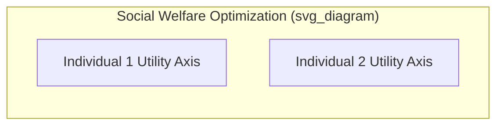

## Social Welfare Functions

### Definition and Purpose

A **social welfare function (SWF)** is a mathematical function that aggregates the individual utilities (or well-being) of all members of society into a single measure of overall social welfare. It provides a formal mechanism for ranking different economic allocations or states of the world according to their desirability from society's perspective, incorporating explicit value judgments about how individual welfare should be weighed and combined.

$$W = f(U_1, U_2, \ldots, U_n)$$

where $W$ represents social welfare, $U_i$ represents the utility of individual $i$, and $n$ is the number of individuals in society.

**Key Points**

- A social welfare function is a **normative** construct — it embeds ethical or political value judgments about how to weigh different individuals' welfare, rather than being derived purely from positive (descriptive) economic analysis
- SWFs are primarily used to select among the many Pareto-efficient allocations on the utility possibility frontier, since Pareto efficiency alone cannot rank efficient outcomes relative to one another
- Different specifications of the SWF embody fundamentally different philosophical views about equity, fairness, and the relative moral weight assigned to individuals

### Relationship to the Utility Possibility Frontier

The **utility possibility frontier (UPF)** represents all Pareto-efficient combinations of utility across individuals, given the economy's resources and technology. A social welfare function is used to select the single "best" point along this frontier according to society's value judgments.

**Verbal description of the standard diagram:**

- The utility possibility frontier is plotted with Individual 1's utility on one axis and Individual 2's utility on the other, typically downward-sloping and concave to the origin
- **Social indifference curves** (or social welfare contours), derived from the specific SWF, are overlaid on the same diagram
- The socially optimal allocation occurs where the highest attainable social indifference curve is **tangent** to the utility possibility frontier
- Different SWF specifications produce social indifference curves of different shapes, leading to different optimal points along the same UPF

**Mathematical Condition**

At the socially optimal point, the slope of the social indifference curve equals the slope of the utility possibility frontier:

$$\frac{\partial W / \partial U_1}{\partial W / \partial U_2} = -\frac{dU_2}{dU_1}\bigg|_{UPF}$$

### Major Forms of Social Welfare Functions

**1. Utilitarian (Classical Benthamite) Social Welfare Function**

$$W = \sum_{i=1}^{n} U_i = U_1 + U_2 + \cdots + U_n$$

- Social welfare is the simple (unweighted) **sum** of individual utilities
- Implies society is indifferent to the distribution of utility, caring only about the **total** — a marginal unit of utility is valued equally regardless of who receives it
- Associated with philosopher Jeremy Bentham and the utilitarian tradition
- **Social indifference curves** under this specification are straight lines with a slope of $-1$ (in a two-person case), since one unit of utility for Individual 1 is treated as a perfect substitute for one unit of utility for Individual 2

**2. Weighted Utilitarian Social Welfare Function**

$$W = \sum_{i=1}^{n} a_i U_i$$

where $a_i$ are welfare weights reflecting the relative social importance assigned to individual $i$'s utility. This generalizes the classical utilitarian form by allowing unequal weighting across individuals, still summing (rather than transforming) individual utilities.

**3. Rawlsian (Maximin) Social Welfare Function**

$$W = \min(U_1, U_2, \ldots, U_n)$$

- Social welfare is determined entirely by the utility of the **worst-off** individual in society
- Associated with philosopher John Rawls and his "veil of ignorance" thought experiment, in which individuals choosing principles of justice without knowing their own future position in society would rationally prioritize the welfare of the least advantaged
- **Social indifference curves** under this specification are **L-shaped** (right angles), since increasing the utility of anyone other than the current worst-off individual does not raise social welfare at all
- Implies an extreme form of inequality aversion: any improvement in the position of the least well-off individual raises social welfare, while improvements elsewhere do not, until the identity of the worst-off individual changes

**4. Cobb-Douglas / Nash Social Welfare Function**

$$W = U_1^{\alpha} U_2^{1-\alpha}, \quad 0 < \alpha < 1$$

- Social welfare is the (weighted) **product** of individual utilities rather than their sum
- Produces convex-to-the-origin social indifference curves, reflecting a moderate degree of inequality aversion between the extremes of utilitarianism (linear) and Rawlsian (L-shaped)
- Related to the Nash bargaining solution in cooperative game theory

**5. Constant Elasticity (Atkinson-Style) Social Welfare Function**

$$W = \sum_{i=1}^{n} \frac{U_i^{1-\varepsilon}}{1-\varepsilon}, \quad \varepsilon \geq 0$$

- A general functional form parameterized by $\varepsilon$, representing the degree of **inequality aversion**
- As $\varepsilon \to 0$, this approaches the utilitarian (sum) form
- As $\varepsilon \to \infty$, this approaches the Rawlsian (maximin) form
- Intermediate values of $\varepsilon$ produce intermediate degrees of inequality aversion, allowing this framework to nest utilitarian and Rawlsian views as special/limiting cases

### Comparison Table of Major SWF Forms

| SWF Type | Formula | Inequality Aversion | Social Indifference Curve Shape |
| --- | --- | --- | --- |
| Utilitarian | $\sum U_i$ | None (indifferent to distribution) | Straight line, slope $-1$ |
| Weighted Utilitarian | $\sum a_i U_i$ | Depends on weights $a_i$ | Straight line, slope $-a_1/a_2$ |
| Cobb-Douglas/Nash | $U_1^\alpha U_2^{1-\alpha}$ | Moderate | Convex to origin |
| Rawlsian (Maximin) | $\min(U_1, \ldots, U_n)$ | Extreme (only worst-off matters) | L-shaped (right angle) |
| Constant Elasticity | $\sum \frac{U_i^{1-\varepsilon}}{1-\varepsilon}$ | Parameterized by $\varepsilon$ | Ranges from linear to L-shaped |

### Worked Example

Suppose the utility possibility frontier is given by $U_1 + 2U_2 = 100$ (a linear UPF for simplicity), and society uses a **utilitarian** SWF.

**Step 1**: Maximize $W = U_1 + U_2$ subject to $U_1 + 2U_2 = 100$.

**Step 2**: Substituting $U_1 = 100 - 2U_2$ into $W$: $W = (100 - 2U_2) + U_2 = 100 - U_2$.

**Step 3**: Since $W$ is decreasing in $U_2$, welfare is maximized by setting $U_2$ as low as possible (i.e., at a corner solution where $U_2 = 0$, giving $U_1 = 100$), since the marginal social value of utility is treated identically for both individuals, and the UPF here allows Individual 1 to generate more total utility per unit of resource shifted.

**Contrast with Rawlsian SWF**: Maximizing $W = \min(U_1, U_2)$ subject to the same constraint would instead push toward **equalizing** $U_1$ and $U_2$ (since the minimum is maximized when neither utility is being "wasted" by being higher than necessary), yielding a very different, more equal allocation: setting $U_1 = U_2$, we get $U_1 + 2U_1 = 100 \Rightarrow U_1 = U_2 = 33.3$.

**Key Points**

This example illustrates how radically different SWF specifications can prescribe very different "optimal" allocations from the same underlying utility possibility frontier, underscoring the importance of the value judgments embedded in SWF choice.

### Arrow's Impossibility Theorem and the Challenge of Constructing SWFs

**Kenneth Arrow's Impossibility Theorem** (1951) poses a foundational challenge to the project of constructing a social welfare function from individual preferences via voting or ranking procedures.

**Statement (informal)**: No method of aggregating individual ordinal preference rankings into a social ranking can simultaneously satisfy all of the following seemingly reasonable conditions when there are three or more options to rank:

- **Unrestricted domain**: The function must work for any possible set of individual preferences
- **Non-dictatorship**: No single individual's preferences automatically determine the social ranking regardless of others' preferences
- **Pareto efficiency**: If everyone prefers option A to option B, society should rank A above B
- **Independence of irrelevant alternatives**: The social ranking between two options should not depend on individuals' preferences regarding a third, unrelated option

**Key Points**

- This theorem is a significant caveat regarding SWFs based on **ordinal** preference rankings (voting-based aggregation)
- [Inference] Many of the specific SWF functional forms discussed above (utilitarian, Rawlsian, etc.) instead rely on **cardinal**, interpersonally comparable utility, which sidesteps Arrow's theorem but introduces its own significant conceptual and measurement challenges, since interpersonal utility comparisons are difficult to establish empirically and are themselves subject to considerable philosophical debate

### Applications in Economic Policy

**Optimal Taxation**

Social welfare functions underpin the theory of **optimal income taxation** (e.g., the Mirrlees model), where a policymaker chooses a tax schedule to maximize a specified SWF subject to behavioral responses (labor supply effects) and government revenue requirements, explicitly trading off equity gains from redistribution against efficiency losses from distortionary taxation.

**Cost-Benefit Analysis**

Government project evaluation often implicitly or explicitly uses a social welfare framework (frequently a utilitarian-style aggregation, sometimes with distributional weights) to determine whether a policy's benefits justify its costs across the affected population.

**Poverty and Inequality Measurement**

The Atkinson inequality index and related measures are directly derived from constant-elasticity SWFs, translating a chosen degree of inequality aversion into a specific numerical index of societal inequality.

### Common Pitfalls and Misconceptions

- **Treating the choice of SWF as a purely technical/objective matter**: The selection of a specific SWF functional form embeds substantive ethical value judgments (how much to weigh equality versus total welfare); it is not a value-free technical choice
- **Assuming utilitarian SWFs are "neutral" or default**: While mathematically simple, the utilitarian form embeds the specific value judgment that redistribution has no independent value beyond its effect on the utility sum — this is as much a normative choice as any other SWF form
- **Ignoring interpersonal utility comparison problems**: Most cardinal SWF applications implicitly assume utility can be meaningfully compared and, in some cases, summed across different individuals — a substantive and contestable assumption in economic theory, since utility is fundamentally a subjective, individual-specific concept
- **Confusing Pareto efficiency with the SWF-optimal point**: A change that increases social welfare according to a given SWF is not necessarily a Pareto improvement (it may make some individuals worse off while increasing the SWF value); conversely, many different Pareto-efficient points may exist, only one of which maximizes a given SWF

**Related Topics**

- Pareto efficiency and the Pareto frontier
- Utility possibility frontier and the contract curve
- Arrow's Impossibility Theorem and social choice theory
- Optimal taxation and the equity-efficiency tradeoff
- Rawlsian justice and the veil of ignorance
- Utilitarianism in welfare economics
- Inequality measurement (Gini coefficient, Atkinson index)
- Cost-benefit analysis in public policy