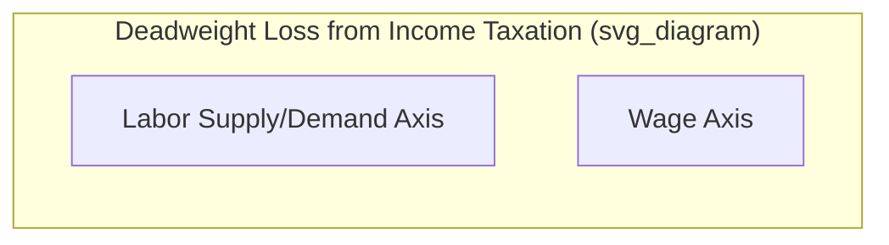
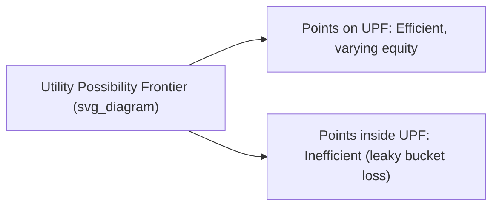

## Equity vs Efficiency Tradeoffs

### Definition and Core Tension

The **equity-efficiency tradeoff** refers to the frequently observed tension between two distinct goals of economic policy: **efficiency** (maximizing the total size of the economic "pie," typically measured via Pareto efficiency or aggregate surplus) and **equity** (achieving a fair or just distribution of that pie among members of society). Many policy interventions aimed at improving equity impose efficiency costs, and vice versa, though the extent and even the existence of this tradeoff varies considerably depending on the specific policy instrument and context.

**Key Points**

- **Efficiency** is typically a positive (measurable, less value-laden) economic concept, closely tied to Pareto efficiency and the size of total surplus
- **Equity** is inherently a normative concept, requiring value judgments about what constitutes a "fair" distribution — there is no single, universally agreed-upon definition of equity in economics
- The tradeoff is not absolute or universal; some policies can improve both efficiency and equity simultaneously (see below), but many redistributive tools involve some degree of efficiency cost

### The Economic Basis of the Tradeoff: Distortionary Taxation

Most real-world tools for redistributing income (the primary mechanism for pursuing equity) involve **distortionary taxation**, which alters relative prices and creates deadweight loss.

**Deadweight Loss from Taxation**

$$DWL = \frac{1}{2} \times \tau^2 \times \varepsilon \times PQ$$

where $\tau$ is the tax rate, $\varepsilon$ is a measure of the relevant elasticity (e.g., of labor supply or demand/supply in the taxed market), and $PQ$ is the pre-tax value of the taxed transaction. This illustrates a general principle: deadweight loss from a tax rises **more than proportionally** (roughly with the square of the tax rate), meaning that higher, more redistributive tax rates impose disproportionately larger efficiency costs at the margin.

**Verbal description of the standard diagram:**

- A labor market diagram with supply and demand curves for labor
- A tax on labor income creates a **wedge** between the wage paid by employers and the wage received by workers
- This wedge reduces the equilibrium quantity of labor supplied below the efficient (no-tax) level, creating a **deadweight loss triangle** — a loss to society not offset by any corresponding gain to the government or any other party
- The redistributive tax revenue collected (used to fund transfers to lower-income individuals, pursuing equity) comes at the cost of this efficiency loss

### The "Leaky Bucket" Metaphor

Economist Arthur Okun, in his influential work on this topic, described redistribution using the metaphor of transferring water in a **leaky bucket**: money can be transferred from the rich to the poor, but some of it "leaks out" along the way due to the administrative costs and behavioral distortions (reduced work effort, reduced investment, tax avoidance/evasion) caused by the taxes and transfers involved.

**Key Points**

- The size of the "leak" represents the efficiency cost of redistribution
- Okun argued that society must decide how much leakage it is willing to tolerate in pursuit of a more equal distribution of income — a value judgmentrather than a purely technical calculation
- [Inference] The precise magnitude of this leakage is empirically contested and depends heavily on the specific policy design (e.g., the responsiveness of labor supply to tax rates, which varies across different populations and studies), meaning the leaky bucket metaphor illustrates the *existence* of a tradeoff more than it specifies its *exact size*

### Behavioral Responses Underlying the Tradeoff

Redistributive policies can create disincentive effects through several channels:

**1. Labor Supply Effects**

Higher marginal tax rates on income reduce the after-tax return to working, potentially reducing labor supply (hours worked, labor force participation, or effort) among taxed individuals.

**2. Savings and Investment Effects**

Taxes on capital income or wealth can reduce the incentive to save and invest, potentially slowing capital accumulation and long-run economic growth.

**3. Effects on Transfer Recipients**

Means-tested transfer programs (benefits that phase out as income rises) can create high **implicit marginal tax rates** for low-income recipients, since earning additional income causes both higher taxes and reduced benefits — potentially discouraging work effort among benefit recipients as well.

$$\text{Implicit MTR} = \text{Explicit Tax Rate} + \text{Benefit Phase-Out Rate}$$

**Example**

A low-income worker facing a 15% income tax rate who also loses $0.50 of a welfare benefit for every additional $1 earned faces an implicit marginal tax rate of 65% — a substantial disincentive to increase earnings, illustrating how the efficiency cost of redistribution can arise not just from taxes on high earners, but also from the design of transfer programs themselves.

### The Optimal Income Taxation Framework (Mirrlees Model)

The theory of **optimal income taxation**, pioneered by James Mirrlees, formalizes the equity-efficiency tradeoff by modeling a policymaker who chooses a tax-and-transfer schedule to maximize a social welfare function, subject to:

- A government revenue requirement (or desired level of redistribution)
- Behavioral responses of individuals (particularly labor supply) to the tax schedule
- **Asymmetric information**: the government cannot directly observe individuals' underlying productivity/ability, only their income, which is itself a behavioral choice

**Key Points**

- The Mirrlees framework demonstrates that optimal tax rates depend on the **elasticity of labor supply** (more elastic labor supply implies higher efficiency costs from taxation, favoring lower rates) and the **shape of the income distribution**, alongside the specific social welfare function's degree of inequality aversion
- [Inference] A key and somewhat counterintuitive finding from this literature is that the optimal marginal tax rate on the very highest earners, under certain model specifications, can be lower than commonly assumed intuitions might suggest, since distortions at the top of the income distribution affect a wide base of income; however, results in this literature are sensitive to specific modeling assumptions (e.g., the shape of the ability distribution, elasticity estimates) and remain an active area of theoretical and empirical research

### The Equality-Efficiency Tradeoff on the Utility Possibility Frontier

The tradeoff can be visualized directly using the **utility possibility frontier (UPF)**.

**Key Points**

- Movement **along** the UPF from one point to another represents a pure equity choice — redistributing utility between individuals without any loss of total efficiency (a frictionless, lump-sum transfer)
- In practice, most redistributive policy tools cause the economy to move to a point **inside** the original UPF (a smaller, shifted-in frontier) due to the deadweight losses associated with real-world (non-lump-sum) taxation — this inward shift represents the "leak" in Okun's bucket metaphor
- The existence of a "true" efficiency-equity tradeoff, in this framework, corresponds to the reality that most feasible redistribution mechanisms are **not** lump-sum, so pursuing greater equity typically involves accepting some reduction in the total size of the frontier

### Cases Where the Tradeoff May Be Reduced or Absent

**Key Points**

Not all equity-enhancing policies necessarily reduce efficiency; the tradeoff is context-dependent rather than universal:

- **Correcting pre-existing market failures**: If initial inequality stems partly from market failures (e.g., credit constraints preventing low-income individuals from investing in profitable education), a redistributive policy addressing that specific failure (e.g., subsidized education loans) could simultaneously improve both equity and efficiency, since it corrects an inefficiency rather than merely redistributing from an already-efficient allocation
- **Human capital and early childhood investment**: [Inference] Some empirical research suggests that certain investments in early childhood development or education targeted at disadvantaged populations may generate returns sufficiently high to be efficiency-enhancing even while also serving equity goals, though the magnitude and generalizability of such returns vary across specific programs and contexts studied
- **In-kind transfers with positive externalities**: Transfers such as public health or education spending may generate positive externalities (e.g., reduced disease transmission, a more productive workforce) that offset some or all of the direct efficiency costs of the taxation used to fund them

### Measuring the Tradeoff: The Marginal Value of Public Funds and Related Concepts

Economists have developed several tools to quantify the tradeoff more precisely:

**Marginal Cost of Public Funds (MCPF)**

Measures the total cost to society (including deadweight loss) of raising one additional unit of government revenue through a specific tax instrument. A higher MCPF indicates a more distortionary (efficiency-costly) tax tool.

$$MCPF = \frac{\Delta \text{Total Social Cost}}{\Delta \text{Government Revenue Raised}}$$

**Marginal Value of Public Funds (MVPF)**

A related and increasingly used concept in modern public finance, measuring the ratio of the benefit to recipients of a policy relative to its net cost to government, allowing comparison of the "bang for the buck" of different redistributive or efficiency-enhancing policies on a common metric.

### Policy Implications and Design Principles

**Key Points from the Literature**

- **Broader tax bases with lower rates** tend to minimize deadweight loss relative to narrow bases with high rates, given the more-than-proportional relationship between tax rates and deadweight loss
- **Targeting transfers efficiently** (minimizing high implicit marginal tax rates on low-income recipients through careful benefit phase-out design) can reduce the efficiency costs of a given amount of redistribution
- **Taxing less elastic bases** (factors that cannot easily adjust their behavior in response to taxation, such as land, per the classical land-rent framework) minimizes deadweight loss for a given amount of revenue raised, though such bases are often more limited in scope than broader income or consumption taxes

### Common Pitfalls and Misconceptions

- **Assuming the tradeoff is fixed or universal in magnitude**: The size of the efficiency cost from any given redistributive policy depends heavily on context-specific elasticities and policy design; it is not a single, constant, universally applicable number
- **Treating equity and efficiency as always mutually exclusive**: As discussed, policies that correct pre-existing market failures or generate positive externalities can improve both equity and efficiency simultaneously — the tradeoff is not an iron law applying to every possible policy
- **Ignoring the equity implications of "efficient" market outcomes**: An unregulated competitive market outcome, while potentially Pareto efficient (per the First Welfare Theorem, under its idealized assumptions), can still be associated with substantial inequality; efficiency and equity are simply different evaluative dimensions, and neither one privileges the other by default
- **Overlooking design details in taxation**: Broad generalizations like "taxes reduce efficiency" obscure important variation — the marginal cost of public funds differs substantially depending on which specific tax instrument, tax base, and rate structure are used

**Related Topics**

- Social welfare functions and inequality aversion
- First and second welfare theorems
- Optimal taxation and the Mirrlees model
- Deadweight loss and tax incidence
- Land markets and economic rent (taxation of inelastic factors)
- Pareto efficiency and the utility possibility frontier
- Public finance and the marginal cost of public funds
- Externalities and corrective (Pigouvian) taxation