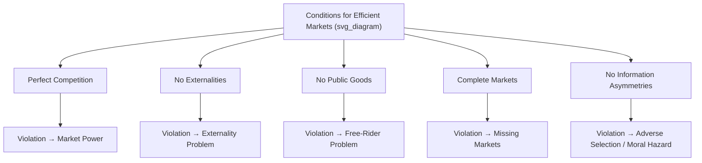

## Conditions for Market Failure

### Definition

**Market failure** occurs when the unregulated operation of a market fails to allocate resources efficiently — that is, when the competitive market outcome does not achieve Pareto efficiency. Market failure represents a divergence between private incentives (what individual agents find privately optimal) and social welfare (what would be collectively optimal for society).

**Key Points**

- Market failure is defined relative to the benchmark established by the **First Fundamental Theorem of Welfare Economics**, which shows that competitive equilibrium achieves Pareto efficiency **only** under a specific set of idealized conditions
- When any of those idealized conditions is violated, the market outcome may fail to be efficient, creating a theoretical justification for potential government or collective intervention
- Market failure does not necessarily imply that intervention will improve outcomes in practice — evaluating any specific policy response requires comparing the market failure's costs against the costs and risks of the proposed intervention (sometimes called "government failure")

### The Five Core Conditions Whose Violation Causes Market Failure

The First Welfare Theorem's efficiency result depends on five key conditions. Violation of any one is a potential source of market failure:

### 1. Market Power (Failure of Perfect Competition)

**Condition Required for Efficiency**: All buyers and sellers are price-takers, with no individual agent able to influence market price.

**Source of Failure**: When a firm (or group of firms) possesses **market power** — the ability to influence price by restricting output — the resulting equilibrium deviates from the competitive, efficient outcome.

**Mechanism**

A monopolist sets output where marginal revenue equals marginal cost ($MR = MC$), rather than where price equals marginal cost ($P = MC$), as would occur under perfect competition. Since marginal revenue is less than price for a downward-sloping demand curve, the monopolist restricts output below the competitive (efficient) level.

$$MR = MC \quad \text{(Monopoly)} \qquad \text{vs.} \qquad P = MC \quad \text{(Perfect Competition)}$$

**Consequence**: This restriction creates a **deadweight loss** — a reduction in total surplus (consumer plus producer surplus) relative to the competitive outcome, representing mutually beneficial transactions that do not occur.

**Example**

A pharmaceutical company with a patent-protected monopoly on a life-saving drug can set a price well above marginal production cost, resulting in some patients unable or unwilling to pay the monopoly price forgoing treatment — even though those patients might value the drug more than its cost of production, meaning a mutually beneficial transaction is priced out of the market.

### 2. Externalities (Failure of "No Externalities" Condition)

**Condition Required for Efficiency**: All costs and benefits of production and consumption decisions are borne entirely by the parties directly involved in the transaction.

**Source of Failure**: An **externality** exists when a third party (not directly involved in a transaction) experiences a cost or benefit as a side effect of that transaction, without compensation.

**Negative Externalities**

When private marginal cost is less than social marginal cost (the market ignores costs imposed on third parties), the market **overproduces** the good relative to the socially efficient quantity.

$$MSC = MPC + MEC$$

where $MSC$ is marginal social cost, $MPC$ is marginal private cost, and $MEC$ is the marginal external cost imposed on third parties.

**Positive Externalities**

When private marginal benefit is less than social marginal benefit (the market ignores benefits accruing to third parties), the market **underproduces** the good relative to the socially efficient quantity.

$$MSB = MPB + MEB$$

where $MSB$ is marginal social benefit, $MPB$ is marginal private benefit, and $MEB$ is the marginal external benefit accruing to third parties.

**Example**

A factory emitting pollution as a byproduct of production imposes a cost (health effects, environmental damage) on nearby residents who are not party to the factory's transactions with its customers. Because the factory does not bear this cost, its private marginal cost is below the true social marginal cost, leading to overproduction relative to the efficient level — the market failure condition is precisely this divergence between private and social cost.

### 3. Public Goods (Failure of the "No Public Goods" Condition)

**Condition Required for Efficiency**: All goods are **excludable** (non-payers can be prevented from consuming) and **rival** (one person's consumption reduces availability for others).

**Source of Failure**: A **public good** is characterized by:

- **Non-excludability**: It is difficult or impossible to prevent individuals from consuming the good, even if they do not pay for it
- **Non-rivalry**: One individual's consumption does not diminish the amount available to others

**The Free-Rider Problem**

Because non-payers cannot be excluded from consuming a public good, individuals have an incentive to **free-ride** — to consume the good without contributing to its cost, relying on others to pay instead. If all individuals reason this way, the good tends to be **underprovided** relative to the socially efficient quantity, since private markets systematically fail to capture the full social value of the good in the price signals that would normally guide production decisions.

**Example**

National defense is a classic pure public good: it is virtually impossible to exclude any citizen from its protection (non-excludable), and one citizen's protection does not diminish another's (non-rival). A private market would tend to underprovide national defense, since individuals could benefit from the defense provided (funded by others) without contributing themselves — this is why national defense is typically provided through collective/government action funded by compulsory taxation rather than voluntary private markets.

**Classification of Goods**

|  | Excludable | Non-Excludable |
| --- | --- | --- |
| **Rival** | Private goods (e.g., food, clothing) | Common-pool resources (e.g., fisheries) |
| **Non-Rival** | Club goods (e.g., cable TV, toll roads with light traffic) | Public goods (e.g., national defense, clean air) |

### 4. Incomplete Markets (Failure of the "Complete Markets" Condition)

**Condition Required for Efficiency**: Markets exist for all goods, services, and risks relevant to consumers' and firms' decisions, spanning all time periods and states of the world.

**Source of Failure**: **Missing markets** occur when no market exists for a good, service, or risk that individuals would otherwise wish to trade, often because of the nature of the good itself (difficulty of contracting, high transaction costs, or the inherent difficulty of insuring against certain unpredictable or unverifiable risks).

**Example**

Markets for insurance against certain long-term risks (e.g., insuring against a decline in one's own future human capital due to unforeseen technological change) are often absent or severely limited, since these risks are difficult to define, verify, and price using standard insurance contracts. Without such a market, individuals cannot efficiently hedge against this risk, resulting in an allocation of risk that is not Pareto efficient relative to a hypothetical world with complete markets.

### 5. Information Asymmetries (Failure of the "No Information Asymmetries" Condition)

**Condition Required for Efficiency**: All parties to a transaction have full and symmetric information relevant to that transaction.

**Source of Failure**: When one party to a transaction has more or better information than the other, this **asymmetric information** can distort market outcomes through two primary mechanisms:

**Adverse Selection**

Arises when there is a **hidden information** problem — one party knows something relevant about the quality of a good or their own risk characteristics before a transaction occurs, but the other party does not, and cannot easily distinguish good types from bad types.

**Example**: In health insurance markets, individuals typically know more about their own health status than insurers. If insurers cannot distinguish high-risk from low-risk individuals and must charge a single average premium, low-risk individuals may find the average-priced policy unattractive and exit the market, leaving a disproportionate share of high-risk individuals — potentially causing average costs (and thus premiums) to rise further, a dynamic known as an **adverse selection death spiral**.

**Moral Hazard**

Arises when there is a **hidden action** problem — one party's *behavior* (unobservable to the other party) changes after a transaction is finalized, because they no longer bear the full consequences of that behavior.

**Example**: An individual with comprehensive health insurance coverage may take fewer precautions to avoid illness or injury, or seek more medical care than they would if bearing the full cost themselves, since the insurer bears part of the cost of their choices after the policy is signed.

### Comparison Summary Table

| Condition Violated | Type of Market Failure | Typical Result | Example |
| --- | --- | --- | --- |
| Perfect competition | Market power | Underproduction relative to competitive level | Monopoly, oligopoly |
| No externalities | Externality problem | Overproduction (negative) / underproduction (positive) | Pollution / vaccination |
| No public goods | Free-rider problem | Underprovision | National defense |
| Complete markets | Missing markets | Inefficient risk allocation | Uninsurable risks |
| No information asymmetries | Adverse selection / moral hazard | Market unraveling / inefficient behavior | Insurance markets |

### Government Responses to Market Failure

Common policy tools targeting each type of market failure:

- **Market power**: Antitrust/competition policy, price regulation, breaking up monopolies
- **Negative externalities**: Pigouvian taxes, cap-and-trade systems, direct regulation, assigning property rights (Coase theorem approaches)
- **Positive externalities**: Subsidies, public provision (e.g., publicly funded education, vaccination programs)
- **Public goods**: Direct government provision funded through taxation
- **Incomplete markets**: Government-provided insurance programs (e.g., social insurance, deposit insurance), regulatory mandates
- **Information asymmetries**: Mandatory disclosure requirements, licensing/certification, signaling and screening mechanisms, regulation of insurance markets (e.g., mandates to reduce adverse selection)

### Government Failure: A Necessary Counterpoint

**Key Points**

[Inference] The existence of a market failure is a necessary but not sufficient condition for beneficial government intervention, since government interventions themselves can be poorly designed, subject to political constraints, informational limitations, or unintended behavioral responses (sometimes termed "government failure") that may offset or even exceed the efficiency losses of the original market failure; this is a widely acknowledged caveat in the public economics literature regarding the practical policy implications of identifying a market failure.

### Common Pitfalls and Misconceptions

- **Assuming market failure automatically justifies any government intervention**: Identifying a market failure only establishes a theoretical case for potential intervention; whether a specific intervention actually improves outcomes depends on its design and the costs of implementing it (including the risk of government failure)
- **Conflating different types of market failure**: Externalities, public goods, market power, and information asymmetries are conceptually distinct problems, often requiring different policy tools; treating them interchangeably can lead to poorly targeted interventions (e.g., using antitrust policy to address an externality problem)
- **Assuming all goods with some public characteristics are pure public goods**: Many goods (club goods, common-pool resources) exhibit only one of the two defining properties (non-excludability, non-rivalry) of a pure public good, and require different analytical treatment
- **Assuming asymmetric information always leads to market collapse**: While severe adverse selection can cause markets to unravel entirely, various market-based solutions (signaling, screening, reputation mechanisms) can partially or fully mitigate these problems even without government intervention

**Related Topics**

- Externalities and Pigouvian taxation
- Public goods and the free-rider problem
- Monopoly and market power
- Adverse selection and moral hazard
- The Coase theorem and property rights
- First and second welfare theorems
- Asymmetric information: signaling and screening
- Government failure and public choice theory