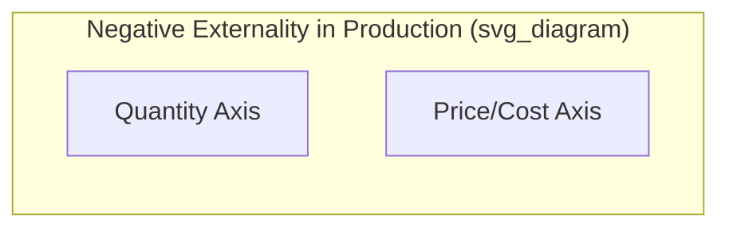
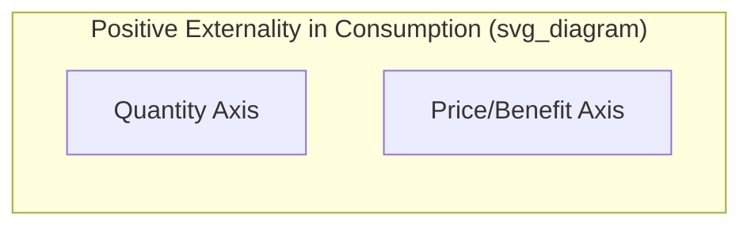
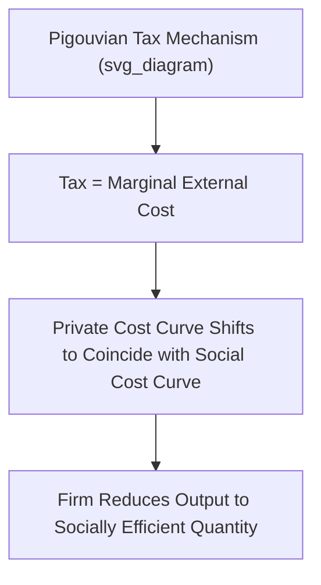

## Positive and Negative Externalities

### Definition

An **externality** occurs when the production or consumption decision of one economic agent directly affects the well-being (utility or profit) of a third party who is not directly involved in the transaction, and this effect is not reflected in the market price. Externalities cause a divergence between **private cost/benefit** (what the decision-maker bears or receives) and **social cost/benefit** (the full cost or benefit to society as a whole).

**Key Points**

- Externalities are a core source of **market failure**, since they violate one of the conditions required for the First Welfare Theorem's efficiency result
- Externalities can occur in **production** or **consumption**, and can be **positive** (beneficial to third parties) or **negative** (harmful to third parties)
- The essential feature of an externality is that it is **uncompensated** — the affected third party neither pays for a benefit received nor is compensated for a cost imposed

### Negative Externalities

A **negative externality** occurs when a third party bears a cost as a result of a transaction or activity in which they were not directly involved, without compensation.

**Formal Condition**

$$MSC = MPC + MEC$$

where $MSC$ is marginal social cost, $MPC$ is marginal private cost (the cost borne by the producer), and $MEC$ is the marginal external cost (the uncompensated cost imposed on third parties).

Since $MSC > MPC$ whenever $MEC > 0$, the market — which responds only to private costs — leads producers to **overproduce** relative to the socially efficient quantity.

**Graphical Representation**

**Verbal description of the standard diagram:**

- Two supply curves are drawn: the private marginal cost curve $MPC$ (the actual firm supply curve) and the marginal social cost curve $MSC$, which lies **above** $MPC$ by the amount of the marginal external cost at each quantity
- The demand curve $D$ represents marginal private benefit ($MPB$), assumed to equal marginal social benefit ($MSB$) in this case (no consumption externality)
- The **market equilibrium** occurs where $MPC = D$, at quantity $Q_{market}$
- The **socially efficient quantity** occurs where $MSC = D$, at a smaller quantity $Q_{efficient} < Q_{market}$
- The market outcome is inefficient: it produces "too much" of the good, and the triangular area between $MSC$ and $D$ from $Q_{efficient}$ to $Q_{market}$ represents the **deadweight loss** from overproduction

**Example**

A coal-fired power plant emits sulfur dioxide and particulate matter as byproducts of electricity generation, imposing health costs on nearby residents (respiratory illness, reduced air quality) and environmental costs (acid rain). The plant's private marginal cost reflects only fuel, labor, and equipment costs, not these external health and environmental damages, so at the market equilibrium, electricity is overproduced relative to the level that would account for the full social cost.

### Positive Externalities

A **positive externality** occurs when a third party receives a benefit as a result of a transaction or activity in which they were not directly involved, without paying for it.

**Formal Condition**

$$MSB = MPB + MEB$$

where $MSB$ is marginal social benefit, $MPB$ is marginal private benefit (the benefit captured by the consumer or producer), and $MEB$ is the marginal external benefit (the uncompensated benefit received by third parties).

Since $MSB > MPB$ whenever $MEB > 0$, the market — which responds only to private benefits — leads to **underproduction** or **underconsumption** relative to the socially efficient quantity.

**Graphical Representation**

**Verbal description of the standard diagram:**

- Two demand curves are drawn: the private marginal benefit curve $MPB$ (the actual market demand curve) and the marginal social benefit curve $MSB$, which lies **above** $MPB$ by the amount of the marginal external benefit at each quantity
- The supply curve $S$ represents marginal private cost, assumed to equal marginal social cost in this case (no production externality)
- The **market equilibrium** occurs where $MPB = S$, at quantity $Q_{market}$
- The **socially efficient quantity** occurs where $MSB = S$, at a larger quantity $Q_{efficient} > Q_{market}$
- The market outcome is inefficient: it produces "too little" of the good, with a deadweight loss triangle between $MSB$ and $S$ from $Q_{market}$ to $Q_{efficient}$

**Example**

An individual's decision to get vaccinated against a contagious disease primarily benefits that individual (private benefit), but also reduces the probability of transmission to others in the population (external benefit via "herd immunity"). Since individuals typically weigh only their own private benefit when deciding whether to vaccinate, the market/private outcome results in a vaccination rate below the socially optimal level that would account for the full public health benefit.

### Additional Examples Across Categories

| Type | Example | Third Party Affected |
| --- | --- | --- |
| Negative Production Externality | Factory pollution | Nearby residents, environment |
| Negative Consumption Externality | Secondhand smoke | Bystanders |
| Positive Production Externality | A firm's R&D generating knowledge spillovers | Other firms/researchers |
| Positive Consumption Externality | Home renovation increasing neighborhood property values | Neighbors |
| Positive Consumption Externality | Education (beyond private wage returns) | Society (informed citizenry, lower crime, innovation) |

### Correcting Negative Externalities: Pigouvian Taxes

A **Pigouvian tax**, named after economist Arthur Pigou, is a tax levied on an activity generating a negative externality, set equal to the marginal external cost at the socially efficient quantity, in order to align private incentives with social costs.

**Mechanism**

$$t^* = MEC(Q_{efficient})$$

By imposing a tax equal to the marginal external cost, the firm's effective private marginal cost curve shifts up to coincide with the marginal social cost curve, causing the firm to voluntarily reduce output to the socially efficient quantity $Q_{efficient}$.

**Example**

A carbon tax levied on greenhouse gas emissions, set to reflect the estimated social cost of carbon (the discounted value of future climate damages per ton of emissions), aims to internalize the externality by raising the private cost of carbon-intensive activities to match their true social cost, thereby reducing emissions toward the socially efficient level.

### Correcting Positive Externalities: Pigouvian Subsidies

Analogously, a **Pigouvian subsidy** can be used to correct underproduction/underconsumption arising from a positive externality, by paying producers or consumers an amount equal to the marginal external benefit, encouraging output/consumption to rise toward the socially efficient quantity.

$$s^* = MEB(Q_{efficient})$$

**Example**

Government subsidies for higher education (public funding of universities, subsidized student loans) can be justified, in part, as a Pigouvian response to the positive externalities of education (a more productive, innovative, and civically engaged workforce), aiming to raise enrollment closer to the socially efficient level beyond what individuals would privately choose based solely on their own wage returns.

### The Coase Theorem: A Market-Based Alternative

The **Coase Theorem**, developed by Ronald Coase, offers an alternative to government-imposed Pigouvian taxes/subsidies for addressing externalities.

**Statement**: If property rights are clearly defined and transaction costs are sufficiently low (or zero), private parties can bargain among themselves to reach an efficient allocation of resources **regardless of the initial assignment of property rights**.

**Key Points**

- Under the Coase Theorem's assumptions, the externality problem can be resolved through **private negotiation** rather than government intervention, since the party who values the resource use more will find it mutually beneficial to compensate the other party appropriately
- The **initial assignment of property rights** affects the *distribution* of resulting wealth (who pays whom), but not the *efficiency* of the final allocation, under the theorem's idealized assumptions
- [Inference] In practice, transaction costs (negotiation costs, coordination challenges, especially with many affected third parties as in most pollution cases) are frequently substantial, which is why Pigouvian taxation and direct regulation remain the more commonly employed real-world policy tools for addressing many externality problems, particularly those involving diffuse or numerous affected parties

**Example**

A factory and a downstream fishery both use a shared river. Under the Coase Theorem, regardless of whether the factory has the legal right to pollute or the fishery has the legal right to clean water, the two parties could in principle negotiate a mutually beneficial arrangement (e.g., the fishery paying the factory to reduce pollution, or the factory compensating the fishery for damages) that results in the economically efficient level of pollution — provided negotiation costs between the two parties are low.

### Command-and-Control Regulation

An alternative to price-based instruments (taxes, subsidies) is **direct regulation**, where the government mandates specific quantities, technologies, or standards (e.g., emissions caps, mandatory pollution control equipment, zoning restrictions).

**Key Points**

- Command-and-control regulation can be simpler to implement and monitor in some contexts, but [Inference] is often considered less economically efficient than price-based instruments (like Pigouvian taxes) because it typically does not allow firms with different abatement costs to find their own least-cost method of reducing the externality-generating activity, a flexibility that market-based instruments generally preserve

### Tradable Permits (Cap-and-Trade)

A **cap-and-trade system** combines elements of quantity regulation and market-based mechanisms: the government sets an overall cap (quantity limit) on a negative externality (e.g., total emissions), issues tradable permits summing to that cap, and allows firms to buy and sell permits among themselves.

**Key Points**

- Firms with low abatement costs have an incentive to reduce their externality-generating activity and sell their excess permits to firms with higher abatement costs, achieving the overall emissions target at the **lowest total cost** to the economy
- This system achieves a similar efficiency result to a Pigouvian tax but sets the **quantity** directly (with the price of permits determined by market trading), whereas a Pigouvian tax sets the **price** directly (with the resulting quantity determined by firms' responses)

### Comparison of Policy Tools

| Tool | Mechanism | Sets | Key Advantage |
| --- | --- | --- | --- |
| Pigouvian Tax | Tax equal to marginal external cost | Price | Directly internalizes cost; flexible for firms |
| Pigouvian Subsidy | Payment equal to marginal external benefit | Price | Encourages positive-externality activities |
| Coasean Bargaining | Private negotiation given property rights | Neither (market-determined) | No government intervention needed if transaction costs are low |
| Command-and-Control | Direct quantity/technology mandate | Quantity/method | Simple to enforce; certain outcome |
| Cap-and-Trade | Tradable permits within an overall cap | Quantity (price emerges from trading) | Cost-effective; certain aggregate quantity outcome |

### Common Pitfalls and Misconceptions

- **Assuming all externalities require government intervention**: Under Coasean conditions (well-defined property rights, low transaction costs), private bargaining can resolve externalities without government action; intervention is more clearly warranted when transaction costs are high or property rights are difficult to establish
- **Confusing the direction of market failure**: Negative externalities lead to **overproduction**, while positive externalities lead to **underproduction** — students frequently reverse this distinction
- **Assuming Pigouvian taxes/subsidies are easy to calibrate precisely in practice**: [Inference] Determining the exact monetary value of a marginal external cost or benefit (e.g., the "correct" social cost of carbon) is often empirically and methodologically challenging, meaning real-world Pigouvian taxes are frequently based on estimated ranges rather than precisely known values
- **Believing the initial property rights assignment under the Coase Theorem doesn't matter at all**: While the theorem states the *efficiency* outcome is independent of the initial rights assignment (under its idealized assumptions), the assignment still matters significantly for the resulting *distribution* of wealth between the parties involved

**Related Topics**

- Conditions for market failure
- The Coase Theorem and property rights
- Pigouvian taxation and corrective subsidies
- Public goods and the free-rider problem
- Cap-and-trade systems and environmental economics
- First and second welfare theorems
- Social cost of carbon and climate policy
- Deadweight loss and market inefficiency