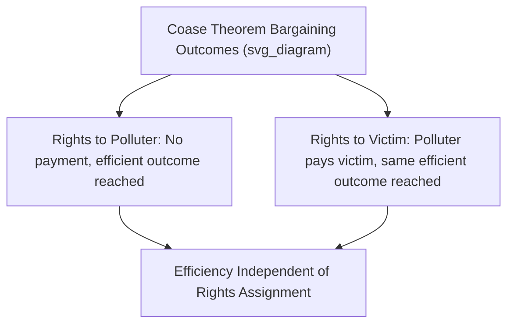

## Coase Theorem

### Definition and Origin

The **Coase Theorem** is a foundational proposition in law and economics, developed by economist Ronald Coase in his 1960 paper "The Problem of Social Cost." It addresses how externalities can be resolved efficiently through private bargaining, challenging the presumption that government intervention (via Pigouvian taxes or regulation) is always necessary to correct externality-related market failures.

**Formal Statement**: If property rights are **clearly defined** and **transaction costs are zero (or sufficiently low)**, private parties will bargain to reach an economically **efficient** outcome, **regardless of the initial allocation of property rights**.

**Key Points**

- The theorem shifts the analytical focus of externality problems from "who caused the harm" to "how can property rights and bargaining be structured to reach an efficient outcome"
- The **initial distribution of property rights** affects who pays whom (a distributional/wealth effect), but under the theorem's idealized assumptions, does **not** affect the ultimate efficiency of the outcome
- Coase's original argument was significant in reframing externalities as fundamentally involving **reciprocal harm** — both parties involved (e.g., a polluter and someone affected by pollution) contribute to the existence of the problem in the sense that the harm would not occur without both parties present

### The Reciprocal Nature of Externality Problems

**Key Points**

Coase's central insight was that externality problems are not simply cases of one party imposing harm on an entirely passive victim; rather, the "harm" only exists because of the interaction between two activities.

**Example**

A factory emitting smoke and a nearby laundry business whose clean laundry is damaged by that smoke represent a reciprocal problem: the harm exists only because *both* the factory's polluting activity and the laundry's clean-air-dependent activity happen to be located near each other. Preventing the factory from polluting harms the factory; allowing the pollution harms the laundry. Coase argued the economically relevant question is not simply "who is at fault," but **which arrangement of rights and activities maximizes total value**, considering both parties' interests.

### The Core Mechanism: Bargaining to Efficiency

**Illustrative Example**

Consider a factory whose production creates noise that disturbs a nearby resident. Suppose the factory's owner values the noisy activity at $500 (the profit lost if the activity is stopped), and the resident values quiet at $300 (the amount of compensation that would make them indifferent to tolerating the noise).

**Scenario A: Factory has the legal right to make noise**

- The resident could offer the factory up to $300 to stop (or reduce) the noise, but since the factory values the activity at $500 (greater than $300), the factory will refuse any offer the resident is willing to make
- **Outcome**: The factory continues operating, which is the efficient outcome, since the factory's value from the activity ($500) exceeds the resident's cost from tolerating it ($300)

**Scenario B: Resident has the legal right to quiet**

- The factory could offer the resident compensation to allow the noise to continue; since the factory's value ($500) exceeds the resident's minimum acceptable compensation ($300), a mutually beneficial deal (e.g., the factory pays the resident $400) can be reached
- **Outcome**: The factory continues operating (having compensated the resident), which is again the efficient outcome

**Key Points**

In both scenarios — regardless of which party initially holds the legal right — the *same efficient outcome* (the factory continues operating) is reached through bargaining. What differs between the scenarios is **who ends up paying whom**: in Scenario A, no payment occurs; in Scenario B, the factory compensates the resident. This illustrates the theorem's central claim: the efficient outcome is independent of the initial rights assignment, though the distributional consequence is not.

### Necessary Conditions for the Theorem to Hold

**1. Well-Defined Property Rights**

All parties must have clearly established, legally enforceable rights over the relevant resource (e.g., the right to emit noise/pollution, or the right to a quiet/clean environment). Ambiguous or contested rights undermine the ability of parties to bargain toward a clear, enforceable agreement.

**2. Zero (or Sufficiently Low) Transaction Costs**

Transaction costs include the costs of:

- Identifying all relevant parties affected by the externality
- Negotiating an agreement among all parties
- Enforcing the resulting agreement

If these costs are high relative to the potential gains from bargaining, an efficient bargain may not be reached even though a mutually beneficial arrangement theoretically exists.

**3. No Wealth Effects (a common simplifying assumption)**

[Inference] Some formal presentations of the theorem also implicitly assume that the distribution of wealth (which depends on the initial rights assignment) does not itself affect the parties' relative valuations of the disputed resource; if wealth effects are significant, the specific efficient quantity reached could, in principle, vary slightly depending on the initial rights allocation, though the outcome would remain efficient given whichever wealth distribution results.

### Why Transaction Costs Are the Central Practical Limitation

**Key Points**

The Coase Theorem is often described as identifying transaction costs as the **actual** cause of persistent externality problems in the real world — if bargaining were truly costless, externalities would not represent a lasting source of inefficiency, since affected parties would simply negotiate their way to an efficient outcome.

**Sources of High Transaction Costs**

- **Large numbers of affected parties**: Pollution affecting thousands or millions of people (e.g., air pollution, greenhouse gas emissions) makes coordinated negotiation extremely costly or practically infeasible
- **Free-rider problems in the bargaining process itself**: If many individuals are affected by a single source of externality, each individual has an incentive to let others bear the cost of negotiating on behalf of the whole group
- **Information asymmetries**: Parties may not know the true costs or benefits involved, hindering effective negotiation
- **Enforcement difficulties**: Even after an agreement is reached, monitoring and enforcing compliance can be costly, particularly for diffuse or hard-to-observe activities

**Example**

Climate change, involving greenhouse gas emissions from billions of individual and corporate sources affecting virtually the entire global population, represents an extreme case of high transaction costs: coordinating a Coasean bargain among all affected parties worldwide is practically infeasible, which is why real-world climate policy relies primarily on government-imposed instruments (carbon taxes, cap-and-trade systems, regulation) rather than private negotiation.

### Coase Theorem vs. Pigouvian Taxation: A Comparison

| Feature | Coase Theorem (Private Bargaining) | Pigouvian Tax (Government Intervention) |
| --- | --- | --- |
| Mechanism | Private negotiation given defined property rights | Government-imposed tax equal to marginal external cost |
| Information required | Parties' own private valuations (revealed through bargaining) | Government must estimate the marginal external cost, often difficult in practice |
| Best suited for | Small number of clearly identifiable parties, low transaction costs | Large number of diffuse parties, high transaction costs |
| Distributional effect | Depends on initial rights assignment | Depends on tax design and revenue use |
| Government role | Minimal (define and enforce property rights) | Active (set and collect tax, determine correct rate) |

**Key Points**

[Inference] In practice, many economists view the Coase Theorem and Pigouvian taxation as complementary rather than strictly competing approaches: Coasean bargaining tends to be most effective for externalities involving a small, well-defined set of parties (e.g., a dispute between two adjacent property owners), while Pigouvian and regulatory approaches tend to be favored for externalities involving large, diffuse populations where transaction costs of private bargaining would be prohibitive.

### Applications and Illustrations

**Property Disputes**

Classic applications include disputes over noise, light, or view obstruction between neighboring property owners, where a limited number of parties and relatively low transaction costs make private negotiation (e.g., easements, negotiated compensation) a practically viable path to an efficient outcome.

**Environmental Regulation Design**

The theorem has influenced the design of market-based environmental policy instruments, including **tradable pollution permits** (cap-and-trade systems), which create clearly defined, tradable property rights (permits) that allow firms to bargain (via buying and selling permits) toward a cost-effective allocation of pollution reduction, effectively harnessing a Coasean logic within an overall government-imposed quantity cap.

**Legal System Design**

The theorem has been influential in the field of **law and economics**, informing how courts and legislators might think about assigning liability rules and property rights specifically with an eye toward minimizing transaction costs and facilitating efficient private bargaining where feasible.

### Common Pitfalls and Misconceptions

- **Interpreting the theorem as saying government intervention is never needed**: The theorem's efficiency result depends critically on the assumption of low transaction costs; Coase's own broader point was to highlight that transaction costs are pervasive and significant in the real world, which is precisely why government intervention (or alternative institutional arrangements) is often still needed in practice
- **Assuming the initial rights assignment is irrelevant altogether**: While the theorem states that efficiency is independent of the initial rights assignment (under its idealized conditions), the assignment still has substantial **distributional** consequences — determining who bears costs and who receives compensation — which remains a matter of significant practical and ethical importance
- **Assuming real-world transaction costs are always low enough for the theorem to apply**: The theorem is frequently invoked as an idealized benchmark rather than a literal description of how most real-world externalities are resolved; large-scale externalities (pollution, climate change) typically involve transaction costs far too high for pure Coasean bargaining to achieve an efficient outcome without government-provided institutional structures (like tradable permit markets) to reduce those costs
- **Confusing the Coase Theorem with a general laissez-faire argument**: The theorem is a specific, conditional claim about efficiency under particular assumptions, not a broader normative claim that markets should always be left entirely unregulated

**Related Topics**

- Positive and negative externalities
- Conditions for market failure
- Pigouvian taxation and corrective subsidies
- Property rights and law and economics
- Cap-and-trade systems and tradable permits
- Transaction cost economics
- Public goods and the free-rider problem
- Bargaining theory and game theory applications