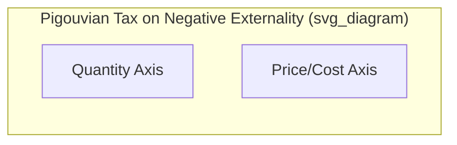
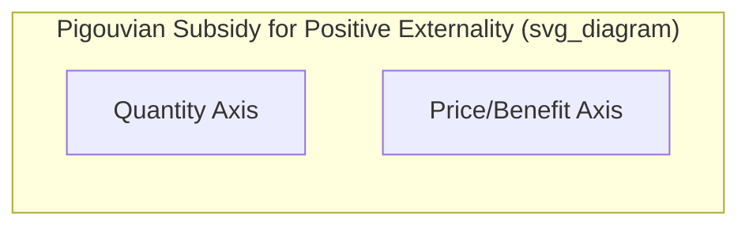

## Pigouvian Taxes and Subsidies

### Definition and Origin

**Pigouvian taxes and subsidies** are government-imposed price interventions designed to correct market failures arising from externalities, by aligning private incentives with social costs and benefits. Named after economist Arthur C. Pigou, who first articulated this approach in *The Economics of Welfare* (1920), these instruments aim to make economic agents "internalize" the external effects of their actions.

**Key Points**

- A **Pigouvian tax** is levied on activities generating **negative externalities**, raising the private cost of the activity to match its true social cost
- A **Pigouvian subsidy** is paid for activities generating **positive externalities**, raising the private incentive to match the activity's true social benefit
- The underlying goal of both instruments is to shift the market equilibrium quantity from the (inefficient) private market outcome to the **socially efficient quantity**

### Theoretical Foundation: Correcting the Externality Wedge

**For Negative Externalities**

$$MSC = MPC + MEC$$

The gap between marginal social cost ($MSC$) and marginal private cost ($MPC$) is the marginal external cost ($MEC$). A Pigouvian tax set equal to $MEC$ at the efficient quantity closes this gap.

**For Positive Externalities**

$$MSB = MPB + MEB$$

The gap between marginal social benefit ($MSB$) and marginal private benefit ($MPB$) is the marginal external benefit ($MEB$). A Pigouvian subsidy set equal to $MEB$ at the efficient quantity closes this gap.

### The Pigouvian Tax Mechanism

**Optimal Tax Rate**

$$t^* = MEC(Q^*)$$

where $Q^*$ is the socially efficient quantity of the externality-generating activity.

**Graphical Illustration**

**Verbal description of the standard diagram:**

- The marginal private cost curve ($MPC$) lies below the marginal social cost curve ($MSC$), with the vertical distance between them representing $MEC$
- Without intervention, the market reaches equilibrium where $MPC$ intersects demand ($D$), at quantity $Q_{market}$ — greater than the efficient quantity
- Imposing a per-unit tax $t^* = MEC$ shifts the effective private cost curve **upward** by exactly the tax amount, so the taxed private cost curve ($MPC + t^*$) coincides with $MSC$
- The new market equilibrium (where $MPC + t^* = D$) occurs at $Q^*$, the socially efficient quantity
- The tax revenue collected is $t^* \times Q^*$, represented by a rectangle on the diagram between the original and new equilibrium prices, up to $Q^*$

**Step-by-Step Worked Example**

Suppose a factory's private marginal cost is $MPC = 2Q$, and each unit of production generates a constant marginal external cost of $MEC = 10$ (e.g., pollution damage). Demand is given by $P = 100 - Q$.

**Step 1: Market equilibrium (no tax)** — set $MPC = D$: $2Q = 100 - Q \Rightarrow Q_{market} = 33.3$

**Step 2: Social marginal cost** — $MSC = MPC + MEC = 2Q + 10$

**Step 3: Efficient quantity** — set $MSC = D$: $2Q + 10 = 100 - Q \Rightarrow Q^* = 30$

**Step 4: Optimal Pigouvian tax** — $t^* = MEC = 10$ per unit

**Step 5: Verification** — with the tax, the firm's effective cost becomes $2Q + 10$; setting this equal to demand: $2Q + 10 = 100 - Q \Rightarrow Q = 30 = Q^*$, confirming the tax successfully restores the efficient quantity.

### The Pigouvian Subsidy Mechanism

**Optimal Subsidy Rate**

$$s^* = MEB(Q^*)$$

where $Q^*$ is the socially efficient quantity of the externality-generating activity, now larger than the unregulated market quantity since the externality is positive.

**Graphical Illustration**

**Verbal description of the standard diagram:**

- The marginal private benefit curve ($MPB$, the market demand curve) lies below the marginal social benefit curve ($MSB$), with the vertical distance representing $MEB$
- Without intervention, the market reaches equilibrium where $MPB$ intersects supply ($S$), at quantity $Q_{market}$ — smaller than the efficient quantity
- A per-unit subsidy $s^* = MEB$ shifts the effective private benefit curve **upward** by the subsidy amount, so the subsidized private benefit curve coincides with $MSB$
- The new equilibrium occurs at $Q^*$, the socially efficient quantity, larger than the original market quantity

**Example**

Suppose a homeowner's decision to install rooftop solar panels generates a private benefit (reduced electricity bills) plus an external benefit (reduced regional grid strain and lower carbon emissions benefiting the broader community). A government subsidy per installed panel, calibrated to the estimated external benefit, would raise the effective private incentive to install panels, encouraging installations to rise toward the socially efficient quantity.

### Advantages of Pigouvian Instruments

**Key Points**

- **Efficiency**: When correctly calibrated, Pigouvian taxes/subsidies restore the socially efficient level of the externality-generating activity, unlike command-and-control regulation, which may not achieve the efficient outcome as precisely
- **Cost-effectiveness across heterogeneous firms**: A uniform Pigouvian tax allows firms with different abatement costs to respond differently — firms that can reduce the externality-generating activity cheaply will do so more, while firms facing higher abatement costs will reduce less and pay more tax, achieving the target reduction at the lowest aggregate cost to the economy
- **Revenue generation** (for taxes): Pigouvian taxes generate government revenue that can be used to fund public services, reduce other distortionary taxes ("double dividend" hypothesis), or directly compensate those harmed by the externality
- **Preserves price signals and market flexibility**: Firms retain the freedom to choose *how* to respond (reduce output, adopt cleaner technology, etc.), rather than being mandated to adopt a specific method

### Challenges and Limitations

**1. Measurement Difficulty**

[Inference] Accurately estimating the marginal external cost or benefit of an activity — required to set the "correct" Pigouvian tax or subsidy rate — is often empirically and methodologically challenging. For example, estimating the "social cost of carbon" requires projecting long-term, uncertain climate damages and applying a discount rate to future costs, both of which are subject to substantial scientific and economic debate, meaning real-world Pigouvian tax rates are typically based on estimated ranges rather than a single precisely known value.

**2. Distributional Concerns**

Pigouvian taxes can have regressive effects if the taxed activity (e.g., gasoline consumption, energy use) represents a larger share of spending for lower-income households, raising equity concerns that must be weighed against the efficiency benefits — though this can potentially be addressed through revenue recycling (e.g., rebates or dividends returned to affected households).

**3. Administrative and Political Feasibility**

Implementing and enforcing a Pigouvian tax requires accurate monitoring of the externality-generating activity (e.g., metering emissions), which can be costly or technically difficult for some pollutants or activities. Additionally, new taxes often face political resistance, particularly if the costs are visible and concentrated on specific industries or consumer groups.

**4. Potential for Tax Incidence to Differ from Intended Target**

Depending on the relative elasticities of supply and demand in the taxed market, the economic burden of a Pigouvian tax may fall partly on consumers rather than solely on producers, a standard tax incidence consideration that also applies to corrective taxation.

**5. Interaction with Existing Market Imperfections**

[Inference] If a market already features other distortions (e.g., pre-existing market power, other taxes), the interaction between a new Pigouvian tax and these existing distortions can complicate the calculation of the truly optimal tax rate, sometimes requiring adjustments from the simple $t^* = MEC$ formula derived under otherwise perfectly competitive conditions.

### Pigouvian Taxes vs. Alternative Policy Instruments

| Instrument | How It Works | Key Advantage | Key Limitation |
| --- | --- | --- | --- |
| Pigouvian Tax | Sets price; quantity emerges from market response | Cost-effective; preserves flexibility | Requires accurate estimate of external cost |
| Cap-and-Trade | Sets quantity (cap); price emerges from permit trading | Certain aggregate quantity outcome; still cost-effective | Requires monitoring and enforcement of permits |
| Command-and-Control | Mandates specific quantity or technology | Simple, direct, certain compliance target | Typically less cost-effective across heterogeneous firms |
| Coasean Bargaining | Private negotiation given defined property rights | No government revenue/administrative needs if transaction costs are low | Impractical with many affected parties (high transaction costs) |

### Real-World Applications

**Carbon Taxes**

Several jurisdictions have implemented carbon taxes on greenhouse gas emissions, calibrated (in principle) to the estimated social cost of carbon, aiming to internalize the climate-related externality of fossil fuel combustion.

**Sin Taxes**

Taxes on tobacco, alcohol, and sugary beverages are often justified partly on Pigouvian grounds (external healthcare costs imposed on the broader insurance pool or public health system), though these are also frequently justified using other rationales, such as addressing internalities from imperfect self-control ([Inference] this additional behavioral-economics justification is a distinct and more contested rationale than the standard third-party-externality logic of a pure Pigouvian tax).

**Congestion Pricing**

Tolls charged for driving in congested urban areas during peak hours are a Pigouvian-style correction for the externality one driver's presence on the road imposes on all other drivers (added congestion, travel time delays).

**R&D and Education Subsidies**

Government subsidies for research and development, or for education, are often justified on Pigouvian grounds relating to the positive spillover benefits (knowledge spillovers, a more productive society) that exceed the private returns captured by the individual firm or student.

### Common Pitfalls and Misconceptions

- **Assuming a Pigouvian tax must eliminate the externality-generating activity entirely**: The goal of a correctly calibrated Pigouvian tax is to reduce the activity to the **socially efficient** quantity, not to zero — some level of the externality-generating activity is typically still efficient, since eliminating it entirely would forgo the activity's private (and possibly social) benefits as well
- **Confusing the direction of correction**: A tax is the appropriate tool for a negative externality (encouraging less of the activity); a subsidy is appropriate for a positive externality (encouraging more of the activity) — reversing this would exacerbate rather than correct the inefficiency
- **Treating the "correct" tax/subsidy rate as a known, fixed number**: In practice, the marginal external cost or benefit is typically estimated with considerable uncertainty, meaning real-world Pigouvian tax and subsidy rates are best understood as policy choices informed by imperfect estimates rather than precisely derived optimal values
- **Ignoring distributional and political economy considerations**: Purely focusing on the efficiency case for Pigouvian taxation can overlook important practical considerations regarding fairness, political feasibility, and how tax revenue is ultimately used

**Related Topics**

- Positive and negative externalities
- The Coase Theorem and private bargaining
- Cap-and-trade systems and tradable permits
- Conditions for market failure
- Deadweight loss and tax incidence
- Carbon pricing and climate policy
- Public goods and the free-rider problem
- Behavioral economics and internalities