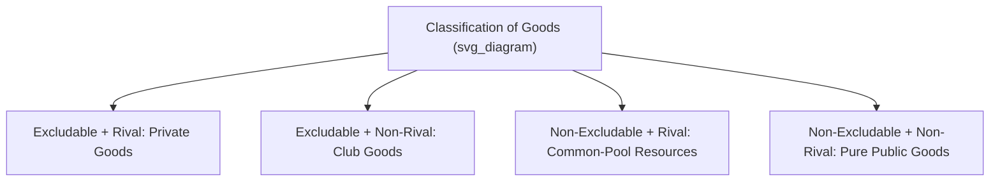
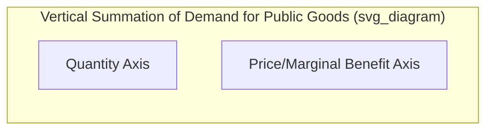

## Public Goods and the Free-Rider Problem

### Definition of Public Goods

A **public good** is a good characterized by two defining properties that distinguish it from a standard private good:

- **Non-excludability**: It is impossible, or prohibitively costly, to prevent individuals from consuming the good, even if they have not paid for it
- **Non-rivalry**: One individual's consumption of the good does not reduce the quantity or quality available for others to consume simultaneously

**Key Points**

- A good must exhibit **both** properties to be classified as a **pure public good**; goods with only one of these two properties fall into different categories (club goods or common-pool resources)
- The combination of non-excludability and non-rivalry is precisely what generates the market failure associated with public goods: private markets, which rely on the ability to exclude non-payers to generate revenue, struggle to provide public goods efficiently

### The Four-Category Classification of Goods

$$\begin{array}{c|cc}
& \text{Excludable} & \text{Non-Excludable} \\
\hline
\text{Rival} & \text{Private Goods} & \text{Common-Pool Resources} \\
\text{Non-Rival} & \text{Club Goods} & \text{Public Goods} \\
\end{array}$$

**Private Goods** (excludable, rival): Standard market goods — food, clothing, cars. Markets function efficiently for these goods under competitive conditions.

**Club Goods** (excludable, non-rival): Goods where exclusion is possible but consumption does not diminish availability for others up to a capacity limit — cable television, satellite radio, membership gyms, toll roads with light traffic.

**Common-Pool Resources** (non-excludable, rival): Goods where exclusion is difficult but one person's use does diminish availability for others — ocean fisheries, groundwater aquifers, congested public roads. These are subject to a related but distinct problem known as the **"tragedy of the commons."**

**Pure Public Goods** (non-excludable, non-rival): National defense, lighthouses (in classical economic examples), basic scientific research, clean air, public radio broadcasts (over-the-air, unencrypted).

### The Free-Rider Problem

The **free-rider problem** arises because non-excludability means individuals can benefit from a public good without contributing to its cost, relying on others to pay for its provision instead.

**Key Points**

- If every individual reasons this way, and each expects others to fund the good, the good tends to be **underprovided** relative to the socially efficient quantity, since no market mechanism forces individuals to reveal or pay according to their true valuation
- The free-rider problem exists because a rational, self-interested individual has **no private incentive** to voluntarily pay for a good they will receive regardless of whether they pay
- This represents a form of market failure precisely because the resulting *private* market provision (typically zero or very low) falls short of the *socially efficient* level

**Example**

Consider a neighborhood association deciding whether to fund a fireworks display, a good that is non-excludable (anyone in the area can watch it) and non-rival (one person watching does not reduce another's enjoyment). Each household might reason: "If enough of my neighbors contribute, I can enjoy the fireworks without paying myself." If most households reason this way, insufficient funds may be raised, and the fireworks display — even if it would be worth more in total value to the neighborhood than its cost — may not occur, or may be underfunded relative to what residents would collectively be willing to pay.

### Efficient Provision of Public Goods: The Samuelson Condition

Unlike private goods, where individual demand curves are summed **horizontally** (summing quantities at each price) to derive market demand, the efficient provision of a public good requires summing individual demand curves **vertically** (summing willingness to pay at each quantity), since all individuals simultaneously consume the same quantity of a non-rival good.

**The Samuelson Condition (Efficient Provision Rule)**

$$\sum_{i=1}^{n} MRS_i = MRT$$

or equivalently, expressed in terms of marginal benefits and marginal cost:

$$\sum_{i=1}^{n} MB_i = MC$$

where $MB_i$ is individual $i$'s marginal benefit from an additional unit of the public good, and $MC$ is the marginal cost of providing that unit. Efficient provision requires that the **sum** of all individuals' marginal benefits equal the marginal cost of provision — a fundamentally different condition than for private goods, where efficiency requires each individual's marginal benefit *alone* to equal marginal cost.

**Graphical Illustration**

**Verbal description of the standard diagram:**

- Individual demand curves ($MB_1$, $MB_2$, etc.) for the public good are plotted
- The **aggregate/social demand curve** is derived by **vertically summing** these individual curves at each quantity level (adding up how much each individual is willing to pay for that specific quantity)
- The efficient quantity of the public good occurs where this summed social demand curve intersects the marginal cost curve
- This contrasts sharply with private good markets, where market demand is the **horizontal** sum of individual demand curves (summing quantities demanded at each given price)

### Worked Numerical Example

Suppose two individuals have the following demand (marginal benefit) functions for units of a public good (e.g., a public park's size, measured in acres):

$$MB_1 = 20 - Q, \qquad MB_2 = 10 - 0.5Q$$

and the marginal cost of providing the public good is constant: $MC = 15$.

**Step 1: Sum marginal benefits vertically**

$$\sum MB = (20 - Q) + (10 - 0.5Q) = 30 - 1.5Q$$

**Step 2: Set the sum equal to marginal cost**

$$30 - 1.5Q = 15 \quad \Rightarrow \quad Q^* = 10$$

The socially efficient quantity of the public good is **10 units**.

**Step 3: Contrast with likely private provision**

If either individual were to unilaterally decide on quantity based solely on their own private marginal benefit equaling marginal cost, Individual 1 would choose $20 - Q = 15 \Rightarrow Q = 5$, and Individual 2 would choose $10 - 0.5Q = 15$, which yields a negative quantity (Individual 2 alone would not fund any of the good, since even zero units already exceeds their private marginal benefit relative to the full cost). This illustrates how private provision, driven by individual incentives alone, tends to fall short of the jointly efficient quantity of 10 units.

### Solutions to the Free-Rider Problem

**1. Government Provision Funded by Taxation**

The most common real-world solution: governments provide public goods directly and fund them through compulsory taxation, which sidesteps the free-rider problem since payment (taxation) is not voluntary and not conditioned on individual willingness to pay.

**2. Mechanism Design (Preference Revelation Mechanisms)**

Economists have developed theoretical mechanisms (e.g., the **Clarke-Groves mechanism**, part of the broader Vickrey-Clarke-Groves family) designed to incentivize individuals to truthfully reveal their private valuation of a public good, overcoming the incentive to understate willingness to pay in order to free-ride. [Inference] While theoretically elegant and demonstrated to achieve efficient outcomes under certain conditions, such mechanisms face practical implementation challenges (complexity, budget balance issues) that have limited their widespread real-world adoption outside of specific applications like certain auction designs.

**3. Private Voluntary Provision and Social Norms**

In some contexts, public goods are provided voluntarily despite the theoretical free-rider problem, through mechanisms such as:

- **Social pressure and reputation effects**: Public recognition of donors (e.g., named buildings, donor walls) can incentivize voluntary contributions
- **Warm-glow giving**: [Inference] Some behavioral economics research suggests individuals may derive direct utility from the act of giving itself, independent of the public good's provision level, which can partially offset the pure free-rider incentive, though the magnitude of this effect varies across studies and contexts
- **Assurance contracts / crowdfunding mechanisms**: Contracts where contributions are only collected (and the good only provided) if a funding threshold is reached, reducing the risk that individual contributions are wasted on an underfunded project

**4. Club Formation and Exclusion Mechanisms**

For goods that can be made partially excludable through technology or institutional design (converting a pure public good into something closer to a club good), private markets can sometimes provide the good more effectively — for example, subscription-based satellite radio uses encryption to exclude non-payers, addressing the free-rider problem even for a good that is inherently non-rival.

**5. International Cooperation and Treaties**

For global public goods (e.g., climate stability, reduced ozone depletion), international agreements and treaties (such as the Montreal Protocol) represent an institutional mechanism for coordinating provision across many independent actors (nations) who would otherwise each have an incentive to free-ride on others' efforts.

### The Tragedy of the Commons: A Related but Distinct Problem

**Key Points**

The **tragedy of the commons**, associated with ecologist Garrett Hardin, describes overuse or depletion of a **common-pool resource** (non-excludable but rival), a related but conceptually distinct problem from the public goods free-rider issue.

- With public goods, the problem is **underprovision** (too little of the good is produced, since no one has an incentive to pay)
- With common-pool resources, the problem is **overuse/overconsumption** (too much of the resource is extracted or exploited, since no individual user bears the full cost of depleting the shared resource)

**Example**

Overfishing in an unregulated ocean fishery illustrates the tragedy of the commons: each fisher's individual decision to catch more fish imposes a cost on all other fishers (a smaller remaining fish population) that the individual fisher does not fully account for, leading to a rate of extraction exceeding the sustainable/efficient level — this is a distinct dynamic from the free-rider problem's underprovision issue, though both stem from non-excludability.

### Common Pitfalls and Misconceptions

- **Assuming all government-provided goods are pure public goods**: Many goods provided by governments (public education, healthcare) are not purely non-excludable and non-rival; they may be provided publicly for other reasons (equity, positive externalities, natural monopoly characteristics) rather than being pure public goods in the strict technical sense
- **Confusing public goods with government-provided goods, and private goods with market-provided goods**: The public/private good classification is based on the good's **inherent economic characteristics** (excludability, rivalry), not on who happens to provide it; some pure public goods are provided privately in specific contexts (e.g., privately funded open-source software, a non-rival, largely non-excludable good), and conversely, governments sometimes provide goods that are technically private
- **Conflating the free-rider problem with the tragedy of the commons**: These are distinct problems (underprovision of non-rival goods vs. overconsumption of rival goods), requiring different analytical frameworks and policy solutions
- **Assuming free-riding always results in zero provision**: In practice, some public goods are provided to a degree through voluntary contributions, government provision, or partial exclusion mechanisms; the theoretical free-rider problem indicates a tendency toward **underprovision relative to the efficient level**, not necessarily complete absence of the good

**Related Topics**

- Conditions for market failure
- Positive and negative externalities
- The Coase Theorem and property rights
- Common-pool resources and the tragedy of the commons
- Mechanism design and the Vickrey-Clarke-Groves mechanism
- Social welfare functions and collective decision-making
- Government provision and public finance
- Behavioral economics and voluntary contribution mechanisms