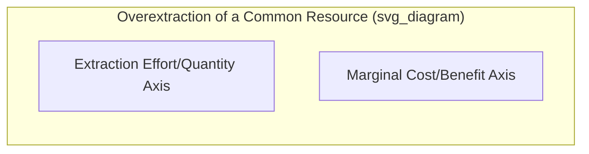

## Common Resources and the Tragedy of the Commons

### Definition of Common Resources

**Common resources** (also called common-pool resources) are goods characterized by:

- **Non-excludability**: It is difficult or costly to prevent individuals from accessing and using the resource
- **Rivalry (subtractability)**: One individual's use of the resource reduces the quantity or quality available for others

**Key Points**

- Common resources occupy a distinct category from **public goods** (non-excludable, non-rival) — the key distinguishing feature is that common resources **are** rival in consumption, meaning use by one party directly diminishes what remains for others
- This combination of properties creates a specific market failure distinct from the free-rider problem associated with public goods: **overuse or depletion** of the resource, rather than underprovision

### The Four-Category Classification (Context)

$$\begin{array}{c|cc}
& \text{Excludable} & \text{Non-Excludable} \\
\hline
\text{Rival} & \text{Private Goods} & \text{Common Resources} \\
\text{Non-Rival} & \text{Club Goods} & \text{Public Goods} \\
\end{array}$$

**Examples of Common Resources**: Ocean fisheries, groundwater aquifers, unregulated grazing land, congested public roads, the atmosphere's capacity to absorb greenhouse gases, wild forests subject to unregulated logging.

### The Tragedy of the Commons: Core Concept

The **tragedy of the commons** describes the tendency for a shared, non-excludable, rival resource to be **overused, overexploited, or depleted** beyond its sustainable or socially efficient level, because individual users do not bear the full cost of their resource extraction.

**Key Points**

- The term was popularized by ecologist Garrett Hardin in his influential 1968 essay, though the underlying economic logic (open-access resource degradation) had been analyzed earlier by economists including H. Scott Gordon
- The "tragedy" lies in the fact that **each individual acting rationally in their own self-interest** leads to an outcome that is **collectively worse for everyone**, including each individual user themselves in the long run

### The Economic Mechanism: Divergence Between Private and Social Marginal Cost

**Formal Framework**

$$MSC = MPC + MEC$$

where $MSC$ is the marginal social cost of an individual's resource extraction, $MPC$ is that individual's marginal private cost (their own direct cost of extraction), and $MEC$ is the marginal external cost imposed on all other users of the shared resource (through the resulting reduction in the resource's future availability or productivity).

**Mechanism**

Each user, in deciding how much to extract, considers only their own private cost and benefit, ignoring the negative externality their extraction imposes on other current and future users of the shared resource. Because $MPC < MSC$, individual users tend to extract **more** than the socially efficient quantity, in a pattern structurally analogous to a standard negative externality problem — but here, the "externality" is imposed on other users of the identical resource rather than an unrelated third party.

**Graphical Illustration**

**Verbal description of the standard diagram:**

- A marginal benefit curve ($MB$, representing the value of each additional unit of extraction, e.g., fish caught) slopes downward
- The marginal private cost curve ($MPC$) is below the marginal social cost curve ($MSC$)
- **Unregulated (open-access) equilibrium** occurs where individual users continue extracting as long as their private benefit exceeds their private cost — often driving extraction to the point where $MB$ equals $MPC$, or in the most extreme "pure open access" cases, to the point where total revenue equals total cost (dissipating the entire resource rent)
- The **socially efficient level** of extraction occurs where $MB = MSC$, at a lower level of extraction than the open-access outcome
- The gap between the open-access outcome and the efficient outcome represents the overextraction caused by the tragedy of the commons

### Classic Illustrative Example: The Shared Pasture

Hardin's original illustration involved a shared pasture used by multiple herders for grazing cattle.

**The Logic**

- Each herder gains the **full private benefit** of adding one more animal to the pasture (increased output/income from that animal)
- The **cost** of that additional animal — in terms of pasture degradation, reduced grass availability for all animals — is **shared** among all herders using the pasture, so each individual herder bears only a fraction of the true cost of their own decision
- Because each herder's private benefit from adding an animal exceeds their own (smaller, shared) private cost, **every** herder has an incentive to add more animals
- If all herders reason this way, the pasture becomes **overgrazed**, degrading the resource for all users — including the herders whose individually rational decisions contributed to the outcome

**Key Points**

This example illustrates the core tension: an action that is individually rational (adding one more animal) becomes collectively self-defeating when replicated by all resource users, since the shared resource's capacity is finite and its degradation affects everyone.

### Modern Real-World Examples

**Overfishing**

Unregulated or under-regulated ocean fisheries are a widely studied real-world example: individual fishing vessels have an incentive to catch as many fish as possible, since any fish left uncaught may simply be caught by a competitor instead, leading to extraction rates exceeding sustainable population replacement rates and, in severe cases, fishery collapse.

**Groundwater Depletion**

Aquifers accessed by many independent well owners face a similar dynamic: each owner has an incentive to pump water at a rate that maximizes their own immediate benefit, without fully accounting for the effect of their pumping on the water table available to neighboring wells, potentially leading to unsustainable long-run depletion.

**Traffic Congestion**

Public roads without congestion pricing represent a common resource in the sense that each driver's decision to use the road during peak hours imposes a congestion cost (added travel time) on all other drivers, a cost the individual driver does not fully internalize when deciding whether to drive.

**Climate Change and Atmospheric Capacity**

[Inference] The Earth's atmosphere's capacity to absorb greenhouse gases without triggering severe climate disruption can be conceptualized as a global common resource; because emissions from any single country or firm are non-excludable in their effect on the shared atmosphere, and each emitter bears only a small fraction of the resulting global cost, this is frequently analyzed by economists using a tragedy-of-the-commons framework, though the specific policy solutions required (given the global scale and number of involved parties) remain a subject of extensive ongoing debate and negotiation.

### Solutions to the Tragedy of the Commons

**1. Government Regulation**

Direct regulatory limits on resource extraction (fishing quotas, water use permits, hunting licenses, catch limits) can restrict aggregate use to the sustainable or efficient level, though effective enforcement and monitoring can be costly, particularly for resources spread over large or remote areas.

**2. Assigning Private Property Rights**

Converting a common resource into a privately owned resource (where feasible) internalizes the externality, since a private owner has a direct incentive to manage the resource sustainably in order to preserve its long-term value (analogous to Coasean logic — clearly defined property rights can facilitate efficient outcomes).

**Example**: Historically, the "enclosure" of previously common grazing land into privately owned parcels in parts of pre-industrial Europe is often cited as an example (with significant historical and distributional complexity) of converting a common resource into excludable private property.

**3. Tradable Quotas (Individual Transferable Quotas)**

For resources like fisheries, governments can establish an overall sustainable catch limit and then allocate **tradable individual quotas** to fishers, combining a regulatory cap with market-based flexibility (similar in spirit to cap-and-trade systems for pollution), allowing quota-holders to trade rights among themselves while keeping aggregate extraction within the sustainable limit.

**4. Community-Based/Collective Management (Ostrom's Contribution)**

Economist **Elinor Ostrom**, awarded the Nobel Memorial Prize in Economic Sciences in 2009, conducted extensive empirical research demonstrating that local communities can, and often do, develop effective **self-governing institutions** to manage common-pool resources sustainably without either full privatization or top-down government regulation.

**Ostrom's Design Principles for Successful Commons Governance** (illustrative, not exhaustive):

- Clearly defined boundaries of the resource and its user group
- Rules governing use that are adapted to local conditions
- Mechanisms for users to participate in modifying the rules
- Monitoring systems, often carried out by the users themselves
- Graduated sanctions for rule violations
- Accessible conflict-resolution mechanisms
- Recognition of the community's right to self-organize

[Inference] Ostrom's research suggested that neither pure privatization nor pure government regulation is a universally necessary or sufficient solution — successful community-based governance arrangements have been empirically documented across various contexts, though scholars generally recognize that the effectiveness of such arrangements depends significantly on specific local social, historical, and institutional conditions rather than following one universal template.

### Comparison with the Public Goods Free-Rider Problem

| Feature | Public Goods (Free-Rider Problem) | Common Resources (Tragedy of the Commons) |
| --- | --- | --- |
| Excludability | Non-excludable | Non-excludable |
| Rivalry | Non-rival | Rival |
| Market failure direction | Underprovision | Overuse/overextraction |
| Core incentive problem | No incentive to pay (benefit received regardless) | No incentive to conserve (cost of use shared, not fully borne) |
| Example | National defense, basic research | Fisheries, groundwater, grazing land |

### Common Pitfalls and Misconceptions

- **Confusing common resources with public goods**: While both are non-excludable, common resources are **rival** (leading to overuse) while public goods are **non-rival** (leading to underprovision) — these require fundamentally different policy solutions
- **Assuming privatization is always the only solution**: Ostrom's empirical work substantially challenged the earlier assumption (implicit in some interpretations of Hardin's original essay) that only privatization or centralized government control can prevent commons degradation; well-designed community-based management has been documented as a viable alternative in many specific contexts
- **Assuming the tragedy of the commons is inevitable for all shared resources**: The "tragedy" describes a **tendency** arising from misaligned individual incentives under open-access conditions, not an unavoidable outcome; well-designed institutions (whether private property, government regulation, or community governance) can and often do prevent or mitigate the tragedy
- **Overlooking the historical and distributional complexity of enclosure/privatization solutions**: Converting common resources to private property has, in various historical contexts, involved significant and often contested distributional consequences for communities that previously relied on open access to the resource — this is a meaningful and separate consideration from the pure efficiency argument for privatization

**Related Topics**

- Public goods and the free-rider problem
- Conditions for market failure
- Positive and negative externalities
- The Coase Theorem and property rights
- Elinor Ostrom and institutional economics
- Fisheries management and tradable quotas
- Environmental economics and sustainable resource management
- Government regulation vs market-based environmental policy