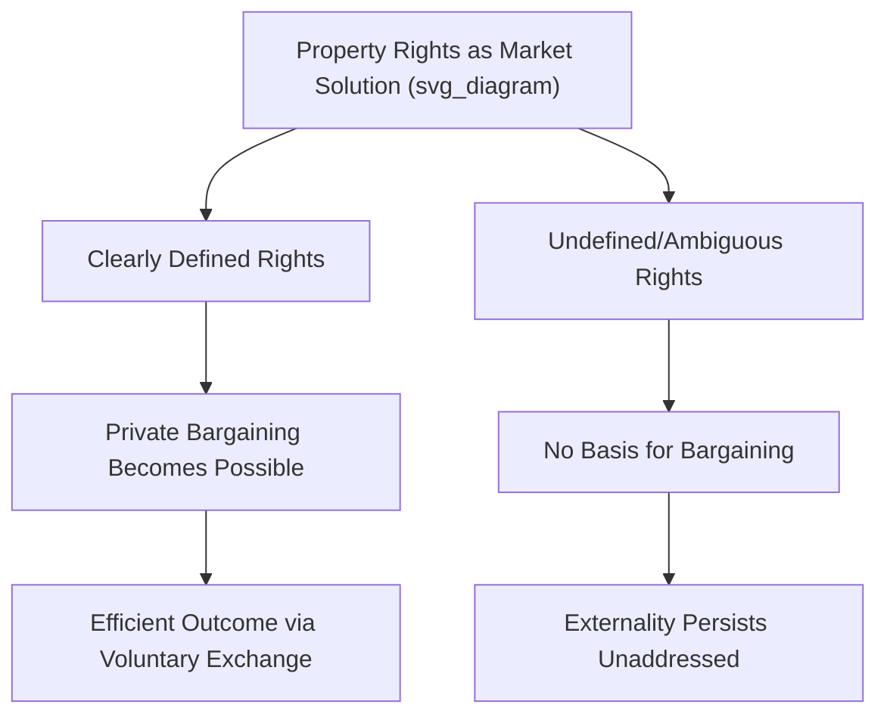

## Property Rights and Market Solutions

### Definition and Role in Economic Analysis

**Property rights** refer to the legally and socially recognized entitlements governing the ownership, use, transfer, and exclusion of others from a resource or asset. In economic analysis, well-defined property rights are a foundational precondition for markets to function efficiently, since they establish who bears the costs and captures the benefits associated with a resource's use.

**Key Points**

- Property rights are typically characterized by several component elements: the right to **use** a resource, the right to **exclude** others from its use, the right to **transfer** (sell or gift) the resource, and the right to the **income or benefits** generated by the resource
- Many market failures — particularly externalities and common resource problems — can be understood, at their root, as arising from **poorly defined, unenforced, or entirely absent property rights**
- Establishing or clarifying property rights is therefore one of the primary **market-based solutions** economists propose for correcting certain categories of market failure, as an alternative or complement to direct government regulation

### The Link Between Property Rights and Externalities

**Key Points**

When property rights over a resource (such as clean air, water, or a fishery) are not clearly assigned, no one has a direct economic incentive to protect that resource or to demand compensation for its degradation — this is often described as an **open-access** or "no-property-rights" condition.

**Example**

Air pollution has historically been a significant externality problem partly because no one holds a clear, enforceable property right over clean air. Because no one can charge a polluter for degrading the air, or be compensated for that degradation, market transactions alone do not naturally arise to address the externality — this is precisely the ownership vacuum that Pigouvian taxes, cap-and-trade permit systems, or direct regulation are designed to address by creating (in the case of tradable permits) an artificial but functional set of property rights.

### The Coase Theorem: Property Rights as a Market-Based Solution

The **Coase Theorem**, developed by Ronald Coase, provides the central theoretical link between property rights and market-based resolution of externalities.

**Formal Statement**: If property rights are clearly defined and transaction costs are sufficiently low, private parties can bargain to an efficient allocation of resources, **regardless of the initial assignment** of those rights.

**Key Points**

- The Coasean insight reframes many market failure problems: the core issue is often not the absence of a market mechanism per se, but the **absence of a well-defined right** that would allow bargaining to occur in the first place
- Once rights are clearly assigned (to either party in a dispute), the parties themselves have an incentive to negotiate toward the efficient outcome, since a mutually beneficial exchange (compensation in one direction or another) becomes possible

**Example**

A dispute between a factory and a nearby resident over noise pollution can, in principle, be resolved through private bargaining **once** it is clearly established whether the factory has the right to make noise or the resident has the right to quiet. Without this clear assignment, there is no defined starting point from which either party could offer or demand compensation.

### Assigning Property Rights to Address Common Resource Problems

For **common-pool resources** (non-excludable, rival goods such as fisheries or grazing land), assigning private property rights is a widely discussed market-based solution to the tragedy of the commons.

**Mechanism**

When a resource is privately owned, the owner has a direct financial incentive to manage it sustainably, since depleting the resource today reduces its future value to that same owner — the owner **internalizes** the full cost of overuse, unlike in an open-access setting where the cost of one user's overextraction is shared (and largely externalized) across all other users.

**Example**

Compare an open-access ocean fishery (where any vessel can fish, with no individual owner) to a privately or communally "owned" fishery (e.g., through an assigned harvesting right). In the open-access case, each fisher has an incentive to catch as much as possible before competitors do, since fish left in the water may simply be caught by someone else. Under a system of assigned property rights (such as **individual transferable quotas**, discussed further below), a quota holder has a defined, secure claim to a portion of the resource, creating an incentive to support sustainable management practices that preserve the resource's long-term value.

### Individual Transferable Quotas (ITQs): A Market-Based Property Rights Solution

**Individual Transferable Quotas (ITQs)** are a widely implemented policy tool applying property-rights logic to fisheries management.

**Mechanism**

1. Regulators establish a **total allowable catch (TAC)** for a fishery, based on estimates of sustainable yield
2. The TAC is divided into individual quota shares, allocated to individual fishers or fishing operations (often based on historical catch records)
3. Quota shares are made **transferable** — fishers can buy, sell, or lease their quota rights to other fishers

**Key Points**

- This system creates a form of **private property right** over a portion of a formerly open-access resource, addressing the core incentive problem underlying the tragedy of the commons
- The **transferability** feature allows quotas to migrate toward the fishers who can harvest most efficiently or profitably, similar in spirit to how tradable pollution permits allow abatement to occur at the lowest aggregate cost
- [Inference] Empirical studies of ITQ systems in various fisheries have generally found improvements in resource sustainability and economic efficiency relative to unregulated open access, though outcomes vary by specific fishery, initial quota allocation method, and enforcement quality, and ITQ systems have also faced criticism regarding the distributional effects of initial quota allocation (e.g., concentration of quota ownership over time)

### Tradable Pollution Permits: Property Rights Applied to Externalities

**Cap-and-trade systems** similarly apply property-rights logic to environmental externalities by creating a defined, tradable right to emit a specific quantity of a pollutant.

**Mechanism**

1. A regulatory body sets an overall **cap** (limit) on total emissions of a pollutant
2. Permits, each representing the right to emit one unit of the pollutant, are issued (via auction, free allocation, or a combination) up to the level of the cap
3. Firms can **trade** permits among themselves

**Key Points**

- This creates an artificial, government-established property right where none existed naturally (since the atmosphere's absorptive capacity is not naturally excludable or ownable in the way physical land is)
- Firms with low-cost abatement options can reduce emissions and sell excess permits; firms with high-cost abatement options can buy permits rather than reduce emissions as much, achieving the overall emissions target at the lowest aggregate cost — a similar cost-effectiveness logic to ITQs in fisheries

### Land and Water Rights: Foundational Historical Examples

**Land Property Rights**

[Inference] The historical development of clearly defined and enforceable land property rights is often cited by economists and economic historians as a significant contributing factor to long-run economic development, since secure land tenure provides individuals and firms the incentive to invest in improving land productivity (irrigation, buildings, soil quality), knowing they will capture the resulting returns; however, the specific magnitude of this effect and the historical processes involved (including their often significant distributional and social consequences) remain subjects of extensive scholarly research and debate.

**Water Rights**

Water rights systems (such as prior appropriation systems used in parts of the western United States, or riparian rights systems used elsewhere) represent attempts to define clear, enforceable property rights over a resource that is otherwise difficult to physically exclude others from, enabling water markets and transfers to occur among users with differing valuations.

### Limitations of Property-Rights-Based Solutions

**1. High Transaction Costs**

As emphasized within the Coase Theorem's own conditions, assigning property rights does not guarantee an efficient outcome if transaction costs of bargaining, monitoring, or enforcing those rights remain high — particularly relevant for resources affecting very large or diffuse populations (e.g., global atmospheric commons).

**2. Difficulty of Defining Rights for Certain Resources**

Some resources are inherently difficult to subdivide into clearly excludable units — for example, migratory wildlife populations, deep ocean resources, or the global climate system present significant practical challenges to establishing enforceable property rights, regardless of the theoretical appeal of doing so.

**3. Distributional Concerns**

The **initial allocation** of newly created property rights (e.g., who receives free pollution permits, or how historical fishing quotas are assigned) carries substantial distributional consequences, even though the Coase Theorem suggests the initial allocation does not affect the ultimate efficiency of the outcome. Political and equity considerations regarding this initial allocation are frequently significant and contested in practice.

**4. Enforcement Costs**

Property rights are only meaningful if they can be **enforced** — monitoring compliance (e.g., verifying actual emissions match permit holdings, or catch matches quota allocations) requires resources and institutional capacity that may be limited or costly, particularly in some developing-country or weak-institution contexts.

**5. Equity and Access Concerns from Privatization**

[Inference] Converting previously open-access or communally managed resources into privately or narrowly held property rights has, in various historical and contemporary contexts, raised significant concerns regarding the loss of access for communities that previously relied on open or communal use, a distributional consideration distinct from the pure efficiency argument for well-defined property rights.

### Comparison of Market-Based Property Rights Solutions

| Mechanism | Resource Type | Right Created | Key Benefit |
| --- | --- | --- | --- |
| Coasean Bargaining | Any (small number of parties) | Existing legal rights clarified | No government administrative burden if transaction costs low |
| Individual Transferable Quotas | Fisheries (common-pool resource) | Right to harvest a defined quantity | Aligns incentives with sustainable management |
| Cap-and-Trade Permits | Air pollution/emissions (externality) | Right to emit a defined quantity | Cost-effective achievement of aggregate target |
| Private Land Ownership | Land, agricultural resources | Full ownership and exclusion rights | Incentivizes long-term investment and stewardship |
| Water Rights Systems | Water resources | Right to withdraw/use a defined quantity | Enables efficient reallocation via water markets |

### Alternatives and Complements to Pure Property-Rights Solutions

**Key Points**

As highlighted by Elinor Ostrom's research on common-pool resource governance, well-defined **individual private property rights** are not the only institutional mechanism capable of addressing resource management problems. **Community-based collective governance arrangements**, with clearly defined group boundaries and locally adapted rules (rather than individual ownership per se), have also been empirically documented as effective in many specific contexts, suggesting that "clearly defined rights" can take collective as well as individual forms.

### Common Pitfalls and Misconceptions

- **Assuming property rights solutions eliminate the need for any government role**: Even market-based solutions like cap-and-trade or ITQs require a government or regulatory body to initially define the rights, set the overall cap/quota level, and enforce compliance — property rights approaches are not equivalent to the complete absence of government involvement
- **Assuming privatization is always superior to regulation or collective management**: Depending on the specific resource characteristics, transaction costs, and social context, direct regulation, tradable rights systems, or community-based governance may each be more or less effective solutions in different circumstances
- **Overlooking distributional consequences of initial rights allocation**: While the Coase Theorem's efficiency conclusion is independent of the initial rights assignment, the specific initial allocation carries substantial and often contested distributional and political implications in practice
- **Assuming all resources can be easily subdivided into enforceable property rights**: Certain resources (highly migratory species, the global atmosphere, deep-sea ecosystems) present significant practical challenges to establishing clear, enforceable, and easily monitored property rights, regardless of the theoretical efficiency case for doing so

**Related Topics**

- The Coase Theorem and private bargaining
- Common resources and the tragedy of the commons
- Positive and negative externalities
- Pigouvian taxes and subsidies
- Cap-and-trade systems and tradable permits
- Elinor Ostrom and institutional economics
- Land markets and economic rent
- Conditions for market failure