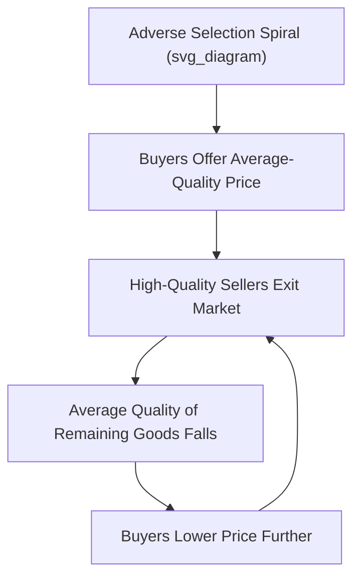

## Asymmetric Information

### Definition

**Asymmetric information** describes a situation in an economic transaction where one party possesses more, or better, relevant information than the other party. This informational imbalance can distort market outcomes, prevent mutually beneficial trades from occurring, and represents a significant category of market failure, since it violates the "no information asymmetries" condition required for the First Welfare Theorem's efficiency result.

**Key Points**

- Asymmetric information problems are typically classified into two broad categories, distinguished by **when** the informational advantage matters relative to the transaction: **adverse selection** (a hidden-information problem existing *before* a transaction) and **moral hazard** (a hidden-action problem arising *after* a transaction)
- The foundational theoretical work on asymmetric information was recognized with the 2001 Nobel Memorial Prize in Economic Sciences, shared by George Akerlof, Michael Spence, and Joseph Stiglitz

### Adverse Selection: Hidden Information Before a Transaction

**Definition**

Adverse selection arises when one party to a potential transaction has private information about a relevant characteristic (quality, risk, type) **before** the transaction occurs, and the other party cannot easily verify or distinguish this characteristic.

**The Akerlof "Market for Lemons" Model**

George Akerlof's seminal 1970 paper illustrates adverse selection using the market for used cars.

**Setup**

- Sellers know the true quality of their used car (whether it is a "good car" or a "lemon"), but buyers cannot distinguish good cars from lemons before purchase
- Buyers are willing to pay a price reflecting the **average** quality of cars in the market, since they cannot identify individual car quality

**Mechanism**

1. Because buyers offer a price based on average quality, sellers of **high-quality** cars — who know their car is worth more than this average price — become less willing to sell at that price
2. As high-quality sellers exit the market, the **average quality** of cars remaining for sale falls
3. Buyers, anticipating this, further lower their offered price to reflect the now-lower average quality
4. This process can repeat, potentially causing the market to **unravel** entirely, with only the lowest-quality cars ("lemons") remaining for sale — an outcome known as **adverse selection death spiral**

**Key Points**

- The market failure here is stark: even though mutually beneficial trades exist (a buyer might value a good-quality car more than the seller does), the informational asymmetry can prevent these trades from occurring, since the market mechanism cannot separately price different quality levels
- This illustrates how asymmetric information alone, absent any externality or public good issue, can cause markets to fail to achieve efficient outcomes

### Adverse Selection in Insurance Markets

**Example**

In health or life insurance markets, individuals typically know more about their own health status and risk factors than insurers do. If an insurer sets a single premium based on the **average** risk across the entire pool of applicants:

- Lower-risk individuals may find this average-based premium unattractive (since it exceeds what accurately reflects their true, lower risk) and choose not to purchase insurance
- Higher-risk individuals, for whom the average premium is a relative bargain, are more likely to purchase insurance
- This shifts the insured pool toward higher average risk, potentially forcing the insurer to raise premiums further, repeating the same unraveling dynamic seen in the used car example

**Key Points**

[Inference] Unaddressed adverse selection in insurance markets can, in severe cases, lead to significant market thinning or collapse for certain risk categories, which is a major reason many real-world insurance markets rely on mechanisms such as mandatory participation requirements, medical underwriting, or group-based (rather than fully individualized) pricing to mitigate the problem, though the specific policy tradeoffs involved (privacy, fairness, market stability) remain actively debated.

### Solutions to Adverse Selection

**1. Signaling**

The party with private information (e.g., the seller or the insurance applicant) can take a costly action to credibly demonstrate their true type. See detailed coverage of signaling models under related topics.

**2. Screening**

The uninformed party can design a menu of contracts or options such that different types of the informed party self-select into different choices, revealing their private information indirectly through their choice.

**3. Warranties and Guarantees**

A seller offering a warranty on a used car signals confidence in the car's quality, since offering such a warranty would be more costly for a seller of a low-quality car (who would expect to pay out on warranty claims more frequently) than for a seller of a genuinely high-quality car.

**4. Reputation and Repeated Interaction**

Sellers or firms that expect to interact repeatedly with the same market (building a reputation over time) have a stronger incentive to be honest about quality, since dishonesty could damage future business — third-party reputation systems (ratings, reviews) can similarly help mitigate information asymmetries.

**5. Third-Party Certification and Disclosure Requirements**

Independent inspection services (e.g., vehicle history reports, professional inspections) or government-mandated disclosure requirements can help reduce the informational gap between buyers and sellers.

**6. Mandatory Participation (Insurance-Specific)**

Requiring universal or near-universal participation in an insurance pool (as opposed to voluntary purchase) can prevent the adverse selection spiral, since low-risk individuals cannot opt out, keeping the risk pool closer to the full population's average risk profile.

### Moral Hazard: Hidden Action After a Transaction

**Definition**

Moral hazard arises when one party's **behavior**, unobservable to the other party, changes **after** a transaction or agreement is finalized, because that party no longer bears the full consequences of their actions.

**Key Distinction from Adverse Selection**

| Feature | Adverse Selection | Moral Hazard |
| --- | --- | --- |
| Timing | Before the transaction (hidden information/type) | After the transaction (hidden action/behavior) |
| Nature of problem | Uninformed party cannot distinguish types | Informed party changes behavior once insulated from consequences |
| Example | Insurer cannot distinguish high-risk from low-risk applicants | Insured individual takes fewer precautions once covered |

**Example: Insurance and Reduced Precaution**

An individual with comprehensive automobile insurance, particularly with low or no deductible, may drive slightly less cautiously than they would without insurance, since they no longer bear the full financial consequence of an accident. The insurer cannot perfectly observe or monitor the policyholder's driving behavior, creating the moral hazard problem.

**Example: Principal-Agent Relationships**

Moral hazard is central to many **principal-agent problems** in economics: an employer (principal) cannot perfectly observe an employee's (agent's) effort level, creating an incentive for the employee to shirk (exert less effort than the employer would prefer) if compensation is not tied closely enough to observable performance outcomes.

$$\text{Effort}_{\text{observed}} < \text{Effort}_{\text{first-best}}$$

when effort cannot be perfectly monitored and compensation does not fully align the agent's incentives with the principal's interests.

### Solutions to Moral Hazard

**1. Deductibles and Co-Payments (Insurance-Specific)**

Requiring the insured party to bear some portion of the cost (a deductible or co-payment) preserves some incentive to avoid the insured-against loss, partially mitigating moral hazard while still providing risk protection.

**2. Monitoring**

Direct observation or monitoring of the agent's behavior (e.g., workplace supervision, telematics devices tracking driving behavior for auto insurance) can reduce the informational gap that enables moral hazard, though monitoring itself is often costly.

**3. Incentive-Compatible Contracts**

Designing compensation contracts that align the agent's incentives with the principal's interests — for example, performance-based pay, stock options for executives, or profit-sharing arrangements — reduces the incentive to shirk or take excessive risk, since the agent now bears more of the direct consequence of their own effort or risk-taking decisions.

**4. Bonding and Reputation Mechanisms**

Requiring an agent to post a bond (forfeited in case of poor performance or malfeasance) or relying on long-term reputational stakes can help align incentives even when direct monitoring is imperfect.

### Signaling: A Market-Based Response to Asymmetric Information

**Definition**

**Signaling** occurs when the party holding private information takes a costly, observable action specifically to credibly communicate their unobservable type to the other party.

**The Spence Job-Market Signaling Model**

Michael Spence's model illustrates signaling using education and the labor market.

**Key Assumption**: Acquiring education is **less costly** for high-ability workers than for low-ability workers (not necessarily because education directly increases ability or productivity, but because high-ability individuals find the process of acquiring credentials easier or less costly).

**Mechanism**

- In a **separating equilibrium**, high-ability workers acquire a level of education that would be too costly for low-ability workers to mimic, credibly signaling their type to employers
- Employers, observing the education signal, offer higher wages to more-educated workers, rationally inferring higher underlying ability
- This can occur **even if education itself does not directly raise productivity** — the value of education here lies purely in its function as a credible signal, distinct from the human capital theory's explanation for the education-wage relationship

**Key Points**

[Unverified] Distinguishing empirically between the signaling explanation and the human capital (productivity-enhancing) explanation for the observed positive correlation between education and wages remains a genuinely contested question in labor economics, with the relative importance of each channel likely varying across educational levels and contexts.

### Screening: The Uninformed Party's Response

**Definition**

**Screening** occurs when the uninformed party designs a set of options or contracts such that different types of the informed party will voluntarily self-select into different choices, indirectly revealing their private information.

**Example**

An insurance company might offer a **menu of contracts**: a low-premium policy with a high deductible, and a high-premium policy with a low deductible. Low-risk individuals (who expect to file fewer claims) will tend to prefer the low-premium, high-deductible option, since they do not expect to need the deductible protection often, while high-risk individuals will tend to prefer the high-premium, low-deductible option. This self-selection allows the insurer to indirectly sort applicants by risk type, even without directly observing each individual's true risk level.

### Comparison: Signaling vs. Screening

| Feature | Signaling | Screening |
| --- | --- | --- |
| Who acts | The informed party (e.g., job applicant, seller) | The uninformed party (e.g., employer, insurer) |
| Mechanism | Costly action credibly reveals private information | Menu of options induces self-selection by type |
| Example | Education credentials, warranties | Insurance contract menus, deductible/premium combinations |

### Broader Applications of Asymmetric Information Theory

**Credit Markets**

Lenders often cannot fully observe a borrower's true creditworthiness or intended use of funds, leading to potential adverse selection (riskier borrowers more likely to seek loans at a given interest rate) and moral hazard (borrowers taking on riskier projects than lenders would prefer once funds are disbursed) — a dynamic central to theories of credit rationing.

**Corporate Governance**

The separation of ownership (shareholders) and control (managers) in large corporations creates a principal-agent problem with significant moral hazard potential, motivating governance mechanisms such as executive stock compensation, board oversight, and mandatory financial disclosure requirements.

**Used Goods and Online Marketplaces**

Modern platforms (online marketplaces, ride-sharing, peer-to-peer rental services) have developed reputation systems, ratings, and review mechanisms as practical, technology-enabled solutions to the adverse selection problems Akerlof originally identified in the used car market.

### Common Pitfalls and Misconceptions

- **Confusing adverse selection and moral hazard**: The critical distinction is timing and mechanism — adverse selection involves hidden information that exists **before** a transaction, while moral hazard involves hidden **actions** that change **after** a transaction or agreement is in place
- **Assuming asymmetric information always causes complete market collapse**: While severe adverse selection can cause markets to unravel, many real-world markets persist despite significant information asymmetries, due to the mitigating mechanisms (signaling, screening, reputation, regulation) discussed above
- **Assuming signaling always reflects genuine productivity differences**: In pure signaling models, the signal (e.g., education) may have value purely due to its differential cost across types, independent of whether it directly enhances the underlying characteristic (productivity) being signaled
- **Overlooking that moral hazard can be a two-sided problem**: While often discussed regarding insurance policyholders or employees, moral hazard can affect any party in an agreement whose behavior becomes unobservable and whose incentives shift once a contract or agreement is in place, including firms and even the principal side of some agency relationships

**Related Topics**

- Conditions for market failure
- Adverse selection in insurance markets
- Moral hazard and principal-agent problems
- Signaling and screening models
- The Coase Theorem and property rights
- Credit rationing and financial market imperfections
- Human capital theory and returns to education
- Mechanism design and contract theory