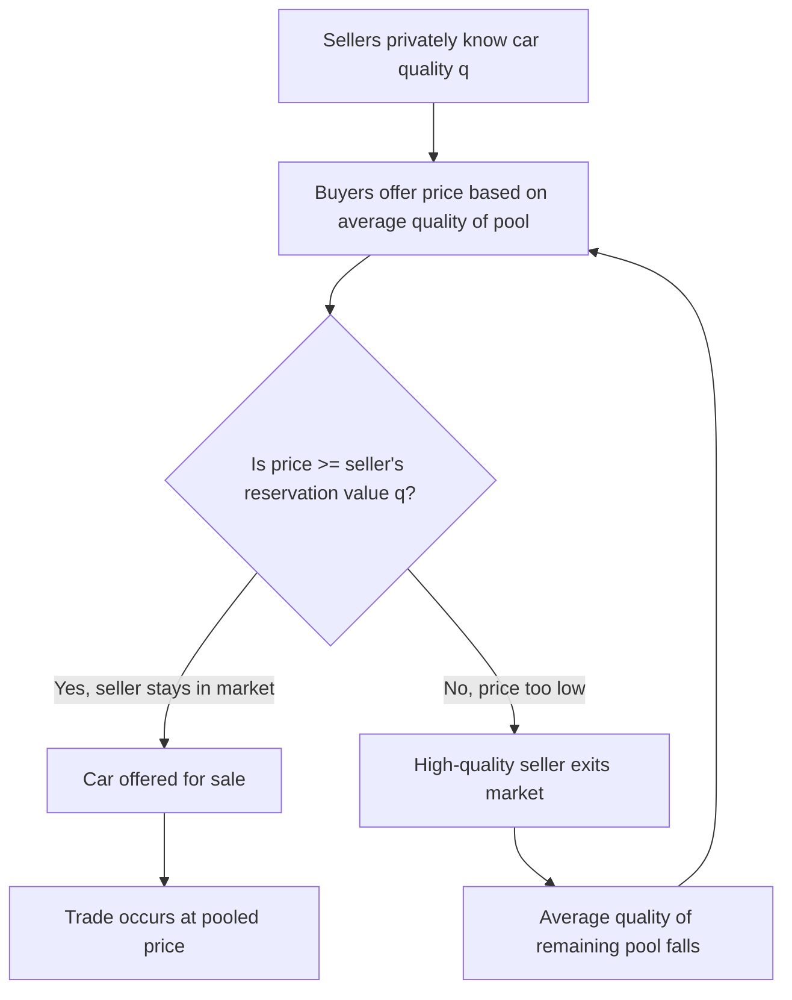

## Adverse Selection

### Definition and Conceptual Overview

Adverse selection is a form of market failure arising from asymmetric information, where one party to a transaction possesses relevant information that the other party lacks, and this information gap exists *before* the transaction takes place (making it a **pre-contractual** or **ex ante** information problem). The party with superior information can exploit this advantage, systematically distorting the mix of goods, services, or counterparties that participate in a market.

The term originates from insurance economics: insurers found that the individuals most eager to buy insurance were disproportionately those most likely to file claims. Applied broadly, adverse selection describes any situation where hidden information about quality, risk, or type causes low-quality participants to "crowd out" high-quality participants in a market.

Adverse selection is one of two major categories of information asymmetry problems studied in information economics, the other being **moral hazard** (a post-contractual, hidden-action problem). The distinction is essential:

| Feature | Adverse Selection | Moral Hazard |
| --- | --- | --- |
| Timing | Ex ante (before contract) | Ex post (after contract) |
| Hidden element | Type/characteristic | Action/behavior |
| Example | Insurer doesn't know applicant's health status | Insured person drives recklessly after buying insurance |

### Historical Origin: Akerlof's "Market for Lemons"

The formal theoretical foundation was established by George Akerlof in his 1970 paper "The Market for 'Lemons': Quality Uncertainty and the Market Mechanism," for which he later shared the 2001 Nobel Memorial Prize in Economic Sciences (with Michael Spence and Joseph Stiglitz, who developed complementary theories of signaling and screening).

Akerlof used the used-car market as his illustrative case:

- Sellers of used cars know the true quality of their vehicle (whether it is a "peach" — good quality — or a "lemon" — defective).
- Buyers cannot distinguish peaches from lemons prior to purchase.
- Buyers, unable to verify quality, are only willing to pay a price reflecting the *average* quality of cars in the market.
- At this average price, owners of peaches find the price too low relative to their car's true value and exit the market.
- This withdrawal lowers the average quality of cars remaining, causing buyers to revise their willingness to pay downward further.
- The process can iterate until only lemons remain, or the market collapses entirely (unravels).

This is often called the "**market unraveling**" or "**death spiral**" result.

### Formal Model

**Setup:**

- There exists a continuum of sellers, each holding a car of quality $q$, uniformly distributed on $[0, 1]$.
- Sellers know their own $q$; buyers only know the distribution of $q$ across the market.
- A seller's valuation of their own car is $V_S(q) = q$.
- A buyer values any car of quality $q$ at $V_B(q) = \alpha q$, where $\alpha > 1$ (buyers value cars more than sellers do, which is why gains from trade should exist).

**Market price:** Since buyers cannot observe individual $q$, they offer a single price $p$ based on the *expected* quality of cars offered at that price.

**Seller participation rule:** A seller with quality $q$ offers their car for sale only if $p \geq q$ (i.e., the price meets or exceeds their reservation value). This means the pool of cars offered at price $p$ is truncated to $q \in [0, p]$.

**Expected quality conditional on being offered:**

$$E[q \mid q \le p] = \frac{p}{2}$$

**Buyer's willingness to pay, given rational expectations:**

$$p = \alpha \cdot E[q \mid q \le p] = \alpha \cdot \frac{p}{2}$$

Solving:

$$p\left(1 - \frac{\alpha}{2}\right) = 0$$

If $\alpha < 2$, the only equilibrium is $p = 0$ — the market **completely unravels**, even though gains from trade $(\alpha - 1)q > 0$ exist for every quality level. This is the classic Akerlof result: private information can destroy a market that would otherwise generate positive surplus for all participants.

[Inference] The specific unraveling threshold ($\alpha < 2$ in this formulation) is a property of the particular functional form and uniform-distribution assumption chosen for pedagogical simplicity; the qualitative unraveling result generalizes, but exact thresholds are model-dependent.

### Conditions Necessary for Adverse Selection

1. **Information asymmetry**: One party has private information about a relevant characteristic (quality, risk type, health status) unavailable to the other.
2. **Heterogeneous types**: Market participants differ meaningfully in the hidden characteristic (not everyone is the same risk/quality).
3. **Single/pooled pricing**: The uninformed party cannot price-discriminate based on the hidden characteristic and must offer terms based on the pooled average.
4. **Self-selection into or out of the market**: Participants can choose whether to transact, and this choice correlates with their private information.

### Key Markets Where Adverse Selection Arises

#### Insurance Markets

This is the canonical application. Individuals know their own risk of illness, accident, or death better than insurers do.

- **High-risk individuals** are more willing to purchase insurance at any given premium (because their expected payout is higher relative to the premium).
- Insurers, observing only the population average risk, must set premiums based on the pool that self-selects into buying insurance.
- As premiums rise to reflect this pool, low-risk individuals — for whom insurance is now overpriced relative to their own risk — drop out.
- This raises the average risk of the remaining pool further, potentially triggering another round of premium increases and low-risk exit.

**Result:** Insurance markets can exhibit under-provision of coverage to low-risk types, or in extreme cases, complete market collapse for certain risk categories (e.g., long-term care insurance markets are frequently cited as thin or missing due to this dynamic).

#### Labor Markets

Job applicants know their own productivity, work ethic, and skill level better than employers do at the hiring stage.

- Firms, unable to observe true productivity, offer wages based on the average expected productivity of the applicant pool.
- Highly productive workers, undervalued at this pooled wage, may withdraw from that segment of the market (or seek jobs where their quality can be verified).
- This can depress average applicant quality, a dynamic connected to **Spence's job-market signaling model**, where education serves as a costly signal that separates high- and low-productivity types.

#### Credit Markets

Borrowers know their own creditworthiness and probability of repayment better than lenders.

- If lenders raise interest rates to compensate for the average default risk in the pool, safe borrowers (for whom the higher rate is unattractive relative to their low risk) may exit, leaving a riskier pool of borrowers.
- This is the basis of the **Stiglitz-Weiss (1981) credit rationing model**, which shows that lenders may rationally choose to *ration credit* (deny loans to some observably identical applicants) rather than raise interest rates indefinitely, because higher rates can *worsen* the average quality of the applicant pool (an adverse selection effect) and induce riskier behavior (a moral hazard effect).

#### Product and Warranty Markets

Sellers of goods (especially durable or complex goods) know quality better than buyers — the original "lemons" setting extends to any market for goods with hidden defects, secondhand goods, franchise quality, or professional services (e.g., choosing a doctor, lawyer, or contractor of unknown competence).

#### Health Insurance and the "Death Spiral"

A frequently discussed real-world case: if a health insurance market allows free entry/exit (e.g., an insurance exchange with guaranteed issue but weak enrollment mandates), healthier individuals may opt out when premiums rise, average risk in the remaining pool increases, premiums rise further, and more healthy individuals exit — a **death spiral** that can end in market collapse for that plan or exchange.

### Mechanisms to Mitigate Adverse Selection

#### 1. Signaling (Spence, 1973)

The **informed** party takes a costly, verifiable action to credibly reveal their type. For signaling to work, the cost of the signal must be negatively correlated with type (i.e., cheaper for high types to acquire than for low types), satisfying a **single-crossing condition**.

- *Example*: Education as a signal of productivity — assuming higher-ability workers find it less costly (in effort/time) to obtain a degree, degree attainment credibly separates high- from low-ability workers even if education adds no direct productivity.
- *Example*: Warranties offered by sellers of durable goods signal quality, since offering a generous warranty is more costly for sellers of low-quality (defect-prone) goods.

#### 2. Screening (Stiglitz, 1975; Rothschild-Stiglitz, 1976)

The **uninformed** party designs a menu of contracts such that different types self-select into different options, revealing their private information indirectly through their choices.

- *Example*: Insurers offer a menu of contracts with different premium-deductible combinations. A contract with a low premium but high deductible is more attractive to low-risk individuals (who don't expect to claim often), while a high-premium, low-deductible contract attracts high-risk individuals. This is called a **separating equilibrium**.
- The **Rothschild-Stiglitz (1976) model** formally shows that a separating equilibrium (if it exists) is typically **second-best** — low-risk types receive only partial insurance (a higher deductible than they would choose under full information) precisely to prevent high-risk types from mimicking them. [Inference] In some parameter ranges, no pure-strategy equilibrium exists at all in the Rothschild-Stiglitz framework, a well-known robustness concern in the screening literature.

#### 3. Statistical Discrimination / Risk Classification

The uninformed party uses observable correlates of the hidden characteristic to sort applicants into more homogeneous risk classes, narrowing the scope for adverse selection.

- *Example*: Auto insurers use age, driving record, and vehicle type as proxies for accident risk; health insurers historically used medical underwriting (pre-existing condition questions, medical exams).
- **Limitation/controversy**: This can raise fairness and discrimination concerns, especially where proxies correlate with protected characteristics (age, gender, genetic information), leading to regulatory restrictions (e.g., the U.S. Genetic Information Nondiscrimination Act, or ACA community rating rules).

#### 4. Mandatory Pooling / Compulsory Insurance

If participation is legally mandated (everyone must buy insurance, regardless of risk type), the low-risk types cannot exit the pool, which prevents unraveling.

- *Example*: Mandatory auto liability insurance; individual mandates in health insurance systems (with varying degrees of enforcement and success).
- This directly addresses the "self-selection into/out of the market" condition required for adverse selection to operate.

#### 5. Reputation and Repeated Interaction

In repeated games or markets with reputational mechanisms (e.g., seller ratings on e-commerce platforms, credit bureaus, professional licensing/certification), the informed party's incentive to misrepresent quality is reduced because misrepresentation is eventually revealed and penalized in future interactions.

#### 6. Third-Party Certification and Guarantees

Independent verification (quality certifications, credit ratings agencies, vehicle history reports like Carfax, professional licensing boards) reduces the informational gap directly by making the hidden characteristic observable (or at least more verifiable) to the uninformed party.

### Adverse Selection vs. Related Concepts

**Adverse Selection vs. Moral Hazard** (recap in more depth):

- Adverse selection concerns *hidden information about type*, existing before the contract.
- Moral hazard concerns *hidden action*, occurring after the contract, where the informed party's behavior changes because they are insulated from consequences (e.g., a person with fire insurance takes fewer fire-safety precautions).
- Both are instances of the broader **principal-agent problem** under asymmetric information.

**Adverse Selection vs. Winner's Curse:**

The winner's curse (common in auction theory) is related but distinct — it describes how the winning bidder in a common-value auction tends to have overestimated the item's value, not because of pre-existing private information asymmetry about *type*, but because winning itself is informative (conditional on winning, your estimate was likely the most optimistic).

**Adverse Selection vs. Statistical Discrimination:**

Statistical discrimination (using observable group characteristics to infer unobservable individual characteristics) can be both a *cause* of differential treatment and a *response* used to mitigate adverse selection, depending on context.

### Diagrammatic Illustration: Market Unraveling Process

### Graphical Representation: Insurance Premium and Risk Pool

The following SVG illustrates how, as premiums rise in response to adverse selection, low-risk individuals exit, raising average pool risk and triggering further premium increases (the "death spiral" dynamic), potentially converging toward market collapse.

<svg xmlns="http://www.w3.org/2000/svg" viewBox="0 0 720 460" font-family="Helvetica, Arial, sans-serif">
<text x="360" y="30" text-anchor="middle" font-size="18" font-weight="bold" fill="#1a1a2e">Adverse Selection Death Spiral in Insurance Markets (svg_diagram)</text>

<line x1="80" y1="400" x2="680" y2="400" stroke="#333" stroke-width="2" />
<line x1="80" y1="400" x2="80" y2="60" stroke="#333" stroke-width="2" />
<text x="380" y="435" text-anchor="middle" font-size="14" fill="#333">Number of Insured Individuals (Pool Size)</text>
<text x="30" y="230" text-anchor="middle" font-size="14" fill="#333" transform="rotate(-90 30 230)">Premium Level</text>

<path d="M 650 100 Q 450 150 300 230 Q 200 280 100 380" stroke="#2563eb" stroke-width="3" fill="none" />
<text x="600" y="90" font-size="13" fill="#2563eb" font-weight="bold">Avg. Risk-Based Premium Needed</text>

<circle cx="600" cy="115" r="6" fill="#dc2626" />
<text x="610" y="118" font-size="12" fill="#dc2626">Step 1: Initial premium P1</text>
<circle cx="420" cy="185" r="6" fill="#dc2626" />
<text x="430" y="188" font-size="12" fill="#dc2626">Step 2: Low-risk exit, pool shrinks</text>
<circle cx="260" cy="255" r="6" fill="#dc2626" />
<text x="270" y="258" font-size="12" fill="#dc2626">Step 3: Premium rises to P2</text>
<circle cx="150" cy="330" r="6" fill="#dc2626" />
<text x="160" y="333" font-size="12" fill="#dc2626">Step 4: More exits</text>
<circle cx="100" cy="378" r="6" fill="#7f1d1d" />
<text x="30" y="405" font-size="12" fill="#7f1d1d" font-weight="bold">Market collapse</text>

<path d="M 600 121 L 425 179" stroke="#9ca3af" stroke-width="1.5" stroke-dasharray="4,3" marker-end="url(#arrow)" />
<path d="M 420 191 L 265 249" stroke="#9ca3af" stroke-width="1.5" stroke-dasharray="4,3" marker-end="url(#arrow)" />
<path d="M 260 261 L 155 324" stroke="#9ca3af" stroke-width="1.5" stroke-dasharray="4,3" marker-end="url(#arrow)" />
<path d="M 150 336 L 105 372" stroke="#9ca3af" stroke-width="1.5" stroke-dasharray="4,3" marker-end="url(#arrow)" />
</svg>

### Worked Numerical Example

Consider a health insurance pool with two risk types:

- **Low-risk individuals**: expected annual claims = $1,000; represent 60% of the potential population.
- **High-risk individuals**: expected annual claims = $5,000; represent 40% of the potential population.

**Full-information (first-best) premiums:**

- Low-risk premium: $1,000
- High-risk premium: $5,000

**Pooled premium (insurer cannot distinguish types), assuming both types buy:**

$$P_{pool} = 0.6(1000) + 0.4(5000) = 600 + 2000 = \$2{,}600$$

At $2,600, low-risk individuals are paying $1,600 more than their expected claims — if they have an outside option (e.g., self-insuring, going uninsured, or a competitor offering risk-adjusted rates), many will exit.

**Suppose 50% of low-risk individuals exit.** New pool composition:

- Low-risk: $0.6 \times 0.5 = 0.30$ (renormalized share of remaining pool)
- High-risk: $0.40$
- Total remaining = $0.30 + 0.40 = 0.70$

New pooled premium:

$$P_{pool}' = \frac{0.30}{0.70}(1000) + \frac{0.40}{0.70}(5000) \approx 428.57 + 2857.14 = \$3{,}285.71$$

The premium has risen further, which will induce additional low-risk exit in the next round — illustrating the iterative unraveling dynamic in concrete numbers. [Inference] The specific exit percentage (50%) is illustrative rather than derived from a utility-maximizing decision rule; a fully specified model would derive exit behavior endogenously from individuals' risk aversion and outside options.

### Real-World Policy Responses (Empirical/Applied Notes)

- **Community rating with individual mandate**: The U.S. Affordable Care Act combined guaranteed issue and community rating (insurers cannot deny coverage or charge based on health status) with an individual mandate (a penalty for not carrying insurance) specifically to counteract adverse selection by keeping healthy individuals in the pool. [Unverified] The precise quantitative effect of the mandate's later reduction to $0 (2019) on enrollment composition is debated among empirical health economists and depends on the specific dataset and time period studied.
- **Employer-sponsored group insurance**: Pools risk across an employer's workforce (a group not self-selected on health status, since people generally don't choose jobs primarily based on the employer's health plan), which is a common institutional solution to adverse selection.
- **Reinsurance and risk-adjustment transfers**: Government or industry mechanisms that transfer funds from insurers with healthier-than-average enrollees to those with sicker-than-average enrollees, reducing insurers' incentive to engage in risk selection (cherry-picking healthy customers) and stabilizing markets against adverse selection dynamics.

### Common Misconceptions

- Adverse selection is **not** the same as simple risk heterogeneity. Risk differences alone don't cause market failure; the failure arises specifically from the *combination* of hidden information and pooled pricing.
- Adverse selection is **not** fraud. It describes a structural information problem and rational self-selection behavior, not necessarily deceptive intent by the informed party (though misrepresentation can compound the problem).
- A separating equilibrium (via screening) is **not** as efficient as the full-information outcome — it is a second-best solution; some surplus is typically lost relative to a world without information asymmetry (e.g., low-risk individuals in Rothschild-Stiglitz screening models are still under-insured relative to the first-best).

### Related Topics

- Moral hazard (post-contractual hidden action)
- Signaling models (Spence, 1973) and the single-crossing property
- Screening models and menu design (Stiglitz; Rothschild-Stiglitz separating vs. pooling equilibria)
- Principal-agent theory and contract theory
- Statistical discrimination
- Credit rationing (Stiglitz-Weiss model)
- Winner's curse in auction theory
- Market design and mechanism design under asymmetric information
- Insurance market regulation (community rating, guaranteed issue, individual mandates)
- Akerlof-Spence-Stiglitz Nobel Prize contributions (2001) and the broader field of information economics