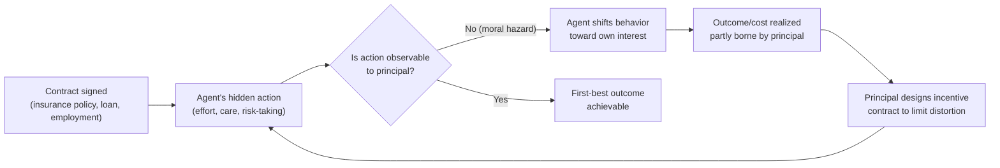

## Moral Hazard

### Definition and Conceptual Overview

Moral hazard is a form of market failure arising from asymmetric information in which one party to a transaction can take **hidden actions** after a contract is agreed upon, and these actions affect the outcome or cost borne by the other party, who cannot fully observe or verify them. Unlike adverse selection, which concerns hidden *information about type* existing *before* a contract (ex ante), moral hazard concerns hidden *behavior* occurring *after* a contract is signed (ex post) — it is a **post-contractual, hidden-action** problem.

The term originated in insurance economics, describing how individuals with insurance coverage may take on more risk or exert less care than they would if fully exposed to the consequences of their own actions, because part or all of the cost of adverse outcomes is shifted onto the insurer.

| Feature | Moral Hazard | Adverse Selection |
| --- | --- | --- |
| Timing | Ex post (after contract) | Ex ante (before contract) |
| Hidden element | Action/behavior/effort | Type/characteristic |
| Core problem | Insulation from consequences alters behavior | Self-selection distorts the pool of participants |
| Example | Insured driver takes fewer precautions | Insurer can't distinguish high- from low-risk applicants |

Both are subsets of the broader **principal-agent problem**, in which a principal (the uninformed party) delegates an outcome to an agent (the informed party) whose interests are not perfectly aligned with the principal's, under conditions where the principal cannot costlessly monitor the agent.

### Historical and Theoretical Origins

The insurance industry identified moral hazard empirically well before its formal economic modeling. The theoretical apparatus was developed substantially through:

- **Kenneth Arrow (1963, 1968)**, who formalized moral hazard in the context of medical insurance and welfare economics, showing how insurance coverage changes incentives for precautionary behavior and healthcare utilization.
- **Principal-agent theory**, developed through the 1970s–1980s by economists including Bengt Holmström, Michael Spence (in adjacent signaling work), and Oliver Hart, formalizing the design of incentive contracts under hidden action.
- **Sanford Grossman and Oliver Hart (1983)**, who provided a rigorous formalization of the principal-agent problem under moral hazard, characterizing optimal incentive schemes.

Bengt Holmström later received the Nobel Memorial Prize in Economic Sciences (2016, jointly with Oliver Hart) specifically for contributions to contract theory, including the analysis of moral hazard and optimal incentive design.

### Two Broad Categories

#### 1. Ex Ante Moral Hazard

Occurs *before* the loss/outcome is realized. The informed party's hidden action affects the *probability* of a bad outcome occurring.

- *Example*: A person with fire insurance is less careful about fire safety (not replacing faulty wiring, not installing smoke detectors), increasing the probability of a fire.
- *Example*: A borrower with limited liability takes on a riskier investment project than a lender would prefer, because the borrower captures the upside but the lender bears more of the downside.

#### 2. Ex Post Moral Hazard

Occurs *after* the loss/outcome has already been realized. The informed party's hidden action affects the *magnitude* of the loss or the cost incurred by the uninformed party, not its likelihood.

- *Example*: A person with comprehensive health insurance, having already fallen ill, consumes more healthcare services (additional tests, longer hospital stays, elective add-ons) than they would if paying the full marginal cost themselves — because the insurer bears the marginal cost.
- *Example*: A person with full car insurance, after an accident has occurred, may not shop around for the cheapest repair shop since the insurer is paying.

### Formal Model: The Hidden-Action Principal-Agent Problem

**Setup:**

- A principal hires an agent to undertake an action $e$ (effort), which is costly to the agent, $C(e)$, with $C'(e) > 0$, $C''(e) > 0$ (increasing marginal cost of effort).
- Output/outcome $x$ depends on effort and a random shock: $x = e + \varepsilon$, where $\varepsilon$ is a mean-zero random noise term.
- The principal observes only $x$ (the outcome), not $e$ (the effort) directly — effort is **unobservable/non-contractible**.
- The principal must design a compensation contract $w(x)$ that depends only on the observable outcome $x$.

**First-best benchmark (effort observable):**

If effort were observable and contractible, the principal could simply pay a fixed wage conditional on the agent supplying the efficient effort level $e^*$, which maximizes total surplus:

$$e^* = \arg\max_e \left[ E[x \mid e] - C(e) \right]$$

with the risk-neutral principal bearing all risk (efficient risk-sharing), since a risk-averse agent should not bear risk they cannot control.

**Second-best problem (effort hidden — the moral hazard case):**

Because effort is unobservable, a fixed wage gives the agent no incentive to exert costly effort (the agent would simply choose $e = 0$, the cost-minimizing effort level, while still collecting the fixed wage). The principal must instead condition pay on the *observable* outcome $x$, which is only a **noisy signal** of effort.

The principal solves:

$$\max_{w(x)} \; E[x - w(x)]$$

subject to two constraints:

**(1) Participation constraint (individual rationality, IR):** The agent must receive at least their reservation utility $\bar{U}$ from accepting the contract:

$$E[U(w(x)) - C(e)] \geq \bar{U}$$

**(2) Incentive compatibility constraint (IC):** The agent, given the wage schedule $w(x)$, must find it optimal to choose the effort level $e$ the principal wants:

$$e \in \arg\max_{e'} E[U(w(x)) \mid e'] - C(e')$$

**Key trade-off — the risk/incentive trade-off:**

Because $x$ is a noisy signal of $e$ (due to $\varepsilon$), tying pay to $x$ exposes a risk-averse agent to income risk unrelated to their own effort. There is an inherent tension:

- **More incentive-based pay** (steeper $w(x)$) → better incentives for effort, but more risk imposed on the risk-averse agent, requiring a higher risk premium to satisfy the IR constraint (costly to the principal).
- **Flatter pay** (closer to fixed wage) → less risk for the agent, but weaker incentives, leading to lower effort and lower expected output.

The **optimal second-best contract** balances this trade-off, generally resulting in effort below the first-best level $e^* $, and expected surplus strictly lower than the first-best (a **moral hazard cost** or **agency cost**) whenever the agent is risk-averse and effort is not perfectly observable. [Inference] The exact functional form of the optimal contract (e.g., whether it is linear in $x$) depends on the specific distributional and utility assumptions (e.g., linear contracts are optimal under CARA utility and normally distributed noise, per Holmström-Milgrom 1987, but this is a special-case result, not a universal one.)

### Moral Hazard in Insurance Markets

This is the most classically studied domain.

**Ex ante moral hazard example — health insurance and prevention:**

An individual with health insurance may under-invest in preventive care behaviors (diet, exercise, safety precautions) because the financial consequences of poor health outcomes are partially borne by the insurer.

**Ex post moral hazard example — healthcare utilization:**

Once insured and ill, a patient facing a low or zero marginal out-of-pocket price for care will consume more healthcare services than they would at the true marginal cost — a phenomenon closely tied to the **price elasticity of demand for healthcare**.

**Empirical evidence — the RAND Health Insurance Experiment (1971–1982):**

This large-scale randomized experiment assigned households to health insurance plans with varying cost-sharing (coinsurance rates from 0% to 95%). It found that higher cost-sharing reduced healthcare utilization, providing direct empirical evidence of ex post moral hazard in healthcare consumption; the experiment is frequently cited as a landmark natural/randomized test of moral hazard theory. [Unverified] Specific numerical estimates from the RAND experiment (e.g., precise elasticity figures) vary somewhat depending on which follow-up reanalysis is cited, and later work (e.g., the Oregon Health Insurance Experiment, 2008) has revisited and refined some of these estimates.

### Mitigating Mechanisms in Insurance

#### 1. Deductibles

The insured pays a fixed initial amount out of pocket before insurance coverage begins, restoring some marginal cost exposure and precautionary incentive for small/moderate losses.

#### 2. Coinsurance

The insured pays a fixed percentage (e.g., 20%) of costs above the deductible, keeping some marginal price signal in place even after the deductible is met — directly targeting ex post moral hazard by preventing the marginal price of care from falling to zero.

#### 3. Copayments

A fixed dollar fee per service (e.g., $25 per doctor visit), which discourages low-value utilization without exposing the insured to unlimited cost variability.

#### 4. Coverage Limits / Caps

Maximum payout limits reduce the insurer's exposure to extreme claims and can reduce incentives for costly, low-value treatment at the margin.

#### 5. Experience Rating

Premiums are adjusted based on the insured's own claims history over time (e.g., auto insurance premiums rising after at-fault accidents), reinstating a long-run incentive for careful behavior even though short-run marginal incentives within a policy period remain blunted.

#### 6. Monitoring and Verification

Insurers may audit claims, require documentation, use fraud detection, or mandate periodic inspections (e.g., commercial property insurers requiring safety compliance checks) to directly reduce the informational gap regarding the insured's actions.

### Moral Hazard in Credit and Financial Markets

**Borrower moral hazard:**

Once a loan is disbursed, borrowers may undertake riskier investments than the lender would prefer, since (under limited liability) the borrower captures upside gains but the lender absorbs losses in default states. This is a core insight of the **Stiglitz-Weiss (1981)** framework, where it combines with adverse selection to explain **credit rationing** — lenders may refuse to raise interest rates further even when facing excess demand for loans, because higher rates can induce borrowers to shift toward riskier projects (moral hazard) and can also worsen the average riskiness of the applicant pool (adverse selection).

**Managerial moral hazard (corporate finance):**

Corporate managers (agents) may pursue actions that benefit themselves (e.g., empire-building, excessive risk-taking, shirking) at the expense of shareholders (principals) who cannot perfectly monitor managerial effort or decisions — a foundational problem in corporate governance theory.

**Systemic moral hazard — "Too Big to Fail":**

Financial institutions that anticipate government bailouts in the event of failure may take on excessive risk, since the downside is partially socialized while the upside remains private. This is frequently cited in analyses of the 2007–2008 global financial crisis. [Unverified] The precise quantitative contribution of "too big to fail" moral hazard, relative to other causal factors in the 2008 crisis (e.g., mortgage securitization structures, regulatory failures, credit rating agency incentives), remains a subject of ongoing debate among economists and is not reducible to a single agreed-upon figure.

### Moral Hazard in Labor Markets

**Employee shirking:**

Workers whose effort cannot be perfectly monitored may exert less effort than the employer desires, especially under fixed-wage contracts.

**Efficiency wage theory (Shapiro-Stiglitz, 1984):**

One proposed solution — firms pay wages *above* the market-clearing level, creating a rent that workers would lose if caught shirking and fired. This makes the threat of job loss costly enough to deter shirking, even without perfect monitoring, at the cost of generating **equilibrium involuntary unemployment** (since above-market wages reduce labor demand).

**Team production and free-riding (Alchian-Demsetz, 1972):**

When output depends on the combined effort of multiple workers whose individual contributions can't be separately observed, each worker has an incentive to free-ride on others' effort — a moral hazard problem inherent to team production, motivating the existence of monitors/supervisors as a specialized role.

### Mitigating Mechanisms in Contracts and Employment

#### 1. Performance-Based Pay / Piece Rates

Tying compensation directly to measurable output realigns the agent's incentives with the principal's objectives, at the cost of imposing income risk if output is noisy.

#### 2. Efficiency Wages

As above — paying above-market wages to raise the cost of job loss and deter shirking.

#### 3. Monitoring and Supervision

Direct observation of effort/behavior, though costly, reduces the informational gap; often paired with incentive pay rather than substituting for it entirely.

#### 4. Deferred Compensation / Bonding

Paying part of compensation later (e.g., bonuses, vesting stock options, pensions) creates a stake the agent forfeits if terminated for poor performance or misconduct, functioning similarly to efficiency wages.

#### 5. Reputation Mechanisms

In repeated interactions, an agent's future opportunities depend on a track record of good behavior, creating implicit incentives beyond what explicit contracts capture.

#### 6. Collateral and Co-signing (Credit Markets)

Requiring collateral reduces the borrower's incentive to take on excessive risk, since the borrower now has "skin in the game" and bears more of the downside directly.

### Diagrammatic Illustration: The Moral Hazard Timeline

### Graphical Representation: Risk-Sharing and Incentive Trade-off

The following SVG illustrates the fundamental trade-off in optimal contract design: as incentive pay (the slope of compensation tied to output) increases, effort/output rises but so does the risk premium the risk-averse agent requires, creating a U-shaped total-cost curve for the principal.

<svg xmlns="http://www.w3.org/2000/svg" viewBox="0 0 720 460" font-family="Helvetica, Arial, sans-serif">
<text x="360" y="30" text-anchor="middle" font-size="17" font-weight="bold" fill="#1a1a2e">Moral Hazard: Risk vs. Incentive Trade-off (svg_diagram)</text>

<line x1="80" y1="400" x2="680" y2="400" stroke="#333" stroke-width="2" />
<line x1="80" y1="400" x2="80" y2="60" stroke="#333" stroke-width="2" />
<text x="380" y="435" text-anchor="middle" font-size="14" fill="#333">Strength of Incentive Pay (Contract Steepness)</text>
<text x="30" y="230" text-anchor="middle" font-size="14" fill="#333" transform="rotate(-90 30 230)">Cost to Principal</text>

<path d="M 100 380 Q 350 350 620 100" stroke="#dc2626" stroke-width="3" fill="none" />
<text x="480" y="140" font-size="12" fill="#dc2626" font-weight="bold">Risk Premium (rises with incentive strength)</text>

<path d="M 100 100 Q 350 200 620 380" stroke="#2563eb" stroke-width="3" fill="none" />
<text x="130" y="90" font-size="12" fill="#2563eb" font-weight="bold">Incentive Loss (falls with incentive strength)</text>

<path d="M 100 260 Q 250 200 350 195 Q 450 200 620 260" stroke="#16a34a" stroke-width="4" fill="none" stroke-dasharray="0" />
<text x="380" y="180" font-size="13" fill="#16a34a" font-weight="bold">Total Agency Cost</text>

<circle cx="350" cy="196" r="7" fill="#7f1d1d" />
<text x="360" y="210" font-size="12" fill="#7f1d1d" font-weight="bold">Optimal contract (second-best)</text>
<line x1="350" y1="196" x2="350" y2="400" stroke="#7f1d1d" stroke-width="1" stroke-dasharray="3,3" />
</svg>

### Worked Numerical Example

Consider a risk-neutral principal hiring a risk-averse agent for a project.

**Effort levels:** $e \in \{0, 1\}$ (low effort, high effort)

**Cost of effort to agent:** $C(0) = 0$, $C(1) = 4$

**Output distribution:**

- If $e = 1$ (high effort): output is $100 with probability 0.8, $20 with probability 0.2. Expected output = $0.8(100) + 0.2(20) = 84$.
- If $e = 0$ (low effort): output is $100 with probability 0.2, $20 with probability 0.8. Expected output = $0.2(100) + 0.8(20) = 36$.

**First-best (effort observable):** The principal simply pays a fixed wage $w$ sufficient to cover the agent's cost of effort plus reservation utility, and mandates $e = 1$ if $84 - w \geq 36 - 0$ (i.e., if the incremental expected output, 48, exceeds the incremental effort cost, 4) — clearly efficient to implement high effort here since $48 > 4$.

**Second-best (effort hidden):** The principal cannot verify which effort level was chosen and must instead offer a wage schedule $w(x)$ contingent on the *realized output* $x \in \{100, 20\}$. Suppose the principal offers $w(100) = w_H$ and $w(20) = w_L$, with $w_H > w_L$ to reward the good outcome. The incentive-compatibility constraint requires:

$$0.8 \, U(w_H) + 0.2\, U(w_L) - 4 \;\geq\; 0.2\, U(w_H) + 0.8\, U(w_L) - 0$$

Simplifying:

$$0.6 \big[U(w_H) - U(w_L)\big] \geq 4 \quad \Longrightarrow \quad U(w_H) - U(w_L) \geq 6.67$$

This shows concretely that a **positive gap** between $w_H$ and $w_L$ is required to induce effort — the agent must bear some outcome-contingent risk, which (for a risk-averse agent, where $U$ is concave) is costlier for the principal to provide than a flat wage would be, generating the **agency cost of moral hazard** relative to the first-best. [Inference] The specific numerical values here are illustrative for pedagogical clarity; solving for the exact optimal $(w_H, w_L)$ pair requires specifying a particular utility function $U(\cdot)$ and the agent's reservation utility.

### Adverse Selection and Moral Hazard Combined

Many real markets exhibit **both** problems simultaneously, and they can interact:

- In credit markets (Stiglitz-Weiss), raising interest rates both **worsens the applicant pool** (adverse selection: safer borrowers exit) and **induces riskier project choice** among remaining borrowers (moral hazard), which is why lenders may ration credit rather than raise rates.
- In health insurance, an individual's *choice* of insurance plan generosity (adverse selection, since sicker individuals may prefer more generous plans) can be entangled with how plan generosity subsequently *affects* their healthcare consumption (moral hazard) — empirically disentangling the two effects is a significant methodological challenge in health economics research. [Unverified] The relative empirical magnitude of adverse selection versus moral hazard effects in any specific insurance market depends heavily on institutional context, data availability, and identification strategy, and does not have a single universally agreed-upon decomposition.

### Common Misconceptions

- Moral hazard does **not** require dishonesty or fraud. It describes a rational response to altered incentive structures, not necessarily bad faith (though outright fraud is sometimes classified as an extreme case of ex post moral hazard).
- Moral hazard is **not** unique to insurance. It is a general feature of any principal-agent relationship involving hidden action — employment, lending, corporate governance, and public policy (e.g., disaster relief programs potentially reducing private mitigation investment) all exhibit moral hazard dynamics.
- Full insurance/full risk transfer is **not** optimal when moral hazard is present, even though it would be optimal in a first-best world with only risk-sharing considerations and no incentive concerns — this is the central insight distinguishing moral hazard analysis from simple risk-pooling analysis.

### Related Topics

- Adverse selection and market unraveling (Akerlof's "lemons" model)
- Principal-agent theory and optimal contract design
- Signaling (Spence) and screening (Rothschild-Stiglitz) models
- Efficiency wage theory (Shapiro-Stiglitz)
- Credit rationing (Stiglitz-Weiss model)
- Deductibles, coinsurance, and optimal insurance contract design
- Corporate governance and managerial incentive structures
- Mechanism design and incentive compatibility
- The RAND Health Insurance Experiment and empirical measurement of moral hazard
- Systemic risk and "too big to fail" in financial regulation