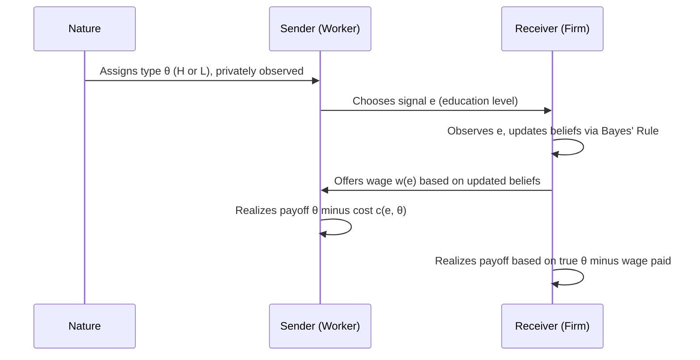

## Signaling

### Definition and Core Concept

Signaling refers to actions taken by an informed party in a market with asymmetric information to credibly convey private information to an uninformed party. The concept was formally developed by Michael Spence (1973) in the context of labor markets, where job applicants possess private information about their own productivity that employers cannot directly observe.

The central problem signaling addresses is **adverse selection**: when one side of a transaction has information the other side lacks, and no mechanism exists to reveal it, markets can unravel or misallocate resources. Signaling is one of two primary market-based solutions to this problem, the other being **screening**, in which the uninformed party designs mechanisms to induce the informed party to reveal information.

**Key Points**

- Signaling requires an action by the informed agent (sender)
- Screening requires an action by the uninformed agent (receiver)
- Both are responses to adverse selection under asymmetric information
- A signal is only meaningful if it is costly and, critically, differentially costly across types

### The Informational Environment

Signaling models rest on a specific structure of information:

- There are at least two **types** of agents (e.g., high-productivity and low-productivity workers)
- The agent's type is privately known to the agent (hidden information)
- The type is payoff-relevant to the uninformed party (e.g., the employer cares about productivity)
- Absent a signal, the uninformed party cannot distinguish types and must treat all agents identically, typically based on the population average

This is a game of **incomplete information**, formally modeled as a Bayesian game in which the receiver holds prior beliefs about the distribution of types and updates those beliefs upon observing the sender's signal.

### The Canonical Spence Job-Market Signaling Model

#### Setup

- Two types of workers: High productivity ($H$) and Low productivity ($L$), with productivities $\theta_H > \theta_L$
- Proportion $p$ of workers are type $H$; $(1-p)$ are type $L$
- Workers privately know their own type
- Firms cannot observe productivity directly but can observe **education level** $e \geq 0$
- Critically, education does not raise productivity in the base model — it is purely a signal, not human capital investment
- Cost of acquiring education level $e$ is $c(e, \theta)$, where cost is **decreasing in ability**: $\frac{\partial c}{\partial \theta} < 0$, and increasing in education: $\frac{\partial c}{\partial e} > 0$

This last assumption — the **single-crossing property** — is the mathematical heart of the model.

#### The Single-Crossing Property

The single-crossing property states that the marginal cost of the signal differs systematically by type, such that the indifference curves of different types in (signal, wage) space cross at most once. Formally, for cost functions $c_H(e)$ and $c_L(e)$:

$$\frac{\partial c_L}{\partial e} > \frac{\partial c_H}{\partial e} \quad \text{for all } e > 0$$

This means low-ability workers find it more costly, at the margin, to acquire additional education than high-ability workers do. This differential is what allows education to separate types — if costs were identical across types, no signal could ever distinguish them, since both types would make identical choices.

**(svg_diagram)**

<svg xmlns="http://www.w3.org/2000/svg" viewBox="0 0 640 420">
<text x="320" y="24" font-size="16" font-weight="bold" text-anchor="middle" fill="#1a1a1a">Single-Crossing Property (svg_diagram)</text>
<line x1="70" y1="370" x2="600" y2="370" stroke="#333" stroke-width="1.5" />
<line x1="70" y1="370" x2="70" y2="50" stroke="#333" stroke-width="1.5" />
<text x="600" y="392" font-size="13" text-anchor="end" fill="#333">Education level (e)</text>
<text x="45" y="55" font-size="13" text-anchor="middle" fill="#333">Wage</text>
<path d="M 90 340 C 250 320, 400 250, 560 90" stroke="#c0392b" stroke-width="2.5" fill="none" />
<text x="565" y="85" font-size="12" fill="#c0392b">High type indifference curve</text>
<path d="M 90 340 C 200 200, 300 100, 380 60" stroke="#2980b9" stroke-width="2.5" fill="none" />
<text x="385" y="58" font-size="12" fill="#2980b9">Low type indifference curve</text>
<circle cx="215" cy="248" r="4.5" fill="#1a1a1a" />
<text x="225" y="240" font-size="12" fill="#1a1a1a">Single crossing point</text>
<text x="150" y="400" font-size="11" fill="#555">Low type's curve is steeper: raising education is more costly for them at the margin</text>
</svg>

Below the crossing point, the low type is willing to accept a lower wage for the same education level than the high type demands; above it, the ordering reverses. This single intersection is what makes a separating wage schedule incentive-compatible.

### Equilibrium Concepts in Signaling Games

Signaling games typically admit multiple types of Perfect Bayesian Equilibria (PBE), classified by whether the signal reveals type information.

#### 1. Separating Equilibrium

Different types choose different signal levels, fully revealing type to the receiver.

- High type chooses education $e_H^* > 0$ such that the low type has no incentive to mimic it
- Low type typically chooses $e_L^* = 0$ (no signal needed, since separation already reveals type once $H$ signals)
- Wages equal the true marginal product of each type once revealed: $w(e_H^*) = \theta_H$, $w(e_L^*) = \theta_L$

The minimum separating signal level for the high type must satisfy the **no-mimicry constraint** for the low type:

$$\theta_H - c_L(e_H^*) \leq \theta_L - c_L(0)$$

Rearranging, the high type's education level must be at least:

$$e_H^* \geq \frac{\theta_H - \theta_L}{c_L'(e)}$$

At the boundary, this defines the **least-cost separating equilibrium**, where the high type signals just enough to deter mimicry — any less, and the low type would find it profitable to imitate.

#### 2. Pooling Equilibrium

Both types choose the same signal level (often $e = 0$), so the receiver cannot distinguish them and pays a common wage equal to the expected productivity:

$$w = p\theta_H + (1-p)\theta_L$$

In a pooling equilibrium, the signal conveys no information, and beliefs off the equilibrium path (i.e., what the receiver would believe if they saw a signal that shouldn't occur in equilibrium) become critical to sustaining it.

#### 3. Semi-Separating (Hybrid) Equilibrium

One type plays a pure strategy while the other randomizes (mixes) between signal levels, producing partial information revelation. These arise in models with a continuum of types or specific off-path belief structures.

**(svg_diagram)**

<svg xmlns="http://www.w3.org/2000/svg" viewBox="0 0 640 260">
<text x="320" y="24" font-size="16" font-weight="bold" text-anchor="middle" fill="#1a1a1a">Signaling Equilibrium Types (svg_diagram)</text>
<rect x="30" y="60" width="170" height="140" rx="8" fill="#eaf2f8" stroke="#2980b9" stroke-width="1.5" />
<text x="115" y="90" font-size="13" font-weight="bold" text-anchor="middle" fill="#1a1a1a">Separating</text>
<text x="115" y="115" font-size="11" text-anchor="middle" fill="#333">e_H ≠ e_L</text>
<text x="115" y="135" font-size="11" text-anchor="middle" fill="#333">Full info revealed</text>
<text x="115" y="155" font-size="11" text-anchor="middle" fill="#333">w(e_H)=θ_H</text>
<text x="115" y="175" font-size="11" text-anchor="middle" fill="#333">w(e_L)=θ_L</text>
<rect x="235" y="60" width="170" height="140" rx="8" fill="#fdebd0" stroke="#e67e22" stroke-width="1.5" />
<text x="320" y="90" font-size="13" font-weight="bold" text-anchor="middle" fill="#1a1a1a">Pooling</text>
<text x="320" y="115" font-size="11" text-anchor="middle" fill="#333">e_H = e_L</text>
<text x="320" y="135" font-size="11" text-anchor="middle" fill="#333">No info revealed</text>
<text x="320" y="155" font-size="11" text-anchor="middle" fill="#333">w = p·θ_H+(1-p)·θ_L</text>
<rect x="440" y="60" width="170" height="140" rx="8" fill="#eafaf1" stroke="#27ae60" stroke-width="1.5" />
<text x="525" y="90" font-size="13" font-weight="bold" text-anchor="middle" fill="#1a1a1a">Semi-Separating</text>
<text x="525" y="115" font-size="11" text-anchor="middle" fill="#333">Mixed strategies</text>
<text x="525" y="135" font-size="11" text-anchor="middle" fill="#333">Partial info revealed</text>
<text x="525" y="155" font-size="11" text-anchor="middle" fill="#333">Beliefs updated</text>
<text x="525" y="175" font-size="11" text-anchor="middle" fill="#333">probabilistically</text>
</svg>

### The Multiplicity Problem and Refinements

A well-known feature of signaling games is that **multiple separating equilibria** can coexist, since any $e_H \geq e_H^*$ (the minimum) satisfies the no-mimicry constraint. This creates an equilibrium selection problem. Economists commonly appeal to refinements:

- **Riley outcome / least-cost separating equilibrium**: Selects the Pareto-dominant separating equilibrium from the high type's perspective — the minimum $e_H$ that still deters mimicry, since higher signals only waste resources without added benefit
- **Intuitive Criterion (Cho–Kreps, 1987)**: Restricts out-of-equilibrium beliefs by requiring the receiver not to attribute an off-path signal to a type that could never benefit from sending it, ruling out most pooling equilibria as unreasonable
- **[Inference]** Under the Intuitive Criterion, the least-cost separating equilibrium is often the unique equilibrium surviving the refinement in standard two-type Spence models, though this result is sensitive to the specific payoff structure and does not generalize to all signaling environments without additional conditions

### Welfare Analysis

A distinctive and often counterintuitive result of signaling models is that separating equilibria, while informative, are **not necessarily welfare-improving** relative to pooling.

- Education in the pure signaling model (with no productivity effect) is **socially wasteful** — it consumes real resources (time, tuition, effort) without producing output
- The high type may be worse off in the least-cost separating equilibrium than in a pooling equilibrium, since they must incur costly signaling to distinguish themselves, whereas pooling lets them free-ride on the average wage
- **[Inference]** Whether separation is welfare-superior to pooling depends on the relative magnitude of the signaling cost versus the value of information to the receiver, and no general ranking holds across all parameterizations

This result underlies a long-standing debate in labor economics about whether education's return reflects genuine human capital accumulation (productivity enhancement) or pure signaling (sorting without productivity gains) — the "sheepskin effect" literature examines this by testing whether wage jumps occur specifically at credential-granting years (e.g., graduation) rather than continuously with each year of schooling, which would be more consistent with signaling than human capital.

### Conditions for a Signal to Be Effective

For any candidate signal to sustain a separating equilibrium, it must satisfy:

1. **Observability**: The receiver must be able to observe the signal
2. **Differential cost (single-crossing)**: The signal must be less costly (in absolute or marginal terms) for the type that wants to be recognized as favorable
3. **Credibility under the equilibrium**: No type should have an incentive to deviate given equilibrium beliefs and wage schedule
4. **Sufficient cost to deter mimicry**: The signal level must be high enough that low types are not tempted to imitate it, per the no-mimicry (incentive compatibility) constraint

### Signaling Beyond the Labor Market

The logic of signaling generalizes to numerous other economic settings involving hidden type:

| Market | Sender | Signal | Private Information |
| --- | --- | --- | --- |
| Labor market | Worker | Education | Productivity |
| Corporate finance | Firm | Dividend policy, capital structure | Future profitability |
| Product markets | Firm | Warranties, advertising expenditure | Product quality |
| Used car market | Seller | Certification, warranty offer | Vehicle quality |
| Credit markets | Borrower | Collateral pledged | Default risk |
| Dating/marriage markets | Individual | Costly courtship behavior | Commitment level |
| Insurance markets | Insured (via screening) | Deductible choice | Risk type |

**Example**

In corporate finance, the Ross (1977) model applies signaling logic to capital structure: managers with private information about future cash flows choose debt levels to signal firm quality. Because bankruptcy costs are higher for weak firms, only genuinely strong firms can credibly take on high leverage without excessive default risk — issuing more debt becomes a costly signal that separates high-quality firms from low-quality ones, since the single-crossing property holds (weak firms face steeper marginal costs of high leverage due to higher bankruptcy risk).

### Signaling vs. Screening: A Comparison

| Dimension | Signaling | Screening |
| --- | --- | --- |
| Who moves first | Informed party (sender) | Uninformed party (receiver), who designs the menu |
| Mechanism | Sender chooses a costly action | Receiver offers a menu of contracts; sender self-selects |
| Classic example | Spence education model | Rothschild–Stiglitz insurance model |
| Equilibrium concept | Perfect Bayesian Equilibrium | Often no pooling equilibrium exists; separating equilibria may fail to exist under Nash refinement |
| Direction of information flow | Informed party reveals type via action | Uninformed party induces self-selection via incentive-compatible contracts |

### Game-Theoretic Timeline

### Formal Payoff Structure

Sender's (worker's) utility given type $\theta$, chosen signal $e$, and resulting wage $w(e)$:

$$U(\theta) = w(e) - c(e, \theta)$$

Receiver's (firm's) zero-profit condition under competitive labor markets, given beliefs $\mu(\theta \mid e)$ about type conditional on observed signal:

$$w(e) = \mathbb{E}[\theta \mid e] = \sum_{\theta} \theta \cdot \mu(\theta \mid e)$$

In a separating equilibrium, $\mu(\theta_H \mid e_H^*) = 1$ and $\mu(\theta_L \mid 0) = 1$, so wages equal true marginal products. In a pooling equilibrium, $\mu(\theta \mid e^{pool}) = $ prior probabilities $p$ and $(1-p)$, so wages equal the population-average product.

### Common Misconceptions

- **Signaling requires the signal to have no direct productive value.** This is true of the pure Spence model but not required in general; many real-world signals (education, in reality) plausibly do both — signal ability and build human capital. The pure signaling model isolates the sorting effect analytically.
- **Any costly action can be a signal.** False — cost alone is insufficient; the cost must be *differentially* borne across types (single-crossing) or the action carries no information content.
- **Signaling always improves market efficiency.** As shown above, signaling can be socially wasteful even while solving the adverse selection problem, since the resources spent signaling produce no output.

### Empirical Considerations

**[Unverified]** The relative empirical weight of the signaling versus human capital explanations for the return to education remains a subject of ongoing dispute in labor economics, with results varying by country, level of schooling, and identification strategy used (e.g., studies exploiting compulsory schooling law changes, twin studies, or sheepskin-effect wage discontinuities).

### Related Topics

- Screening and the Rothschild–Stiglitz model of competitive insurance markets
- Adverse selection and the Market for Lemons (Akerlof, 1970)
- Moral hazard and the principal-agent problem
- Perfect Bayesian Equilibrium and belief refinements (Intuitive Criterion, D1 criterion)
- Cheap talk models (Crawford–Sobel) as a contrast to costly signaling
- Human capital theory (Becker, Mincer) as the competing explanation for education returns
- Signaling in corporate finance: dividend signaling, capital structure signaling (Ross, Myers–Majluf)
- Statistical discrimination and its relationship to pooling equilibria