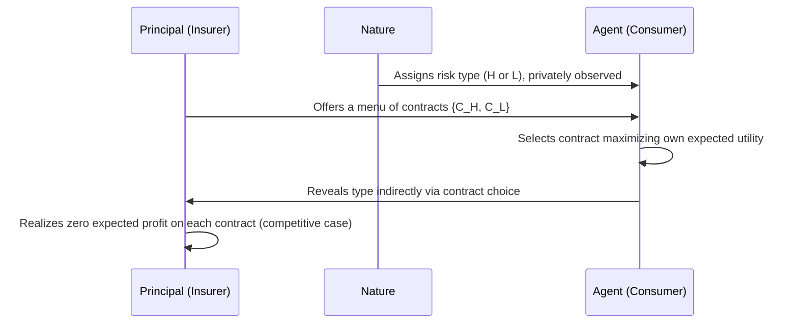

## Screening

### Definition and Core Concept

Screening refers to a mechanism whereby the *uninformed* party in a transaction designs a set of options or contracts specifically to induce the *informed* party to reveal their private information through the choices they make. It is the mirror image of signaling: while signaling has the informed party move first to convey information, screening has the uninformed party move first, offering a menu that separates types via self-selection.

Screening was formalized most influentially by Rothschild and Stiglitz (1976) in the context of competitive insurance markets, and it belongs to the broader theory of **mechanism design** under **adverse selection**.

**Key Points**

- The uninformed party moves first, designing the menu of contracts
- The informed party self-selects from the menu based on private type
- Self-selection must satisfy incentive compatibility: each type must (weakly) prefer the contract designed for their type
- Screening menus typically involve a trade-off dimension (e.g., price vs. quantity, premium vs. coverage) that different types value differently

### The Informational Environment

- Two (or more) types of agents exist, differing in some payoff-relevant characteristic unobservable to the other side (e.g., risk type, willingness to pay, ability)
- The type distribution is common knowledge (the *proportions* of each type), but individual type realizations are private
- The uninformed party (principal) cannot directly observe an individual's type but can observe the choice that individual makes from an offered menu
- The principal designs the menu **before** knowing which agent will choose which option, subject to a zero-expected-profit or profit-maximizing constraint

### The Rothschild–Stiglitz Insurance Model

#### Setup

- Two types of consumers: high-risk ($H$) with probability of loss $p_H$, and low-risk ($L$) with probability of loss $p_L$, where $p_H > p_L$
- Proportion $\lambda$ of the population is high-risk
- Consumers have identical wealth $W$ absent a loss, and suffer a loss $D$ with their respective probability
- Insurance contracts are pairs $(\text{premium}, \text{coverage})$, denoted $(\alpha, \beta)$, where $\alpha$ is the premium paid in all states and $\beta$ is the payout received in the loss state
- Insurers are risk-neutral and operate in a competitive market (zero expected profit in equilibrium); consumers are risk-averse (expected utility maximizers with concave utility)

#### The Self-Selection (Incentive Compatibility) Constraint

For a menu of two contracts $C_H$ (intended for high-risk) and $C_L$ (intended for low-risk) to sustain separation, each type must prefer their intended contract:

$$EU_H(C_H) \geq EU_H(C_L)$$

$$EU_L(C_L) \geq EU_L(C_H)$$

The key insight exploited by the screening mechanism is that **high-risk consumers value additional coverage more than low-risk consumers do**, because they face a higher probability of needing it. This generates a single-crossing property in indifference curves across the two contract dimensions (premium and coverage), analogous to the single-crossing property in signaling models but here applied to the *receiver's* menu design rather than the *sender's* signal choice.

**(svg_diagram)**

<svg xmlns="http://www.w3.org/2000/svg" viewBox="0 0 640 420">
<text x="320" y="24" font-size="16" font-weight="bold" text-anchor="middle" fill="#1a1a1a">Rothschild-Stiglitz Separating Contracts (svg_diagram)</text>
<line x1="70" y1="370" x2="600" y2="370" stroke="#333" stroke-width="1.5" />
<line x1="70" y1="370" x2="70" y2="50" stroke="#333" stroke-width="1.5" />
<text x="600" y="392" font-size="13" text-anchor="end" fill="#333">Wealth in loss state</text>
<text x="45" y="55" font-size="13" text-anchor="middle" fill="#333">Wealth no-loss</text>
<line x1="70" y1="370" x2="560" y2="90" stroke="#999" stroke-width="1" stroke-dasharray="4,3" />
<text x="400" y="190" font-size="11" fill="#777">45° full-insurance line</text>
<circle cx="480" cy="130" r="5" fill="#c0392b" />
<text x="490" y="130" font-size="12" fill="#c0392b">C_H: full insurance (high-risk)</text>
<circle cx="270" cy="230" r="5" fill="#2980b9" />
<text x="280" y="225" font-size="12" fill="#2980b9">C_L: partial insurance (low-risk)</text>
<path d="M 90 340 C 200 260, 340 190, 480 130" stroke="#c0392b" stroke-width="1.5" fill="none" opacity="0.5" />
<path d="M 90 340 C 150 300, 220 260, 270 230" stroke="#2980b9" stroke-width="1.5" fill="none" opacity="0.5" />
<text x="100" y="400" font-size="11" fill="#555">High-risk gets full coverage; low-risk is rationed to deter high-risk mimicry</text>
</svg>

In equilibrium, the separating outcome requires that the low-risk contract offers only **partial insurance** — deliberately rationing coverage below what a low-risk consumer would choose under full information — specifically so that high-risk consumers are not tempted to purchase the cheaper, low-risk contract. This rationing is the screening mechanism's defining and costly feature: it is a deliberate **distortion** introduced solely to preserve incentive compatibility.

### Formal Characterization of the Separating Equilibrium

The separating equilibrium contracts must satisfy:

1. **Zero-profit conditions** for each contract (competitive insurers earn zero expected profit on each type they attract):

   $$\alpha_H = p_H \beta_H, \qquad \alpha_L = p_L \beta_L$$
2. **Full insurance for the high-risk type**: Since only the high-risk type would ever choose $C_H$, there is no incentive-compatibility reason to distort it, so $C_H$ provides full coverage ($\beta_H = D$) at actuarially fair terms.
3. **Binding incentive compatibility for the high-risk type** (equivalently, zero information rent for the high type): The low-risk contract $C_L$ is set at the *maximum* coverage level such that the high-risk type is exactly indifferent between mimicking $C_L$ and taking their own contract $C_H$:

   $$EU_H(C_H) = EU_H(C_L)$$

This binding constraint pins down $C_L$, and it necessarily lies below the low-risk type's full-information optimum, so low-risk consumers are strictly worse off than they would be if their type were observable.

### The Existence Problem

A defining and famous feature of the Rothschild–Stiglitz model is that a **pooling equilibrium never exists** in this competitive setting (a pooling contract is always vulnerable to a profitable "cream-skimming" entrant offering a slightly better deal that attracts only low-risk types), and, more strikingly, **a separating equilibrium may fail to exist** if the proportion of high-risk types ($\lambda$) is sufficiently small.

- **[Inference]** When $\lambda$ is small, the pooled actuarially-fair contract lies close to the low-risk indifference curve, making it profitable for an entrant to offer a contract that attracts the entire pool and earns positive profit, which in turn undermines the candidate separating equilibrium — this non-existence result is a standard and well-established feature of the base model, though various extensions (e.g., allowing cross-subsidization, Wilson equilibrium, or reactive equilibrium concepts) have been proposed to restore existence
- This non-existence result was a major theoretical puzzle motivating subsequent refinements to the equilibrium concept in competitive screening markets (e.g., Wilson's anticipatory equilibrium, Miyazaki's equilibrium concept, and Riley's reactive equilibrium)

### Screening vs. Signaling: Structural Comparison

| Dimension | Screening | Signaling |
| --- | --- | --- |
| Who designs the mechanism | Uninformed party (principal) | N/A — informed party chooses freely |
| Who moves first | Uninformed party (offers menu) | Informed party (sends signal) |
| Self-selection instrument | Contract terms (price-quantity menus) | Costly action (education, warranties) |
| Classic model | Rothschild–Stiglitz (insurance) | Spence (labor market) |
| Existence of equilibrium | May fail to exist (competitive insurance case) | Generally exists, but multiplicity is the issue |
| Source of distortion | Rationing of the "weak" type's contract | Excess costly signal by the "strong" type |

### General Screening / Mechanism Design Framework

Screening problems are typically formalized using the **Revelation Principle**, which allows the principal to restrict attention (without loss of generality) to **direct mechanisms** in which each type is asked to report their type, and the mechanism is designed so that truthful reporting is optimal.

A direct mechanism specifies an allocation $q(\hat\theta)$ and transfer $t(\hat\theta)$ for each reported type $\hat\theta$, and must satisfy two classes of constraints:

- **Incentive Compatibility (IC)**: Each type must find truthful reporting optimal

  $$U(\theta) = \theta \cdot q(\theta) - t(\theta) \geq \theta \cdot q(\hat\theta) - t(\hat\theta) \quad \forall \hat\theta$$
- **Individual Rationality (IR) / Participation Constraint**: Each type must receive at least their outside option (often normalized to zero)

  $$U(\theta) \geq 0 \quad \forall \theta$$

In the standard monopolist screening problem (second-degree price discrimination), the principal's optimal mechanism typically features:

- **"No distortion at the top"**: The highest-valuation type receives the efficient (first-best) allocation, since there is no higher type left to prevent from mimicking them
- **Downward distortion for lower types**: Lower types receive *less* than the efficient allocation, purely to reduce the information rent that must be conceded to higher types
- **Information rents**: Higher types generically earn strictly positive surplus above their outside option, because the binding IC constraints from below prevent the principal from extracting all surplus without inducing mimicry

**Example**

A classic application is second-degree price discrimination via **quantity discounts** or **quality versioning**: a monopolist selling to consumers with unknown high or low valuation for quality offers a low-quality product at low price and a high-quality product at a higher price, deliberately degrading the low-quality option below what would be efficient in isolation, purely to prevent high-valuation consumers from choosing the cheap option (this is the same "distortion at the bottom" logic as insurance rationing, applied to a monopoly rather than a competitive-insurance setting).

### Applications of Screening Beyond Insurance

| Market | Principal (uninformed) | Menu Dimension | Hidden Type |
| --- | --- | --- | --- |
| Insurance | Insurer | Premium-coverage pairs | Risk type |
| Labor contracts | Employer | Wage-effort or wage-tenure schedules | Worker productivity/type |
| Monopoly pricing | Firm | Quality-price bundles (versioning) | Willingness to pay |
| Nonlinear pricing | Firm | Quantity discounts (two-part tariffs, block pricing) | Demand intensity |
| Regulation | Regulator | Cost-reimbursement/price-cap contracts | Firm's true cost type |
| Auctions | Auctioneer | Bidding mechanism/reserve price | Bidder valuation |
| Credit markets | Lender | Interest rate-collateral combinations | Borrower default risk |

### Common Misconceptions

- **Screening eliminates asymmetric information.** It does not eliminate it — it induces partial or full revelation *through the agent's choice*, but this revelation is typically costly (via rationing/distortion), unlike a world of full information where no such cost exists.
- **A pooling equilibrium is always a feasible outcome in screening models.** In the Rothschild–Stiglitz competitive framework specifically, pooling contracts are generally not sustainable in equilibrium because they invite profitable cream-skimming entry — this is a distinguishing feature relative to monopoly screening models, where pooling can sometimes be optimal for the principal.
- **Screening and signaling are interchangeable.** They differ fundamentally in *who* takes the strategic first action and *why* self-selection is achieved (action cost vs. contract design), even though both address the same underlying adverse selection problem.

### Welfare Implications

- Relative to a hypothetical full-information (first-best) benchmark, screening equilibria are constrained-inefficient: at least one type (often the "good" type, e.g., low-risk consumers) receives strictly less than their first-best allocation
- **[Inference]** Whether screening or signaling yields higher aggregate welfare in a given market depends on the specific cost and preference parameters, and no general dominance result holds across the two mechanisms
- Cross-subsidization from low-risk to high-risk types, which could in principle improve aggregate welfare in some parameterizations, is typically unsustainable in a competitive Rothschild–Stiglitz setting because it invites entry that skims off the subsidizing type, though it can be sustained under alternative equilibrium concepts (e.g., Wilson equilibrium, Miyazaki–Wilson) that account for entrants' anticipation of exit by incumbents

### Related Topics

- Signaling and the Spence education model
- The Revelation Principle and mechanism design fundamentals
- Second-degree vs. third-degree price discrimination
- Optimal nonlinear pricing (Mussa–Rosen model)
- Adverse selection in credit markets (Stiglitz–Weiss model)
- Wilson, Miyazaki, and Riley equilibrium concepts as extensions addressing non-existence
- Moral hazard and the principal-agent problem (contrasted with adverse selection)
- Auction theory and optimal auction design (Myerson)