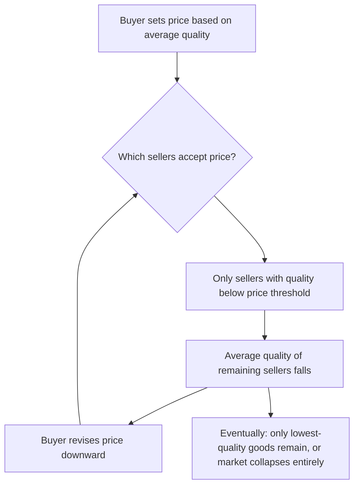
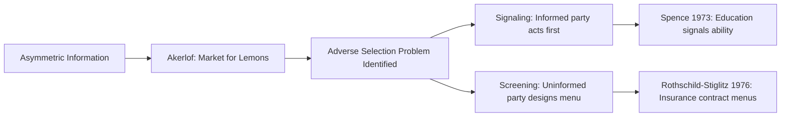

## Market for Lemons

### Definition and Core Concept

The "Market for Lemons" refers to George Akerlof's foundational 1970 model demonstrating how **asymmetric information** between buyers and sellers can cause adverse selection severe enough to degrade market quality, shrink trading volume, or cause a market to unravel entirely — even when mutually beneficial trades exist. Akerlof used the used-car market as his illustrative case, where "lemons" is American slang for defective used cars, but the mechanism generalizes to any market where sellers possess private information about quality that buyers cannot verify before purchase.

The paper is widely regarded as the founding contribution of modern information economics and earned Akerlof a share of the 2001 Nobel Memorial Prize in Economic Sciences (with Michael Spence and Joseph Stiglitz).

**Key Points**

- Sellers have private information about the quality of the good they are selling
- Buyers can only observe the *average* quality of goods in the market, not any individual good's true quality
- Because buyers price goods at the average quality level, sellers of above-average quality goods are undercompensated and exit the market
- This exit lowers the average quality remaining, causing buyers to lower their valuation further, triggering further exit — a self-reinforcing downward spiral known as **adverse selection**

### The Informational Environment

- The good in question has a quality dimension $q$, distributed over some range (e.g., $q \in [0, 2]$ in Akerlof's original parameterization)
- The seller of each unit knows the exact quality $q$ of their own unit
- The buyer cannot observe $q$ for any individual unit before purchase, only the distribution of quality across the market as a whole
- Because buyers cannot distinguish units, they can only offer a single price based on the **expected quality** of units willing to sell at that price

This is a case of **hidden information** (as opposed to hidden action, which characterizes moral hazard), and it exists prior to any contract being signed — this timing distinguishes adverse selection from moral hazard, which arises *after* a contract is in place.

### Formal Structure of the Basic Model

#### Setup (Used Car Example)

- Quality $q$ is uniformly distributed on $[0, 2]$ (representing the population of used cars, from worst to best)
- A seller who owns a car of quality $q$ values it at $V_S(q) = q$
- A buyer who cannot observe $q$ but knows the distribution values any given car at some multiple of quality, e.g., $V_B(q) = \frac{3}{2}q$, reflecting that buyers generally value cars more than current owners do (gains from trade exist at every quality level, absent information problems)

#### The Unraveling Mechanism

Suppose the market price is $p$. A seller will only offer their car for sale if $p \geq q$ (i.e., the price at least compensates them for their own valuation). This means:

- Only cars with quality $q \leq p$ are offered for sale
- The **average quality of cars offered** at price $p$ is therefore $\mathbb{E}[q \mid q \leq p] = \frac{p}{2}$ (under the uniform distribution assumption)
- A rational buyer, anticipating this selection effect, will only be willing to pay based on this *conditional* average quality, not the *unconditional* population average

Setting buyer willingness-to-pay equal to price in equilibrium:

$$p = \frac{3}{2} \cdot \mathbb{E}[q \mid q \leq p] = \frac{3}{2} \cdot \frac{p}{2} = \frac{3p}{4}$$

This equation is only satisfied at $p = 0$, meaning the *only* equilibrium in this particular parameterization is **complete market collapse** — no trade occurs at all, despite the fact that every single potential trade (buyer values every car more than the seller does) would be mutually beneficial under full information.

**(svg_diagram)**

<svg xmlns="http://www.w3.org/2000/svg" viewBox="0 0 640 420">
<text x="320" y="24" font-size="16" font-weight="bold" text-anchor="middle" fill="#1a1a1a">Adverse Selection Death Spiral (svg_diagram)</text>
<rect x="230" y="50" width="180" height="50" rx="8" fill="#fdebd0" stroke="#e67e22" stroke-width="1.5" />
<text x="320" y="80" font-size="12" text-anchor="middle" fill="#1a1a1a">Buyer offers price p</text>
<line x1="320" y1="100" x2="320" y2="140" stroke="#333" stroke-width="1.5" marker-end="url(#arrow1)" />
<rect x="200" y="140" width="240" height="50" rx="8" fill="#eaf2f8" stroke="#2980b9" stroke-width="1.5" />
<text x="320" y="170" font-size="12" text-anchor="middle" fill="#1a1a1a">High-quality sellers exit (q &gt; p)</text>
<line x1="320" y1="190" x2="320" y2="230" stroke="#333" stroke-width="1.5" marker-end="url(#arrow1)" />
<rect x="180" y="230" width="280" height="50" rx="8" fill="#fadbd8" stroke="#c0392b" stroke-width="1.5" />
<text x="320" y="260" font-size="12" text-anchor="middle" fill="#1a1a1a">Average market quality falls</text>
<line x1="320" y1="280" x2="320" y2="320" stroke="#333" stroke-width="1.5" marker-end="url(#arrow1)" />
<rect x="200" y="320" width="240" height="50" rx="8" fill="#fdebd0" stroke="#e67e22" stroke-width="1.5" />
<text x="320" y="350" font-size="12" text-anchor="middle" fill="#1a1a1a">Buyer lowers offer price</text>
<path d="M 200 345 C 100 345, 100 75, 225 75" stroke="#333" stroke-width="1.5" fill="none" marker-end="url(#arrow1)" />
<text x="60" y="210" font-size="11" fill="#555" transform="rotate(-90 60 210)">Feedback loop</text>
</svg>

This process — quality deterioration triggering price decline, triggering further quality deterioration — is the defining "unraveling" or "death spiral" dynamic of the lemons problem. Depending on the specific parameterization of valuations and quality distribution, the outcome can range from **complete market collapse** (as above) to a **partial market** in which only the lowest-quality goods trade, with all higher-quality goods rationally withheld from the market.

### Generalized Conditions for the Lemons Problem

The lemons mechanism requires several conditions to generate significant market failure:

1. **Quality is heterogeneous** across units in the market
2. **Sellers have superior information** about the quality of their specific unit relative to buyers
3. **Buyers cannot costlessly verify quality** before purchase (no cheap, reliable inspection or certification)
4. **Price is the only signal available**, and it must be common across all units (a single market-clearing price cannot price-discriminate by unobservable quality)
5. **The "quality elasticity" of seller participation is significant**: as price falls, disproportionately higher-quality sellers must exit for the spiral to be severe

**[Inference]** The severity of the lemons problem — whether it produces complete collapse, partial collapse, or merely a moderate discount for "lemons risk" — is highly sensitive to the specific functional forms assumed for buyer and seller valuations relative to quality, and Akerlof's own numerical example was chosen for illustrative starkness rather than as a universal prediction of total market failure in every applied setting.

### Market Responses and Institutional Solutions

Because the lemons problem is a widely applicable friction, real-world markets have developed several institutional mechanisms to counteract it — largely corresponding to the signaling and screening solutions covered elsewhere in information economics:

| Mechanism | Category | Example |
| --- | --- | --- |
| Warranties | Signaling | Seller offers a costly warranty only credible if the seller is confident in quality |
| Certification / third-party inspection | Information disclosure | Vehicle history reports (e.g., Carfax), professional pre-purchase inspections |
| Reputation and repeated interaction | Reputation mechanism | Branded dealerships, repeat-seller platforms with reviews |
| Licensing and quality standards | Regulation | Minimum quality standards imposed by law |
| Money-back guarantees | Signaling | Retailer return policies that shift quality risk back to seller |
| Screening menus | Screening | Buyer offers a menu (e.g., price contingent on inspection results) |
| Branding | Signaling | Consistent brand quality reduces buyer's uncertainty about any single unit |

**Example**

In the used car market specifically, third-party certification programs (Certified Pre-Owned programs offered by manufacturers) directly counteract the lemons problem: the manufacturer inspects and certifies vehicles meeting a quality threshold, effectively verifying a lower bound on $q$ that the buyer could not otherwise observe, allowing certified cars to command a price premium over uncertified used cars of ostensibly similar age and mileage.

### Applications Beyond Used Cars

Akerlof's original paper explicitly extended the model to several other markets, and subsequent literature has applied it further:

- **Insurance markets**: Individuals privately know their own risk type; without medical underwriting, insurers cannot distinguish high-risk from low-risk applicants, potentially producing adverse selection in the insurance pool itself (linking directly to the Rothschild–Stiglitz screening framework)
- **Credit markets**: Borrowers privately know their own probability of repayment; lenders cannot fully distinguish borrower risk, motivating models like Stiglitz–Weiss (1981) in which credit rationing (rather than interest-rate adjustment alone) emerges as an equilibrium response
- **Labor markets**: Akerlof discussed how minority or otherwise statistically-discriminated workers might face a lemons-type problem if employers cannot verify individual productivity, defaulting to group-based statistical inference (connecting to statistical discrimination theory)
- **Financial markets**: Adverse selection in securities markets, where firms with private information about their own prospects choose whether and how to issue equity or debt (connecting to the Myers–Majluf pecking-order theory of capital structure)
- **Health insurance exchanges**: Adverse selection concerns motivate mechanisms like mandated enrollment periods and risk-adjustment payments across insurers

### Relationship to Signaling and Screening

The Market for Lemons identifies the *problem*; signaling (Spence) and screening (Rothschild–Stiglitz) represent the two canonical *market-based solutions*:

### Common Misconceptions

- **The lemons problem requires sellers to be dishonest or malicious.** It does not — the market failure arises purely from the *structure* of information asymmetry and rational buyer inference, even if every seller behaves honestly and simply prices at their true valuation.
- **The lemons problem always produces total market collapse.** This is a special (and somewhat extreme) result of Akerlof's specific numerical example; in many real-world parameterizations, the outcome is a **partial market** — trade still occurs but is restricted to lower-quality goods, or occurs at a quality-risk discount, rather than complete unraveling.
- **Any price discount for used or previously-owned goods reflects the lemons problem.** A discount can also simply reflect ordinary depreciation or reduced remaining useful life, unrelated to information asymmetry; the lemons effect specifically refers to the *additional* discount attributable to buyers' inability to distinguish quality.

### Welfare Implications

- The lemons problem represents a case of market failure in the classical welfare sense: mutually beneficial trades that would occur under full information fail to occur under asymmetric information, producing a deadweight loss
- Unlike externality-based market failures, the inefficiency here arises purely from an information friction, not from any divergence between private and social cost/benefit at the level of an executed trade
- **[Inference]** The magnitude of welfare loss from the lemons problem in any specific real-world market is an empirical question and depends heavily on the effectiveness of the institutional counter-mechanisms (certification, warranties, reputation) that have emerged in that market

### Related Topics

- Signaling (Spence model) as a market-based solution
- Screening (Rothschild–Stiglitz model) as a market-based solution
- Moral hazard and the distinction between hidden information and hidden action
- Statistical discrimination
- Stiglitz–Weiss credit rationing model
- Adverse selection in health insurance markets and mandated enrollment mechanisms
- Reputation mechanisms and repeated games in markets with quality uncertainty
- Myers–Majluf model of adverse selection in corporate capital structure