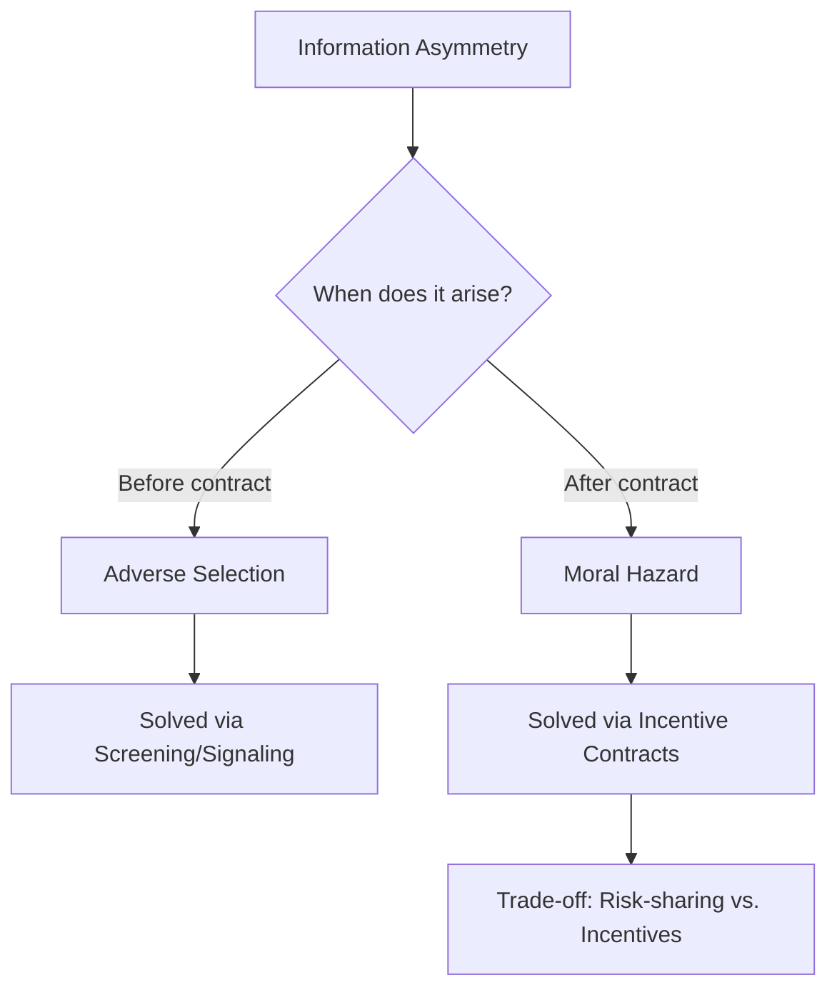
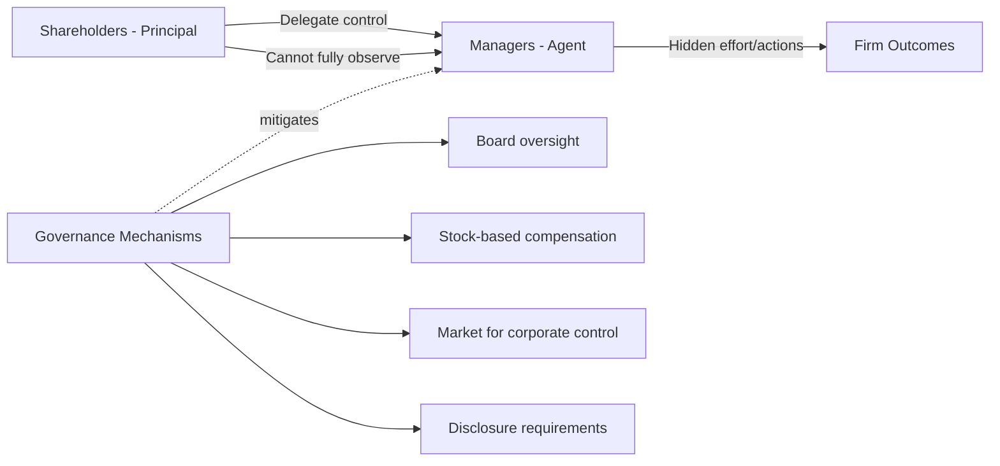

## Principal-Agent Problem

### Definition and Core Concept

The principal-agent problem (also called agency theory) describes the conflict of interest that arises when one party (the **principal**) delegates a task to another party (the **agent**), and the agent's actions or private information cannot be perfectly monitored or verified by the principal. Because the agent typically has different incentives than the principal — and because effort or private information is often unobservable or unverifiable — the agent may not act in the principal's best interest, producing a welfare loss relative to the outcome that would occur under full information.

This is a foundational topic within information economics, and it is closely related to, but conceptually distinct from, adverse selection: the principal-agent problem is most closely associated with **moral hazard**, which involves **hidden action** occurring *after* a contract is signed, whereas adverse selection (signaling, screening, lemons) involves **hidden information** existing *before* a contract is signed.

**Key Points**

- Two parties: a principal (delegates a task) and an agent (performs the task)
- Their objectives are not perfectly aligned (misaligned incentives)
- The principal cannot costlessly observe the agent's effort, action, or private information
- The result is either **moral hazard** (hidden action) or **adverse selection** (hidden type), depending on the timing of information asymmetry
- The principal designs a contract to mitigate the resulting inefficiency, generally trading off risk-sharing against incentive provision

### Taxonomy: Hidden Action vs. Hidden Information

The principal-agent literature is typically divided based on **when** the informational asymmetry arises relative to contracting:

| Type | Timing | Nature of Asymmetry | Canonical Model |
| --- | --- | --- | --- |
| Moral hazard (hidden action) | After contract signed | Principal cannot observe agent's effort/action | Standard moral hazard model |
| Adverse selection (hidden information) | Before contract signed | Principal cannot observe agent's type | Screening models (Rothschild–Stiglitz) |
| Moral hazard with hidden information | After contract, ongoing | Agent's type affects action interpretation | Dynamic agency models |

This document focuses primarily on the **moral hazard** branch, since adverse selection/screening is treated in depth elsewhere in this chapter.

### The Canonical Moral Hazard Model

#### Setup

- A risk-neutral **principal** hires a risk-averse **agent** to perform a task
- The agent chooses an unobservable effort level $e \geq 0$, which is costly to the agent: cost $c(e)$, with $c'(e) > 0$, $c''(e) > 0$
- Output (or a verifiable signal of output) $x$ is a stochastic function of effort: $x = e + \varepsilon$, where $\varepsilon$ is a mean-zero random noise term (representing factors outside the agent's control)
- The principal can observe $x$ (verifiable output) but **not** $e$ directly (unobservable effort)
- A wage/payment contract $w(x)$ can only be conditioned on the observable outcome $x$, not on effort itself

#### The First-Best Benchmark (Full Information)

If effort $e$ were directly observable and contractible, the principal could simply specify a required effort level in the contract and pay a fixed wage, since the agent's actual choice of effort is irrelevant once it is contractible and enforceable. The first-best contract would:

- Fully insure the risk-averse agent against output risk (since the principal is risk-neutral and better positioned to bear risk) — a **fixed wage**, independent of realized output
- Specify the efficient effort level $e^*$ that maximizes total surplus:

  $$e^* = \arg\max_e \left[ \mathbb{E}[x(e)] - c(e) \right]$$

This is efficient because the risk-neutral principal absorbs all output risk while the agent bears no risk at all — the theoretically optimal allocation of risk-bearing.

#### The Second-Best Problem (Hidden Action)

When effort is unobservable, the fixed wage of the first-best contract is **no longer incentive-compatible**: since the agent's pay does not depend on effort, and effort is costly, a self-interested agent will choose $e = 0$ (or whatever minimal effort satisfies any participation requirement), shirking entirely. This is the moral hazard problem in its starkest form.

To induce effort, the principal must condition pay on the *observable* outcome $x$, since $x$ is at least statistically informative about $e$. But because $x$ also depends on random noise $\varepsilon$ beyond the agent's control, tying pay to $x$ necessarily imposes **risk** on the risk-averse agent. This produces the central trade-off of moral hazard models:

$$\text{Optimal contract} = \arg\min \left[ \text{Risk premium demanded by agent} \right] \quad \text{subject to inducing desired effort}$$

**Key Points**

- **Risk-sharing efficiency** wants a flat wage (fully insures the risk-averse agent)
- **Incentive provision** wants pay tied to output (rewards effort, which raises expected output)
- These two objectives are directly in tension whenever output is noisy — this tension is the defining insight of moral hazard theory

### The Formal Trade-off: Risk vs. Incentives

The principal's problem is typically formalized as:

$$\max_{w(x), e} \quad \mathbb{E}[x - w(x)]$$

subject to:

- **Individual Rationality (IR) / Participation Constraint**: $\mathbb{E}[u(w(x)) - c(e)] \geq \bar{U}$ (agent's expected utility must meet their reservation utility)
- **Incentive Compatibility (IC) constraint**: $e \in \arg\max_{e'} \mathbb{E}[u(w(x)) \mid e'] - c(e')$ (the agent must find it optimal to choose the effort level the principal wants, given the wage contract)

Under the commonly used **first-order approach** (replacing the IC constraint with the agent's first-order condition for effort choice), the optimal contract typically takes a form where the marginal incentive-pay sensitivity depends inversely on the agent's risk aversion and the noisiness of the output signal — more risk-averse agents or noisier signals call for flatter (less output-sensitive) wage schedules, since the cost of imposing risk rises accordingly.

**[Inference]** The precise functional form of the optimal contract (linear, convex, or otherwise) is sensitive to the specific distributional and utility assumptions of the model; the widely cited result that optimal contracts are *linear* in output holds under specific assumptions (e.g., CARA utility with normally distributed noise, as in Holmström–Milgrom 1987) and does not generalize to all specifications without qualification.

**(svg_diagram)**

<svg xmlns="http://www.w3.org/2000/svg" viewBox="0 0 640 400">
<text x="320" y="24" font-size="16" font-weight="bold" text-anchor="middle" fill="#1a1a1a">Risk-Incentive Trade-off (svg_diagram)</text>
<line x1="80" y1="340" x2="580" y2="340" stroke="#333" stroke-width="1.5" />
<line x1="80" y1="340" x2="80" y2="60" stroke="#333" stroke-width="1.5" />
<text x="580" y="365" font-size="13" text-anchor="end" fill="#333">Pay-performance sensitivity (β)</text>
<text x="45" y="55" font-size="12" text-anchor="middle" fill="#333">Cost</text>
<path d="M 100 100 C 250 150, 400 250, 560 320" stroke="#c0392b" stroke-width="2.5" fill="none" />
<text x="420" y="230" font-size="12" fill="#c0392b">Risk premium (rising in β)</text>
<path d="M 100 320 C 250 260, 400 160, 560 100" stroke="#2980b9" stroke-width="2.5" fill="none" />
<text x="380" y="150" font-size="12" fill="#2980b9">Incentive benefit (rising in β)</text>
<line x1="320" y1="60" x2="320" y2="340" stroke="#666" stroke-width="1" stroke-dasharray="4,3" />
<circle cx="320" cy="190" r="5" fill="#1a1a1a" />
<text x="330" y="185" font-size="12" fill="#1a1a1a">Optimal β* balances the two forces</text>
</svg>

### Common Solutions and Contract Structures

Real-world responses to the principal-agent problem generally fall into these categories:

#### 1. Performance-Based Pay

Piece rates, sales commissions, stock options, bonuses tied to output or profit — directly links agent's pay to observable performance measures. Trade-off: exposes the agent to risk from factors outside their control, requiring a compensating risk premium.

#### 2. Efficiency Wages

Paying above the market-clearing wage so that the agent has more to lose if caught shirking and terminated — deters shirking through the threat of job loss rather than direct output-contingent pay, useful when output itself is hard to measure but termination is a credible threat.

#### 3. Deferred Compensation

Structuring pay so a substantial portion is delayed (e.g., pensions, vesting stock, bonuses paid after multi-year performance windows) — creates an ongoing incentive to avoid shirking or malfeasance, since forfeiture is possible if problems are later discovered.

#### 4. Monitoring

Direct observation, audits, and supervisory oversight — reduces the informational gap directly, but is itself costly and imperfect; monitoring cost must be weighed against the residual moral hazard cost it eliminates.

#### 5. Bonding

The agent posts a bond (financial or reputational) that is forfeited upon detected shirking or malfeasance — shifts risk onto the agent but only feasible when the agent has sufficient wealth or a valuable reputation stake to pledge.

#### 6. Multi-Task Considerations

When agents perform multiple tasks with varying measurability (Holmström–Milgrom 1991), tying pay too strongly to the most easily measured task can cause agents to **neglect harder-to-measure tasks** — a documented distortion sometimes called "multitasking" or "teaching to the test."

**Example**

A classic multitasking illustration: if a teacher's pay is tied strongly to standardized test scores (an easily measurable output) but not to broader student development like critical thinking or creativity (harder to measure), the incentive scheme may induce the teacher to over-invest effort in test preparation at the expense of other valuable but unmeasured educational goals — this is a direct consequence of the principal being unable to write a complete, verifiable contract over every dimension of desired agent behavior.

### Applications of the Principal-Agent Framework

| Context | Principal | Agent | Hidden Action/Type |
| --- | --- | --- | --- |
| Corporate governance | Shareholders | CEO/Management | Effort, risk-taking, self-dealing |
| Employment relationships | Employer | Employee | Work effort |
| Insurance | Insurer | Insured party | Care/precaution-taking (ex-post moral hazard) |
| Politics | Voters/Citizens | Elected officials/Bureaucrats | Policy effort, corruption |
| Franchising | Franchisor | Franchisee | Local operating effort |
| Medicine | Patient | Physician | Treatment recommendations (potential over-treatment) |
| Real estate | Seller | Real estate agent | Effort to secure the best price vs. quickest sale |
| Asset management | Investor | Fund manager | Investment effort/risk choices |

### Corporate Governance: The Shareholder-Manager Agency Problem

One of the most extensively studied applications is the separation of ownership and control in modern corporations (Berle and Means, 1932; Jensen and Meckling, 1976):

- **Shareholders** (principals) own the firm but typically cannot directly monitor day-to-day managerial decisions
- **Managers** (agents) control operational decisions and may pursue objectives that diverge from shareholder value maximization — e.g., empire-building (excessive firm growth for prestige rather than value), excessive perquisite consumption, entrenchment strategies that reduce takeover risk, or insufficient risk-taking to protect their own job security (career-concerns-driven risk aversion)
- **Agency costs** (Jensen–Meckling) comprise: (1) monitoring costs borne by the principal, (2) bonding costs borne by the agent, and (3) the **residual loss** — the remaining welfare loss even after optimal monitoring and bonding, since perfect alignment is generally unattainable

Common governance mechanisms addressing this specific agency problem include: independent boards of directors, executive stock-based compensation (linking manager wealth to shareholder value), the market for corporate control (takeover threats disciplining underperforming management), and mandatory financial disclosure requirements.

### Common Misconceptions

- **The principal-agent problem is the same as adverse selection.** They are related but distinct: adverse selection concerns hidden *information/type* existing before contracting; the principal-agent problem (in its most common usage) concerns hidden *action* (moral hazard) occurring after contracting, though some treatments use "principal-agent problem" as an umbrella term covering both.
- **More performance-pay is always better for solving agency problems.** Excessive pay-performance sensitivity imposes excessive risk on a risk-averse agent, requiring a large compensating risk premium that can outweigh the incentive benefit — and can also induce multitasking distortions or excessive risk-taking by the agent.
- **The principal-agent problem can always be fully solved with a clever enough contract.** In general, second-best outcomes remain strictly worse than the first-best whenever effort is truly unobservable and output is noisy; complete contracts that replicate first-best outcomes are typically infeasible except in special cases (e.g., risk-neutral agent with unlimited liability, where "selling the firm to the agent" can restore efficiency).

### Related Topics

- Moral hazard (as distinguished from adverse selection)
- Adverse selection, screening, and the Market for Lemons
- Efficiency wage theory
- Holmström's linear contract results and the Informativeness Principle
- Multitasking models (Holmström–Milgrom 1991)
- Corporate governance and agency costs (Jensen–Meckling 1976)
- Incomplete contracts and the theory of the firm (Grossman–Hart–Moore)
- Career concerns models (Holmström 1999) and reputation-based incentives