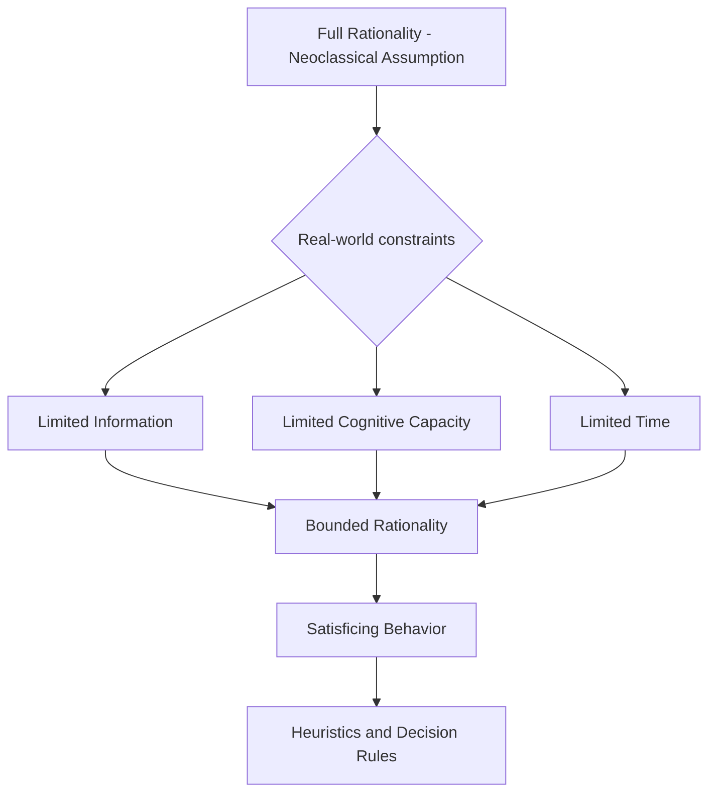

## Bounded Rationality

### Definition and Core Concept

Bounded rationality is the theory, originated by Herbert Simon (1955, 1957), that decision-makers' rationality is limited by the cognitive capacity of the human mind, the complexity of the problems they face, and the finite time available to make decisions. Rather than optimizing perfectly over the full space of possible choices as assumed in neoclassical rational-choice models, boundedly rational agents seek **satisfactory** rather than **optimal** solutions — a process Simon termed **satisficing**.

Bounded rationality is a foundational concept for behavioral economics because it provides the theoretical justification for departing from the standard rational-agent (homo economicus) model that underlies most of neoclassical microeconomics, opening the door to systematic, predictable deviations from full optimization.

**Key Points**

- Standard rational-choice theory assumes unlimited computational ability, complete information processing, and perfect optimization
- Bounded rationality instead models agents as limited by cognitive capacity, incomplete information, and time constraints
- The resulting behavior is **satisficing** (finding a "good enough" option) rather than **optimizing** (finding the objectively best option)
- Bounded rationality is descriptive (how people actually decide) rather than normative (how they should decide)

### The Three Bounds

Simon identified three interrelated limitations that jointly constrain rational decision-making in practice:

1. **Limited information**: Decision-makers rarely possess complete information about all available alternatives, their consequences, and relevant probabilities
2. **Limited cognitive capacity**: Even with complete information, the human mind has finite capacity to process, store, and compute over large or complex decision problems
3. **Limited time**: Real-world decisions are typically made under time pressure, precluding exhaustive search and evaluation of all alternatives

### Satisficing vs. Optimizing

The central behavioral prediction of bounded rationality is **satisficing**: rather than searching exhaustively for the objectively optimal choice, agents establish an **aspiration level** (a threshold of acceptability) and select the first alternative encountered that meets or exceeds that threshold, then stop searching.

| Dimension | Optimizing (Standard Model) | Satisficing (Bounded Rationality) |
| --- | --- | --- |
| Search process | Exhaustive evaluation of all alternatives | Sequential search, stops at "good enough" |
| Decision criterion | Maximize objective function | Meet or exceed an aspiration level |
| Information requirement | Complete | Partial, as available |
| Computational demand | Unlimited | Limited by cognitive capacity |
| Outcome | Global optimum | Locally acceptable solution |

Formally, if $u(x)$ represents the utility of alternative $x$, an optimizing agent solves:

$$x^* = \arg\max_{x \in X} u(x)$$

A satisficing agent instead searches sequentially and stops at the first $x$ satisfying:

$$u(x) \geq \bar{u} \quad \text{(aspiration level)}$$

**[Inference]** The aspiration level itself is not treated as a fixed, exogenous parameter in most extensions of the model — it is generally understood to adjust based on the agent's search experience (e.g., revised downward if search proves unexpectedly difficult, or upward if early alternatives exceed expectations), though the precise adjustment process is not uniquely specified by the original theory and has been formalized differently across subsequent models.

### Procedural vs. Substantive Rationality

Simon drew an important distinction that underlies much of the bounded rationality literature:

- **Substantive rationality**: Rationality judged solely by whether the *outcome* of a decision is optimal given the goals and constraints — this is the standard economic notion of rationality
- **Procedural rationality**: Rationality judged by whether the *process* used to reach a decision is reasonable given the cognitive resources and information available to the decision-maker, regardless of whether the resulting outcome happens to be globally optimal

Bounded rationality is fundamentally a theory of **procedural** rationality: an agent can be behaving entirely reasonably given their limitations, even while failing to achieve the substantively optimal outcome that an unconstrained optimizer would reach.

### Heuristics as a Manifestation of Bounded Rationality

Because exhaustive optimization is infeasible under bounded rationality, agents rely on **heuristics** — simplified decision rules or mental shortcuts that reduce the cognitive burden of a decision at the cost of potential systematic deviations from the optimal choice. This connects bounded rationality directly to the later heuristics-and-biases research program of Kahneman and Tversky (1974), which catalogued specific heuristics and the biases they can produce.

| Heuristic | Description | Potential Bias Introduced |
| --- | --- | --- |
| Availability heuristic | Judging probability by ease of recall | Overweighting vivid or recent events |
| Representativeness heuristic | Judging probability by similarity to a prototype | Neglecting base rates |
| Anchoring and adjustment | Starting from an initial value and adjusting insufficiently | Under-adjustment from arbitrary anchors |
| Elimination-by-aspects | Sequentially eliminating options failing to meet a threshold on each attribute | Order-dependent, potentially inconsistent choices |
| Recognition heuristic | Choosing the recognized option over the unrecognized one | Can outperform or underperform full information depending on context |

**[Inference]** Whether a given heuristic is best characterized as an adaptive, efficient response to bounded rationality (as emphasized in Gerd Gigerenzer's "fast and frugal heuristics" research program) or as a systematic source of costly bias (as emphasized in the Kahneman–Tversky tradition) remains a matter of ongoing debate and differing theoretical emphasis within the behavioral literature, rather than a settled empirical conclusion.

### Formal Modeling Approaches to Bounded Rationality

Several distinct formal frameworks have been developed to operationalize bounded rationality within economic models:

#### 1. Search-Theoretic Satisficing Models

Directly formalize Simon's sequential search-and-stop process, often via optimal stopping rules where the *search process itself* is modeled as costly, making a form of "constrained optimization over the decision to stop searching" — a partial reconciliation with optimization-based modeling.

#### 2. Rational Inattention (Sims, 2003)

Models agents as facing an explicit information-processing cost (formalized using information theory, typically Shannon mutual information), such that acquiring more precise information about the state of the world is costly, and agents optimally choose *how much* attention/information to acquire, trading off decision quality against cognitive/attention cost.

#### 3. Level-k / Cognitive Hierarchy Models

Used primarily in game theory, these models assume players reason through only a finite number of iterations of strategic thinking (e.g., a "level-0" player chooses non-strategically, a "level-1" player best-responds to level-0 opponents, and so on), rather than the infinite-regress common-knowledge-of-rationality assumption underlying Nash equilibrium.

#### 4. Sparsity-Based Models (Gabaix, 2014)

Model agents as using simplified, "sparse" mental models of a complex environment, optimally choosing which variables to attend to and which to ignore, formalized via an explicit cost of cognitive complexity.

#### 5. Behavioral Game Theory Adjustments

Incorporate bounded rationality into equilibrium concepts via constructs like Quantal Response Equilibrium (QRE), where agents choose better responses with higher probability but do not always select the strict best response, reflecting decision noise consistent with bounded computational precision.

**Example**

Rational inattention offers a concrete illustration: consider a consumer deciding how much attention to pay to fluctuating grocery prices. Under full rationality, the consumer would track every price change perfectly and always purchase from the cheapest source. Under rational inattention, the consumer instead optimally chooses a *coarser* information strategy — checking prices only occasionally, or only tracking prices for a subset of frequently purchased items — because the cognitive cost of perfect price-tracking exceeds the expected benefit for lower-stakes purchases, while high-stakes purchases (e.g., a major appliance) justify more careful attention.

### Applications in Microeconomics and Behavioral Economics

| Domain | Application of Bounded Rationality |
| --- | --- |
| Consumer choice | Limited consideration sets; consumers evaluate only a subset of available products rather than the full choice set |
| Retirement savings | Default options and automatic enrollment exploit satisficing — most employees accept defaults rather than optimizing contribution rates |
| Firm behavior | Organizational routines and standard operating procedures as satisficing responses to complex environments (behavioral theory of the firm, Cyert and March) |
| Mortgage/financial product choice | Consumers rely on simplified heuristics (e.g., focusing on monthly payment rather than total cost) rather than fully comparing complex contract terms |
| Search and matching markets | Job search and housing search modeled with reservation-wage/reservation-price stopping rules, a direct descendant of satisficing logic |
| Contract design/behavioral IO | Firms exploit consumer bounded rationality via complex pricing (e.g., drip pricing, shrouded fees) that boundedly rational consumers underweight |

### Bounded Rationality vs. Related Behavioral Concepts

| Concept | Core Mechanism | Relationship to Bounded Rationality |
| --- | --- | --- |
| Bounded rationality | Cognitive/informational/time limits on the decision *process* | The foundational umbrella concept |
| Heuristics and biases | Specific shortcuts and resulting systematic errors | A downstream manifestation of bounded rationality |
| Prospect theory | Value function defined over gains/losses relative to a reference point, with probability weighting | A distinct behavioral departure (concerning risk preferences), not strictly a bounded-rationality model, though often grouped together under behavioral economics |
| Bounded willpower | Limits on self-control rather than cognition | A related but conceptually distinct departure from the standard model, concerning intertemporal choice rather than computational limits |
| Bounded self-interest | Departures from pure self-interest (e.g., fairness concerns, reciprocity) | Concerns *preferences*, whereas bounded rationality concerns *cognitive process* — a separate axis of departure from the standard model |

### Common Misconceptions

- **Bounded rationality means people are irrational.** This is not the framing Simon intended — bounded rationality describes agents behaving reasonably and adaptively *given* their genuine cognitive and informational constraints; the term "irrational" implies a normative failure, whereas bounded rationality is often understood as a rational adaptation to constraints, not a departure from rationality per se.
- **Satisficing always produces worse outcomes than optimizing.** Under costly search or costly cognition, satisficing can be the objectively superior strategy once search/cognition costs are properly accounted for — full optimization that ignores computation cost is not "more rational" if it is not actually feasible or is more costly than its benefit.
- **Bounded rationality and prospect theory are the same theory.** They are distinct: bounded rationality concerns limits on the decision-making *process* (information, computation, time), while prospect theory concerns the *shape of preferences* over risky outcomes (reference dependence, loss aversion, probability weighting) — both fall under the broader behavioral economics umbrella but address different departures from the standard model.

### Critiques and Ongoing Debates

- **[Inference]** A frequent critique of bounded rationality as a modeling framework is that, unlike expected utility maximization, it does not by itself generate a single, universally agreed-upon set of testable predictions — the specific form of "boundedness" (which heuristic, what aspiration level, how much attention) must typically be specified by the modeler, which some critics argue introduces a degree of flexibility that can make the framework harder to falsify in specific applications
- Proponents respond that this flexibility is a feature reflecting genuine psychological realism, and that specific formal instantiations (rational inattention, level-k models, QRE) do generate sharp, testable predictions once the relevant cognitive-cost or reasoning-depth parameters are specified

### Related Topics

- Heuristics and biases (Kahneman and Tversky)
- Prospect theory and reference-dependent preferences
- Rational inattention (Sims)
- Behavioral theory of the firm (Cyert and March)
- Nudges and choice architecture (Thaler and Sunstein)
- Quantal Response Equilibrium and level-k reasoning in behavioral game theory
- Default effects and status quo bias
- Dual-process theory (System 1 / System 2 thinking, Kahneman)