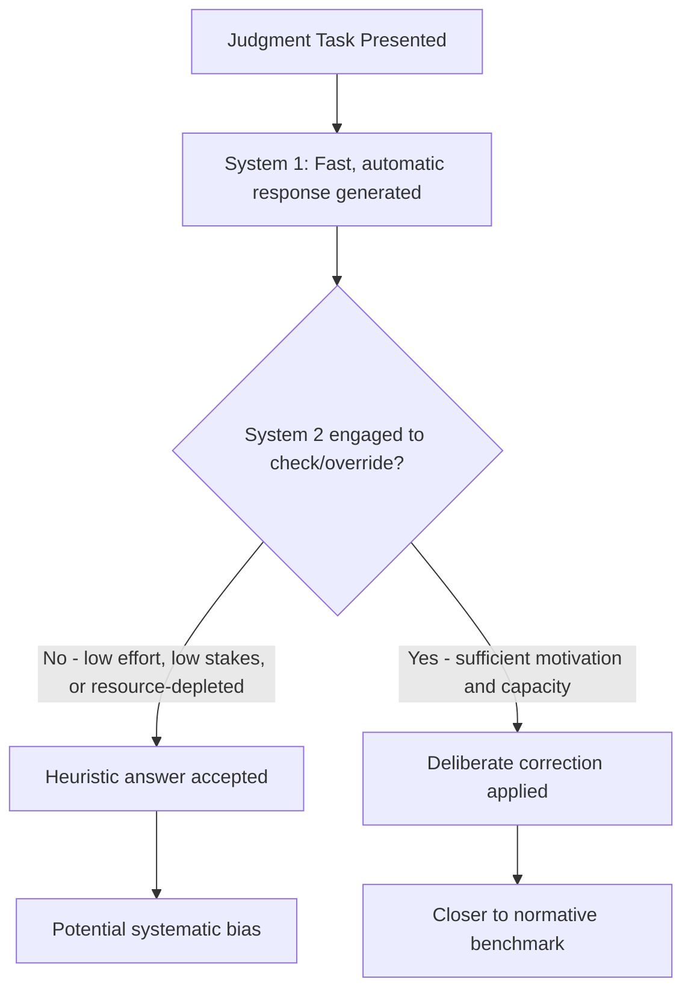

## Heuristics and Cognitive Biases

### Definition and Core Concept

Heuristics are mental shortcuts — simplified rules of thumb — that individuals use to make judgments and decisions quickly under uncertainty, without engaging in exhaustive, formally optimal reasoning. Cognitive biases are systematic, predictable deviations from normative rationality (typically defined relative to the axioms of probability theory, logic, or expected utility theory) that arise as a byproduct of relying on these heuristics.

The systematic study of heuristics and biases was pioneered by Amos Tversky and Daniel Kahneman beginning in the early 1970s, culminating in their influential 1974 *Science* paper "Judgment Under Uncertainty: Heuristics and Biases." This research program, along with Kahneman and Tversky's subsequent development of prospect theory, forms one of the two central pillars of modern behavioral economics (the other being bounded rationality's broader challenge to the standard rational-agent model).

**Key Points**

- Heuristics are adaptive in the sense that they reduce cognitive effort and often perform reasonably well
- Biases are the *systematic* errors that heuristics can produce relative to a normative benchmark (not random noise, but predictable directional deviations)
- The heuristics-and-biases program catalogues specific heuristics and the biases each one characteristically produces
- Kahneman's later "dual-process" framing (System 1 / System 2) provides a cognitive-architecture explanation for why these shortcuts occur

### Dual-Process Theory: System 1 and System 2

Kahneman's popular synthesis (*Thinking, Fast and Slow*, 2011) frames heuristic-driven judgment within a dual-process model of cognition:

| System | Characteristics | Role in Heuristics |
| --- | --- | --- |
| System 1 | Fast, automatic, effortless, intuitive, operates in parallel | Generates heuristic judgments by default |
| System 2 | Slow, deliberate, effortful, analytical, operates serially | Can override System 1 output, but requires cognitive resources and motivation to engage |

**[Inference]** The dual-process framing is a widely used pedagogical and organizing device for the heuristics-and-biases literature, but it is a simplification of more complex underlying cognitive architecture; the two "systems" are not literally separate anatomical brain modules but rather a useful conceptual distinction between characteristically fast/automatic versus slow/deliberate processing modes.

Biases characteristically arise when System 1 generates an intuitive answer to a question, and System 2 either fails to detect that the intuitive answer is inappropriate for the actual question being asked, or fails to exert sufficient effort to override it.

### The Core Heuristics: Detailed Treatment

#### 1. Representativeness Heuristic

Judging the probability that an object or event belongs to a category by how much it resembles the typical or prototypical member of that category, rather than by the actual (base-rate) frequency of category membership.

**Biases produced:**

- **Base-rate neglect**: Ignoring prior probability information in favor of similarity-based judgments
- **Conjunction fallacy**: Judging a conjunction of two events as more probable than one of the constituent events alone, violating the basic probability axiom $P(A \cap B) \leq P(A)$
- **Insensitivity to sample size**: Failing to appreciate that small samples are more variable than large samples, leading to overconfidence in inferences from limited data
- **Gambler's fallacy**: The mistaken belief that random sequences must "self-correct" (e.g., believing a coin is "due" for tails after a run of heads), reflecting a mistaken representativeness-based expectation that even short local sequences should resemble the long-run probability

**Example**

In Kahneman and Tversky's classic "Linda problem," participants were given a description of a woman matching a stereotype of a feminist activist, then asked to rank the probability of various statements. A majority of respondents ranked "Linda is a bank teller and is active in the feminist movement" as *more* probable than "Linda is a bank teller" alone — violating the conjunction rule of probability, since the joint event cannot be more probable than either constituent event. This is a canonical demonstration of the representativeness heuristic producing base-rate neglect and the conjunction fallacy.

#### 2. Availability Heuristic

Judging the probability or frequency of an event based on the ease with which relevant instances come to mind, rather than on actual statistical frequency.

**Biases produced:**

- Overestimating the probability of vivid, recent, or emotionally salient events (e.g., overestimating death by shark attack relative to death by more common but less memorable causes, due to media coverage salience)
- Underestimating the probability of events that are hard to recall or imagine, even if objectively common
- **Illusory correlation**: Perceiving a relationship between two events because instances of their co-occurrence are more memorable, even absent a genuine statistical relationship

#### 3. Anchoring and Adjustment Heuristic

Starting from an initial reference point (an "anchor") — which may be entirely arbitrary or irrelevant to the judgment at hand — and adjusting insufficiently away from it when forming a final estimate.

**Biases produced:**

- Insufficient adjustment from arbitrary or irrelevant anchors, leading final estimates to be biased toward the anchor
- **[Inference]** The magnitude of anchoring effects has been found in numerous replications to be sensitive to factors such as whether the anchor is self-generated versus externally provided, and whether participants are given incentives or explicit warnings about anchoring, though the qualitative direction of the effect (insufficient adjustment) has proven to be a robust and widely replicated finding across many experimental contexts

**Example**

In a widely cited demonstration, participants were asked to spin a wheel rigged to stop at either a low or high number, then asked to estimate the percentage of African countries in the United Nations. Participants who saw the higher number on the wheel gave systematically higher estimates than those who saw the lower number, despite the wheel's outcome being entirely unrelated to the actual quantity being estimated — illustrating how even transparently irrelevant anchors can bias subsequent numeric judgments.

#### 4. Affect Heuristic

Using one's immediate emotional reaction ("liking" or "disliking," positive or negative affect) toward an option as a proxy for a more effortful cost-benefit analysis of its risks and benefits.

**Bias produced:** Risks and benefits of a given activity or technology tend to be perceived as inversely correlated in judgment (things that feel "good" are judged as low-risk and high-benefit, things that feel "bad" are judged as high-risk and low-benefit) even when the objective statistical relationship between risk and benefit for a given technology is independent or even positively correlated.

### Related Biases Beyond the Original Three Heuristics

| Bias | Description |
| --- | --- |
| Overconfidence | Systematic overestimation of the precision or accuracy of one's own knowledge/judgments |
| Confirmation bias | Tendency to search for, interpret, and recall information in ways that confirm pre-existing beliefs |
| Hindsight bias | Tendency to perceive past events as having been more predictable than they actually were before they occurred |
| Framing effects | Judgments and choices shift depending on how logically equivalent information is presented (e.g., "90% survival rate" vs. "10% mortality rate") |
| Status quo bias | A disproportionate preference for the current state of affairs, beyond what is explained by switching costs alone |
| Loss aversion | Losses loom larger than equivalently-sized gains in subjective evaluation (a component of prospect theory) |
| Endowment effect | Individuals demand more to give up an object they own than they would be willing to pay to acquire the identical object |
| Present bias / hyperbolic discounting | Disproportionate weighting of immediate outcomes relative to future outcomes, beyond what constant (exponential) discounting would predict |

**(svg_diagram)**

<svg xmlns="http://www.w3.org/2000/svg" viewBox="0 0 640 400">
<text x="320" y="24" font-size="16" font-weight="bold" text-anchor="middle" fill="#1a1a1a">Heuristic to Bias Mapping (svg_diagram)</text>
<rect x="30" y="60" width="150" height="60" rx="8" fill="#eaf2f8" stroke="#2980b9" stroke-width="1.5" />
<text x="105" y="95" font-size="12" font-weight="bold" text-anchor="middle" fill="#1a1a1a">Representativeness</text>
<rect x="245" y="60" width="150" height="60" rx="8" fill="#fdebd0" stroke="#e67e22" stroke-width="1.5" />
<text x="320" y="95" font-size="12" font-weight="bold" text-anchor="middle" fill="#1a1a1a">Availability</text>
<rect x="460" y="60" width="150" height="60" rx="8" fill="#eafaf1" stroke="#27ae60" stroke-width="1.5" />
<text x="535" y="95" font-size="12" font-weight="bold" text-anchor="middle" fill="#1a1a1a">Anchoring</text>
<line x1="105" y1="120" x2="105" y2="160" stroke="#333" stroke-width="1.5" />
<text x="105" y="180" font-size="10.5" text-anchor="middle" fill="#333">Base-rate neglect,</text>
<text x="105" y="196" font-size="10.5" text-anchor="middle" fill="#333">Conjunction fallacy</text>
<line x1="320" y1="120" x2="320" y2="160" stroke="#333" stroke-width="1.5" />
<text x="320" y="180" font-size="10.5" text-anchor="middle" fill="#333">Overestimating vivid,</text>
<text x="320" y="196" font-size="10.5" text-anchor="middle" fill="#333">memorable events</text>
<line x1="535" y1="120" x2="535" y2="160" stroke="#333" stroke-width="1.5" />
<text x="535" y="180" font-size="10.5" text-anchor="middle" fill="#333">Insufficient adjustment</text>
<text x="535" y="196" font-size="10.5" text-anchor="middle" fill="#333">from irrelevant reference</text>
</svg>

### Formal Contrast with the Normative Benchmark

Heuristics and biases are always defined *relative to* a specified normative standard, most commonly:

- **Bayesian probability theory** (for representativeness/availability-driven judgment errors)
- **Expected utility theory** (for framing effects and related choice anomalies)
- **Exponential discounted utility** (for present bias / hyperbolic discounting)

$$\text{Bias} \equiv \text{Observed judgment/choice} - \text{Prediction under normative benchmark}$$

**[Inference]** A long-standing methodological debate exists over whether departures from these specific normative benchmarks should always be interpreted as "errors," since in some cases the benchmark itself may be a contested or overly narrow definition of rationality for the task environment in question — this is the central argument of the ecological rationality tradition (Gigerenzer), which holds that some "biases" are in fact well-adapted responses to real-world statistical structure that the abstracted laboratory task fails to capture.

### Applications in Economics and Policy

| Domain | Bias Applied | Implication |
| --- | --- | --- |
| Financial markets | Overconfidence, availability | Excess trading volume, momentum/overreaction in asset pricing |
| Insurance decisions | Availability (of vivid disaster events) | Over-purchase of insurance against vivid, low-probability risks (e.g., post-disaster flood insurance spikes); under-purchase against less vivid but statistically comparable risks |
| Retirement savings | Present bias, status quo bias | Under-saving for retirement; effectiveness of automatic-enrollment ("nudge") default policies |
| Public health messaging | Framing effects | Message framing (gain-framed vs. loss-framed) affects behavior uptake (e.g., vaccination, screening participation) |
| Consumer choice | Anchoring, endowment effect | Reference-price anchoring in retail pricing strategies ("original price" markdowns) |
| Voting and political judgment | Availability, confirmation bias | Disproportionate salience of recent or vivid political events in voter judgment |

### Debiasing: Can Heuristic Errors Be Corrected?

The literature on **debiasing** examines interventions intended to reduce the influence of specific heuristics on judgment. Commonly studied approaches include:

- **Incentives**: Providing financial stakes for accuracy, though evidence on effectiveness is mixed and bias-dependent
- **Warning/education**: Informing individuals about a specific bias before the judgment task, with variable success depending on the bias and task
- **Consider-the-opposite instructions**: Explicitly prompting individuals to generate reasons the opposite conclusion might be true, shown to reduce certain biases like overconfidence and hindsight bias in some studies
- **Statistical/algorithmic decision aids**: Replacing or supplementing human judgment with formal statistical models, which are immune to many of these specific heuristic-driven errors
- **Choice architecture / nudges**: Rather than correcting the bias directly, redesigning the decision environment to produce better outcomes despite the bias remaining present (e.g., default enrollment for biases rooted in status quo/present bias)

**[Unverified]** The overall effectiveness of debiasing interventions varies substantially across bias type, task domain, and population studied, and general claims about "which debiasing method works best" should be treated with caution absent reference to the specific bias and context in question.

### Common Misconceptions

- **Heuristics are always harmful or produce worse outcomes than deliberate calculation.** Heuristics can perform very well, and sometimes better than more complex models, particularly in the "fast and frugal heuristics" tradition's empirical demonstrations in specific domains (e.g., simple recognition-based heuristics in some forecasting tasks) — the heuristics-and-biases program specifically studies the conditions under which they produce systematic *errors*, not a claim that they are uniformly inferior.
- **Cognitive biases are the same as "human error" in general, or random mistakes.** Biases specifically refer to *systematic, directionally predictable* deviations from a normative benchmark, not random noise or occasional mistakes.
- **All departures from expected utility theory documented by Kahneman and Tversky are "biases" in the pejorative sense.** Many such departures (e.g., loss aversion, as formalized in prospect theory) are treated in the modern literature as legitimate descriptive features of preferences rather than simply "errors" to be corrected.

### Related Topics

- Prospect theory and reference-dependent preferences
- Bounded rationality and satisficing (Herbert Simon)
- Ecological rationality and fast-and-frugal heuristics (Gigerenzer)
- Nudge theory and choice architecture (Thaler and Sunstein)
- Present bias and hyperbolic discounting
- Loss aversion and the endowment effect
- Overconfidence and its role in financial market anomalies
- Debiasing interventions and their empirical effectiveness