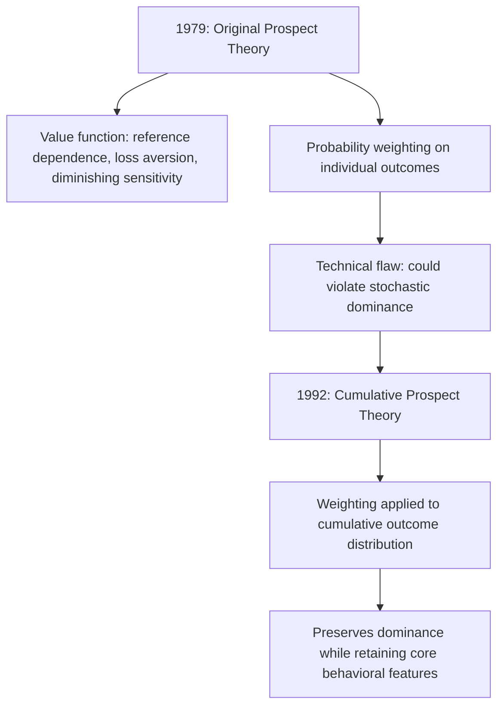

## Prospect Theory and Loss Aversion

### Definition and Core Concept

Prospect theory is a descriptive model of decision-making under risk and uncertainty, developed by Daniel Kahneman and Amos Tversky (1979), that was constructed specifically to account for a systematic pattern of empirical violations of expected utility theory (EUT), the standard normative model of choice under risk. Loss aversion — the principle that losses are psychologically more impactful than equivalently-sized gains — is the central and most influential component of prospect theory, and is now widely treated as a foundational building block of behavioral economics in its own right.

Kahneman was awarded the 2002 Nobel Memorial Prize in Economic Sciences for this work (Tversky, who died in 1996, was ineligible under Nobel rules).

**Key Points**

- Prospect theory replaces expected utility's evaluation of *final wealth states* with evaluation of *gains and losses relative to a reference point*
- Losses are weighted more heavily than equivalent gains: **loss aversion**
- The value function is concave for gains (risk-averse in the gain domain) but convex for losses (risk-seeking in the loss domain)
- Probabilities are not weighted linearly but transformed via a **probability weighting function** that overweights small probabilities and underweights moderate-to-large probabilities

### Motivation: Empirical Violations of Expected Utility Theory

Standard expected utility theory posits that a rational agent evaluates a risky prospect $(x_1, p_1; x_2, p_2; \ldots)$ by its expected utility:

$$EU = \sum_i p_i \cdot u(x_i)$$

where $u(\cdot)$ is defined over **final wealth levels** and is typically assumed concave (risk aversion) throughout. Kahneman and Tversky documented several robust, systematic patterns of choice that this framework cannot accommodate without modification:

- **The reflection effect**: Individuals are typically risk-averse for gains but risk-seeking for losses of comparable magnitude and probability — a pattern that is incompatible with a value function that is uniformly concave over final wealth
- **The certainty effect**: Outcomes that are certain are given disproportionate weight relative to outcomes that are merely probable, even when expected values are held constant (related to, but conceptually distinct from, the Allais paradox)
- **Framing effects**: Logically identical decision problems described in terms of gains versus losses produce systematically different choices (the "Asian disease problem" is the canonical demonstration)
- **Loss aversion itself**: In simple mixed gambles (a chance of a gain and a chance of an equally-sized loss), most people require the potential gain to be roughly **1.5 to 2.5 times larger** than the potential loss before accepting the gamble — a asymmetry that expected utility theory, with utility defined over final wealth, cannot easily explain without invoking implausibly extreme local risk aversion

### The Value Function

Prospect theory replaces the utility function $u(x)$ (defined over final wealth) with a **value function** $v(x)$ defined over **gains and losses relative to a reference point** (typically the status quo or current wealth level, though the reference point itself can be manipulated by framing).

The value function has three defining properties:

1. **Reference dependence**: Outcomes are evaluated as deviations $x$ from a reference point, not as absolute final wealth levels
2. **Diminishing sensitivity**: The value function is concave for gains ($v''(x) < 0$ for $x > 0$) and convex for losses ($v''(x) > 0$ for $x < 0$) — the psychological impact of an additional unit of gain or loss diminishes as the size of that gain or loss grows from the reference point
3. **Loss aversion**: The function is steeper for losses than for gains, so that $|v(-x)| > v(x)$ for any $x > 0$

A commonly used functional form (from Tversky and Kahneman's 1992 cumulative prospect theory refinement) is:

$$v(x) = \begin{cases} x^\alpha & \text{if } x \geq 0 \\ -\lambda(-x)^\beta & \text{if } x < 0 \end{cases}$$

where $\alpha, \beta \in (0,1)$ govern diminishing sensitivity (typically estimated around 0.88 in the original study) and $\lambda > 1$ is the **loss aversion coefficient** (typically estimated around 2.25 in the original study, though **[Inference]** subsequent studies across different populations, elicitation methods, and stake sizes have produced a wide range of loss aversion coefficient estimates, and the specific value of 2.25 should be treated as an illustrative estimate from one study rather than a universal constant).

**(svg_diagram)**

<svg xmlns="http://www.w3.org/2000/svg" viewBox="0 0 640 460">
<text x="320" y="24" font-size="16" font-weight="bold" text-anchor="middle" fill="#1a1a1a">Prospect Theory Value Function (svg_diagram)</text>
<line x1="60" y1="240" x2="600" y2="240" stroke="#333" stroke-width="1.5" />
<line x1="320" y1="60" x2="320" y2="420" stroke="#333" stroke-width="1.5" />
<text x="600" y="260" font-size="13" text-anchor="end" fill="#333">Gains</text>
<text x="70" y="260" font-size="13" fill="#333">Losses</text>
<text x="330" y="70" font-size="12" fill="#333">Value v(x)</text>
<text x="325" y="420" font-size="12" fill="#333">Reference point (0)</text>
<path d="M 320 240 C 400 180, 480 140, 580 110" stroke="#2980b9" stroke-width="2.5" fill="none" />
<text x="440" y="150" font-size="12" fill="#2980b9">Concave for gains (risk-averse)</text>
<path d="M 320 240 C 250 320, 150 400, 70 415" stroke="#c0392b" stroke-width="2.5" fill="none" />
<text x="90" y="360" font-size="12" fill="#c0392b">Convex for losses (risk-seeking)</text>
<line x1="320" y1="240" x2="320" y2="115" stroke="#999" stroke-dasharray="3,3" />
<line x1="320" y1="240" x2="320" y2="365" stroke="#999" stroke-dasharray="3,3" />
<text x="330" y="440" font-size="11" fill="#555">Note: slope steeper on the loss side than the gain side at equal |x| — loss aversion</text>
</svg>

### Loss Aversion in Detail

Loss aversion is often summarized by the informal ratio "losses loom roughly twice as large as gains," reflecting the empirical estimates of $\lambda$ near 2 to 2.5 found in the original and many subsequent studies, though this exact figure is an empirical estimate rather than a theoretical constant.

**Key Points**

- Loss aversion is distinct from (though related to) ordinary risk aversion: risk aversion concerns the curvature of the value/utility function; loss aversion specifically concerns the *kink and differential steepness* at the reference point
- The reference point is not always simply "current wealth" — it can be manipulated by expectations, recent experience, or explicit framing, a fact heavily exploited in the behavioral economics literature on framing effects
- Loss aversion is a leading candidate explanation for numerous empirical anomalies inconsistent with standard expected-utility-maximizing behavior

#### Prominent Applications and Manifestations of Loss Aversion

**Example**

The **endowment effect** — individuals demand more to sell an object they own than they would be willing to pay to acquire that same object — is commonly attributed to loss aversion: once an individual owns an object, it becomes part of their reference point, so giving it up is coded as a *loss* rather than foregoing an equivalent-sized *gain*, and losses are weighted more heavily. Classic experiments (Kahneman, Knetsch, and Thaler, 1990) using randomly-assigned coffee mugs found that owners' minimum selling prices substantially exceeded non-owners' maximum willingness to pay for the identical mug.

| Phenomenon | Mechanism via Loss Aversion |
| --- | --- |
| Endowment effect | Giving up an owned good is coded as a loss, not a forgone gain |
| Status quo bias | Any change from the status quo entails potential losses relative to the current reference point |
| Equity premium puzzle | Investors demand unusually high equity returns because loss-averse, frequent portfolio evaluation ("myopic loss aversion") makes stock volatility feel disproportionately painful |
| Disposition effect | Investors hold losing stocks too long (reluctant to realize a loss) and sell winning stocks too early (to lock in a gain), reflecting the asymmetric shape of the value function around the purchase-price reference point |
| Labor supply of cab drivers | Some studies find drivers quit earlier on high-earning days and work longer on low-earning days, consistent with a daily income target acting as a loss-averse reference point (though this finding has been contested and is not universally replicated) |
| Reluctance to renegotiate contracts | Concessions are perceived as losses, making mutually beneficial renegotiation harder to achieve than a purely rational, reference-independent model would predict |

**[Inference]** Several of these applications, particularly myopic loss aversion in the equity premium puzzle and the cab-driver labor supply findings, remain subjects of ongoing empirical debate regarding the size of the effect, the robustness of the finding across datasets, and the extent to which alternative explanations (e.g., standard risk aversion, income effects, or measurement issues) can account for the same patterns.

### The Probability Weighting Function

The second major departure from expected utility theory in prospect theory concerns how probabilities are subjectively weighted. Rather than weighting outcomes by their objective probabilities $p_i$ (as in standard EUT), prospect theory replaces $p_i$ with a **decision weight** $\pi(p_i)$ generated by a nonlinear probability weighting function $w(p)$.

**Characteristic shape of $w(p)$:**

- $w(p) > p$ for small $p$ (small probabilities are **overweighted**)
- $w(p) < p$ for moderate-to-large $p$ (moderate and large probabilities are **underweighted**)
- $w(0) = 0$ and $w(1) = 1$ (certainty is preserved at the endpoints)
- The function typically exhibits an inverse-S shape, being concave for small probabilities and convex for larger ones

**(svg_diagram)**

<svg xmlns="http://www.w3.org/2000/svg" viewBox="0 0 500 460">
<text x="250" y="24" font-size="16" font-weight="bold" text-anchor="middle" fill="#1a1a1a">Probability Weighting Function (svg_diagram)</text>
<line x1="70" y1="400" x2="440" y2="400" stroke="#333" stroke-width="1.5" />
<line x1="70" y1="400" x2="70" y2="60" stroke="#333" stroke-width="1.5" />
<text x="440" y="422" font-size="12" text-anchor="end" fill="#333">Objective probability p</text>
<text x="45" y="55" font-size="12" text-anchor="middle" fill="#333">w(p)</text>
<line x1="70" y1="400" x2="410" y2="80" stroke="#999" stroke-width="1" stroke-dasharray="4,3" />
<text x="300" y="230" font-size="11" fill="#777">45° line: w(p) = p (objective weighting)</text>
<path d="M 70 400 C 130 320, 180 220, 250 190 C 320 165, 380 110, 410 80" stroke="#c0392b" stroke-width="2.5" fill="none" />
<text x="100" y="345" font-size="11" fill="#c0392b">Overweights small p</text>
<text x="270" y="150" font-size="11" fill="#c0392b">Underweights moderate/large p</text>
</svg>

**Example**

The overweighting of small probabilities helps explain simultaneous demand for both lottery tickets (risk-seeking for small-probability large gains) and insurance (risk-averse behavior for small-probability large losses) by the same individual — a pattern that is difficult to reconcile with a single, globally concave expected utility function, but follows naturally once small probabilities of both extreme gains and extreme losses are overweighted in decision-making.

### Cumulative Prospect Theory: The 1992 Refinement

Tversky and Kahneman's 1992 paper introduced **cumulative prospect theory (CPT)**, addressing a technical shortcoming of the original 1979 formulation: the original version could, under certain conditions, imply that a dominated prospect (one that is unambiguously worse in every state) might be preferred, violating basic monotonicity/dominance principles. CPT resolves this by applying the probability weighting function to the **cumulative distribution** of outcomes rather than to individual outcome probabilities directly, ensuring the model satisfies first-order stochastic dominance while retaining the core reference-dependence, loss-aversion, and probability-weighting features of the original theory.

### Formal Comparison: Expected Utility Theory vs. Prospect Theory

| Feature | Expected Utility Theory | Prospect Theory |
| --- | --- | --- |
| Domain of evaluation | Final wealth/consumption levels | Gains and losses relative to a reference point |
| Utility/value function shape | Typically globally concave (risk-averse) | Concave for gains, convex for losses (S-shaped) |
| Treatment of losses vs. gains | Symmetric around wealth level | Asymmetric — losses weighted more heavily (loss aversion) |
| Probability treatment | Linear (objective probabilities used directly) | Nonlinear (probability weighting function) |
| Framing sensitivity | Framing should not affect choice (invariance/description invariance assumed) | Framing systematically affects choice via reference point manipulation |
| Normative status | Normative and (historically) descriptive model | Purely descriptive model; not proposed as normative |

### Common Misconceptions

- **Prospect theory claims people are simply "irrational."** Prospect theory is a *descriptive* model intended to accurately predict actual human choice behavior; it makes no normative claim that the documented patterns represent an ideal or recommended way to make decisions — indeed the theory was constructed precisely because observed behavior systematically departs from the normative expected utility benchmark.
- **Loss aversion means people always avoid all risk.** Loss aversion combined with the convex value function for losses actually predicts *risk-seeking* behavior in the loss domain (e.g., gambling to try to recoup a loss) — loss aversion is about the differential weighting of losses versus gains, not a blanket prediction of risk avoidance in every context.
- **The loss aversion coefficient of 2.25 is a universal, fixed parameter.** This figure comes from specific experimental estimates in the original studies; subsequent research has found substantial variation in estimated loss aversion coefficients depending on the population, stakes, domain, and elicitation method used.

### Related Topics

- The endowment effect and status quo bias
- Framing effects and the Asian disease problem
- Mental accounting (Thaler) and reference point formation
- Myopic loss aversion and the equity premium puzzle
- The disposition effect in behavioral finance
- Cumulative prospect theory's technical refinements over the original 1979 model
- Heuristics and cognitive biases more broadly (Kahneman and Tversky's related program)
- Nudge theory and default-option design exploiting reference-dependent preferences