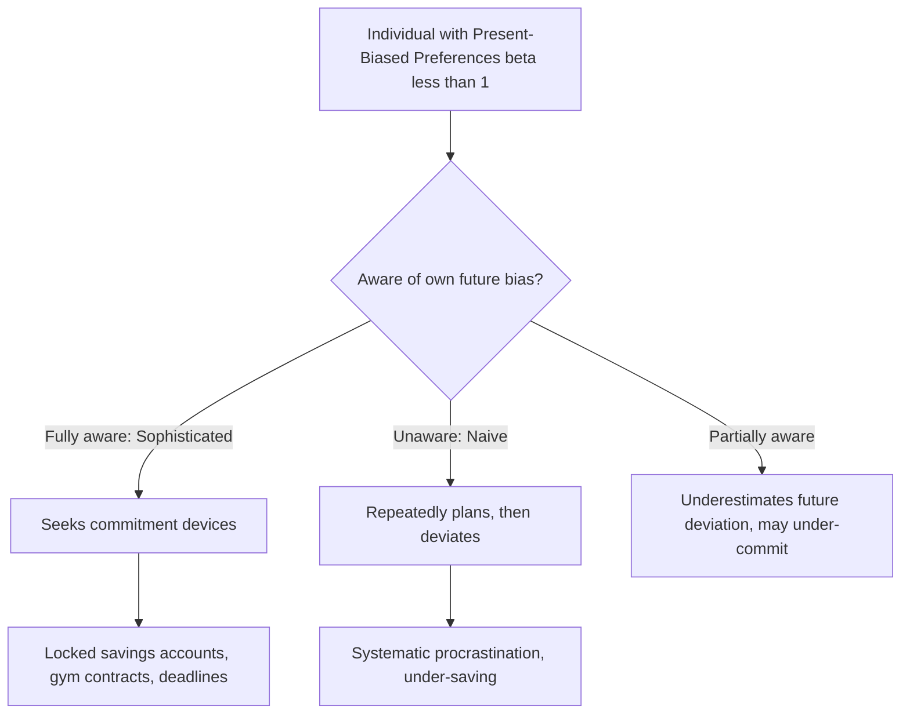

## Time Inconsistency and Present Bias

### Definition and Core Concept

Time inconsistency describes a pattern of preferences in which an individual's ranking of outcomes occurring at different points in time changes depending on when the ranking is evaluated — a plan that seems optimal when made in advance is no longer the plan the individual wants to follow once the future arrives. Present bias is the specific, most commonly studied form of time inconsistency: a disproportionate weighting of immediate costs and benefits relative to future costs and benefits, beyond what a constant (exponential) discount rate would predict.

These concepts sit within intertemporal choice theory and represent one of the most influential behavioral departures from the standard **discounted utility model**, with wide-ranging applications in savings behavior, procrastination, addiction, health behaviors, and public policy design (particularly "nudge" interventions).

**Key Points**

- Time-consistent preferences: the relative ranking of two future outcomes does not change simply because time has passed
- Time-inconsistent preferences: the relative ranking of two future outcomes *can* reverse as the decision moment approaches, even with no new information
- Present bias is the most commonly modeled and empirically documented source of time inconsistency
- Present bias is formally captured by **quasi-hyperbolic (β-δ) discounting**, contrasted with the standard **exponential discounting** model

### The Standard Benchmark: Exponential Discounting

The classical model of intertemporal choice (Samuelson, 1937) assumes an individual discounts utility from future periods at a **constant** rate $\delta \in (0,1)$ per period. Total discounted utility from a stream of consumption $(c_0, c_1, c_2, \ldots)$ evaluated at time 0 is:

$$U_0 = u(c_0) + \delta \, u(c_1) + \delta^2 u(c_2) + \delta^3 u(c_3) + \cdots = \sum_{t=0}^{\infty} \delta^t u(c_t)$$

**Key property — dynamic (time) consistency**: Under exponential discounting, the relative discount factor between any two periods $t$ and $t+1$ is always $\delta$, regardless of *when* that comparison is made. This means a plan formulated today for consumption at future dates $t$ and $t+1$ will still be viewed as optimal when the individual actually arrives at period $t$ — there is no incentive to revise the plan purely due to the passage of time. This consistency property is what makes exponential discounting **dynamically consistent**.

### Quasi-Hyperbolic (β-δ) Discounting: The Present-Bias Model

Laibson (1997), building on earlier work by Phelps and Pollak (1968) in an intergenerational context, formalized present-biased preferences using the **quasi-hyperbolic discounting** function, now the standard workhorse model in behavioral economics for present bias:

$$U_t = u(c_t) + \beta \sum_{k=1}^{\infty} \delta^k u(c_{t+k})$$

where:

- $\delta \in (0,1)$ is the standard **long-run discount factor**, applied uniformly between any two future periods
- $\beta \in (0,1]$ is the **present-bias parameter**, applied specifically and only to the "gap" between the present period and *all* future periods

When $\beta = 1$, this collapses exactly to the standard exponential discounting model (no present bias). When $\beta < 1$, the individual applies an *additional* discount specifically to anything not happening immediately, creating a discontinuous drop in valuation between "now" and "the future," followed by ordinary exponential discounting *among* future periods.

**(svg_diagram)**

<svg xmlns="http://www.w3.org/2000/svg" viewBox="0 0 640 380">
<text x="320" y="24" font-size="16" font-weight="bold" text-anchor="middle" fill="#1a1a1a">Exponential vs. Quasi-Hyperbolic Discounting (svg_diagram)</text>
<line x1="60" y1="330" x2="600" y2="330" stroke="#333" stroke-width="1.5" />
<line x1="60" y1="330" x2="60" y2="50" stroke="#333" stroke-width="1.5" />
<text x="600" y="352" font-size="13" text-anchor="end" fill="#333">Time period (t)</text>
<text x="35" y="45" font-size="12" text-anchor="middle" fill="#333">Discount weight</text>
<path d="M 90 80 C 200 110, 350 175, 570 290" stroke="#2980b9" stroke-width="2.5" fill="none" />
<text x="380" y="150" font-size="12" fill="#2980b9">Exponential: smooth decay (δ^t)</text>
<path d="M 90 80 L 92 200 C 200 220, 350 260, 570 310" stroke="#c0392b" stroke-width="2.5" fill="none" />
<text x="130" y="240" font-size="12" fill="#c0392b">Quasi-hyperbolic: sharp drop at t=0→1 (β), then decays as δ^t</text>
<line x1="92" y1="80" x2="92" y2="200" stroke="#c0392b" stroke-width="1.5" stroke-dasharray="3,3" />
<text x="100" y="140" font-size="11" fill="#c0392b">Discontinuity (β)</text>
</svg>

### Sophistication vs. Naivety

A crucial modeling distinction in present-bias models concerns whether the individual is **aware** of their own future present bias:

| Type | Awareness of Future Self's Bias | Behavior |
| --- | --- | --- |
| Sophisticated | Fully aware that future self will also be present-biased | Anticipates future deviations from current plans and may use commitment devices to constrain future choices |
| Naive | Believes future self will behave according to the exponential ($\beta=1$) plan, i.e., unaware of their own future present bias | Repeatedly makes plans it will not follow, is systematically surprised by its own future deviations, and typically does not seek out commitment devices |
| Partially naive | Aware of *some* future bias but underestimates its true magnitude ($\hat\beta \in (\beta, 1)$) | Intermediate behavior; may under-utilize commitment devices relative to what full sophistication would prescribe |

**[Inference]** The distinction between sophistication and naivety has substantial welfare and policy implications, since sophisticated present-biased agents can partially self-correct via voluntary commitment, while naive agents cannot self-correct and represent the strongest case for external policy intervention (e.g., default options) — however, empirically determining the actual degree of individual sophistication versus naivety is difficult and is itself an active area of empirical research, so real-world welfare calculations based on assumed sophistication levels carry meaningful uncertainty.

### The Preference Reversal Pattern

The signature empirical demonstration of present bias is a **preference reversal** across time: individuals asked to choose between a smaller-sooner reward and a larger-later reward often display different preferences depending on how far in the future *both* options are, even though the *time gap* between the two options is held constant.

**Example**

In a canonical illustration, most people prefer \$100 today over \$110 in one week (choosing the smaller-sooner reward when "today" is an option), but prefer \$110 in 53 weeks over \$100 in 52 weeks (choosing the larger-later reward when both options are equally distant in the future). Under exponential discounting, since the time gap between the two options is identical (one week) in both cases, the *same* choice should be made regardless of whether that week gap starts today or 52 weeks from now. The observed reversal — patience when both options are far away, impatience when one option is immediate — is the hallmark signature of present-biased, quasi-hyperbolic preferences, and cannot be generated by any constant exponential discount rate.

### Applications and Behavioral Manifestations

| Domain | Present-Bias Manifestation | Common Policy/Market Response |
| --- | --- | --- |
| Retirement savings | Under-saving; procrastination on enrollment | Automatic enrollment with opt-out defaults (Thaler and Benartzi's "Save More Tomorrow" program) |
| Health behaviors | Procrastination on exercise, healthy eating, preventive screening | Commitment contracts, gym membership structures |
| Addiction | Repeated relapse despite stated long-run intentions to quit | Commitment devices (e.g., disulfiram for alcohol, self-exclusion programs for gambling) |
| Task procrastination | Deadline-dependent completion, cramming behavior | Externally imposed intermediate deadlines |
| Consumer credit / borrowing | Overborrowing on high-interest credit relative to long-run financial interest | Cooling-off periods, disclosure requirements |
| Education | Underinvestment in effort with long-run but delayed payoffs | Structuring near-term rewards/incentives tied to long-run-beneficial behavior |

### Commitment Devices

A **commitment device** is any mechanism a sophisticated present-biased individual can voluntarily adopt *today* to constrain or penalize their own future choices, specifically in anticipation of their own future self's predictable present bias.

**Key Points**

- Commitment devices are only sought (in the pure theoretical model) by **sophisticated** agents who correctly anticipate their own future deviation
- Effective commitment devices typically work by either (a) removing the tempting option from the future choice set entirely, or (b) imposing a cost on choosing the "impatient" option later
- The willingness to pay for commitment devices is, in principle, a revealed measure of an individual's awareness of their own time-inconsistency

**Example**

The "Save More Tomorrow" program (Thaler and Benartzi, 2004) allows employees to commit in advance to allocating a portion of *future* salary increases to retirement savings, rather than committing to reduce current take-home pay. Because the sacrifice is scheduled to occur in the future (aligning with the point at which present bias would otherwise cause under-saving) and is tied to raises rather than current income, it substantially increases savings rates relative to standard opt-in savings plans, consistent with a commitment-device interpretation that circumvents the present-bias-driven reluctance to reduce current consumption.

### Distinguishing Present Bias from Standard (High) Discounting

A frequently made analytical error is to conflate present bias with simply having a high overall discount rate. These are conceptually distinct:

| Feature | High Exponential Discount Rate | Present Bias (β < 1) |
| --- | --- | --- |
| Time consistency | Fully time-consistent | Time-inconsistent |
| Preference reversals | None — same choice regardless of when the trade-off starts | Present, specifically between "now vs. soon" and "later vs. later" comparisons |
| Interpretation | The individual simply cares relatively little about the future in general, uniformly | The individual specifically overweights the *immediate* present relative to *any* future period, uniformly among future periods themselves |
| Policy relevance for commitment devices | Standard exponential agents have no demand for commitment devices — a high-discount-rate exponential plan is already fully consistent | Sophisticated present-biased agents actively demand commitment devices to bind their future selves |

**[Inference]** Empirically distinguishing whether observed impatience reflects genuinely high exponential discounting versus present bias specifically requires experimental designs that vary the *starting point* of a fixed time delay (as in the preference-reversal design above), rather than designs that only vary delay length from the present, since the latter cannot separately identify $\beta$ from $\delta$.

### Common Misconceptions

- **Present bias means an individual simply discounts the future heavily.** This describes ordinary high exponential discounting, which is time-consistent; present bias specifically refers to a *structural break* in discounting between the present and any future period, producing genuine preference reversals that pure high discounting cannot generate.
- **Naive and sophisticated present-biased agents behave identically.** They differ substantially: sophisticated agents anticipate and may actively counteract their own future deviations via commitment; naive agents do not, and are the primary intended beneficiaries of externally-imposed default-option policies precisely because they cannot self-correct.
- **Time inconsistency is proof of irrationality that must be corrected in all cases.** While present bias is typically treated as a departure from a "rational," welfare-relevant reference model (often the individual's own long-run, $\delta$-weighted preferences), this welfare judgment itself rests on the modeling assumption that the long-run perspective represents the individual's "true" preferences — a normative assumption that is not universally accepted in all philosophical treatments of the topic.

### Related Topics

- Quasi-hyperbolic discounting and its estimation in field and lab data
- Commitment devices and self-control mechanisms
- Nudge theory, default options, and libertarian paternalism (Thaler and Sunstein)
- The "Save More Tomorrow" program and behavioral retirement savings policy
- Loss aversion and prospect theory as related departures from standard rational choice
- Dual-self models of self-control (Fudenberg and Levine)
- Procrastination models in behavioral labor and education economics
- Addiction models incorporating time-inconsistent preferences (e.g., Gruber and Köszegi)