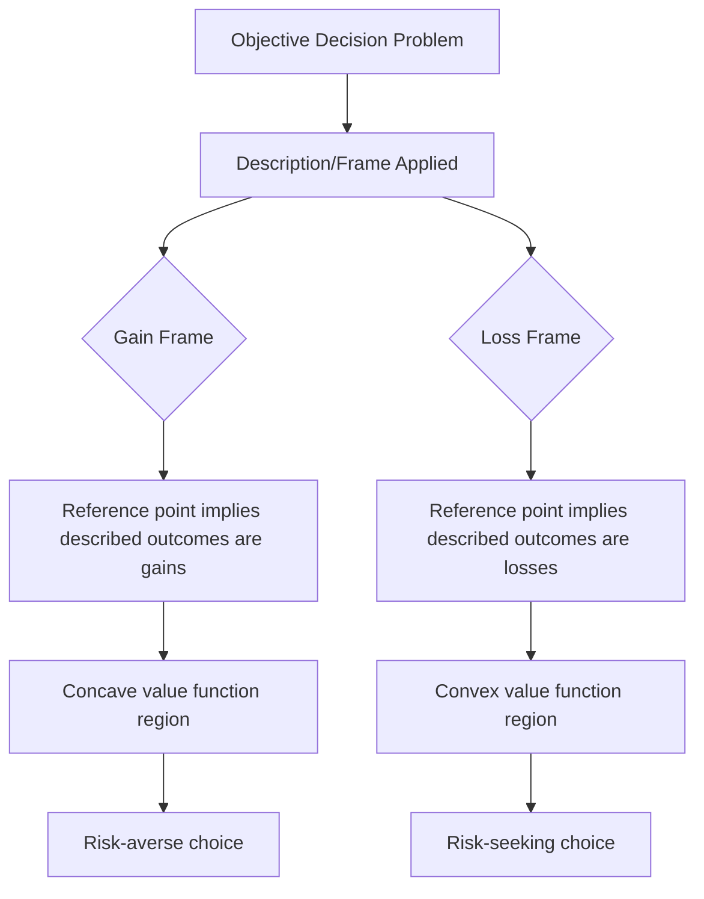

## Framing Effects

### Definition and Core Concept

Framing effects describe the phenomenon in which the way information, choices, or outcomes are described or presented — the "frame" — systematically influences judgments and decisions, even when the underlying substantive content, probabilities, and payoffs are logically and mathematically identical across frames. Framing effects were first systematically documented and analyzed by Amos Tversky and Daniel Kahneman, most influentially in their 1981 *Science* paper "The Framing of Decisions and the Psychology of Choice," and constitute one of the most robust and widely replicated violations of the **invariance axiom** (also called description invariance) that underlies rational choice theory and expected utility theory.

**Key Points**

- Framing effects violate the invariance/description-invariance assumption: rational choice theory requires that preferences depend only on the substance of options, not on how those options are described
- The most extensively studied form is the **gain/loss frame**, closely linked to loss aversion and prospect theory's reference-dependent value function
- Framing effects are highly robust across numerous domains: public health, finance, negotiation, marketing, and policy communication
- They provide some of the strongest evidence that decision-making departs systematically from the normative expected-utility benchmark

### The Invariance Axiom and Why Framing Violates It

Expected utility theory (and rational choice theory more broadly) requires that if two descriptions of a decision problem are logically equivalent — describable via a formal transformation showing they yield identical outcome distributions — a rational decision-maker's choice should not differ between them. This is the **invariance** or **description invariance** axiom.

$$\text{If } D_1 \equiv D_2 \text{ (logically equivalent)}, \text{ then } \text{Choice}(D_1) = \text{Choice}(D_2)$$

Framing effects directly violate this axiom: logically identical problems, differing only in surface presentation, produce systematically different choices. This is not merely noise or occasional inconsistency — the direction of the shift is highly predictable and replicable, which is what elevates framing from a curiosity to a systematic, modelable bias.

### The Asian Disease Problem: The Canonical Demonstration

Tversky and Kahneman's most famous illustration presented participants with a hypothetical disease outbreak expected to kill 600 people, and two policy options, framed in one of two logically equivalent ways:

**Positive (gain) frame:**

- Program A: 200 people will be saved for certain
- Program B: A 1/3 probability that 600 people will be saved, and a 2/3 probability that no people will be saved

**Negative (loss) frame:**

- Program C: 400 people will die for certain
- Program D: A 1/3 probability that nobody will die, and a 2/3 probability that 600 people will die

Programs A and C are logically identical (200 saved = 400 die, out of 600), as are B and D. Yet a substantial majority of participants chose the certain option (A) under the positive/gain frame, exhibiting risk-averse behavior, while a substantial majority chose the risky option (D) under the negative/loss frame, exhibiting risk-seeking behavior — a direct empirical demonstration of the **reflection effect** predicted by prospect theory's value function (concave for gains, convex for losses), triggered purely by a change in linguistic framing with no change in the underlying probabilities or outcomes.

**(svg_diagram)**

<svg xmlns="http://www.w3.org/2000/svg" viewBox="0 0 640 400">
<text x="320" y="24" font-size="16" font-weight="bold" text-anchor="middle" fill="#1a1a1a">Asian Disease Problem: Frame Reversal (svg_diagram)</text>
<rect x="40" y="60" width="260" height="140" rx="8" fill="#eafaf1" stroke="#27ae60" stroke-width="1.5" />
<text x="170" y="85" font-size="13" font-weight="bold" text-anchor="middle" fill="#1a1a1a">Positive (Gain) Frame</text>
<text x="170" y="110" font-size="11" text-anchor="middle" fill="#333">A: 200 saved for certain</text>
<text x="170" y="130" font-size="11" text-anchor="middle" fill="#333">B: 1/3 chance 600 saved</text>
<text x="170" y="155" font-size="12" font-weight="bold" text-anchor="middle" fill="#27ae60">Majority choose A (risk-averse)</text>
<rect x="340" y="60" width="260" height="140" rx="8" fill="#fadbd8" stroke="#c0392b" stroke-width="1.5" />
<text x="470" y="85" font-size="13" font-weight="bold" text-anchor="middle" fill="#1a1a1a">Negative (Loss) Frame</text>
<text x="470" y="110" font-size="11" text-anchor="middle" fill="#333">C: 400 die for certain</text>
<text x="470" y="130" font-size="11" text-anchor="middle" fill="#333">D: 1/3 chance nobody dies</text>
<text x="470" y="155" font-size="12" font-weight="bold" text-anchor="middle" fill="#c0392b">Majority choose D (risk-seeking)</text>
<line x1="300" y1="130" x2="340" y2="130" stroke="#333" stroke-width="1.5" stroke-dasharray="4,3" />
<text x="320" y="120" font-size="10" text-anchor="middle" fill="#333">Logically identical</text>
<text x="170" y="240" font-size="12" text-anchor="middle" fill="#555">Same 600-person outbreak, same probabilities and outcomes throughout</text>
<text x="170" y="260" font-size="12" text-anchor="middle" fill="#555">Only the description (saved vs. die) changes</text>
</svg>

### Taxonomy of Framing Effects

The framing literature, particularly as organized by Levin, Schneider, and Gaeth (1998), distinguishes several distinct subtypes of framing effect, since "framing" is not a single unified phenomenon but a family of related presentation-sensitivity effects:

| Type | Description | Example |
| --- | --- | --- |
| Risky-choice framing | Gain/loss framing of a choice between risky prospects (as in the Asian disease problem) | Medical treatment described as "90% survival" vs. "10% mortality" |
| Attribute framing | A single attribute of an object or event is described in positive or negative terms | Ground beef labeled "75% lean" vs. "25% fat" |
| Goal framing | The consequence of performing (or not performing) an action is framed as a gain or as the avoidance of a loss | "Perform self-exams to detect cancer early" vs. "Failing to perform self-exams may mean cancer is caught too late" |

**Key Points**

- **Risky-choice framing** most directly maps onto prospect theory's reflection effect and is the type most associated with the Kahneman-Tversky research program
- **Attribute framing** tends to produce more straightforward evaluative shifts (positive frames generally produce more favorable evaluations) without necessarily involving risk
- **Goal framing** is particularly influential in health communication and persuasion research, where loss-framed messages have often (though not universally) been found more effective for detection-oriented behaviors (e.g., cancer screening) and gain-framed messages more effective for prevention-oriented behaviors (e.g., sunscreen use), a distinction proposed in some subsequent research building on the original Levin, Schneider, and Gaeth taxonomy

### Formal Connection to Prospect Theory

Framing effects are the behavioral demonstration of the **reference point** concept central to prospect theory. A gain-framed description implicitly sets the reference point such that the described outcomes register as *gains* relative to a worse baseline (e.g., "saved" implies the reference point is "everyone dies," so any saved lives are gains); a loss-framed description sets the reference point such that outcomes register as *losses* relative to a better baseline (e.g., "die" implies the reference point is "everyone survives," so any deaths are losses).

$$v(\text{outcome} \mid \text{reference point}_{\text{gain frame}}) \neq v(\text{outcome} \mid \text{reference point}_{\text{loss frame}})$$

Because prospect theory's value function is concave for gains (risk-averse) and convex for losses (risk-seeking), the same objective prospect evaluated under different implied reference points predictably generates the observed reversal in risk attitude — framing effects are thus not an independent behavioral anomaly but a direct, testable consequence of reference-dependent evaluation.

### Applications Across Domains

| Domain | Framing Application | Typical Effect |
| --- | --- | --- |
| Public health messaging | Gain-framed vs. loss-framed appeals for screening, vaccination | Message effectiveness varies by behavior type (detection vs. prevention) |
| Consumer finance | "Save $X" vs. "Avoid losing $X" in savings program marketing | Loss-framed appeals can increase enrollment/participation in some studies |
| Retail pricing | "Cash discount" vs. "credit card surcharge" for economically identical price differences | Consumers react more negatively to surcharges (losses) than favorably to discounts (foregone gains) of equal size |
| Employee benefits/incentives | Framing a bonus as a default that can be lost for underperformance, vs. a reward for good performance | Loss-framed incentive structures can increase effort in some experimental and field settings |
| Political communication | Policy framed in terms of jobs "created" vs. jobs "not lost" | Differential public support despite similar substantive content |
| Energy/environmental policy | Framing energy-saving programs in terms of savings versus losses from inefficiency | Documented differences in program enrollment and behavior change |
| Medical decision-making | Treatment outcomes framed as "survival rate" vs. "mortality rate" | Physician and patient choices between treatments shown to shift with frame in controlled studies |

**Example**

A well-documented application in behavioral finance and retail concerns **price framing**: economically, a "\$5 discount for paying cash" and a "\$5 surcharge for paying by credit card" represent an identical \$5 price difference. However, framing the difference as a *surcharge* (a loss relative to a higher reference price) tends to generate more consumer resistance than framing the identical difference as a *discount* (a foregone gain relative to a lower reference price), consistent with loss aversion — losses are weighted more heavily than equivalent forgone gains. This framing distinction has been the subject of historical regulatory and industry disputes over credit card surcharge versus cash discount terminology in retail pricing.

### Framing and Policy Design (Nudges)

Because framing effects are robust and predictable, they have become a central tool in **choice architecture** and "nudge"-based policy design (Thaler and Sunstein), which seeks to influence behavior through the presentation of choices rather than through changes to the underlying incentives or options available.

- **Default framing**: Presenting an option as the default (requiring active opt-out to avoid) versus requiring active opt-in leverages framing/status-quo effects to shift participation rates, notably in retirement savings and organ donation policy
- **Opt-out organ donation systems** ("presumed consent") in many countries have been associated with substantially higher organ donor registration rates than opt-in systems, a finding widely (though not without some methodological debate) attributed to the interaction of framing and status quo bias
- **[Inference]** While the directional prediction that opt-out framing increases participation relative to opt-in framing is well-supported across many domains, the *magnitude* of the effect varies considerably by context, population, and the specific stakes involved, and should not be assumed to generalize uniformly to every policy application

### Common Misconceptions

- **Framing effects only matter for "irrational" or unsophisticated decision-makers.** Framing effects have been demonstrated even among experienced professionals, including physicians choosing between medical treatments and experienced financial decision-makers, indicating the effect is not simply a product of naivety or lack of expertise.
- **Any difference in wording that changes a decision is a "framing effect" in the formal sense.** The formal definition specifically requires that the underlying substantive content (probabilities, payoffs, logical structure) be held **strictly equivalent** across descriptions; if the wording change actually conveys new information (e.g., implying different probabilities), the resulting choice difference reflects genuine information transmission, not framing in the technical prospect-theory sense.
- **Loss-framed messaging is always more persuasive than gain-framed messaging.** The empirical evidence is domain-dependent — some research suggests the reverse for prevention-oriented (as opposed to detection-oriented) behaviors — and blanket claims about which frame is universally more effective are not well-supported.

### Related Topics

- Prospect theory and the value function's reflection effect
- Loss aversion and the endowment effect
- Reference-dependent preferences and reference point formation
- Nudge theory, default options, and choice architecture (Thaler and Sunstein)
- Mental accounting (Thaler)
- Heuristics and cognitive biases (Kahneman and Tversky's broader program)
- Behavioral public health communication strategy
- The invariance axiom and violations of rational choice theory