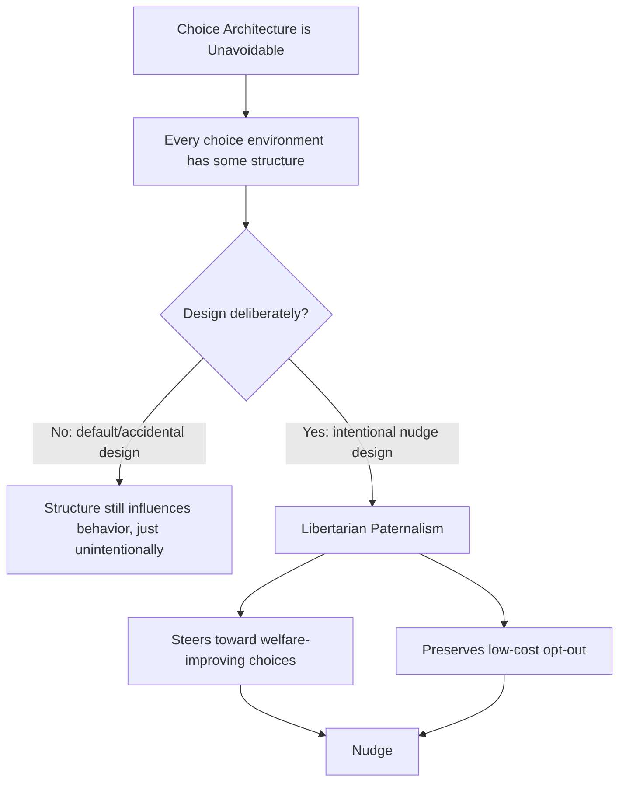
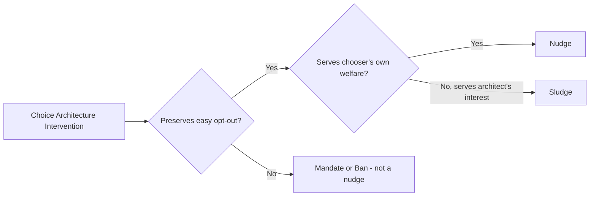

## Nudges and Choice Architecture

### Definition and Core Concept

Choice architecture refers to the design of the environment in which decisions are made — the organization, presentation, and structuring of choices that inevitably shapes the decisions people make, whether or not that design is deliberate. A **nudge** is any specific feature of choice architecture that alters people's behavior in a predictable way without forbidding any options or significantly changing their economic incentives. The concept was formalized by Richard Thaler and Cass Sunstein in their influential 2008 book *Nudge: Improving Decisions About Health, Wealth, and Happiness*, building directly on the behavioral economics foundations of bounded rationality, heuristics and biases, and prospect theory.

Thaler was awarded the 2017 Nobel Memorial Prize in Economic Sciences substantially for this and related work integrating psychologically realistic assumptions into economic analysis.

**Key Points**

- A nudge preserves freedom of choice — it does not ban, mandate, or significantly alter the economic payoffs of any option (this distinguishes it from a mandate, subsidy, or tax)
- Choice architecture is unavoidable — any environment presenting options necessarily has *some* structure, so the relevant question is whether that structure is designed deliberately and well, not whether to have one at all
- Nudges work specifically because human decision-making departs from full rationality (bounded rationality, present bias, status quo bias, framing sensitivity)
- The underlying philosophy is termed **libertarian paternalism**: paternalistic in that it steers people toward choices believed to improve their own welfare, libertarian in that it explicitly preserves the ability to choose otherwise

### Libertarian Paternalism: The Philosophical Foundation

Thaler and Sunstein's central philosophical argument is that, since choice architecture is unavoidable, the traditional debate between paternalism (restricting choice for people's own good) and libertarianism (never restricting choice) is a false dichotomy in any context where a default or presentation must be chosen regardless.

**Key Points**

- Libertarian paternalism holds that it is legitimate for choice architects (governments, firms, institutions) to attempt to influence behavior in directions that improve people's welfare, **as judged by themselves**, while preserving the right to opt out at low cost
- This is explicitly a middle position between traditional paternalism (which would restrict choice) and pure laissez-faire (which denies any role for intentional choice-environment design)
- The approach targets predictable, well-documented deviations from rational decision-making (e.g., present bias, inertia, limited attention) rather than assuming universal irrationality

### The Behavioral Foundations Nudges Exploit

Nudges derive their effectiveness specifically from documented, systematic departures from full rationality established elsewhere in behavioral economics:

| Behavioral Bias Exploited | Nudge Mechanism |
| --- | --- |
| Status quo bias / inertia | Default options (people tend to stick with whatever is pre-selected) |
| Present bias | Commitment devices, reminders, and structuring near-term incentives |
| Bounded rationality / limited attention | Simplification, salience, reducing the number of choices or steps |
| Loss aversion | Framing options in loss terms to increase compliance |
| Social proof / conformity | Providing information about others' behavior (social norm messaging) |
| Anchoring | Setting reference points (e.g., suggested donation amounts) |

Because nudges are specifically calibrated to these documented biases, their theoretical justification rests directly on the empirical robustness of the underlying behavioral phenomena (loss aversion, present bias, framing sensitivity, and so on) rather than on any independent behavioral mechanism of their own.

### Thaler and Sunstein's Core Nudge Categories

#### 1. Defaults

Setting a pre-selected option that takes effect unless the individual actively opts out. Because of status quo bias and the cognitive/effort cost of making an active choice, default options are followed by a substantial share of decision-makers even when opting out would be costless.

**Example**

Automatic enrollment in employer-sponsored retirement savings plans (with an opt-out provision) has been repeatedly found in empirical studies to produce substantially higher participation rates than economically identical opt-in plans, despite the fact that in both cases workers face the same choice set and the same low cost of switching — a direct demonstration of default-driven behavior change operating through inertia rather than through any change in financial incentives.

#### 2. Simplification

Reducing complexity in choice presentation — fewer options, clearer comparison formats, standardized disclosure — to counteract the cognitive burden that bounded rationality imposes on complex decisions.

#### 3. Increasing Ease and Convenience

Reducing the physical or procedural "friction" costs of taking a beneficial action (e.g., pre-filled forms, fewer required steps), since even small increases in effort can disproportionately suppress action given limited attention and self-control resources.

#### 4. Framing

Presenting logically identical information in ways calibrated to trigger a specific, predictable response, drawing directly on the gain/loss framing effects documented in prospect theory.

#### 5. Feedback

Providing timely, salient information about the consequences of past behavior (e.g., real-time energy usage displays, spending trackers), which can improve decision quality by making otherwise abstract or delayed consequences more immediately salient.

#### 6. Social Norms / Social Proof

Communicating information about what other people typically do, leveraging documented tendencies toward conformity and social comparison to shift behavior toward the communicated norm.

**Example**

Utility companies in several countries have implemented programs sending households a comparison of their energy usage relative to similar neighboring households ("Home Energy Reports"). Multiple field studies have found that this social-comparison framing alone, without any change in actual electricity prices, produces measurable reductions in energy consumption among above-average users — a direct application of the social-norm nudge category.

#### 7. Expect Error / Structuring Complex Choices

Designing systems that anticipate and forgive predictable human errors (e.g., allowing grace periods for late credit card payments, structuring pension enrollment via simplified "active choice" prompts rather than complex, error-prone forms).

### Formal Distinction: Nudges vs. Traditional Policy Tools

| Instrument | Mechanism | Changes Economic Incentives? | Removes/Restricts Options? |
| --- | --- | --- | --- |
| Nudge | Alters presentation/defaults in choice architecture | No | No |
| Subsidy/Tax | Alters relative prices | Yes | No |
| Mandate | Requires specific behavior by law | Not necessarily | Yes (removes non-compliant options) |
| Ban | Prohibits an option entirely | N/A | Yes |
| Information provision | Corrects informational gaps | No | No |

**Key Points**

- Information provision (mandatory disclosure, labeling) is sometimes classified as a nudge and sometimes treated as a distinct category, since it works partly by correcting genuine informational deficits (an information economics mechanism) rather than purely exploiting a behavioral bias
- The defining test Thaler and Sunstein propose for whether an intervention is a nudge: could an economically "rational," fully-informed agent with no self-control problems simply ignore it at negligible cost and be unaffected? If yes, and behavior nonetheless changes for typical agents, the intervention is functioning as a nudge

### The SLuMBER / Common Design Heuristics (Selected Frameworks)

Various practitioner frameworks have organized nudge design principles; one widely cited example (attributed to Thaler and Sunstein's later work and applied behavioral science practice) uses the mnemonic **SLuMBeR** or similar acronyms combining core levers:

- **iNcentives**: Are incentives aligned, or is there a hidden behavioral mismatch?
- **Understand mappings**: Do people understand how choices map to outcomes?
- **Defaults**: What happens if the individual does nothing?
- **Give feedback**: Are consequences of choices made salient?
- **Expect error**: Is the system forgiving of predictable mistakes?
- **Structure complex choices**: Are complex decisions simplified or broken into manageable steps?

**[Unverified]** Multiple overlapping mnemonic frameworks exist across different behavioral science practitioners and consultancies (e.g., "MINDSPACE" from the UK's Behavioural Insights Team, "EAST" — Easy, Attractive, Social, Timely), and there is no single canonical framework universally adopted across the field; the specific mnemonic used often reflects the particular institution or consultancy presenting it rather than a single unified academic standard.

### Applications by Domain

| Domain | Example Nudge | Behavioral Mechanism |
| --- | --- | --- |
| Retirement savings | Automatic enrollment; "Save More Tomorrow" escalation | Default bias, present bias/commitment |
| Organ donation | Opt-out (presumed consent) registration systems | Status quo bias |
| Public health | Placing healthier food at eye level in cafeterias | Salience, effort/friction reduction |
| Tax compliance | Reminder letters citing peer compliance rates | Social norms |
| Energy conservation | Home energy usage comparison reports | Social norms, feedback |
| Environmental policy | Green energy as the pre-selected default utility plan | Default bias |
| Consumer credit | Simplified, standardized loan disclosure formats | Simplification, reduced cognitive load |
| Government institutions | UK's Behavioural Insights Team ("Nudge Unit"), US Office of Evaluation Sciences | Institutionalized application across domains |

### Critiques and Limitations

Nudge-based policy has attracted substantial academic and philosophical debate:

- **Autonomy concerns**: Critics argue that nudges can manipulate rather than genuinely inform, potentially undermining individual autonomy even when technically preserving the freedom to opt out, since the very effectiveness of a nudge relies on exploiting a bias rather than persuading through reasoned argument
- **Transparency requirements**: Some scholars (including Thaler and Sunstein themselves in later writing) have argued nudges should satisfy a "publicity principle" — a nudge should be one the choice architect would be willing to defend publicly and transparently, to distinguish legitimate nudges from manipulative "sludge"
- **"Sludge"**: A term (popularized by Thaler) for nudge-like frictions deliberately designed to work *against* the individual's interest (e.g., deliberately complex cancellation procedures for subscriptions) — the mirror-image, welfare-reducing counterpart to a beneficial nudge, using the identical behavioral mechanisms (friction, defaults) for the opposite purpose
- **Effect size heterogeneity**: **[Inference]** Not all nudges produce the large effects reported in the most widely cited original studies; subsequent meta-analyses and large-scale replication efforts across many nudge interventions have generally found average effect sizes to be more modest than some of the earliest, most-publicized individual studies suggested, and effectiveness varies considerably by context, population, and specific implementation details
- **Paternalism objections**: Even granting that nudges preserve formal choice, critics from a more strict libertarian perspective argue that deliberately steering choices based on a policymaker's judgment of what is "good for" the individual remains objectionably paternalistic in substance, regardless of the formal preservation of opt-out rights

### Common Misconceptions

- **Any policy that changes behavior is a nudge.** Taxes, subsidies, mandates, and bans all change behavior but work through altered economic incentives or removed options, not through choice-architecture design exploiting behavioral biases — the defining feature of a nudge is the *absence* of significant incentive changes or option restriction.
- **Nudges are inherently benevolent.** The same behavioral mechanisms (defaults, friction, framing) can be deployed against an individual's interest, a pattern Thaler termed "sludge" — the ethical status of a given choice-architecture intervention depends on whose interest it serves, not on the mechanism itself.
- **Nudges work equally well in all contexts and populations.** Effect sizes are highly context-dependent, and the broader empirical replication record suggests meaningful heterogeneity in nudge effectiveness across settings, making generalized claims about nudge efficacy (in either direction) inappropriate without reference to the specific intervention and context.

### Related Topics

- Libertarian paternalism (Thaler and Sunstein)
- Status quo bias and default effects
- Present bias, time inconsistency, and commitment devices
- Prospect theory and framing effects
- "Sludge" and behaviorally-informed consumer protection policy
- Behavioral public economics and government "nudge units"
- Mental accounting (Thaler)
- Bounded rationality and satisficing (Herbert Simon)