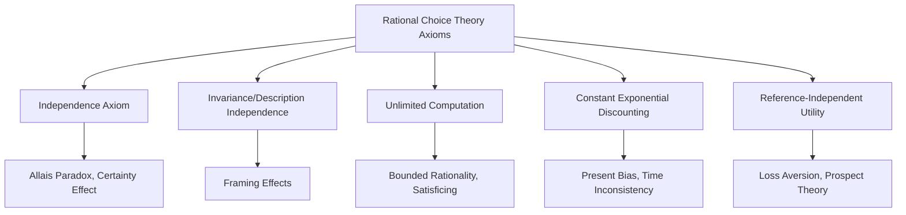
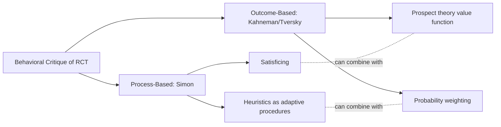

## Behavioral Critiques of Rational Choice Theory

### Definition and Core Concept

Rational choice theory (RCT) is the foundational framework of neoclassical economics, modeling individuals as agents who possess complete, consistent preferences and who choose the option that maximizes their expected utility subject to constraints, using all available information optimally. Behavioral critiques of rational choice theory comprise the cumulative body of theoretical and empirical work — largely originating in cognitive psychology and developed into economics primarily by Herbert Simon, Daniel Kahneman, and Amos Tversky — documenting systematic, predictable ways in which real human decision-making departs from this idealized model.

This entry synthesizes the critiques covered individually elsewhere in this chapter (bounded rationality, heuristics and biases, prospect theory, time inconsistency, framing effects) into a unified assessment of *which specific axioms and assumptions* of rational choice theory are challenged, and what alternative modeling frameworks have been proposed in response.

**Key Points**

- Behavioral economics does not reject the *usefulness* of rational choice models wholesale, but identifies specific, well-documented domains where their predictive accuracy fails
- Critiques target distinct components of the RCT framework: the axioms defining a "rational" preference ordering, the assumption of unlimited computational capacity, and the assumption of stable, context-independent preferences
- Each critique has generated a corresponding alternative model (bounded rationality → satisficing; biases → heuristics research; loss aversion → prospect theory; time inconsistency → quasi-hyperbolic discounting)
- The relationship between behavioral economics and rational choice theory is best understood as a *research program* extending and modifying the standard model, not a wholesale replacement of its optimization-based methodology

### The Core Axioms of Rational Choice Theory Under Challenge

Standard rational choice theory rests on a specific set of axioms governing preferences over uncertain outcomes (von Neumann–Morgenstern expected utility axioms) and a broader assumption of unbounded optimization capacity. Behavioral critiques map onto specific violations of these axioms:

| RCT Axiom/Assumption | Definition | Behavioral Critique | Key Evidence |
| --- | --- | --- | --- |
| Completeness | Agent can rank any two alternatives | Preference construction / context-dependence | Preferences appear to be partly *constructed* during the choice process rather than fully pre-existing |
| Transitivity | If A ≻ B and B ≻ C, then A ≻ C | Preference reversals | Documented reversals between choice and pricing tasks |
| Independence (von Neumann–Morgenstern) | Preferences over lotteries are unaffected by irrelevant common outcomes | Allais paradox, certainty effect | Systematic violations in gambles involving near-certain outcomes |
| Invariance/description invariance | Choice depends only on substance, not description | Framing effects | Asian disease problem and related demonstrations |
| Unlimited computational capacity | Agents can costlessly identify and evaluate the global optimum | Bounded rationality | Satisficing behavior; heuristic reliance |
| Stable, exponential time preference | Discount rate is constant across time horizons | Time inconsistency / present bias | Preference reversals in intertemporal choice |
| Reference-independence | Utility depends only on final wealth states | Loss aversion, endowment effect | Asymmetric valuation of gains vs. losses |
| Linear probability weighting | Probabilities enter utility calculations at face value | Probability weighting (prospect theory) | Overweighting of small probabilities, underweighting of large ones |

### The Allais Paradox: An Early and Influential Challenge

Before Kahneman and Tversky's systematic program, Maurice Allais (1953) presented a specific pair of choice problems demonstrating violation of the **independence axiom** underlying expected utility theory, predating and partly motivating the later behavioral program.

**Setup**: Participants choose between pairs of lotteries:

- **Choice 1**: Option A (\$1 million with certainty) vs. Option B (\$5 million with probability 0.10, \$1 million with probability 0.89, \$0 with probability 0.01)
- **Choice 2**: Option C (\$1 million with probability 0.11, \$0 with probability 0.89) vs. Option D (\$5 million with probability 0.10, \$0 with probability 0.90)

A majority of respondents typically choose A over B (preferring the certain \$1 million), but also choose D over C (preferring the higher expected value gamble) — this combination violates the independence axiom of expected utility theory, since the two problems differ only by a common outcome shared across both options in each pair (an 0.89 probability of \$1 million in Choice 1 versus an 0.89 probability of \$0 in Choice 2), which should not affect the ranking under expected utility theory if independence holds. The pattern reflects what is now called the **certainty effect** — a disproportionate psychological preference for certain outcomes relative to merely probable ones — later incorporated directly into prospect theory's probability weighting function.

### Preference Reversals: Challenging Even Transitivity and Procedure-Invariance

Lichtenstein and Slovic (1971) documented a further challenge distinct from, but related to, the Allais-type violations: **preference reversals** between two different methods of eliciting the *same* underlying preference. Participants were shown pairs of lotteries — a "P-bet" (high probability of a modest win) and a "\$-bet" (low probability of a large win) — and asked both to (a) choose which they preferred, and (b) state the minimum price at which they would sell each lottery.

**Key finding**: A substantial share of participants who *chose* the P-bet over the $-bet nonetheless assigned a *higher selling price* to the $-bet — a direct contradiction, since a rational agent's stated selling price should be monotonically related to their preference ranking (the more preferred option should command the higher price). This finding challenges the RCT assumption of **procedure invariance**: that an agent's underlying preference ordering should be independent of the specific elicitation method used to reveal it.

### The Two Central Alternative Frameworks

The cumulative behavioral critique has produced two broad, complementary classes of alternative models:

#### 1. Process-Based Alternatives (Bounded Rationality Tradition)

Rather than positing a different *outcome* of the optimization process, these models (originating with Herbert Simon) reject the premise that agents perform global optimization at all, proposing instead that agents follow adaptive, resource-economizing **procedures** (satisficing, heuristics) that may or may not closely approximate the optimum depending on context.

#### 2. Outcome-Based Alternatives (Prospect Theory Tradition)

Rather than rejecting optimization as the underlying process, these models (Kahneman and Tversky) retain an optimization-like structure but replace the *objective function itself* — substituting the value function (with reference-dependence, loss aversion, and diminishing sensitivity) and probability weighting function for the standard expected utility function, while still assuming the agent chooses the option that maximizes this modified objective.

**[Inference]** These two traditions are not mutually exclusive and are often integrated in applied behavioral economics research; a given paper may model an agent as using a heuristic-driven or boundedly rational search process to *arrive at* a choice set, while separately evaluating chosen prospects via a prospect-theory-style value function. The degree of integration versus separate application varies considerably across the applied literature.

### Methodological Responses from Defenders of Rational Choice Theory

The behavioral critique has not gone unanswered; several methodological defenses and qualifications have been raised within economics:

- **"As-if" rationality**: Milton Friedman's classic methodological argument (1953) holds that a model's realism of assumptions is less important than the accuracy of its *predictions*; RCT could remain a useful predictive tool even if individual decision processes do not literally match its assumptions, provided aggregate market outcomes are well-predicted (e.g., via market selection pressures eliminating persistently suboptimal behavior)
- **Market discipline and learning**: Some economists argue that repeated experience, competition, and arbitrage in real markets (as opposed to one-shot laboratory experiments) may substantially attenuate individual-level biases at the aggregate market level, though **[Inference]** the extent to which market forces reliably eliminate behavioral anomalies is itself contested and varies by market structure — some anomalies (e.g., certain asset-pricing puzzles) have proven persistent even in markets with substantial professional participation and arbitrage opportunity
- **Ecological rationality**: Gigerenzer and colleagues have argued that many "biases" documented in artificial laboratory tasks are in fact well-adapted responses to the statistical structure of natural environments, and that the normative benchmark used to define a "bias" (often an idealized, computationally unconstrained standard) may itself be inappropriate for judging heuristic performance in realistic, resource-constrained settings
- **External validity concerns**: Some critics of the behavioral program have raised questions about the generalizability of specific laboratory findings (often based on small samples, low stakes, and artificial decision tasks) to real-world, high-stakes economic decisions — a concern behavioral economists have addressed through an expanding body of field experiments and natural-experiment evidence, though debate over the relative weight of lab versus field evidence continues

### Areas of Convergence: Behavioral Economics as an Extension, Not a Replacement

**Key Points**

- Modern behavioral economics generally does not propose abandoning optimization-based modeling; it proposes modifying the *objective function* or *constraint set* to better reflect documented human psychology, while retaining the broader methodological toolkit of formal, mathematical economic modeling
- Prospect theory itself is structured as a maximization problem — it is a *modification* of the utility-maximization framework (via reference-dependence and probability weighting), not an abandonment of optimization as an analytical device
- Many behavioral models nest the standard rational choice model as a special case (e.g., quasi-hyperbolic discounting collapses to exponential discounting when $\beta=1$; prospect theory's value function collapses toward standard expected utility under specific parameter restrictions), which allows behavioral economics to be understood as a strict generalization rather than a wholesale rejection of the standard framework

### Applications: Where the Critique Has Reshaped Economic Practice

| Field | Behavioral Modification to Standard RCT Model | Resulting Policy/Practice Change |
| --- | --- | --- |
| Public finance | Present bias replacing exponential discounting | Automatic-enrollment retirement savings defaults |
| Finance | Loss aversion, overconfidence, limited attention | Behavioral asset pricing models; disclosure regulation design |
| Labor economics | Reference-dependent effort/reciprocity | Contract and compensation design incorporating fairness norms |
| Health economics | Present bias, framing sensitivity | Health messaging design; commitment-based intervention programs |
| Industrial organization | Bounded rationality, framing in consumer search | Consumer protection regulation (disclosure format standards) |
| Development economics | Present bias, limited attention, poverty-related cognitive load | Behaviorally-informed savings and health-uptake interventions |

### Common Misconceptions

- **Behavioral economics claims humans are irrational and RCT is entirely wrong.** The mainstream behavioral program does not reject the value of rational-choice modeling broadly; it identifies specific, well-documented, and systematic domains of departure, and typically proposes modified (not abandoned) optimization frameworks.
- **All departures from RCT documented in laboratory experiments straightforwardly generalize to all real-world high-stakes decisions.** External validity is a genuine and actively debated methodological concern; the size and even the direction of some effects can differ between low-stakes lab settings and high-stakes, repeated, or professionally-mediated real-world decisions.
- **The behavioral critique is a recent development with no roots in mainstream economic thought.** Herbert Simon's foundational work on bounded rationality dates to the 1950s, and Maurice Allais's independence-axiom challenge dates to 1953 — the behavioral critique has a substantial multi-decade history predating its more recent mainstream integration into applied economics.

### Related Topics

- Bounded rationality and satisficing (Herbert Simon)
- Heuristics and cognitive biases (Kahneman and Tversky)
- Prospect theory and loss aversion
- Time inconsistency and present bias
- Framing effects
- The Allais paradox and independence axiom violations
- Ecological rationality (Gigerenzer) as a qualified defense of heuristic decision-making
- "As-if" rationality and Friedman's methodological instrumentalism