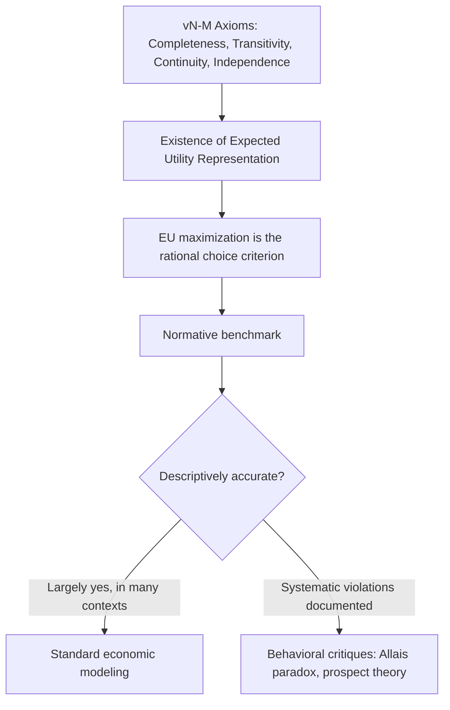

## Expected Value and Expected Utility

### Definition and Core Concept

Expected value (EV) and expected utility (EU) are the two foundational decision criteria for evaluating choices under risk — situations in which outcomes are uncertain but their probabilities are known (as distinguished from *uncertainty* in the Knightian sense, where even probabilities are unknown). Expected value evaluates a risky prospect by the probability-weighted average of its monetary or physical outcomes; expected utility evaluates it by the probability-weighted average of the *utility* derived from those outcomes, allowing the framework to account for risk preferences that pure expected-value maximization cannot capture.

The distinction between the two — and the reasons expected utility theory largely superseded raw expected-value maximization as the standard normative model — traces back to the **St. Petersburg Paradox**, first analyzed by Daniel Bernoulli in 1738.

**Key Points**

- Expected value is a purely statistical concept: the probability-weighted sum of outcomes, expressed in the same units as the outcomes themselves
- Expected utility introduces a **utility function** that transforms outcomes before weighting, allowing the model to capture attitudes toward risk
- Expected utility theory (EUT), formalized axiomatically by von Neumann and Morgenstern (1944), is the standard normative benchmark against which both traditional decision theory and behavioral economics (prospect theory, etc.) are compared
- The curvature of the utility function determines whether an agent is risk-averse, risk-neutral, or risk-seeking

### Expected Value: Formal Definition

For a discrete random variable $X$ with possible outcomes $x_1, x_2, \ldots, x_n$ occurring with probabilities $p_1, p_2, \ldots, p_n$ (where $\sum_i p_i = 1$), the expected value is:

$$E[X] = \sum_{i=1}^{n} p_i x_i$$

For a continuous random variable with probability density function $f(x)$:

$$E[X] = \int_{-\infty}^{\infty} x f(x) \, dx$$

**Expected value maximization** as a decision criterion states that a rational agent should choose the option (lottery, gamble, or risky prospect) with the highest expected value, regardless of the variance or distributional shape of outcomes around that expected value.

**Example**

Consider a gamble offering a 50% chance of winning \$100 and a 50% chance of winning \$0. Its expected value is $E[X] = 0.5(100) + 0.5(0) = \$50$. Under pure expected-value maximization, an agent should be exactly indifferent between accepting this gamble and receiving a certain \$50, since both have identical expected value — a prediction that empirical behavior overwhelmingly contradicts, since most individuals strictly prefer the certain \$50 (a risk-averse preference).

### The St. Petersburg Paradox: Why Expected Value Fails as a Decision Criterion

Daniel Bernoulli's 1738 analysis of a gambling problem posed by his cousin Nicolas Bernoulli demonstrated a fundamental flaw in expected-value maximization as a normative decision rule.

**The game**: A fair coin is flipped repeatedly until it lands tails. If tails first appears on flip $n$, the player receives a payout of $2^n$ ducats. The expected value of this game is:

$$E[X] = \sum_{n=1}^{\infty} \left(\frac{1}{2}\right)^n \cdot 2^n = \sum_{n=1}^{\infty} 1 = \infty$$

The expected value of the game is **infinite**, meaning pure expected-value maximization implies a rational agent should be willing to pay *any* finite amount of money, however large, to play this game once. Empirically and intuitively, however, virtually no one is willing to pay more than a modest, finite amount to play — a stark contradiction between the theoretical prediction of expected-value maximization and observed (and, Bernoulli argued, entirely sensible) behavior.

**Bernoulli's resolution**: Bernoulli proposed that individuals do not value monetary outcomes linearly, but instead experience **diminishing marginal utility of wealth** — each additional unit of money contributes progressively less to well-being as wealth increases. He proposed a logarithmic utility function, $u(x) = \ln(x)$, under which the *expected utility* of the St. Petersburg game (rather than its expected monetary value) converges to a finite value, resolving the paradox and yielding a plausible, finite willingness to pay.

$$E[u(X)] = \sum_{n=1}^{\infty} \left(\frac{1}{2}\right)^n \ln(2^n) = \sum_{n=1}^{\infty} \frac{n \ln 2}{2^n} = \ln 2 \sum_{n=1}^{\infty} \frac{n}{2^n} = 2\ln 2 \approx 1.386$$

This converges to a finite value, in sharp contrast to the divergent expected monetary value, illustrating precisely how introducing a concave utility function resolves the paradox.

**(svg_diagram)**

<svg xmlns="http://www.w3.org/2000/svg" viewBox="0 0 640 380">
<text x="320" y="24" font-size="16" font-weight="bold" text-anchor="middle" fill="#1a1a1a">Concave Utility Resolves the St. Petersburg Paradox (svg_diagram)</text>
<line x1="70" y1="330" x2="580" y2="330" stroke="#333" stroke-width="1.5" />
<line x1="70" y1="330" x2="70" y2="60" stroke="#333" stroke-width="1.5" />
<text x="580" y="352" font-size="13" text-anchor="end" fill="#333">Wealth / Payout (x)</text>
<text x="45" y="55" font-size="12" text-anchor="middle" fill="#333">u(x)</text>
<path d="M 90 320 C 200 200, 350 120, 560 80" stroke="#2980b9" stroke-width="2.5" fill="none" />
<text x="280" y="140" font-size="12" fill="#2980b9">u(x) = ln(x): concave, diminishing marginal utility</text>
<line x1="70" y1="330" x2="560" y2="80" stroke="#c0392b" stroke-width="1.5" stroke-dasharray="4,3" />
<text x="380" y="220" font-size="12" fill="#c0392b">Linear u(x) = x: constant marginal utility</text>
<text x="100" y="370" font-size="11" fill="#555">Same infinite-EV payouts translate to a finite, bounded sum under concave utility</text>
</svg>

### Expected Utility Theory: Formal Framework

Expected utility theory evaluates a risky prospect (lottery) $L = (x_1, p_1; x_2, p_2; \ldots; x_n, p_n)$ using a **utility function** $u(\cdot)$ applied to each outcome before probability-weighting:

$$EU(L) = \sum_{i=1}^{n} p_i \, u(x_i)$$

A rational agent, under this framework, chooses the lottery that maximizes $EU(L)$ — the *expected value of utility*, not the *utility of the expected value*. These are generally not equal:

$$E[u(X)] \neq u(E[X]) \quad \text{(in general, when } u \text{ is nonlinear)}$$

This inequality relationship is formalized by **Jensen's Inequality**:

- If $u(\cdot)$ is concave: $E[u(X)] \leq u(E[X])$ — risk aversion
- If $u(\cdot)$ is linear: $E[u(X)] = u(E[X])$ — risk neutrality
- If $u(\cdot)$ is convex: $E[u(X)] \geq u(E[X])$ — risk-seeking

### The von Neumann–Morgenstern Axioms

John von Neumann and Oskar Morgenstern (1944) provided the axiomatic foundation showing that if a decision-maker's preferences over lotteries satisfy a specific set of rationality axioms, those preferences can be represented by an expected utility function. The core axioms are:

| Axiom | Description |
| --- | --- |
| Completeness | For any two lotteries, the agent can state a preference or indifference between them |
| Transitivity | If $L_1 \succeq L_2$ and $L_2 \succeq L_3$, then $L_1 \succeq L_3$ |
| Continuity | If $L_1 \succeq L_2 \succeq L_3$, there exists a probability $p$ such that the agent is indifferent between $L_2$ and a mixture $pL_1 + (1-p)L_3$ |
| Independence | If $L_1 \succeq L_2$, then for any lottery $L_3$ and probability $p$: $pL_1 + (1-p)L_3 \succeq pL_2 + (1-p)L_3$ |

**Key Points**

- These axioms jointly imply the existence of a utility function $u(\cdot)$, unique up to a positive affine transformation (i.e., $u$ and $a + bu$ for $b>0$ represent identical preferences), such that lotteries can be ranked by their expected utility
- The **independence axiom** is the most behaviorally contentious and is the specific axiom violated by the Allais paradox, discussed extensively in behavioral critiques of rational choice theory
- Expected utility theory is a **normative** theory (a benchmark for rational choice under the stated axioms), which is analytically separable from the question of whether it is also **descriptively** accurate — the latter question motivated the development of prospect theory

### Risk Attitudes and Utility Function Curvature

The shape (curvature) of the utility function determines the decision-maker's attitude toward risk, formalized via the **Arrow-Pratt measures of risk aversion**.

| Risk Attitude | Utility Function Shape | Certainty Equivalent vs. Expected Value |
| --- | --- | --- |
| Risk-averse | Concave ($u'' < 0$) | Certainty equivalent < Expected value |
| Risk-neutral | Linear ($u'' = 0$) | Certainty equivalent = Expected value |
| Risk-seeking | Convex ($u'' > 0$) | Certainty equivalent > Expected value |

#### Arrow-Pratt Measures

**Absolute risk aversion (ARA)**:

$$A(x) = -\frac{u''(x)}{u'(x)}$$

**Relative risk aversion (RRA)**:

$$R(x) = -\frac{x \, u''(x)}{u'(x)}$$

These measures quantify the intensity of risk aversion at a given wealth level $x$ and are used to classify commonly assumed utility function families:

| Utility Function | Form | Risk Aversion Property |
| --- | --- | --- |
| CARA (Constant Absolute Risk Aversion) | $u(x) = -e^{-\alpha x}$ | $A(x) = \alpha$, constant regardless of wealth |
| CRRA (Constant Relative Risk Aversion) | $u(x) = \frac{x^{1-\gamma}}{1-\gamma}$ | $R(x) = \gamma$, constant regardless of wealth |
| Logarithmic (Bernoulli's original) | $u(x) = \ln(x)$ | Special case of CRRA with $\gamma = 1$ |
| Quadratic | $u(x) = x - bx^2$ | Exhibits *increasing* absolute risk aversion, an empirically less favored property |

**[Inference]** CARA and CRRA utility functions are widely used in applied economic modeling largely because of their analytical tractability (e.g., producing closed-form portfolio choice solutions), not necessarily because either functional form has been established as the single most empirically accurate representation of real individual risk preferences across all contexts; empirical estimates of relevant risk aversion parameters vary considerably across studies, populations, and elicitation methods.

### Risk Premium and Certainty Equivalent

Two related concepts formalize the cost of risk to a risk-averse agent:

- **Certainty equivalent (CE)**: The certain (risk-free) amount that provides the same utility as a given risky prospect: $u(CE) = E[u(X)]$
- **Risk premium (RP)**: The difference between the expected value of the risky prospect and its certainty equivalent: $RP = E[X] - CE$

A risk-averse agent's risk premium is strictly positive, representing the amount they would be willing to sacrifice, on average, to eliminate risk entirely and receive a certain payment instead.

**Example**

Consider a risk-averse agent with utility $u(x) = \sqrt{x}$ facing a gamble with a 50% chance of \$0 and a 50% chance of \$100. The expected value is $E[X] = \$50$. The expected utility is $E[u(X)] = 0.5\sqrt{0} + 0.5\sqrt{100} = 5$. The certainty equivalent solves $\sqrt{CE} = 5$, giving $CE = \$25$. The risk premium is therefore $RP = \$50 - \$25 = \$25$ — this agent would accept as little as \$25 for certain rather than face the 50/50 gamble with an expected value of \$50, illustrating substantial risk aversion under a concave (square-root) utility function.

### Applications of the Expected Utility Framework

| Domain | Application |
| --- | --- |
| Insurance economics | Deriving optimal insurance demand and the maximum premium a risk-averse individual will pay |
| Portfolio theory | Optimal asset allocation under risk aversion (mean-variance analysis, CAPM foundations) |
| Contract theory | Optimal risk-sharing between risk-averse agents and risk-neutral principals (moral hazard, principal-agent models) |
| Auction theory | Bidder behavior under risk aversion in various auction formats |
| Public economics | Cost-benefit analysis and valuation of uncertain public projects |
| Game theory | Payoff specification in games with stochastic outcomes |

### Limitations of Expected Utility Theory and the Behavioral Response

While EUT remains the dominant normative and widely used descriptive framework in mainstream economics, it has documented empirical shortcomings that motivated alternative models:

- **The Allais paradox** demonstrates systematic violation of the independence axiom
- **Prospect theory** was developed specifically to accommodate empirical patterns (loss aversion, the reflection effect, probability weighting) that EUT with a conventional concave utility function over final wealth cannot easily explain
- **[Inference]** Despite these documented departures, EUT remains widely used as a tractable working benchmark throughout mainstream economics, partly due to its axiomatic rigor and analytical convenience, and partly because many of its predictions perform adequately for a substantial range of practical applications, even where it is not the most descriptively precise model available for every specific behavioral phenomenon

### Common Misconceptions

- **Expected value and expected utility are interchangeable terms.** They are distinct: expected value operates directly on outcome magnitudes; expected utility operates on the *utility* derived from those outcomes, and the two coincide only under the special case of a linear (risk-neutral) utility function.
- **A risk-averse agent will never accept any gamble with positive expected value close to zero cost.** Risk aversion describes a general *tendency*, not an absolute rule against all risk-taking; a sufficiently risk-averse agent may still accept small, low-stakes gambles, particularly when the relative stakes are small compared to their overall wealth (a pattern related to the debate over the plausibility of expected-utility-implied risk aversion at small stakes, discussed extensively in the "calibration critique" literature).
- **Expected utility theory assumes people consciously calculate integrals and probability-weighted sums.** EUT is typically presented as an "as-if" model: it claims that observed choices are consistent with such a calculation, not that decision-makers literally perform this arithmetic consciously.

### Related Topics

- Risk aversion, risk neutrality, and risk-seeking behavior
- Arrow-Pratt measures of absolute and relative risk aversion
- The Allais paradox and violations of the independence axiom
- Prospect theory and loss aversion
- Insurance demand and optimal risk-sharing
- Mean-variance portfolio theory
- The calibration critique of expected utility theory at small stakes (Rabin, 2000)
- Knightian uncertainty and ambiguity aversion (contrasted with risk)