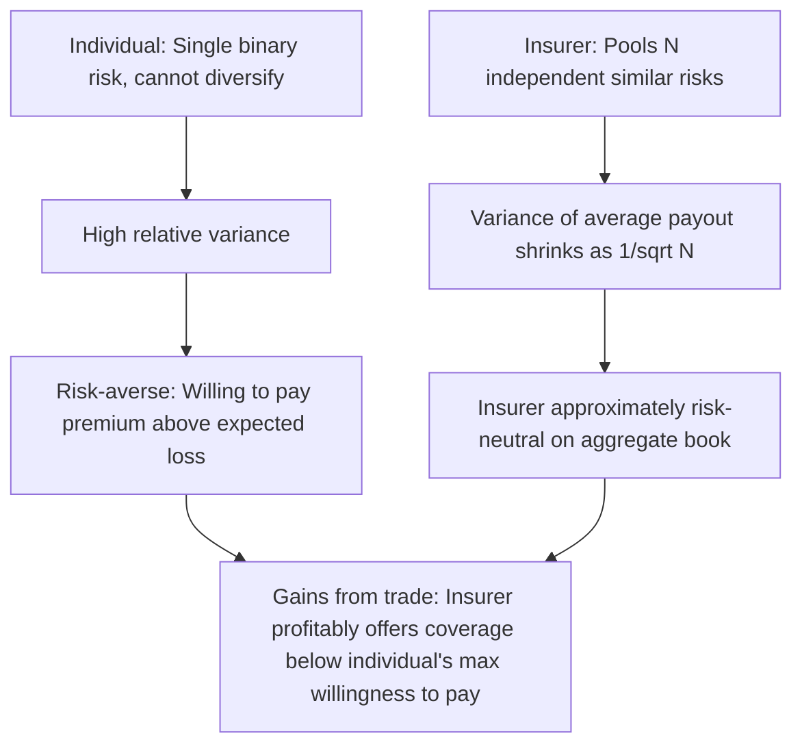
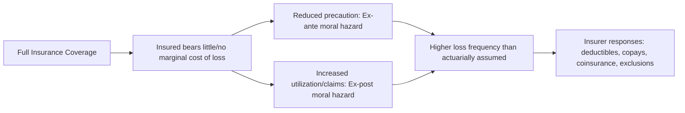

## Insurance Markets

### Definition and Core Concept

Insurance markets are economic mechanisms through which risk is transferred from risk-averse individuals or firms facing uncertain losses to insurers who pool many such risks together, exploiting the statistical properties of risk-pooling (the law of large numbers) to offer coverage at a premium the insured is willing to pay in excess of their expected loss. Insurance markets represent one of the clearest applied intersections of expected utility theory, risk aversion, and information economics (adverse selection and moral hazard), since virtually all of the theoretical machinery developed elsewhere in this course — signaling, screening, expected utility, risk aversion — finds its most direct and empirically studied application in this single market context.

**Key Points**

- Insurance exists because risk-averse individuals are willing to pay a premium exceeding their expected loss to eliminate uncertainty (a positive risk premium, as formalized in expected utility theory)
- Insurers can profitably offer coverage below what individuals would be willing to pay because pooling many independent risks reduces the insurer's *relative* variance (via the law of large numbers), even while aggregate expected payouts remain the same
- Insurance markets are a canonical setting for the two central information economics frictions: **adverse selection** (hidden information about risk type before contracting) and **moral hazard** (hidden action affecting risk after contracting)
- Real-world insurance market design (deductibles, copays, exclusions, underwriting) reflects deliberate responses to both frictions

### The Economic Rationale for Insurance: Risk Pooling

#### Individual Demand Side

A risk-averse individual with utility function $u(\cdot)$ facing a potential loss $D$ with probability $p$ has expected utility (absent insurance):

$$EU_{\text{no insurance}} = (1-p) \, u(W) + p \, u(W - D)$$

where $W$ is initial wealth. Given concave utility, this individual has a positive risk premium and is willing to pay an actuarially *unfair* premium (exceeding the expected loss $pD$) for full insurance, up to the point where:

$$u(W - \pi) = (1-p)u(W) + p\,u(W-D)$$

where $\pi$ is the maximum premium the individual would accept, satisfying $\pi > pD$ (strictly exceeding the actuarially fair premium) whenever the individual is strictly risk-averse.

#### Insurer Supply Side: The Law of Large Numbers

An individual insurer covering $N$ statistically independent policyholders, each facing the same loss probability $p$ and loss magnitude $D$, has total payouts with mean $NpD$ and a coefficient of variation (standard deviation relative to the mean) that **shrinks proportionally to $\frac{1}{\sqrt{N}}$** as $N$ grows large. This is the direct consequence of the law of large numbers applied to a pool of independent risks.

$$\text{Std. Dev. of average payout} = \frac{\sigma}{\sqrt{N}} \to 0 \text{ as } N \to \infty$$

This means a large insurer, by pooling many independent policies, can predict its *aggregate* payout with far greater relative precision than any individual can predict their own single, binary loss outcome — allowing the insurer to behave as approximately risk-neutral with respect to its aggregate book of business, even though each individual policyholder is risk-averse with respect to their own single, undiversifiable risk.

**Key Points**

- Risk pooling works specifically because losses across policyholders are (assumed to be) **independent or only weakly correlated** — if losses are highly correlated across the pool (a **systemic** or **catastrophic** risk, such as a hurricane affecting an entire region simultaneously), pooling provides little to no diversification benefit, since the law of large numbers requires approximate independence to reduce relative variance
- This distinction between **idiosyncratic** (diversifiable, poolable) and **systemic** (non-diversifiable, non-poolable) risk is central to understanding both the feasibility and the pricing of different insurance products (e.g., why flood and earthquake insurance in high-risk zones is priced very differently, and sometimes withdrawn entirely, compared to more idiosyncratic risks like individual auto accidents)

### Actuarially Fair vs. Actuarially Unfair Premiums

| Term | Definition | Formula |
| --- | --- | --- |
| Actuarially fair premium | Premium exactly equal to expected loss | $\pi = pD$ |
| Actuarially unfair (loaded) premium | Premium exceeding expected loss, reflecting insurer costs and profit margin | $\pi = pD + \text{loading}$ |

In perfectly competitive insurance markets with zero administrative costs and zero profit, premiums would converge to the actuarially fair level. In practice, real-world premiums include a **loading factor** covering administrative costs, adverse selection risk, capital costs, and profit margin — meaning insurance in practice is typically actuarially unfair from the buyer's perspective, yet still rationally purchased by sufficiently risk-averse individuals, since their willingness to pay (their personal risk premium) can exceed even this loaded premium.

### The Two Central Information Frictions in Insurance

#### 1. Adverse Selection

Adverse selection in insurance arises because individuals typically know more about their own risk type (health status, driving habits, occupational hazards) than insurers can observe. This is a direct application of Akerlof's Market for Lemons logic to the insurance context, and the theoretical mechanism for addressing it (screening via contract menus) is formalized in the Rothschild–Stiglitz model.

**Key Points**

- If insurers cannot distinguish high-risk from low-risk applicants and must charge a single pooled premium, low-risk individuals may find the pooled premium unattractive relative to their true (low) risk, and exit the market
- This exit raises the average risk of the remaining pool, potentially triggering further premium increases and further exit of the next-lowest-risk group — the same unraveling dynamic as the general Market for Lemons framework
- The standard market response is **screening**: insurers offer a menu of contracts (e.g., varying deductibles and premiums) designed so that different risk types self-select into different contracts, as formalized in the Rothschild–Stiglitz separating equilibrium
- Additional real-world responses include **medical underwriting**, **experience rating**, and mandated **risk pools** or **community rating** regulations that constrain how much premiums can vary by observable risk factors

**Example**

In health insurance markets prior to the introduction of guaranteed-issue and community-rating regulations in many jurisdictions, insurers commonly used medical underwriting to deny coverage or charge substantially higher premiums to individuals with pre-existing conditions — a direct market response to the adverse selection problem, since without such screening, insurers offering a single community-rated premium would attract disproportionately high-risk applicants (a classic adverse selection death spiral).

#### 2. Moral Hazard

Moral hazard in insurance refers to the change in an insured individual's *behavior* — typically toward less risk-averse or less precautionary behavior — that occurs specifically *because* they are insured and therefore no longer bear the full cost of a loss. This is a hidden-action problem, directly connecting to the general principal-agent/moral hazard framework, with the insurer as principal and the insured as agent.

**Key Points**

- **Ex-ante moral hazard**: reduced precaution-taking *before* a loss occurs (e.g., a fully-insured driver taking less care to avoid accidents, or a fully-insured homeowner installing fewer fire-prevention measures)
- **Ex-post moral hazard**: increased utilization or exaggerated claims *after* an insured event has occurred (e.g., over-utilization of medical services once health insurance covers most of the marginal cost, since insured patients face a marginal price for care well below the true resource cost)
- Both forms represent an externality the insured imposes on the insurer (and, in the case of premium adjustments, on the broader risk pool) that is not internalized under full insurance coverage

### Contract Design Responses to Moral Hazard

Real-world insurance contracts are deliberately structured to mitigate moral hazard by ensuring the insured retains **some** exposure to loss, even while transferring the bulk of the risk:

| Mechanism | Description | Effect on Moral Hazard |
| --- | --- | --- |
| Deductible | Insured pays the first $D$ of any loss out of pocket | Preserves incentive to avoid small/moderate losses entirely |
| Coinsurance | Insured pays a fixed percentage of the loss (e.g., 20%) regardless of loss size | Preserves marginal incentive across the entire loss distribution |
| Copayment | Insured pays a fixed fee per claim or service (common in health insurance) | Discourages low-value utilization without fully exposing the insured to catastrophic cost |
| Coverage limits/caps | Maximum payout per claim or per period | Limits insurer exposure to extreme ex-post moral hazard or fraud |
| Experience rating | Future premiums adjusted based on the individual's claims history | Creates a dynamic (multi-period) incentive to avoid claims, since claiming raises future premiums |
| Exclusions | Specific causes of loss or pre-existing conditions excluded from coverage | Limits coverage of risks most susceptible to adverse selection or moral hazard |

**[Inference]** All of these mechanisms represent a fundamental trade-off, mirroring the general principal-agent risk-incentive trade-off: greater risk retention by the insured (higher deductibles, higher coinsurance rates) reduces moral hazard but also reduces the risk-transfer benefit that is insurance's core value proposition to a risk-averse individual — optimal contract design in the theoretical literature (e.g., extensions of the Holmström linear-contract framework to insurance) generally involves setting this exposure at a level that balances the marginal reduction in moral hazard against the marginal cost of remaining uninsured risk, though the specific optimal level is highly sensitive to the elasticity of the insured behavior with respect to coverage generosity, which varies substantially by insurance line and context.

### Insurance Market Structures and Regulation

| Feature | Description | Economic Rationale |
| --- | --- | --- |
| Community rating | All policyholders in a group pay the same premium regardless of individual risk factors | Addresses adverse selection concerns and equity objectives, but can itself induce adverse selection if not paired with mandated participation |
| Guaranteed issue | Insurers cannot deny coverage based on pre-existing risk factors | Ensures access, but exacerbates adverse selection absent an accompanying mandate or penalty for non-enrollment |
| Individual mandates | Legal requirement to purchase insurance (or penalty for non-purchase) | Directly counters adverse selection by preventing healthy/low-risk individuals from opting out of a community-rated pool |
| Risk adjustment/reinsurance | Transfers between insurers based on the realized risk profile of their enrolled population | Reduces insurers' incentive to "cherry-pick" low-risk enrollees under community rating |
| Government-provided/mandated insurance | Public programs (e.g., social insurance for unemployment, disability, or universal health coverage) | Can achieve risk pooling at a scale and mandatory-participation basis that private markets alone may not sustain, particularly where private markets are vulnerable to unraveling |

**Example**

The individual mandate structure used in some health insurance reform frameworks (e.g., aspects of the U.S. Affordable Care Act) illustrates the direct application of adverse selection theory to policy design: by requiring broad participation (or penalizing non-participation), the policy aims to prevent the healthy, low-risk population from exiting a community-rated insurance pool, which would otherwise trigger the classic Rothschild–Stiglitz/Akerlof-style unraveling dynamic in which only progressively higher-risk (and higher-cost) individuals remain enrolled.

### Reinsurance and Catastrophic Risk

Because primary insurers themselves face limits to diversification (particularly for correlated, systemic risks like natural catastrophes), a secondary market — **reinsurance** — allows insurers to transfer a portion of their own risk exposure to larger, more diversified reinsurance firms operating across broader geographic and risk-category pools. This represents risk-pooling occurring at a second tier of the market, extending the same fundamental risk-pooling logic beyond what any single primary insurer's policyholder pool alone can achieve, particularly for risks with meaningful geographic or systemic correlation.

### Common Misconceptions

- **Insurance eliminates risk.** Insurance *transfers* risk from a risk-averse individual to an insurer better positioned to bear it (via pooling), and typically only partially, given deductibles, copays, and coverage limits designed to mitigate moral hazard — it does not eliminate the underlying risk or loss itself.
- **All insurable risks can be pooled equally well.** Pooling benefits depend critically on the degree of independence across the risks in the pool; highly correlated (systemic) risks, such as regional natural disasters, provide far less diversification benefit and are priced and underwritten very differently than idiosyncratic, largely independent risks.
- **Adverse selection and moral hazard are the same problem.** They are distinct in both timing and nature: adverse selection concerns hidden information about risk *type* existing *before* a contract is signed; moral hazard concerns a hidden *action* (behavioral change) occurring *after* a contract is signed, and they call for different classes of solutions (screening/menus for adverse selection; deductibles/copays/monitoring for moral hazard).

### Related Topics

- Adverse selection and the Market for Lemons
- Screening and the Rothschild–Stiglitz insurance model
- Moral hazard and the principal-agent problem
- Expected utility theory and risk aversion
- Law of large numbers and diversification
- Social insurance and public provision of risk pooling
- Reinsurance markets and catastrophic risk transfer
- Community rating, guaranteed issue, and individual mandate policy design