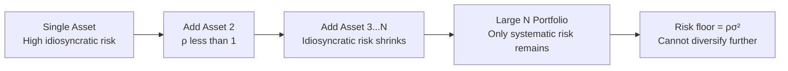

## Diversification

### Definition and Conceptual Overview

Diversification is the practice of allocating resources, investments, or economic activities across multiple assets, sectors, or income sources rather than concentrating them in a single one, with the goal of reducing the overall variance of returns or outcomes without a proportional sacrifice in expected value. In the economics of risk and uncertainty, diversification is a *risk-management strategy* that exploits the fact that individual sources of risk are often not perfectly correlated with one another.

The core insight is statistical: when the returns (or outcomes) of different assets do not move in perfect lockstep, combining them into a portfolio can reduce the volatility of the combined outcome below what any single asset would exhibit alone. This is fundamentally different from *hedging*, which is a deliberate offsetting of a specific risk, and from *insurance*, which transfers risk to a third party for a premium. Diversification instead pools risks so that idiosyncratic (asset-specific) fluctuations tend to cancel out.

### Theoretical Foundation

#### Expected Value and Variance

For any risky asset or income stream, decision-makers under uncertainty are typically modeled as caring about two moments of the outcome distribution:

- **Expected value** $E[X]$: the probability-weighted average outcome
- **Variance** $\text{Var}(X)$: the dispersion of outcomes around the expected value, used as a proxy for risk

A risk-averse agent (one with a concave utility function, per expected utility theory) prefers a lower variance for a given expected value. Diversification is attractive precisely because it can lower $\text{Var}(X)$ without lowering $E[X]$.

#### Portfolio Variance with Two Assets

Consider a portfolio composed of two assets, A and B, with portfolio weights $w_A$ and $w_B$ (where $w_A + w_B = 1$). The expected return of the portfolio is simply the weighted average:

$$E[R_p] = w_A E[R_A] + w_B E[R_B]$$

However, the **variance** of the portfolio is not a simple weighted average — it depends critically on the covariance (or correlation) between the two assets:

$$\text{Var}(R_p) = w_A^2 \sigma_A^2 + w_B^2 \sigma_B^2 + 2w_A w_B \sigma_A \sigma_B \rho_{AB}$$

where:

- $\sigma_A^2$, $\sigma_B^2$ are the variances of assets A and B
- $\sigma_A$, $\sigma_B$ are their standard deviations
- $\rho_{AB}$ is the correlation coefficient between the returns of A and B, $-1 \le \rho_{AB} \le 1$

**Key Points**

- If $\rho_{AB} = 1$ (perfect positive correlation), there is no diversification benefit; portfolio risk is simply the weighted average of the individual risks.
- If $\rho_{AB} < 1$, the portfolio variance is *strictly less* than the weighted average of the individual variances — this is the diversification effect.
- If $\rho_{AB} = -1$ (perfect negative correlation), it is theoretically possible to construct a portfolio with **zero variance** by choosing weights appropriately.
- Diversification benefits do not require negative correlation — they exist whenever $\rho_{AB} < 1$, which includes most real-world asset pairs.

#### Generalization to N Assets

For a portfolio of $n$ assets, the variance formula generalizes to:

$$\text{Var}(R_p) = \sum_{i=1}^{n} w_i^2 \sigma_i^2 + \sum_{i=1}^{n}\sum_{j \ne i} w_i w_j \sigma_i \sigma_j \rho_{ij}$$

An important special case is an **equally-weighted portfolio** of $n$ assets with identical variance $\sigma^2$ and identical pairwise correlation $\rho$ between every pair. Setting $w_i = 1/n$ for all $i$, the portfolio variance simplifies to:

$$\text{Var}(R_p) = \frac{\sigma^2}{n} + \left(\frac{n-1}{n}\right)\rho\sigma^2$$

As $n \to \infty$, this expression converges to:

$$\lim_{n \to \infty} \text{Var}(R_p) = \rho\sigma^2$$

**Key Points**

- The first term, $\sigma^2/n$, is the **diversifiable (idiosyncratic) risk** — it shrinks toward zero as the number of assets increases.
- The second term, $\rho\sigma^2$, is the **non-diversifiable (systematic) risk** — it persists regardless of how many assets are added, as long as $\rho > 0$.
- This result is the mathematical basis for the distinction between diversifiable and non-diversifiable risk discussed below.

### Diversifiable vs. Non-Diversifiable Risk

| Risk Type | Also Called | Source | Effect of Diversification |
| --- | --- | --- | --- |
| Diversifiable risk | Idiosyncratic, unsystematic, firm-specific risk | Factors unique to a single asset, firm, or activity (e.g., a factory fire, a lawsuit, a product recall) | Can be reduced toward zero by holding a sufficiently large and varied portfolio |
| Non-diversifiable risk | Systematic, market, aggregate risk | Factors affecting all assets in a class simultaneously (e.g., recessions, interest rate changes, wars, pandemics) | Cannot be eliminated by diversification within that asset class; requires diversification across asset *classes* or geographies, or must simply be borne |

This distinction is central to modern portfolio theory and to insurance economics: an insurer can diversify away idiosyncratic risk (e.g., the risk that any *one* insured house burns down) by pooling many independent policies, but cannot diversify away a systematic risk that hits all policyholders simultaneously (e.g., a hurricane affecting an entire region — this is why insurers themselves use *reinsurance* and geographic diversification).

### Illustration: Diversification and Portfolio Risk

The following diagram shows the classic risk-reduction curve as the number of assets in a portfolio increases.

<svg xmlns="http://www.w3.org/2000/svg" viewBox="0 0 600 380">
<text x="300" y="25" font-family="Arial, sans-serif" font-size="16" font-weight="bold" text-anchor="middle" fill="#1a1a1a">Portfolio Risk vs. Number of Assets (svg_diagram)</text>
<line x1="70" y1="320" x2="70" y2="50" stroke="#333" stroke-width="2" />
<line x1="70" y1="320" x2="550" y2="320" stroke="#333" stroke-width="2" />

<text x="40" y="60" font-family="Arial, sans-serif" font-size="12" fill="#333">σ_p</text>

<text x="300" y="355" font-family="Arial, sans-serif" font-size="12" fill="#333" text-anchor="middle">Number of Assets in Portfolio (n)</text>

<path d="M 90 70 Q 150 200 250 260 Q 350 285 550 290" fill="none" stroke="#2563eb" stroke-width="3" />
<line x1="70" y1="290" x2="550" y2="290" stroke="#dc2626" stroke-width="2" stroke-dasharray="6,4" />
<text x="480" y="282" font-family="Arial, sans-serif" font-size="12" fill="#dc2626">Systematic risk floor (ρσ²)</text>
<path d="M 90 70 Q 150 175 250 260" fill="none" stroke="#16a34a" stroke-width="2" stroke-dasharray="3,3" />
<text x="120" y="150" font-family="Arial, sans-serif" font-size="12" fill="#16a34a" transform="rotate(-45 120 150)">Diversifiable risk</text>

<text x="90" y="65" font-family="Arial, sans-serif" font-size="11" fill="`#1a1a1a`" text-anchor="middle">n=1</text>

<text x="250" y="270" font-family="Arial, sans-serif" font-size="11" fill="`#1a1a1a`" text-anchor="middle">n≈20</text>

<text x="530" y="305" font-family="Arial, sans-serif" font-size="11" fill="`#1a1a1a`" text-anchor="middle">n large</text>

<circle cx="90" cy="70" r="4" fill="#2563eb" />
<circle cx="250" cy="260" r="4" fill="#2563eb" />
<circle cx="550" cy="290" r="4" fill="#2563eb" />
</svg>

### Types of Diversification

**Asset/Security Diversification**

Holding multiple securities (stocks, bonds) within the same asset class whose returns are imperfectly correlated. Example: holding shares in a technology firm and a utility firm, whose earnings respond differently to interest-rate shocks.

**Sectoral/Industry Diversification**

Spreading holdings across industries with different business cycle sensitivities (e.g., consumer staples vs. luxury goods) so that a downturn concentrated in one sector does not devastate the whole portfolio.

**Geographic/International Diversification**

Holding assets across countries or regions whose economic cycles are not perfectly synchronized, reducing exposure to country-specific shocks (political instability, currency crises, localized recessions).

**Temporal Diversification**

Spreading purchases or investments over time (e.g., dollar-cost averaging) to reduce exposure to the risk of transacting at a single, potentially unfavorable, price point. [Inference] The effectiveness of temporal diversification as a risk-reduction tool relative to lump-sum investing is debated in the finance literature and depends on assumptions about return distributions over time.

**Diversification of Income Sources (Labor Economics)**

At the household level, diversification also applies to labor income — for example, a household with income from multiple earners or multiple income streams (wages plus rental income) is less exposed to the risk of a single job loss than a household dependent on one earner.

**Production/Firm-Level Diversification**

A firm producing multiple product lines or operating in multiple markets reduces its exposure to demand shocks in any single product or market. This connects to the theory of the firm and to conglomerate diversification strategies studied in industrial organization.

**Diversification in Agriculture (Classic Applied Example)**

A farmer planting multiple crop varieties with different weather sensitivities (e.g., a drought-resistant crop alongside a flood-resistant crop) reduces the variance of total harvest value, even if expected yield is slightly lower than specializing in the single highest-expected-yield crop.

### Worked Example

Consider two assets:

- Asset A: expected return $E[R_A] = 10\%$, standard deviation $\sigma_A = 20\%$
- Asset B: expected return $E[R_B] = 8\%$, standard deviation $\sigma_B = 15\%$
- Correlation $\rho_{AB} = 0.2$

A portfolio with $w_A = 0.5$ and $w_B = 0.5$ has:

$$E[R_p] = 0.5(10\%) + 0.5(8\%) = 9\%$$

$$\text{Var}(R_p) = (0.5)^2(0.20)^2 + (0.5)^2(0.15)^2 + 2(0.5)(0.5)(0.20)(0.15)(0.2)$$

$$\text{Var}(R_p) = 0.01 + 0.005625 + 0.003 = 0.018625$$

$$\sigma_p = \sqrt{0.018625} \approx 13.65\%$$

**Key Points**

- The weighted average of the individual standard deviations would be $0.5(20\%) + 0.5(15\%) = 17.5\%$.
- The actual portfolio standard deviation, $13.65\%$, is *lower* than this weighted average — this gap is the diversification benefit, arising purely from $\rho_{AB} = 0.2 < 1$.
- The portfolio achieves a return of 9% (close to the average of the two assets) while bearing less risk than a simple weighted average of individual risks would suggest.

### The Diversification–Return Tradeoff

Diversification does **not** typically increase expected return; its primary function is variance reduction. In an efficient market context, this connects to the risk-return tradeoff: assets bearing only diversifiable risk should not command a risk premium (since that risk can be eliminated "for free" by holding a portfolio), while non-diversifiable (systematic) risk is priced, because it cannot be eliminated. This is the intuition underlying asset pricing models such as the Capital Asset Pricing Model (CAPM), where an asset's expected return is a function of its exposure to systematic risk (measured by beta) rather than its total variance.

**Key Points**

- Rational, diversified investors should not be compensated for bearing risk they could have diversified away.
- Two assets with identical *total* variance can have very different expected returns if one has high idiosyncratic variance (diversifiable, uncompensated) and the other has high systematic variance (non-diversifiable, compensated).

### Limits and Costs of Diversification

- **Transaction costs**: Acquiring and managing many small positions incurs higher brokerage, information, and monitoring costs, which can offset diversification benefits beyond some optimal number of holdings.
- **Diminishing marginal benefit**: As shown in the $n$-asset formula above, the marginal risk-reduction benefit of adding another asset declines rapidly; most of the diversifiable risk in an equally-weighted portfolio is eliminated within roughly 20–30 uncorrelated holdings. [Inference] The specific number at which diminishing returns become negligible depends on the correlation structure and variance of the assets in question, and varies across empirical studies and asset classes.
- **Correlation is not fixed**: Correlations between assets are not structural constants; they can rise sharply during systemic crises ("correlation breakdown" or "contagion"), precisely when diversification is most needed. This is a well-documented pattern in financial crises.
- **Over-diversification**: Excessive diversification can dilute returns and expertise, and in a firm context, unrelated conglomerate diversification has sometimes been associated with a "diversification discount" in corporate valuation, though this finding is contested in the corporate finance literature. [Unverified]
- **Adverse selection and moral hazard limits**: In insurance markets, diversification (risk pooling) works best when risks are independent; correlated risks or private information problems (adverse selection) can limit how effectively pooling reduces aggregate risk.

### Diversification and the Law of Large Numbers

The statistical justification for diversification in insurance and pooling contexts rests on the **Law of Large Numbers**: as the number of independent, identically distributed risks pooled together grows, the variance of the *average* outcome per unit shrinks toward zero, even though the variance of any individual outcome remains unchanged. This is why insurance companies can offer predictable premiums despite the unpredictability of any single claim — they rely on pooling a large number of largely independent policyholders.

This differs subtly from portfolio diversification: insurance pooling reduces the variance of the *average* claim per policyholder, whereas investment diversification reduces the variance of a *weighted combination* of returns. Both rely on the same underlying principle — imperfect correlation (or independence) among risks — but are applied in different institutional contexts.

### Related Topics

- Expected Utility Theory and Risk Aversion
- Capital Asset Pricing Model (CAPM) and the Security Market Line
- Modern Portfolio Theory (Markowitz Efficient Frontier)
- Insurance and Risk Pooling
- Moral Hazard and Adverse Selection
- Systematic vs. Unsystematic Risk
- Hedging and Derivatives as Risk Management Tools
- Law of Large Numbers in Risk Economics
- The Theory of the Firm and Conglomerate Diversification