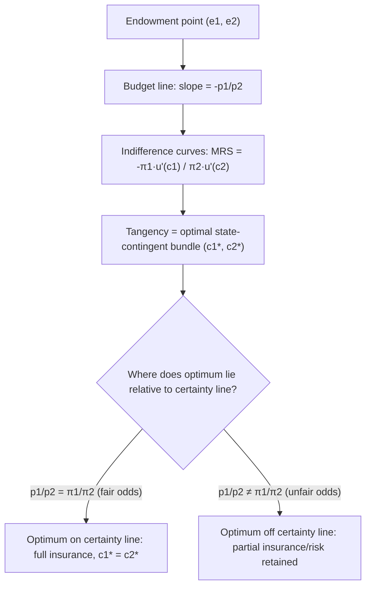

## State-Preference Theory

### Definition and Conceptual Overview

State-preference theory is a framework for analyzing decision-making under uncertainty by decomposing risky prospects into payoffs across a finite set of mutually exclusive, collectively exhaustive **states of the world**. Rather than treating a "risky asset" as a single object characterized only by a probability distribution's mean and variance, state-preference theory treats it as a *bundle of contingent claims* — one claim for each possible state of nature. This approach, developed primarily by Kenneth Arrow and Gérard Debreu, reformulates choice under uncertainty as an extension of standard consumer choice theory, where "goods" are redefined as "state-contingent commodities."

The theory answers a foundational question in the economics of risk: how can we price and analyze uncertain outcomes using the same tools (indifference curves, budget constraints, general equilibrium) used for certain outcomes? The answer is to expand the commodity space so that "one dollar in state A" and "one dollar in state B" are treated as distinct goods, even though they are physically identical, because their *value* to an agent differs depending on which state occurs.

### Core Building Blocks

#### States of the World

A **state of the world** (or "state of nature") is a complete, mutually exclusive description of a possible resolution of uncertainty relevant to the decision at hand. States must be:

- **Mutually exclusive**: exactly one state occurs
- **Collectively exhaustive**: the states cover every possibility
- **Exogenous**: typically assumed to be outside the agent's control (though this assumption can be relaxed in moral hazard extensions)

Example: for a farmer facing weather risk, the states might be $S_1 = \text{drought}$, $S_2 = \text{normal rainfall}$, $S_3 = \text{flood}$.

#### State-Contingent Claims (Arrow Securities)

A **state-contingent claim**, also called an **Arrow security** or **Arrow-Debreu security**, is an asset that pays a fixed amount (conventionally normalized to $1) if and only if a specified state occurs, and pays nothing otherwise. If there are $n$ possible states $S_1, \ldots, S_n$, then a complete set of Arrow securities consists of $n$ distinct assets, each contingent on exactly one state.

**Key Points**

- Any complex risky asset can, in principle, be replicated (synthesized) as a portfolio of Arrow securities weighted by its state-contingent payoffs.
- If a complete set of Arrow securities exists and can be freely traded, markets are said to be **complete** — every conceivable state-contingent payoff pattern can be constructed by combining these basic securities.
- The price of an Arrow security for state $i$, denoted $p_i$, reflects the market's valuation of receiving $1 in that particular state, incorporating both the probability of the state and the marginal utility of income in that state.

#### The State-Contingent Consumption Bundle

An agent's uncertain prospect is represented as a vector of consumption levels across states:

$$(c_1, c_2, \ldots, c_n)$$

where $c_i$ is the consumption (or wealth) the agent receives if state $i$ occurs. This is directly analogous to a bundle of ordinary goods $(x_1, x_2, \ldots, x_n)$ in standard consumer theory — except here, the "goods" are the same underlying consumption good delivered in different, mutually exclusive contingencies.

### The State-Preference Budget Constraint

Suppose an agent has initial wealth $W$ and faces $n$ states. With Arrow security prices $p_1, \ldots, p_n$, and an initial endowment across states $(e_1, \ldots, e_n)$, the agent chooses a state-contingent consumption bundle $(c_1, \ldots, c_n)$ to maximize expected utility subject to the budget constraint:

$$\sum_{i=1}^{n} p_i c_i = \sum_{i=1}^{n} p_i e_i$$

This is formally identical to a standard budget constraint in consumer theory, with $p_i$ playing the role of a price and $c_i$ the role of a quantity demanded.

### The Two-State Model (Standard Simplification)

For pedagogical purposes and diagrammatic analysis, state-preference theory is most often presented with only two states, $S_1$ and $S_2$ (e.g., "loss occurs" and "no loss occurs"). The agent's endowment is $(e_1, e_2)$, and the budget constraint becomes:

$$p_1 c_1 + p_2 c_2 = p_1 e_1 + p_2 e_2$$

This can be rearranged into a familiar linear budget line in $(c_1, c_2)$ space:

$$c_2 = \frac{p_1 e_1 + p_2 e_2}{p_2} - \frac{p_1}{p_2} c_1$$

The slope of this budget line, $-p_1/p_2$, is the **price ratio** of the two Arrow securities — the rate at which the market allows the agent to trade consumption in state 1 for consumption in state 2.

### Preferences Over State-Contingent Claims: Expected Utility

Under the expected utility hypothesis, if the agent assigns subjective or objective probabilities $\pi_1, \pi_2, \ldots, \pi_n$ to the states, the agent's utility function over the state-contingent bundle is:

$$U(c_1, c_2, \ldots, c_n) = \sum_{i=1}^{n} \pi_i \, u(c_i)$$

where $u(\cdot)$ is a von Neumann–Morgenstern utility-of-income function, typically assumed increasing and concave ($u' > 0$, $u'' < 0$) to reflect risk aversion.

For the two-state case, indifference curves in $(c_1, c_2)$ space are derived from:

$$U(c_1, c_2) = \pi_1 u(c_1) + \pi_2 u(c_2) = \text{constant}$$

The slope of an indifference curve (the marginal rate of substitution between state-1 and state-2 consumption) is:

$$MRS_{12} = -\frac{\partial U/\partial c_1}{\partial U/\partial c_2} = -\frac{\pi_1 u'(c_1)}{\pi_2 u'(c_2)}$$

**Key Points**

- Along the **certainty line** (the 45° line where $c_1 = c_2$), consumption is identical across states, so $u'(c_1) = u'(c_2)$, and the MRS collapses to $-\pi_1/\pi_2$ — the ratio of probabilities alone.
- This means indifference curves cross the certainty line with a slope equal to the negative ratio of the state probabilities, a key diagrammatic result used to locate the optimal choice.
- Because $u$ is concave under risk aversion, indifference curves are convex to the origin, exactly as in standard consumer theory with diminishing marginal rate of substitution.

### Diagrammatic Analysis

<svg xmlns="http://www.w3.org/2000/svg" viewBox="0 0 620 500">
<text x="310" y="25" font-family="Arial, sans-serif" font-size="16" font-weight="bold" text-anchor="middle" fill="#1a1a1a">State-Preference Diagram: Two States (svg_diagram)</text>
<line x1="80" y1="440" x2="80" y2="60" stroke="#333" stroke-width="2" />
<line x1="80" y1="440" x2="560" y2="440" stroke="#333" stroke-width="2" />
<text x="30" y="70" font-family="Arial, sans-serif" font-size="13" fill="#333">c₂</text>
<text x="565" y="445" font-family="Arial, sans-serif" font-size="13" fill="#333">c₁</text>
<line x1="80" y1="440" x2="530" y2="90" stroke="#9333ea" stroke-width="1.5" stroke-dasharray="4,4" />
<text x="480" y="105" font-family="Arial, sans-serif" font-size="12" fill="#9333ea">45° Certainty Line (c₁=c₂)</text>
<line x1="120" y1="380" x2="480" y2="130" stroke="#2563eb" stroke-width="2.5" />
<text x="440" y="150" font-family="Arial, sans-serif" font-size="12" fill="#2563eb">Budget line (slope = -p₁/p₂)</text>
<circle cx="300" cy="255" r="5" fill="#111" />
<text x="310" y="245" font-family="Arial, sans-serif" font-size="12" fill="#111">Endowment (e₁,e₂)</text>
<path d="M 200 400 Q 300 260 460 200" fill="none" stroke="#16a34a" stroke-width="2" />
<path d="M 170 420 Q 300 300 500 235" fill="none" stroke="#16a34a" stroke-width="1.5" stroke-dasharray="2,2" />
<text x="230" y="410" font-family="Arial, sans-serif" font-size="11" fill="#16a34a">Indifference curves (convex, risk-averse)</text>
<circle cx="300" cy="260" r="5" fill="#dc2626" />
<text x="200" y="290" font-family="Arial, sans-serif" font-size="12" fill="#dc2626">Optimum on certainty line (fair-odds case)</text>
<circle cx="380" cy="180" r="5" fill="#ea580c" />
<text x="390" y="175" font-family="Arial, sans-serif" font-size="12" fill="#ea580c">Off-certainty-line optimum (unfair odds)</text>
</svg>

**Key Points**

- If the price ratio of Arrow securities equals the probability ratio ($p_1/p_2 = \pi_1/\pi_2$, sometimes called **actuarially fair odds**), a risk-averse agent's optimal choice lies exactly on the certainty line — the agent fully insures, equalizing consumption across states.
- If the price ratio diverges from the probability ratio (**unfair odds**, e.g., because insurers charge a loading fee above actuarially fair premiums), the risk-averse agent's optimum shifts off the certainty line, and the agent bears some residual risk (partial insurance) because full insurance becomes too costly relative to its risk-reduction benefit.
- This diagrammatic result is the state-preference-theoretic derivation of the classic insurance economics result that risk-averse agents fully insure only at actuarially fair prices.

### Complete vs. Incomplete Markets

**Complete markets**: A market is complete if there exists a full set of $n$ linearly independent Arrow securities (or equivalent tradable assets) for $n$ states, allowing agents to achieve any desired state-contingent consumption pattern subject only to their budget constraint. In complete markets, the **Arrow-Debreu equilibrium** achieves a Pareto-efficient allocation of risk-bearing across agents, consistent with the First Welfare Theorem extended to uncertainty.

**Incomplete markets**: If fewer than $n$ independent securities are traded (e.g., not every contingency has an insurable claim), agents cannot achieve their unconstrained optimal state-contingent bundle, and the resulting allocation is generally not Pareto efficient. Real-world markets are typically incomplete — insurance is unavailable for many idiosyncratic risks, and financial markets do not span every conceivable state.

**Key Points**

- Market completeness is a central theoretical benchmark; deviations from it explain phenomena like uninsurable risk, precautionary saving, and demand for diversification (see Diversification).
- Any tradable asset with state-contingent payoffs (a stock, a bond, an insurance contract) can be viewed as a *portfolio* of implicit Arrow securities; asset pricing theory often works "backward" from observed asset prices to infer implied state prices.

### Risk Aversion in State-Preference Space

The curvature of indifference curves in $(c_1, c_2)$ space directly reflects the agent's degree of risk aversion:

- A **risk-neutral** agent (linear $u$) has straight-line indifference curves with slope $-\pi_1/\pi_2$ everywhere, not just at the certainty line — such an agent is indifferent between bearing risk and eliminating it, provided expected value is held constant.
- A **risk-averse** agent (strictly concave $u$) has strictly convex indifference curves, generating a strict preference for the certainty line over any bundle with the same expected value but unequal state consumption.
- A **risk-loving** agent (convex $u$) has concave indifference curves, and would move consumption *away* from the certainty line if permitted.

### Relation to Expected Utility Theory and Mean-Variance Analysis

State-preference theory is often presented as more general and more fundamental than mean-variance analysis (used in portfolio theory), because it does not require restricting attention to just the first two moments (mean and variance) of a payoff distribution — it works directly with the full vector of state-contingent payoffs. [Inference] Whether state-preference theory is more "useful" than mean-variance analysis in a given application depends on the number of relevant states and the availability of data on state probabilities and contingent payoffs; mean-variance analysis remains more tractable when the state space is very large or continuous.

State-preference theory nests expected utility theory as the specific case where preferences over state-contingent bundles take the additively separable, probability-weighted form $\sum_i \pi_i u(c_i)$. It is possible, in principle, to have well-behaved (convex, complete, transitive) preferences over state-contingent claims that do *not* take this expected-utility form, which is part of why state-preference theory is sometimes treated as the more general framework, with expected utility theory as a special functional-form restriction.

### Applications

**Insurance Markets**

Insurance contracts are naturally modeled as trades of Arrow securities: a policyholder pays a premium (giving up consumption in the no-loss state) in exchange for indemnity payments (gaining consumption in the loss state). The state-preference framework directly generates the full-insurance-at-fair-odds result described above.

**Asset Pricing**

The Arrow-Debreu state price for state $i$, often denoted $q_i$, underlies modern asset pricing theory. The price of any asset can be expressed as the sum of its state-contingent payoffs weighted by state prices:

$$\text{Price} = \sum_{i=1}^{n} q_i \times \text{Payoff}_i$$

This is the discrete-state analogue of the stochastic discount factor approach used in continuous-state asset pricing models.

**General Equilibrium Under Uncertainty**

Arrow and Debreu extended general equilibrium theory to uncertainty by treating state-contingent goods as ordinary commodities in an expanded commodity space, allowing standard existence and welfare theorems to be applied to economies with uncertainty, provided markets for all state-contingent claims exist (i.e., markets are complete).

**Corporate Finance and Capital Structure**

Contingent claims analysis in corporate finance (e.g., viewing equity as a call option on firm value, contingent on the state of firm value exceeding debt obligations) is a direct descendant of state-preference theory.

### Limitations and Critiques

- **Informational requirements**: The theory requires that states of the world be well-defined, exhaustively enumerable, and that agents can assign meaningful probabilities to them — a demanding assumption when uncertainty is not easily reduced to a clean, finite state space (this connects to the distinction between quantifiable "risk" and unquantifiable "Knightian uncertainty").
- **Market incompleteness in practice**: Because most real-world economies lack a complete set of tradable Arrow securities for all conceivable states, the elegant efficiency results of the complete-markets case are a theoretical benchmark rather than a description of observed markets. [Inference] The practical gap between complete-markets predictions and observed insurance and asset markets is a matter of ongoing empirical and theoretical study, and the degree of inefficiency this implies is not settled.
- **Moral hazard and adverse selection**: The basic theory assumes states are exogenous and observable; when the probability of a state depends on unobservable agent behavior (moral hazard) or when agents have private information about their own state probabilities (adverse selection), the simple full-insurance-at-fair-odds result breaks down and richer contract-theoretic models are needed.

### Related Topics

- Expected Utility Theory and the von Neumann–Morgenstern Axioms
- Arrow-Debreu General Equilibrium Model
- Diversification and Portfolio Risk
- Insurance Markets and Adverse Selection
- Moral Hazard and Contract Theory
- Knightian Uncertainty vs. Quantifiable Risk
- Asset Pricing and the Stochastic Discount Factor
- Complete vs. Incomplete Markets
- Risk Aversion, Risk Neutrality, and Risk-Loving Preferences