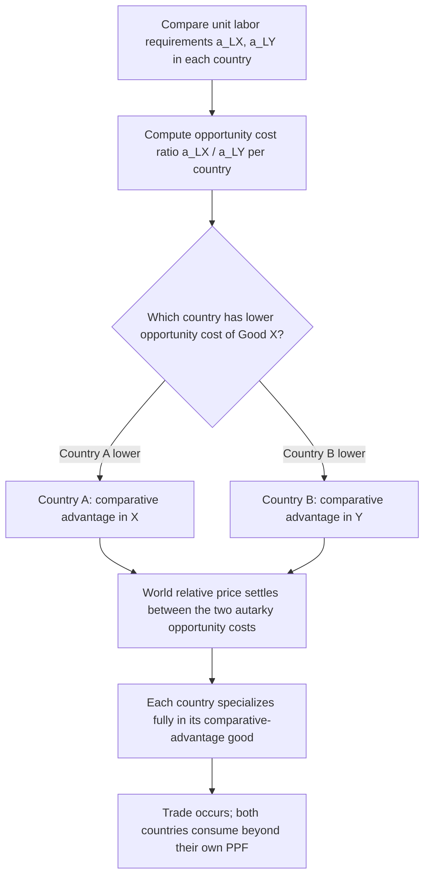

## Absolute vs Comparative Advantage

### Definition and Conceptual Overview

**Absolute advantage** exists when a country, individual, or firm can produce a good or service using fewer real resources (typically measured in labor-hours or other input units) than another producer. **Comparative advantage** exists when a producer can produce a good at a lower *opportunity cost* relative to other goods, compared to another producer — regardless of whether it holds an absolute advantage in that good.

The distinction between these two concepts is foundational to international trade theory: absolute advantage, associated with Adam Smith, explains why trade *can* be mutually beneficial when each party is more efficient at producing different things. Comparative advantage, associated with David Ricardo, is the more powerful and general result: it demonstrates that mutually beneficial trade can occur even when one party is absolutely more efficient at producing *everything*, because what matters for trade is *relative* efficiency, not absolute efficiency.

### Absolute Advantage (Adam Smith)

#### Formal Definition

Country A has an absolute advantage over Country B in producing good X if Country A requires fewer units of input (typically labor) to produce one unit of X than Country B does.

If $a_{LX}^A$ denotes the labor required to produce one unit of good X in country A, then:

$$\text{Country A has absolute advantage in X if } a_{LX}^A < a_{LX}^B$$

#### Example

Consider two countries, each with 100 labor-hours available, producing two goods: Wheat and Cloth.

|  | Labor-hours per unit of Wheat | Labor-hours per unit of Cloth |
| --- | --- | --- |
| Country A | 2 | 10 |
| Country B | 4 | 5 |

Country A requires fewer labor-hours per unit of Wheat (2 vs. 4), so Country A has an **absolute advantage in Wheat**. Country B requires fewer labor-hours per unit of Cloth (5 vs. 10), so Country B has an **absolute advantage in Cloth**.

**Key Points**

- Smith's insight was that when each country specializes in the good in which it has an absolute advantage and trades, both countries can consume more of both goods than they could in isolation (autarky).
- Smith's framework does not explain what happens when one country is absolutely more efficient at producing *every* good — this gap is what Ricardo's theory resolves.

### Comparative Advantage (David Ricardo)

#### Formal Definition

Comparative advantage is defined in terms of **opportunity cost** — the amount of one good that must be forgone to produce one additional unit of another good — rather than in terms of absolute resource requirements.

Country A has a comparative advantage in good X (relative to good Y) if its opportunity cost of producing X, in terms of Y forgone, is lower than that of Country B:

$$\text{Country A has comparative advantage in X if } \frac{a_{LX}^A}{a_{LY}^A} < \frac{a_{LX}^B}{a_{LY}^B}$$

where $a_{LX}$ and $a_{LY}$ are the unit labor requirements for goods X and Y respectively. This ratio represents the opportunity cost of X in terms of Y under the Ricardian (labor-only) production assumption.

#### Numerical Example: Absolute Advantage Everywhere, Yet Gains from Trade Exist

Suppose Country A is absolutely more efficient at producing *both* goods:

|  | Labor-hours per unit of Wheat | Labor-hours per unit of Cloth |
| --- | --- | --- |
| Country A | 2 | 4 |
| Country B | 10 | 5 |

Country A has an absolute advantage in both goods (2 < 10 for Wheat; 4 < 5 for Cloth). Under a naive absolute-advantage view, it might seem there is no basis for trade, since Country A is better at everything.

Computing opportunity costs:

**Country A's opportunity cost of 1 unit of Wheat** $= \dfrac{2}{4} = 0.5$ units of Cloth forgone

**Country B's opportunity cost of 1 unit of Wheat** $= \dfrac{10}{5} = 2$ units of Cloth forgone

Since $0.5 < 2$, **Country A has a comparative advantage in Wheat**.

**Country A's opportunity cost of 1 unit of Cloth** $= \dfrac{4}{2} = 2$ units of Wheat forgone

**Country B's opportunity cost of 1 unit of Cloth** $= \dfrac{5}{10} = 0.5$ units of Wheat forgone

Since $0.5 < 2$, **Country B has a comparative advantage in Cloth**, even though it is absolutely less efficient at producing it.

**Key Points**

- Comparative advantage is inherently *relative* and *relational*: a country cannot have a comparative advantage in everything, because opportunity costs are mirror images of each other across goods. If Country A's opportunity cost of Wheat is lower than Country B's, then Country A's opportunity cost of Cloth must necessarily be higher than Country B's.
- This is the central theoretical result: mutually beneficial trade is possible whenever opportunity costs differ across countries, independent of absolute productivity levels.

### The Ricardian Model: Formal Structure

#### Assumptions

- Two countries, two goods, one factor of production (labor)
- Labor is homogeneous and perfectly mobile *within* a country but immobile *between* countries
- Constant returns to scale (constant unit labor requirements, $a_{LX}$ and $a_{LY}$, regardless of output level)
- Perfect competition in both goods and labor markets
- No transportation costs or trade barriers
- Full employment of labor in both countries

#### Production Possibility Frontier (PPF)

With a fixed labor endowment $L$ and constant unit labor requirements, each country's PPF is a straight line (reflecting constant opportunity cost):

$$a_{LX} \cdot Q_X + a_{LY} \cdot Q_Y = L$$

The slope of the PPF, $-a_{LX}/a_{LY}$, represents the (constant) opportunity cost of good X in terms of good Y — this slope *is* the comparative advantage measure.

#### Relative Price Under Autarky vs. Free Trade

In autarky (no trade), the relative price of X in terms of Y is pinned down by the opportunity cost, since production and consumption must be equal domestically:

$$\left(\frac{P_X}{P_Y}\right)_{\text{autarky}} = \frac{a_{LX}}{a_{LY}}$$

Under free trade, a single world relative price emerges that must lie *between* the two countries' autarky opportunity costs:

$$\left(\frac{a_{LX}}{a_{LY}}\right)^A < \left(\frac{P_X}{P_Y}\right)_{\text{world}} < \left(\frac{a_{LX}}{a_{LY}}\right)^B$$

Each country then specializes completely in the good in which it holds a comparative advantage, since it can now trade at a relative price more favorable than its own opportunity cost.

### Diagrammatic Illustration

<svg xmlns="http://www.w3.org/2000/svg" viewBox="0 0 640 460">
<text x="320" y="25" font-family="Arial, sans-serif" font-size="16" font-weight="bold" text-anchor="middle" fill="#1a1a1a">Gains from Trade: PPF and Consumption (svg_diagram)</text>

<text x="150" y="55" font-family="Arial, sans-serif" font-size="13" font-weight="bold" text-anchor="middle" fill="`#1a1a1a`">Country A (comparative advantage: Wheat)</text>

<line x1="60" y1="220" x2="60" y2="70" stroke="#333" stroke-width="2" />

<line x1="60" y1="220" x2="260" y2="220" stroke="#333" stroke-width="2" />

<text x="30" y="80" font-family="Arial, sans-serif" font-size="11" fill="#333">Cloth</text>

<text x="240" y="235" font-family="Arial, sans-serif" font-size="11" fill="#333">Wheat</text>

<line x1="60" y1="90" x2="240" y2="220" stroke="`#2563eb`" stroke-width="2.5" />

<text x="90" y="105" font-family="Arial, sans-serif" font-size="10" fill="`#2563eb`">Autarky PPF (slope=-0.5)</text>

<line x1="60" y1="90" x2="240" y2="150" stroke="`#16a34a`" stroke-width="2" stroke-dasharray="5,3" />

<text x="150" y="140" font-family="Arial, sans-serif" font-size="10" fill="`#16a34a`">World price line (flatter)</text>

<circle cx="150" cy="155" r="4" fill="#111" />

<text x="155" y="150" font-family="Arial, sans-serif" font-size="9" fill="#111">Autarky point</text>

<circle cx="200" cy="175" r="4" fill="`#dc2626`" />

<text x="150" y="195" font-family="Arial, sans-serif" font-size="9" fill="`#dc2626`">Consumption w/ trade (beyond PPF)</text>

<text x="480" y="55" font-family="Arial, sans-serif" font-size="13" font-weight="bold" text-anchor="middle" fill="`#1a1a1a`">Country B (comparative advantage: Cloth)</text>

<line x1="390" y1="220" x2="390" y2="70" stroke="#333" stroke-width="2" />

<line x1="390" y1="220" x2="590" y2="220" stroke="#333" stroke-width="2" />

<text x="360" y="80" font-family="Arial, sans-serif" font-size="11" fill="#333">Cloth</text>

<text x="570" y="235" font-family="Arial, sans-serif" font-size="11" fill="#333">Wheat</text>

<line x1="390" y1="80" x2="590" y2="220" stroke="`#2563eb`" stroke-width="2.5" />

<text x="420" y="95" font-family="Arial, sans-serif" font-size="10" fill="`#2563eb`">Autarky PPF (slope=-2)</text>

<line x1="410" y1="80" x2="590" y2="180" stroke="`#16a34a`" stroke-width="2" stroke-dasharray="5,3" />

<text x="480" y="170" font-family="Arial, sans-serif" font-size="10" fill="`#16a34a`">World price line (steeper)</text>

<circle cx="490" cy="150" r="4" fill="#111" />

<text x="495" y="145" font-family="Arial, sans-serif" font-size="9" fill="#111">Autarky point</text>

<circle cx="450" cy="130" r="4" fill="`#dc2626`" />

<text x="330" y="120" font-family="Arial, sans-serif" font-size="9" fill="`#dc2626`">Consumption w/ trade (beyond PPF)</text>

<text x="320" y="420" font-family="Arial, sans-serif" font-size="12" text-anchor="middle" fill="`#1a1a1a`">Free trade lets both countries consume outside their own production possibility frontier</text>

</svg>

### Mutual Gains from Trade

Returning to the numerical example above, suppose the two countries agree to trade at a world relative price of 1 unit of Wheat for 1 unit of Cloth (which lies between Country A's autarky ratio of 0.5 and Country B's autarky ratio of 2, satisfying the condition for mutually beneficial trade).

**Key Points**

- Country A, whose autarky cost of Wheat was only 0.5 units of Cloth, can now trade 1 Wheat for 1 Cloth — effectively "earning" more Cloth per unit of Wheat given up than it could domestically.
- Country B, whose autarky cost of Cloth was only 0.5 units of Wheat, can now trade 1 Cloth for 1 Wheat — effectively "earning" more Wheat per unit of Cloth given up than it could domestically.
- Both countries are strictly better off specializing according to comparative advantage and trading, even though Country A is absolutely more productive in both goods.

### Absolute Advantage vs. Comparative Advantage: Comparison Table

| Dimension | Absolute Advantage | Comparative Advantage |
| --- | --- | --- |
| Originator | Adam Smith | David Ricardo |
| Basis of comparison | Absolute resource input (labor-hours per unit) | Relative opportunity cost across goods |
| Can one party hold it in everything? | Yes — possible to be absolutely more efficient at all goods | No — by construction, if one country has comparative advantage in X, the other has it in Y |
| Determines basis for trade? | Sufficient but not necessary condition | Necessary and sufficient condition |
| Explains trade when one country dominates in all goods? | No | Yes |
| Key theoretical output | Trade benefits both if each specializes in what it does best in absolute terms | Trade benefits both whenever opportunity costs differ, regardless of absolute productivity |

### Why Comparative Advantage Is the More General and Robust Principle

Absolute advantage is a special case that happens to align with comparative advantage when *relative* efficiencies also differ in the same direction as absolute efficiencies. But absolute advantage alone cannot explain trade patterns in the many real-world cases where one country (or region, or firm) is more productive than its trading partner across essentially all goods and services. Comparative advantage resolves this by showing that what matters is not how a country's productivity compares to another country's in a given good, but how a country's *own* trade-off between two goods compares to another country's trade-off between the same two goods.

This principle generalizes beyond countries: it explains why a highly skilled individual (e.g., a surgeon who could also type faster than any assistant) still benefits from "trading" — hiring an assistant for administrative tasks — because the surgeon's opportunity cost of typing (forgone surgery time) is far higher than the assistant's, even though the surgeon may have an absolute advantage in *both* activities.

### Extensions and Limitations of the Basic Ricardian Model

- **Many goods and many countries**: The two-good, two-country model extends to multiple goods and countries; comparative advantage still governs the pattern of specialization, though the analysis becomes a ranking of goods by relative opportunity cost (a "chain of comparative advantage") rather than a simple binary split.
- **Constant opportunity costs**: The linear PPF in the basic Ricardian model reflects the assumption of constant returns to scale and a single factor of production; introducing multiple factors (as in the Heckscher-Ohlin model) or increasing opportunity costs produces a bowed-out PPF and a more nuanced determination of comparative advantage based on relative factor endowments rather than labor productivity alone.
- **Terms of trade indeterminacy**: The basic Ricardian model determines the *range* within which the world relative price must fall for mutual gains to exist, but does not by itself pin down the exact price — this typically requires specifying relative demand conditions (as in the theory of reciprocal demand, associated with John Stuart Mill).
- **Distributional effects**: While comparative advantage demonstrates aggregate/national gains from trade, it does not imply that every individual or factor of production within a country gains — specific factors tied to the import-competing sector can be made worse off, a concern addressed by later trade models (e.g., the Specific Factors Model and Stolper-Samuelson theorem). [Inference] The magnitude and distribution of these within-country losses relative to aggregate gains is an empirical and policy-relevant question that varies significantly by country, sector, and time period, and is not resolved by the basic Ricardian framework itself.
- **Dynamic and strategic considerations**: The static Ricardian model does not account for how comparative advantage might change over time due to technology transfer, learning-by-doing, or strategic industrial policy — topics addressed in more advanced trade theory.

### Related Topics

- Ricardian Model of International Trade
- Heckscher-Ohlin Model and Factor Endowments
- Terms of Trade and Reciprocal Demand
- Production Possibility Frontier (PPF)
- Gains from Trade and Trade Specialization
- Stolper-Samuelson Theorem
- Specific Factors Model
- Opportunity Cost in Microeconomic Theory