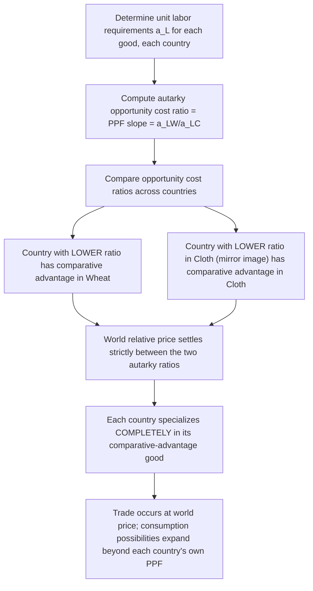

## Ricardian Trade Model

### Definition and Conceptual Overview

The Ricardian trade model is the foundational formal model of international trade, developed by David Ricardo (1817), which demonstrates that countries gain from trade by specializing according to **comparative advantage** — producing and exporting the goods in which they have the lowest opportunity cost relative to their trading partner — rather than according to **absolute advantage**. The model isolates a single source of comparative advantage: cross-country differences in labor productivity (technology), holding all other factors constant. It remains the theoretical starting point for international trade theory because it establishes, with minimal assumptions, that mutually beneficial trade can occur even between a highly productive country and a less productive one, as long as *relative* productivities differ.

### Core Assumptions

- **Two countries** (conventionally Home and Foreign), **two goods**, and **one factor of production** (labor)
- Labor is the only input; production technology is summarized entirely by constant **unit labor requirements** $a_{Li}$ (labor-hours needed to produce one unit of good $i$)
- **Constant returns to scale**: unit labor requirements do not change with output level
- Labor is **perfectly mobile domestically** (can move freely between industries within a country) but **completely immobile internationally**
- **Perfect competition** in both goods and labor markets; prices equal unit labor cost
- **Full employment** of the labor force in each country
- **No transportation costs, tariffs, or other trade barriers**
- **Technology differs across countries** (this is the sole source of comparative advantage in the basic model), captured by country-specific unit labor requirements

### Notation

| Symbol | Meaning |
| --- | --- |
| $a_{LW}$, $a_{LC}$ | Labor-hours required per unit of Wheat, Cloth (Home country) |
| $a_{LW}^*$, $a_{LC}^*$ | Labor-hours required per unit of Wheat, Cloth (Foreign country, denoted with asterisk) |
| $L$, $L^*$ | Total labor endowment of Home and Foreign |
| $Q_W$, $Q_C$ | Quantities produced of Wheat and Cloth |
| $w$, $w^*$ | Wage rate in Home and Foreign |
| $P_W/P_C$ | Relative price of Wheat in terms of Cloth |

### The Production Possibility Frontier (PPF)

With labor as the only input and constant unit labor requirements, the labor constraint for the Home country is:

$$a_{LW} Q_W + a_{LC} Q_C \le L$$

At full employment, this holds with equality, producing a **linear PPF**:

$$Q_C = \frac{L}{a_{LC}} - \frac{a_{LW}}{a_{LC}} Q_W$$

**Key Points**

- The PPF is a straight line (not bowed outward) because opportunity cost is *constant*: giving up one unit of Wheat always frees up exactly $a_{LW}$ labor-hours, which always produces exactly $a_{LW}/a_{LC}$ units of Cloth, regardless of the current output mix.
- The slope of the PPF, $-a_{LW}/a_{LC}$, *is* the opportunity cost of Wheat in terms of Cloth — this single number fully characterizes the country's comparative advantage structure.
- The vertical and horizontal intercepts, $L/a_{LC}$ and $L/a_{LW}$, represent the maximum output achievable if all labor were devoted to Cloth or Wheat respectively.

### Relative Prices Under Autarky

Under perfect competition with labor as the only cost, the price of each good equals its unit labor cost:

$$P_W = w \cdot a_{LW} \qquad P_C = w \cdot a_{LC}$$

Since both goods are produced in a closed (autarky) economy, the wage $w$ cancels when taking the price ratio, so the autarky relative price is pinned down purely by relative unit labor requirements:

$$\left(\frac{P_W}{P_C}\right)_{\text{autarky}} = \frac{a_{LW}}{a_{LC}}$$

This confirms that in autarky, the relative price of a good equals its opportunity cost — exactly the slope of the PPF.

### Determining Comparative Advantage

Home has a comparative advantage in Wheat if its opportunity cost of Wheat is lower than Foreign's:

$$\frac{a_{LW}}{a_{LC}} < \frac{a_{LW}^*}{a_{LC}^*}$$

Equivalently, rearranging:

$$\frac{a_{LW}}{a_{LW}^*} < \frac{a_{LC}}{a_{LC}^*}$$

This form is often used directly: it compares **relative labor productivity** across countries for each good, and whichever country has the *relatively* lower labor requirement (i.e., the *relatively* higher productivity ratio) in a good holds the comparative advantage in that good — independent of whether it is absolutely more or less productive overall.

### Numerical Example

|  | $a_{LW}$ (hrs/unit Wheat) | $a_{LC}$ (hrs/unit Cloth) |
| --- | --- | --- |
| Home | 2 | 4 |
| Foreign | 10 | 5 |

**Home's opportunity cost of Wheat**: $2/4 = 0.5$ Cloth

**Foreign's opportunity cost of Wheat**: $10/5 = 2$ Cloth

Since $0.5 < 2$, **Home has comparative advantage in Wheat**, and by the mirror-image property, **Foreign has comparative advantage in Cloth** (Foreign's opportunity cost of Cloth is $5/10 = 0.5$ Wheat, versus Home's $4/2 = 2$ Wheat).

Note that Home is absolutely more efficient at producing *both* goods (2 < 10 and 4 < 5) — this is precisely the case the Ricardian model was designed to address, showing that absolute advantage in everything does not eliminate the basis for mutually beneficial trade.

### World Equilibrium Relative Price

Under free trade, a single world relative price $(P_W/P_C)_W$ emerges. For both countries to gain from specialization, this price must lie strictly between the two countries' autarky opportunity costs:

$$\left(\frac{a_{LW}}{a_{LC}}\right)_{\text{Home}} < \left(\frac{P_W}{P_C}\right)_{W} < \left(\frac{a_{LW}}{a_{LC}}\right)_{\text{Foreign}}$$

$$0.5 < \left(\frac{P_W}{P_C}\right)_{W} < 2$$

**Key Points**

- The exact location of the world price within this range is *not* determined by supply-side (technology) considerations alone — the basic Ricardian model leaves this indeterminate and requires demand-side information to pin down, formalized by the theory of **reciprocal demand** (associated with John Stuart Mill) via "offer curves."
- Regardless of where within the range the price settles, *both* countries are strictly better off than in autarky, as long as the price differs from each country's own autarky ratio.
- If the world price exactly equals one country's autarky ratio, that country gains nothing from trade at the margin (it is indifferent between producing the good domestically and trading for it), while the other country captures the entire gain from trade.

### Complete Specialization

A distinguishing feature of the basic two-country, two-good Ricardian model (with constant opportunity costs) is that free trade leads to **complete specialization**: each country devotes its *entire* labor force to producing the single good in which it holds a comparative advantage, since the linear PPF means there is no diminishing return to discourage full specialization once the world price departs from the autarky price.

**Key Points**

- This is a stark prediction relative to real-world trade patterns, where most countries produce a diverse range of goods; the multi-good and multi-factor extensions of the model (and the Heckscher-Ohlin model) relax this feature.
- Complete specialization occurs precisely because the PPF is linear (constant marginal opportunity cost); if opportunity costs increased with output (a bowed-out PPF, as with multiple factors of production), specialization would typically be partial.

### Diagrammatic Summary

<svg xmlns="http://www.w3.org/2000/svg" viewBox="0 0 640 420">
<text x="320" y="25" font-family="Arial, sans-serif" font-size="16" font-weight="bold" text-anchor="middle" fill="#1a1a1a">Ricardian Model: PPF, Autarky, and Trade (svg_diagram)</text>
<line x1="80" y1="360" x2="80" y2="60" stroke="#333" stroke-width="2" />
<line x1="80" y1="360" x2="560" y2="360" stroke="#333" stroke-width="2" />
<text x="40" y="70" font-family="Arial, sans-serif" font-size="12" fill="#333">Q_C (Cloth)</text>
<text x="500" y="380" font-family="Arial, sans-serif" font-size="12" fill="#333">Q_W (Wheat)</text>
<line x1="80" y1="90" x2="440" y2="360" stroke="#2563eb" stroke-width="2.5" />
<text x="300" y="200" font-family="Arial, sans-serif" font-size="12" fill="#2563eb">Home PPF (slope=-0.5, low opp. cost of Wheat)</text>
<line x1="80" y1="120" x2="240" y2="140" stroke="#16a34a" stroke-width="2" stroke-dasharray="6,4" />
<text x="250" y="135" font-family="Arial, sans-serif" font-size="11" fill="#16a34a">World price line (consumption possibilities)</text>
<circle cx="80" cy="90" r="5" fill="#dc2626" />
<text x="60" y="80" font-family="Arial, sans-serif" font-size="10" fill="#dc2626">Home specializes fully in Wheat (produces here on Q_W axis)</text>
<line x1="80" y1="90" x2="440" y2="130" stroke="#9333ea" stroke-width="1.5" stroke-dasharray="3,3" />
<text x="360" y="120" font-family="Arial, sans-serif" font-size="10" fill="#9333ea">Consumption point (beyond own PPF)</text>

<text x="80" y="395" font-family="Arial, sans-serif" font-size="11" fill="`#1a1a1a`">Home produces only Wheat (comparative advantage good), trades for Cloth at the world price, and consumes a bundle outside its own autarky PPF.</text>

</svg>

### Wage Determination and the Distribution of Gains

Because unit labor requirements determine unit costs, and prices equal unit labor costs under perfect competition, the Ricardian model also generates predictions about relative wages. Under free trade, the ratio of the two countries' wages is bounded by their relative productivities in each good:

$$\frac{a_{LW}^*}{a_{LW}} < \frac{w}{w^*} < \frac{a_{LC}^*}{a_{LC}}$$

**Key Points**

- The country with higher absolute productivity across the board (Home in the example above) will generally enjoy a *higher real wage* under free trade, even though the trade pattern is determined by *comparative*, not absolute, advantage.
- This distinguishes two separate questions the model answers: (1) which good each country exports (governed by comparative advantage) and (2) the level of wages/living standards each country enjoys (governed more by absolute productivity, i.e., "how much of each good a unit of that country's labor can produce").

### Gains from Trade

Gains from trade in the Ricardian model can be shown in two equivalent ways:

1. **Production gains**: for the world as a whole, reallocating labor from a good in which a country has comparative *disadvantage* to the good in which it has comparative *advantage* increases total world output of at least one good without decreasing the other, expanding the world production frontier relative to autarky.
2. **Consumption gains**: each individual country, by specializing and trading at a world price different from its own autarky price, can consume a bundle of goods that lies *outside* its own domestic PPF — something unattainable without trade.

### Extensions of the Basic Model

- **Many goods, two countries**: Goods are ranked by relative labor productivity (a "chain of comparative advantage"); the equilibrium pattern of specialization is determined jointly by this ranking and relative wage levels, with a cutoff good separating what each country produces.
- **Many countries, many goods**: More complex, but the core comparative-advantage logic (specialization by relative unit labor cost) still governs trade patterns, typically analyzed via computational or graphical techniques rather than closed-form solutions.
- **Ricardo-Viner / Specific Factors Model**: Introduces additional factors of production specific to each industry (e.g., capital, land), generating a concave (bowed-out) PPF and allowing for incomplete specialization and short-run distributional effects between mobile and immobile factors.
- **Technology-based dynamic extensions**: Later work (e.g., Dornbusch-Fischer-Samuelson 1977) extends the model to a continuum of goods, generating smoother patterns of specialization and enabling analysis of how changes in relative wages or technology shift the boundary of goods each country produces.

### Empirical Relevance and Limitations

- **Empirical support**: Studies comparing relative labor productivity and trade patterns (notably early tests by MacDougall in the 1950s comparing U.S. and U.K. export patterns) found a positive relationship between relative labor productivity and relative export shares, broadly consistent with Ricardian predictions. [Inference] The overall strength and consistency of this empirical relationship across later studies and different country pairs is a matter of ongoing empirical debate in the trade literature, and results vary depending on data, time period, and methodology used.
- **Single-factor limitation**: Because the model assumes labor is the only factor of production, it cannot explain trade patterns driven by differences in capital, land, or other resource endowments — this gap motivated the Heckscher-Ohlin model, which introduces multiple factors and explains comparative advantage via relative factor abundance instead of (or in addition to) technology differences.
- **Static and non-strategic**: The model does not incorporate changes in comparative advantage over time (e.g., via technology diffusion, learning-by-doing, or industrial policy), nor strategic trade policy interactions between governments.
- **No treatment of intra-industry trade**: Because the model predicts complete specialization in different goods, it cannot by itself explain the widely observed phenomenon of countries simultaneously importing and exporting similar categories of goods (intra-industry trade), which is instead addressed by New Trade Theory models incorporating increasing returns and product differentiation.

### Related Topics

- Absolute vs. Comparative Advantage
- Heckscher-Ohlin Model and Factor Endowments
- Specific Factors Model (Ricardo-Viner Model)
- Terms of Trade and Reciprocal Demand (Offer Curves)
- Production Possibility Frontier and Opportunity Cost
- Gains from Trade
- New Trade Theory and Intra-Industry Trade
- Stolper-Samuelson Theorem