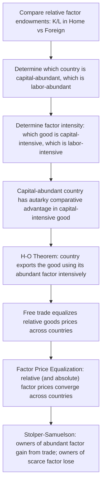

## Heckscher-Ohlin Model

### Definition and Conceptual Overview

The Heckscher-Ohlin (H-O) model is a general equilibrium theory of international trade, developed by Eli Heckscher (1919) and Bertil Ohlin (1933) and later formalized mathematically (notably by Paul Samuelson), which explains the pattern of comparative advantage and trade through cross-country differences in **relative factor endowments** rather than through cross-country differences in technology (the source of comparative advantage in the Ricardian model). The model's central proposition, known as the **Heckscher-Ohlin theorem**, states that a country will export the good that uses its relatively abundant factor of production intensively, and import the good that uses its relatively scarce factor intensively.

Where the Ricardian model has one factor (labor) and explains trade via technology differences, the H-O model has (in its basic form) **two factors of production** (typically capital and labor) and identical technology across countries, explaining trade purely via differences in **factor abundance**.

### Core Assumptions (2x2x2 Model)

- **Two countries** (Home and Foreign), **two goods** (X and Y), **two factors of production** (capital $K$ and labor $L$) — hence "2x2x2"
- **Identical technology** (production functions) across countries for each good
- **Identical, homothetic preferences** across countries (so that at identical relative prices, both countries would demand goods in the same relative proportions)
- **Different relative factor endowments** across countries — this is the sole source of comparative advantage in the model
- **Factor intensity reversal does not occur**: one good is always capital-intensive relative to the other, at all relevant relative factor prices
- **Perfect competition** in all goods and factor markets
- **Constant returns to scale** in production of both goods
- **Diminishing marginal returns** to each factor, holding the other fixed
- **Factors are perfectly mobile domestically** (between industries) but **completely immobile internationally**
- **No transportation costs, tariffs, or other trade barriers**
- **Full employment** of both factors in both countries

### Factor Abundance: Two Definitions

**Physical (quantity) definition**: Home is capital-abundant relative to Foreign if:

$$\frac{K_{\text{Home}}}{L_{\text{Home}}} > \frac{K_{\text{Foreign}}}{L_{\text{Foreign}}}$$

**Price definition**: Home is capital-abundant relative to Foreign if the autarky (pre-trade) rental-wage ratio is lower in Home:

$$\left(\frac{r}{w}\right)_{\text{Home}} < \left(\frac{r}{w}\right)_{\text{Foreign}}$$

where $r$ is the rental rate on capital and $w$ is the wage rate.

**Key Points**

- The price-based definition is generally considered the more rigorous one, because it directly reflects relative scarcity as priced by the market, incorporating both endowments and demand conditions.
- Under the model's assumption of identical, homothetic preferences across countries, the two definitions coincide — the physically capital-abundant country will also have the lower autarky capital rental-to-wage ratio.

### Factor Intensity

A good is **capital-intensive** relative to another if producing it requires a higher capital-to-labor ratio at any given set of factor prices:

$$\left(\frac{K}{L}\right)_X > \left(\frac{K}{L}\right)_Y \implies \text{Good X is capital-intensive relative to Good Y}$$

**Key Points**

- Factor intensity is a *relative* ranking between two goods, not an absolute property of a single good in isolation.
- The model assumes **no factor-intensity reversal**: the ranking of which good is more capital-intensive must hold consistently across the full range of relative factor prices relevant to the analysis; if the ranking could flip at different factor price ratios, several of the model's clean theorems would break down.

### The Heckscher-Ohlin Theorem

**Statement**: A country will export the good that uses its abundant factor intensively, and import the good that uses its scarce factor intensively.

If Home is capital-abundant and Good X is capital-intensive, the H-O theorem predicts Home exports X and imports Y.

**Intuition**: Because Home has relatively more capital, capital is relatively cheap in Home (low $r/w$) in autarky. This makes the capital-intensive good (X) relatively cheap to produce in Home compared to Foreign. Home therefore has a comparative advantage in X, driven not by superior technology (technology is identical) but purely by the relative cheapness of the input it uses intensively.

### Diagrammatic Summary of the Core Logic

### Building Blocks: The Edgeworth Box and Production

Within each country, given the two factors and two goods, an **Edgeworth box** diagram determines the efficient allocation of capital and labor between the two industries, generating a **contract curve** of Pareto-efficient factor allocations. Mapping this contract curve into goods-output space yields the country's **PPF**, which — unlike the linear Ricardian PPF — is typically **concave (bowed outward)** because of diminishing returns to each factor and the fact that reallocating factors between industries with different factor intensities involves increasing opportunity costs.

**Key Points**

- The bowed-out PPF reflects **increasing opportunity cost**: as a country shifts resources further into producing one good, it must use factors that are progressively less well-suited to that good's production, since factor proportions in the two industries typically differ.
- The concavity of the PPF is what generally produces **incomplete specialization** under free trade in the H-O model — unlike the Ricardian model's tendency toward complete specialization.

<svg xmlns="http://www.w3.org/2000/svg" viewBox="0 0 620 440">
<text x="310" y="25" font-family="Arial, sans-serif" font-size="16" font-weight="bold" text-anchor="middle" fill="#1a1a1a">Heckscher-Ohlin: Bowed-Out PPF and Trade (svg_diagram)</text>
<line x1="80" y1="380" x2="80" y2="60" stroke="#333" stroke-width="2" />
<line x1="80" y1="380" x2="540" y2="380" stroke="#333" stroke-width="2" />
<text x="40" y="70" font-family="Arial, sans-serif" font-size="12" fill="#333">Q_Y</text>
<text x="510" y="400" font-family="Arial, sans-serif" font-size="12" fill="#333">Q_X (capital-intensive)</text>
<path d="M 80 90 Q 200 100 320 200 Q 420 280 500 380" fill="none" stroke="#2563eb" stroke-width="2.5" />
<text x="330" y="180" font-family="Arial, sans-serif" font-size="11" fill="#2563eb">Home PPF (capital-abundant, bowed out)</text>
<circle cx="260" cy="175" r="5" fill="#111" />
<text x="180" y="165" font-family="Arial, sans-serif" font-size="10" fill="#111">Autarky production/consumption</text>
<line x1="150" y1="330" x2="420" y2="130" stroke="#16a34a" stroke-width="2" stroke-dasharray="6,4" />
<text x="330" y="150" font-family="Arial, sans-serif" font-size="10" fill="#16a34a">World price line (steeper, favors X)</text>
<circle cx="380" cy="150" r="5" fill="#dc2626" />
<text x="360" y="140" font-family="Arial, sans-serif" font-size="10" fill="#dc2626">Trade production point (more X, incomplete specialization)</text>
<circle cx="300" cy="230" r="5" fill="#9333ea" />
<text x="220" y="250" font-family="Arial, sans-serif" font-size="10" fill="#9333ea">Trade consumption point (beyond PPF)</text>
</svg>

### The Four Core Theorems of the Heckscher-Ohlin Framework

The H-O model is typically taught alongside four interrelated theorems that together describe trade patterns, factor prices, and welfare distribution.

#### 1. Heckscher-Ohlin Theorem (Trade Pattern)

As stated above: countries export goods that intensively use their abundant factor. This is the model's core prediction about the *direction* of trade.

#### 2. Factor Price Equalization (FPE) Theorem

**Statement**: Under free trade in goods (even with zero factor mobility between countries), free trade in goods causes both the *relative* and *absolute* prices of factors to converge across trading countries, potentially becoming fully equalized.

**Mechanism**: As countries specialize according to comparative advantage, Home (capital-abundant) shifts resources into the capital-intensive good, increasing demand for capital relative to labor domestically, which pushes up $r$ and pushes down $w$ (relatively). Foreign experiences the opposite shift. This process continues until, under the model's strict assumptions, factor prices are fully equalized across countries — effectively, trade in goods acts as a *substitute* for the international mobility of factors themselves.

**Key Points**

- Full factor price equalization is a strong theoretical result that requires stringent conditions: both countries must produce both goods (no complete specialization), identical technology, no factor-intensity reversals, and frictionless trade.
- [Inference] The degree to which factor price equalization is observed empirically in the real world is heavily debated, since real-world conditions (transportation costs, tariffs, technology gaps, more than two factors and goods) systematically violate the model's strict assumptions; most economists view FPE as a theoretical benchmark rather than an empirically realized outcome.

#### 3. Stolper-Samuelson Theorem (Income Distribution)

**Statement**: An increase in the relative price of a good increases the real return to the factor used intensively in that good's production, and decreases the real return to the other factor — in absolute terms, not just relative to the other good.

**Application to trade**: When a capital-abundant country opens to trade, the relative price of the capital-intensive good rises (as the country exports more of it and its domestic relative price converges to the higher world price). By the Stolper-Samuelson theorem, this raises the real return to capital (the abundant factor) and lowers the real return to labor (the scarce factor) in that country.

**Key Points**

- This is the theoretical basis for the prediction that trade creates *winners and losers* within a country, even while generating net aggregate gains: owners of the abundant factor gain, owners of the scarce factor lose, in real terms.
- This result underlies debates over trade policy and income inequality — e.g., the concern that trade with labor-abundant developing countries could depress real wages for labor (the scarce factor) in capital-abundant developed countries, all else equal. [Inference] Whether trade liberalization has been a primary driver of observed wage trends in specific real-world economies, relative to other factors like technological change, is a matter of extensive and unresolved empirical debate in labor and trade economics.

#### 4. Rybczynski Theorem (Endowment Changes)

**Statement**: At constant relative goods prices, an increase in the endowment of one factor will increase the output of the good that uses that factor intensively (by more than proportionally) and *decrease* the output of the other good in absolute terms.

**Key Points**

- This theorem is primarily used to analyze the effects of factor accumulation (e.g., capital investment, immigration, population growth) on a country's production structure, holding world prices fixed.
- It provides the supply-side mechanism underlying long-run shifts in comparative advantage as countries accumulate factors over time (e.g., a country accumulating capital over decades gradually shifting its comparative advantage toward capital-intensive goods).

### Comparison: Heckscher-Ohlin vs. Ricardian Model

| Dimension | Ricardian Model | Heckscher-Ohlin Model |
| --- | --- | --- |
| Factors of production | One (labor) | Two or more (capital, labor) |
| Source of comparative advantage | Technology differences across countries | Factor endowment differences across countries |
| Technology across countries | Different | Identical |
| Shape of PPF | Linear (constant opportunity cost) | Concave/bowed-out (increasing opportunity cost) |
| Degree of specialization under trade | Typically complete | Typically incomplete |
| Factor price predictions | Not the primary focus; relative wages bounded by relative productivities | Central predictions: Factor Price Equalization, Stolper-Samuelson |
| Distributional implications | Less emphasis on within-country winners/losers | Explicit: abundant factor owners gain, scarce factor owners lose (Stolper-Samuelson) |

### The Leontief Paradox

An important empirical challenge to the H-O model is the **Leontief Paradox**, from Wassily Leontief's 1953 empirical study of U.S. trade patterns. Contrary to the H-O prediction that the capital-abundant United States should export capital-intensive goods and import labor-intensive goods, Leontief found that U.S. exports were, if anything, *less* capital-intensive than U.S. imports.

**Proposed Explanations / Resolutions**

- **Factor heterogeneity**: treating labor as a single homogeneous factor ignores skill differences; if "human capital" (skilled labor) is treated as a distinct factor in which the U.S. is abundant, the paradox weakens considerably, since U.S. exports tend to be intensive in skilled labor/human capital.
- **Natural resources**: the basic two-factor model omits land/natural resources as a third factor, which can distort simple capital/labor intensity comparisons.
- **Trade policy distortions**: tariffs and non-tariff barriers in the actual (non-frictionless) world economy can shift observed trade patterns away from the frictionless H-O prediction.
- **Demand reversals or non-homothetic preferences**: violations of the identical-homothetic-preferences assumption can also generate deviations from the simple prediction.

[Inference] There is no single, universally agreed-upon resolution to the Leontief Paradox in the trade literature; rather, most economists view the various explanations above (particularly the human-capital augmentation) as jointly contributing to reconciling observed trade patterns with a broadly factor-endowment-based view of comparative advantage.

### Extensions and Generalizations

- **Higher dimensions (many goods, many factors, many countries)**: The clean 2x2x2 theorems (especially strict FPE) generally do not extend cleanly to higher dimensions without additional restrictive assumptions, though weaker "correlation" versions of the theorems (e.g., the Heckscher-Ohlin-Vanek theorem, relating factor content of trade to relative factor abundance) have been developed for the general case.
- **Specific Factors Model as a short-run variant**: Often presented as complementary to H-O, the Specific Factors Model assumes one factor is industry-specific (immobile between sectors) in the short run, while H-O assumes full long-run mobility of both factors between industries — the two models are sometimes viewed as short-run and long-run versions of the same underlying trade theory.
- **New Trade Theory as a complement, not a replacement**: Because H-O (like the Ricardian model) predicts trade based on *inter*-industry specialization, it cannot explain widely observed *intra*-industry trade (countries simultaneously exporting and importing similar goods); this is instead addressed by New Trade Theory models incorporating increasing returns to scale and product differentiation (e.g., Krugman's monopolistic competition trade model).

### Empirical Relevance and Limitations

- Beyond the Leontief Paradox, subsequent empirical tests of the H-O framework (including multi-country, multi-factor tests) have found **mixed support**, generally performing better when human capital and natural resources are included as additional factors, and worse in strict two-factor formulations. [Inference] The overall empirical standing of the Heckscher-Ohlin model relative to competing explanations of trade patterns (e.g., technology-based or increasing-returns-based theories) continues to be actively studied and is not fully settled.
- The model's assumption of identical technology across countries is a significant simplification; in practice, technology differences (Ricardian-style comparative advantage) and factor-endowment differences (H-O-style comparative advantage) likely operate simultaneously in explaining real-world trade patterns.
- The strict assumptions required for factor price equalization (no factor-intensity reversal, both countries producing both goods, frictionless trade) are rarely fully satisfied in practice, so while trade tends to exert *some* pressure toward narrowing factor price gaps, full equalization is a theoretical limiting case rather than an observed outcome.

### Related Topics

- Ricardian Trade Model
- Absolute vs. Comparative Advantage
- Stolper-Samuelson Theorem
- Rybczynski Theorem
- Factor Price Equalization Theorem
- Specific Factors Model (Ricardo-Viner Model)
- Leontief Paradox
- New Trade Theory and Intra-Industry Trade
- Edgeworth Box and Production Efficiency