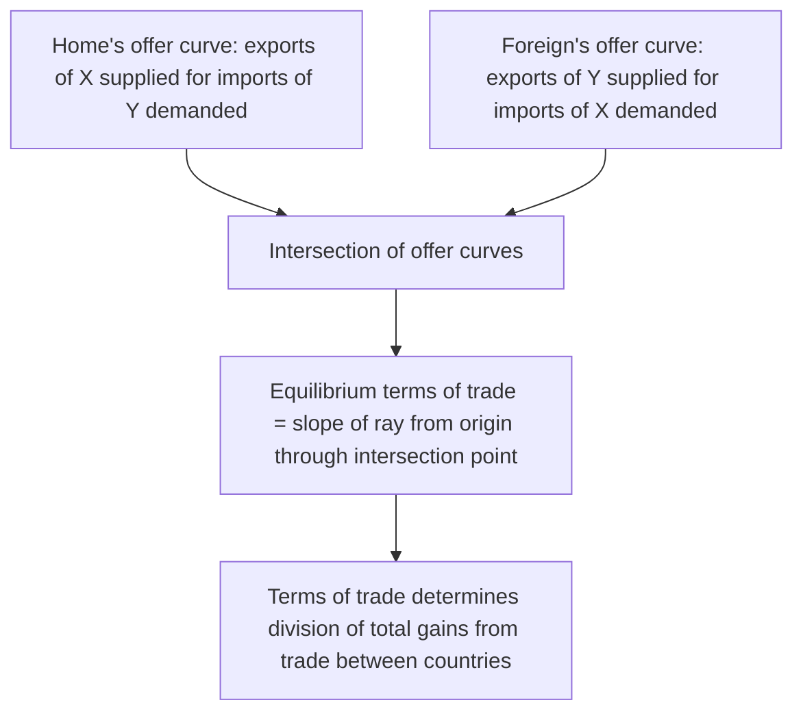

## Terms of Trade

### Definition and Conceptual Overview

**Terms of trade (ToT)** is the ratio at which a country's export goods exchange for its import goods — a measure of the relative price of exports to imports. It captures how much of a country's imports it can obtain for a given quantity of its exports, and is a central concept for assessing whether a country's international trading position is improving or deteriorating over time, independent of changes in trade *volume*.

In the simplest bilateral, two-good context, the terms of trade correspond directly to the world relative price at which trade occurs, as derived in the Ricardian and Heckscher-Ohlin models. In applied and macroeconomic contexts, the terms of trade is more commonly computed as an index comparing a country's export price index to its import price index across many goods.

### The Net Barter Terms of Trade (Basic Formula)

The most commonly used measure is the **net barter terms of trade (NBTT)**, defined as:

$$\text{ToT} = \frac{P_X}{P_M} \times 100$$

where $P_X$ is an index of export prices and $P_M$ is an index of import prices, both typically measured relative to a common base year (so the base-year ToT equals 100).

**Key Points**

- A **rise** in the terms of trade index means export prices are rising faster than (or falling slower than) import prices — the country can obtain more imports per unit of exports, generally interpreted as a favorable or "improving" terms of trade.
- A **fall** in the terms of trade index means the country must export more to obtain the same quantity of imports — generally interpreted as unfavorable or "deteriorating" terms of trade.
- The terms of trade is a **relative price**, not an absolute welfare measure by itself — its welfare implications depend on trade volumes and the underlying causes of the price movement.

### Terms of Trade in the Two-Good Trade Model

In the simple two-country, two-good framework used in the Ricardian and Heckscher-Ohlin models, the terms of trade is simply the world equilibrium relative price:

$$\text{ToT} = \frac{P_X}{P_M}$$

For this price to represent mutually beneficial trade, it must lie strictly between the two countries' autarky opportunity cost ratios — as established in the Ricardian model:

$$\left(\frac{P_X}{P_M}\right)_{\text{Home autarky}} < \text{ToT}_{\text{world}} < \left(\frac{P_X}{P_M}\right)_{\text{Foreign autarky}}$$

**Key Points**

- Where exactly the world relative price settles within this range determines *how the gains from trade are divided* between the two countries — a terms of trade closer to Home's own autarky price means Home captures a smaller share of the gains, while a terms of trade closer to Foreign's autarky price means Home captures a larger share.
- This division is not determined by production costs alone; it depends on relative demand conditions in each country, formalized through **reciprocal demand** and **offer curves** (developed by John Stuart Mill and later formalized graphically by Alfred Marshall and Francis Edgeworth).

### Offer Curves and the Determination of Equilibrium Terms of Trade

An **offer curve** (or reciprocal demand curve) traces out, for each possible terms of trade, the quantity of exports a country is willing to offer in exchange for a corresponding quantity of imports it desires, given its production and consumption preferences. The equilibrium terms of trade is found where the two countries' offer curves intersect — the price at which the quantity Home wishes to export exactly matches the quantity Foreign wishes to import, and vice versa.

<svg xmlns="http://www.w3.org/2000/svg" viewBox="0 0 600 440">
<text x="300" y="25" font-family="Arial, sans-serif" font-size="16" font-weight="bold" text-anchor="middle" fill="#1a1a1a">Offer Curves and Equilibrium Terms of Trade (svg_diagram)</text>
<line x1="80" y1="380" x2="80" y2="60" stroke="#333" stroke-width="2" />
<line x1="80" y1="380" x2="540" y2="380" stroke="#333" stroke-width="2" />
<text x="40" y="70" font-family="Arial, sans-serif" font-size="12" fill="#333">Imports of Y</text>
<text x="500" y="400" font-family="Arial, sans-serif" font-size="12" fill="#333">Exports of X</text>
<path d="M 80 380 Q 200 300 280 200 Q 330 150 370 100" fill="none" stroke="#2563eb" stroke-width="2.5" />
<text x="330" y="130" font-family="Arial, sans-serif" font-size="11" fill="#2563eb">Home's offer curve</text>
<path d="M 80 380 Q 250 340 350 260 Q 420 200 460 130" fill="none" stroke="#16a34a" stroke-width="2.5" />
<text x="420" y="180" font-family="Arial, sans-serif" font-size="11" fill="#16a34a">Foreign's offer curve</text>
<circle cx="330" cy="245" r="6" fill="#dc2626" />
<text x="340" y="240" font-family="Arial, sans-serif" font-size="11" fill="#dc2626">Equilibrium (intersection)</text>
<line x1="80" y1="380" x2="450" y2="120" stroke="#9333ea" stroke-width="1.5" stroke-dasharray="4,4" />
<text x="380" y="110" font-family="Arial, sans-serif" font-size="10" fill="#9333ea">Slope of ray = equilibrium ToT</text>
</svg>

### Types of Terms of Trade Measures

While the net barter terms of trade is the most widely cited measure, several related indices adjust for different economic considerations:

| Measure | Formula/Focus | What It Captures |
| --- | --- | --- |
| **Net Barter Terms of Trade (NBTT)** | $P_X/P_M \times 100$ | Basic relative price of exports to imports |
| **Income Terms of Trade** | $(P_X/P_M) \times Q_X$ | Purchasing power of a country's *total* export earnings over imports — accounts for export volume, not just price |
| **Single Factoral Terms of Trade** | NBTT adjusted for productivity changes in the export sector | Whether productivity gains in export production are being captured domestically or passed to trading partners via lower prices |
| **Double Factoral Terms of Trade** | Single factoral ToT further adjusted for productivity changes in the import-competing (foreign) sector | The exchange of domestic *factor services* embodied in exports for foreign factor services embodied in imports |

**Key Points**

- The **income terms of trade** is particularly relevant when a country experiences deteriorating prices (falling NBTT) but rising export volumes — a country's total import purchasing power can still rise even as its NBTT falls, if the volume effect dominates the price effect.
- **Factoral terms of trade** measures are used to assess whether a country's real income from trade is improving once productivity changes (not just prices) are taken into account — distinguishing a "worse deal" from merely "producing exports more cheaply."

### Determinants of Terms of Trade Movements

- **Changes in relative supply**: A productivity increase in a country's export sector that lowers its own autarky opportunity cost of the export good tends to shift the world equilibrium price against that country (a form of the phenomenon behind the "immiserizing growth" concept below), all else equal.
- **Changes in relative demand**: An increase in world demand for a country's export good relative to its import good raises that country's terms of trade, all else equal.
- **Changes in trade policy**: Tariffs and export subsidies can shift the effective terms of trade a country faces; a "large country" imposing an optimal tariff can, in principle, improve its terms of trade at the expense of its trading partner (the basis of the **optimal tariff argument** in trade policy theory).
- **Exchange rate movements**: For countries whose export and import prices are denominated differently or respond differently to exchange rate changes, currency appreciation or depreciation can shift the terms of trade, particularly in the short run before full price pass-through occurs.
- **Commodity price cycles**: Countries specializing in primary commodity exports (e.g., oil, agricultural goods, minerals) often experience significant terms of trade volatility driven by global commodity price cycles, largely independent of their own domestic productivity or policy choices.

### Terms of Trade and Economic Welfare

An improvement in the terms of trade generally raises a country's real income and consumption possibilities, since it can obtain more imports for the same volume of exports — effectively equivalent to a positive income shock from the perspective of the trading country's consumers, even without any change in domestic production.

**Key Points**

- The welfare effect of a terms of trade change is not necessarily symmetric across all residents of a country: exporters and import-competing producers are affected differently, connecting terms of trade movements to the distributional predictions of the Stolper-Samuelson theorem when the price change is driven by trade itself.
- Terms of trade improvements driven by a country's own export productivity growth are generally welfare-improving; however, a special case — **immiserizing growth**, formalized by Jagdish Bhagwati — describes a scenario in which productivity growth in a country's export sector is so large that it substantially worsens the country's terms of trade (by flooding world markets with the export good and depressing its price), potentially reducing the country's overall welfare despite the increase in physical output. This is a theoretical possibility that requires a highly inelastic foreign demand for the export good and a large ("large country") effect on world prices; it is not considered a typical outcome of export-sector growth.

### Terms of Trade for Developing and Commodity-Exporting Economies

A long-standing debate in development economics concerns the **Prebisch-Singer hypothesis**, which argues that the terms of trade of primary-commodity-exporting (typically developing) countries exhibit a long-run secular *declining* trend relative to manufactured-goods-exporting (typically developed) countries, due to differences in income elasticity of demand (manufactured goods having higher income elasticity than primary commodities) and market structure differences between the two types of goods.

**Key Points**

- The Prebisch-Singer hypothesis has historically been used to argue for import-substitution industrialization policies in developing economies, on the grounds that reliance on primary commodity exports would lead to persistently worsening terms of trade over time.
- [Unverified] The empirical validity of a persistent, universal secular decline in commodity terms of trade, as originally hypothesized by Prebisch and Singer, remains contested in the development economics literature, with different studies finding support depending on the time period, commodity basket, and econometric methodology used.

### Measurement in Practice

In applied macroeconomic statistics, the terms of trade index is typically constructed using:

$$\text{ToT}_t = \frac{\left(\sum_i p_{X,i,t} q_{X,i,0}\right) / \left(\sum_i p_{X,i,0} q_{X,i,0}\right)}{\left(\sum_i p_{M,i,t} q_{M,i,0}\right) / \left(\sum_i p_{M,i,0} q_{M,i,0}\right)} \times 100$$

using a Laspeyres-type weighted export and import price index (fixed base-period quantity weights), analogous to standard consumer or producer price index construction, though Paasche or chained (Fisher) index variants are also used by different national statistical agencies. Reported terms of trade statistics are commonly published by national statistical offices and international organizations tracking trade and balance-of-payments data.

### Related Topics

- Ricardian Trade Model
- Heckscher-Ohlin Model and Factor Endowments
- Offer Curves and Reciprocal Demand
- Optimal Tariff Argument and Trade Policy
- Stolper-Samuelson Theorem
- Immiserizing Growth
- Prebisch-Singer Hypothesis
- Balance of Payments and Exchange Rate Determination