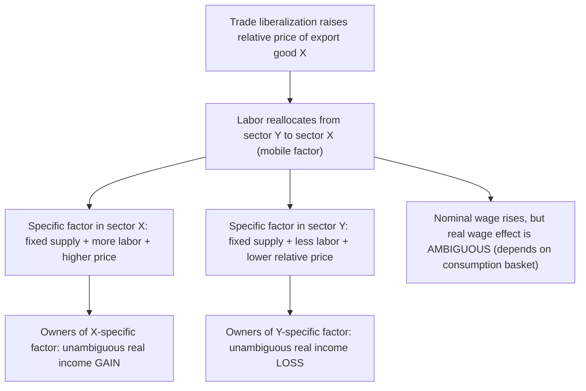

## Winners and Losers from Trade

### Definition and Conceptual Overview

The proposition that trade generates aggregate net gains for participating countries is one of the most robust results in international economics. However, this aggregate gain coexists with a critical and equally robust result: trade typically produces **distributional effects** within each country, creating winners and losers even as the country as a whole benefits. Understanding *why* trade harms specific groups even while raising aggregate welfare — and *which* groups are affected — is essential to reconciling the economic case for trade liberalization with the political economy of trade policy, protectionism, and compensation schemes.

This topic synthesizes results from several core trade models (Ricardian, Specific Factors, Heckscher-Ohlin) to identify the mechanisms through which trade redistributes income, and distinguishes redistribution from aggregate loss.

### The Aggregate Gains vs. Distributional Effects Distinction

**Key Points**

- The standard trade models establish that total gains from trade are positive: the sum of gains to winners exceeds the sum of losses to losers, meaning the winners could, *in principle*, fully compensate the losers and still be better off (this is the logic of a potential Pareto improvement, related to the **Kaldor-Hicks compensation criterion**).
- Whether such compensation actually occurs is a separate, empirical and political question — the theoretical existence of aggregate gains does not guarantee that any individual factor owner, worker, or firm is made better off by trade liberalization in practice.
- Distinguishing "trade produces losers" from "trade reduces total welfare" is one of the most important analytical distinctions in trade policy debates; the models below explain the former without contradicting the latter.

### Mechanism 1: The Specific Factors Model (Short-Run Distribution)

The **Specific Factors Model** (also called the Ricardo-Viner model) assumes two goods are produced using labor (mobile between sectors) plus a sector-specific factor (immobile, e.g., sector-specific capital or land) unique to each industry. This model is typically used to analyze the *short-run* distributional effects of trade, before factors have time to relocate between industries.

#### Setup

- Good X uses labor $L_X$ and specific factor $K_X$ (immobile, used only in sector X)
- Good Y uses labor $L_Y$ and specific factor $T_Y$ (immobile, used only in sector Y)
- Labor $L = L_X + L_Y$ is freely mobile between the two sectors
- Wage $w$ equalizes across both sectors in equilibrium

#### Effect of a Price Change

Suppose trade liberalization raises the relative price of Good X (the country's export good). The value of the marginal product of labor in sector X rises, drawing labor out of sector Y and into sector X until wages re-equalize at a higher level.

**Key Points**

- **The specific factor in the expanding sector (X) unambiguously gains**: with more labor now working alongside a *fixed* quantity of the specific factor $K_X$, and a higher output price, the marginal product — and thus the return — to $K_X$ rises in both nominal and real terms.
- **The specific factor in the contracting sector (Y) unambiguously loses**: with labor flowing out and a fixed quantity of $T_Y$ now combined with less labor, the return to $T_Y$ falls in both nominal and real terms.
- **The mobile factor (labor) has an ambiguous outcome**: the nominal wage rises (since labor is now more productive on average, having moved toward the higher-value sector), but *real* wages depend on the consumption bundle — labor's real wage rises in terms of Good Y (the good whose relative price fell) but falls in terms of Good X (the good whose relative price rose). Whether workers are better or worse off overall depends on their specific consumption preferences between X and Y.

<svg xmlns="http://www.w3.org/2000/svg" viewBox="0 0 600 400">
<text x="300" y="25" font-family="Arial, sans-serif" font-size="16" font-weight="bold" text-anchor="middle" fill="#1a1a1a">Specific Factors Model: Distributional Effects (svg_diagram)</text>
<rect x="60" y="80" width="200" height="100" fill="none" stroke="#2563eb" stroke-width="2" />
<text x="160" y="70" font-family="Arial, sans-serif" font-size="12" font-weight="bold" text-anchor="middle" fill="#2563eb">Sector X (export, expanding)</text>
<text x="160" y="110" font-family="Arial, sans-serif" font-size="11" text-anchor="middle" fill="#111">Specific factor K_X</text>
<text x="160" y="130" font-family="Arial, sans-serif" font-size="11" text-anchor="middle" fill="#16a34a">↑ Real return (WINNER)</text>
<text x="160" y="160" font-family="Arial, sans-serif" font-size="11" text-anchor="middle" fill="#111">More labor inflow</text>
<rect x="340" y="80" width="200" height="100" fill="none" stroke="#dc2626" stroke-width="2" />
<text x="440" y="70" font-family="Arial, sans-serif" font-size="12" font-weight="bold" text-anchor="middle" fill="#dc2626">Sector Y (import-competing, contracting)</text>
<text x="440" y="110" font-family="Arial, sans-serif" font-size="11" text-anchor="middle" fill="#111">Specific factor T_Y</text>
<text x="440" y="130" font-family="Arial, sans-serif" font-size="11" text-anchor="middle" fill="#dc2626">↓ Real return (LOSER)</text>
<text x="440" y="160" font-family="Arial, sans-serif" font-size="11" text-anchor="middle" fill="#111">Labor outflow</text>
<line x1="260" y1="130" x2="340" y2="130" stroke="#333" stroke-width="2" marker-end="url(#arrow)" />
<text x="300" y="120" font-family="Arial, sans-serif" font-size="10" text-anchor="middle" fill="#333">Labor reallocation ←</text>
<rect x="180" y="240" width="240" height="90" fill="none" stroke="#9333ea" stroke-width="2" />
<text x="300" y="230" font-family="Arial, sans-serif" font-size="12" font-weight="bold" text-anchor="middle" fill="#9333ea">Mobile factor: Labor</text>
<text x="300" y="270" font-family="Arial, sans-serif" font-size="11" text-anchor="middle" fill="#111">Nominal wage rises</text>
<text x="300" y="290" font-family="Arial, sans-serif" font-size="11" text-anchor="middle" fill="#ea580c">Real wage: AMBIGUOUS</text>
<text x="300" y="310" font-family="Arial, sans-serif" font-size="11" text-anchor="middle" fill="#111">(depends on consumption basket)</text>
</svg>

### Mechanism 2: Stolper-Samuelson Theorem (Long-Run Distribution in Heckscher-Ohlin)

In the long run, when *both* factors of production (not just labor) can move freely between industries, the **Heckscher-Ohlin model** and its associated **Stolper-Samuelson theorem** generate a sharper prediction based on factor abundance rather than sector specificity.

**Statement**: When a country opens to trade and the relative price of its capital-intensive export good rises, the real return to the **abundant factor** (used intensively in the export good) rises unambiguously, while the real return to the **scarce factor** (used intensively in the import-competing good) falls unambiguously — in both goods, not just relative to each other.

**Key Points**

- Unlike the Specific Factors Model, Stolper-Samuelson delivers an **unambiguous** prediction for *both* factors (not just the specific factors) because, in the long run, both capital and labor are mobile across sectors and their overall economy-wide returns are determined by which factor is used intensively in the expanding (export) versus contracting (import-competing) sector.
- Applied to trade between a capital-abundant developed country and a labor-abundant developing country: Stolper-Samuelson predicts that in the capital-abundant country, capital owners gain and workers lose (in real terms) from trade liberalization, while in the labor-abundant country, workers gain and capital owners lose.
- This result has been central to policy debates over the relationship between trade liberalization and wage inequality in developed economies, since it implies that expanded trade with labor-abundant countries could depress real wages for labor as a whole in a capital-abundant country, not just in the specific import-competing sector.

### Comparing the Two Models: Short-Run vs. Long-Run Distribution

| Dimension | Specific Factors Model (Short Run) | Heckscher-Ohlin / Stolper-Samuelson (Long Run) |
| --- | --- | --- |
| Factor mobility assumption | One factor mobile (labor), one factor sector-specific | Both factors fully mobile between sectors |
| Clear winners | Specific factor in the expanding (export) sector | The economy-wide abundant factor |
| Clear losers | Specific factor in the contracting (import-competing) sector | The economy-wide scarce factor |
| Ambiguous group | The mobile factor (labor) — real wage effect depends on consumption basket | None — both factors have unambiguous predictions |
| Typical use | Explaining short-run adjustment costs, sector-specific worker/firm impacts | Explaining long-run, economy-wide income distribution shifts (e.g., capital vs. labor share) |
| Policy relevance | Explains why specific industries and communities lobby intensely against trade liberalization | Explains broader debates over trade and aggregate wage/capital income trends |

### Why Losers Often Organize More Effectively Than Winners

A recurring theme in the political economy of trade is that the *distribution* of gains and losses tends to be asymmetric in ways that shape political outcomes, even when aggregate gains are positive.

**Key Points**

- Losses from trade are typically **concentrated** among a relatively small number of workers and firms in specific import-competing industries, who bear large, visible, and immediate costs (e.g., plant closures, job losses in a specific town or sector).
- Gains from trade are typically **diffuse**, spread across a very large number of consumers (through lower prices) and export-sector workers/firms, each of whom benefits by a relatively small amount.
- This asymmetry creates a **collective action problem**: concentrated losers have strong individual incentives to organize, lobby, and politically resist trade liberalization, while diffuse winners have weak individual incentives to organize in support of it, even though the aggregate gains exceed the aggregate losses.
- This dynamic is frequently cited in political economy as a key explanation for persistent protectionist pressure despite the broad economic consensus favoring the net benefits of trade liberalization. [Inference] The relative political weight given to concentrated versus diffuse interests varies significantly across countries and time periods depending on institutional structures (e.g., electoral systems, lobbying regulation), so the strength of this effect is not uniform.

### Adjustment Costs and Trade Adjustment Assistance

Even where a group's *long-run* real income position from trade is ambiguous or even favorable, the transition itself typically imposes **adjustment costs**: displaced workers may face skill mismatches, geographic immobility, unemployment spells, and loss of firm- or industry-specific human capital that is not compensated simply by an eventual re-employment at the new equilibrium wage.

**Key Points**

- These adjustment costs are separate from, and additional to, the steady-state distributional predictions of the Specific Factors and Stolper-Samuelson models — they represent transitional losses that occur even for factors that ultimately benefit in the long run.
- **Trade Adjustment Assistance (TAA)** programs, implemented in several countries, are policy responses designed to compensate or retrain workers displaced by import competition, operationalizing the Kaldor-Hicks logic that winners from trade could, in principle, compensate losers.
- [Inference] The empirical effectiveness of trade adjustment assistance programs in fully offsetting displaced workers' losses is a matter of ongoing empirical evaluation and debate, with mixed findings across different program designs and countries.

### Terms of Trade and Cross-Country Distribution

Beyond within-country distribution, trade can also create winners and losers *between* countries via terms of trade effects (see Terms of Trade). A country whose terms of trade improve due to trade captures a larger share of the total gains from trade, while its trading partner captures a smaller share (though both, in the standard model, still gain something relative to autarky, provided the terms of trade lies strictly between the two countries' autarky price ratios).

**Key Points**

- In the extreme case of an **optimal tariff** imposed by a "large" country with market power, that country can shift the terms of trade in its own favor, effectively capturing gains at its trading partner's expense — an example of one *country* gaining from a trade policy at another country's cost, distinct from the within-country distributional effects discussed above.
- The **Prebisch-Singer hypothesis**, discussed under Terms of Trade, extends this cross-country distributional concern to the claim that primary-commodity-exporting countries may systematically capture a shrinking share of global trade gains over time relative to manufactured-goods exporters.

### Summary Table: Sources of Winners and Losers from Trade

| Source of Distributional Effect | Winners | Losers |
| --- | --- | --- |
| Specific Factors Model (short run) | Specific factor in expanding export sector | Specific factor in contracting import-competing sector |
| Stolper-Samuelson (long run, H-O) | Owners of the economy's abundant factor | Owners of the economy's scarce factor |
| Consumer price effects | Consumers of imported goods (lower prices) | Producers competing directly with cheaper imports |
| Terms of trade shifts | Country whose terms of trade improve | Trading partner whose terms of trade worsen |
| Adjustment/transition costs | N/A (costs are asymmetric to this category) | Displaced workers/firms facing relocation, retraining, or unemployment during transition |

### Related Topics

- Specific Factors Model (Ricardo-Viner Model)
- Stolper-Samuelson Theorem
- Heckscher-Ohlin Model and Factor Endowments
- Terms of Trade
- Optimal Tariff Argument and Trade Policy
- Kaldor-Hicks Compensation Criterion
- Trade Adjustment Assistance
- Political Economy of Protectionism