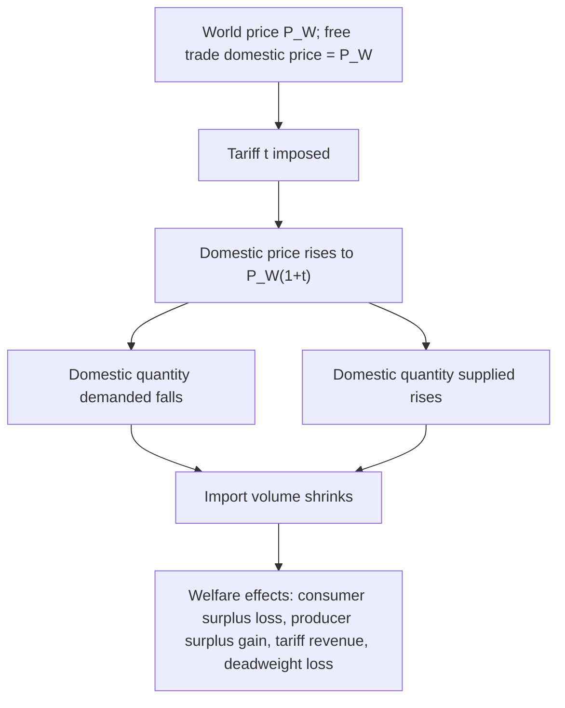

## Trade Policy and Protectionism

### Definition and Conceptual Overview

Trade policy encompasses the set of government interventions that affect the flow of goods and services across international borders — including tariffs, quotas, subsidies, and non-tariff barriers. **Protectionism** refers specifically to trade policies designed to shield domestic industries from foreign competition, typically by raising the effective price or restricting the quantity of imports. While the standard trade models (Ricardian, Heckscher-Ohlin) demonstrate that free trade maximizes aggregate national welfare, protectionist policies persist widely in practice, motivated by a mix of legitimate economic arguments (in specific, limited circumstances), distributional politics, and non-economic objectives.

### Tariffs

#### Definition and Types

A **tariff** is a tax imposed on imported (or, less commonly, exported) goods.

- **Specific tariff**: a fixed monetary charge per unit of the imported good (e.g., $5 per unit)
- **Ad valorem tariff**: a percentage charge based on the value of the imported good (e.g., 10% of import value)
- **Compound tariff**: a combination of specific and ad valorem components

#### Partial Equilibrium Effects of a Tariff (Small Country Case)

For a "small country" (one that cannot influence the world price $P_W$ through its own trade volume), a tariff $t$ raises the domestic price of the imported good to:

$$P_D = P_W(1 + t)$$

This is illustrated in the standard partial-equilibrium tariff diagram, which decomposes the welfare effects into distinct areas.

<svg xmlns="http://www.w3.org/2000/svg" viewBox="0 0 640 460">
<text x="320" y="25" font-family="Arial, sans-serif" font-size="16" font-weight="bold" text-anchor="middle" fill="#1a1a1a">Partial Equilibrium Effects of a Tariff (svg_diagram)</text>
<line x1="90" y1="400" x2="90" y2="60" stroke="#333" stroke-width="2" />
<line x1="90" y1="400" x2="580" y2="400" stroke="#333" stroke-width="2" />
<text x="50" y="70" font-family="Arial, sans-serif" font-size="12" fill="#333">Price</text>
<text x="550" y="420" font-family="Arial, sans-serif" font-size="12" fill="#333">Quantity</text>
<line x1="120" y1="380" x2="560" y2="90" stroke="#2563eb" stroke-width="2" />
<text x="530" y="85" font-family="Arial, sans-serif" font-size="11" fill="#2563eb">Domestic Supply (S)</text>
<line x1="120" y1="90" x2="560" y2="380" stroke="#16a34a" stroke-width="2" />
<text x="500" y="370" font-family="Arial, sans-serif" font-size="11" fill="#16a34a">Domestic Demand (D)</text>
<line x1="90" y1="280" x2="580" y2="280" stroke="#9333ea" stroke-width="2" stroke-dasharray="6,4" />
<text x="590" y="285" font-family="Arial, sans-serif" font-size="10" fill="#9333ea">P_W</text>
<line x1="90" y1="230" x2="580" y2="230" stroke="#dc2626" stroke-width="2" stroke-dasharray="6,4" />
<text x="590" y="235" font-family="Arial, sans-serif" font-size="10" fill="#dc2626">P_W(1+t)</text>
<polygon points="200,280 200,230 270,230 250,280" fill="#fca5a5" opacity="0.6" />
<text x="215" y="260" font-family="Arial, sans-serif" font-size="9" fill="#7f1d1d">DWL (production)</text>
<polygon points="450,280 450,230 470,230 500,280" fill="#fca5a5" opacity="0.6" />
<text x="450" y="260" font-family="Arial, sans-serif" font-size="9" fill="#7f1d1d">DWL (consumption)</text>
<rect x="270" y="230" width="180" height="50" fill="#93c5fd" opacity="0.5" />
<text x="330" y="255" font-family="Arial, sans-serif" font-size="10" fill="#1e3a8a">Tariff revenue (government)</text>
</svg>

#### Welfare Decomposition

Using the standard consumer surplus / producer surplus framework, a tariff imposed by a small (price-taking) country generates four distinct effects:

| Area/Effect | Description | Sign |
| --- | --- | --- |
| Consumer surplus loss | Domestic consumers pay a higher price and consume less | Negative (loss) |
| Producer surplus gain | Domestic producers receive a higher price and expand output | Positive (gain) |
| Tariff revenue | Government collects tariff × import volume | Positive (transfer, not a net loss) |
| Deadweight loss (two triangles) | Production inefficiency (resources drawn into higher-cost domestic production) plus consumption inefficiency (consumers foregoing units they valued above world price) | Negative (net loss) |

**Key Points**

- For a **small country**, a tariff always produces a **net welfare loss** — the sum of the deadweight loss triangles exceeds any gain in producer surplus or government revenue, because the small country cannot affect the world price and therefore captures no offsetting terms-of-trade benefit.
- Tariff revenue and producer surplus gains are **transfers** within the domestic economy (from consumers to producers/government), not net social gains — only the deadweight loss triangles represent genuine losses to the economy as a whole.
- This result reinforces the free-trade conclusion of the Ricardian and Heckscher-Ohlin models: for a small country, unilateral tariff removal is welfare-improving regardless of whether trading partners reciprocate.

#### The Large-Country (Optimal Tariff) Exception

If a country is "large" enough that its import demand affects the world price, a tariff can shift the terms of trade in the importing country's favor (by reducing its demand for the good, thereby depressing the world price its exporters must accept). This introduces a **terms-of-trade gain** that partially or, at a specific tariff rate, more than fully offsets the standard deadweight loss.

**Key Points**

- The **optimal tariff** is the rate that maximizes the large country's national welfare by balancing the terms-of-trade gain against the growing deadweight loss as the tariff rate rises; a tariff beyond this optimal rate reduces welfare, and a sufficiently high tariff can eliminate trade altogether.
- Critically, the optimal tariff argument describes a gain for the *tariff-imposing country* at the expense of its trading partner (a "beggar-thy-neighbor" policy) — it does not represent a gain for the world as a whole, and typically invites retaliation, which can leave both countries worse off than under free trade (a trade-policy version of a prisoner's dilemma).
- [Inference] Whether real-world large-country tariffs are calibrated with this optimal-tariff logic in mind, versus being driven primarily by domestic political-economy considerations, is debated; in practice, most protectionist measures are attributed more to distributional politics (see Winners and Losers from Trade) than to deliberate optimal-tariff calculation.

### Import Quotas

An **import quota** directly restricts the physical *quantity* of a good that can be imported, rather than taxing it. A quota set at the same level as the import volume generated by an equivalent tariff produces broadly similar price and quantity effects on the domestic market, but with a crucial difference in *who captures the revenue*.

**Key Points**

- Under a tariff, the government collects tariff revenue. Under a quota, the "revenue" equivalent (the gap between the domestic price and world price, times the quota quantity) accrues to whoever holds the **import licenses** — this could be domestic import license holders, or, if licenses are allocated to foreign exporters, the *foreign* firms/government (this scenario, called a **voluntary export restraint (VER)**, effectively transfers what would have been domestic tariff revenue to foreign producers).
- Quotas are generally considered less economically transparent and more prone to rent-seeking and administrative/political manipulation (e.g., corruption in license allocation) than tariffs, because the size of the quota rent is often less visible than a published tariff rate.
- Unlike a tariff, a quota provides an absolute cap on import volume regardless of price changes — under a tariff, if domestic demand shifts, import volume can still adjust; under a binding quota, it cannot.

### Export Subsidies

An **export subsidy** is a payment (or tax reduction) by the government to domestic firms conditional on export sales, intended to boost export volumes.

**Key Points**

- For the subsidizing country, an export subsidy generally produces a **net welfare loss**, symmetric in structure to the tariff case: while producers gain and export volume rises, the government bears the cost of the subsidy, and the country's terms of trade (the price its exports command) typically *worsen*, since export subsidies increase world supply and depress the world price — the opposite of the terms-of-trade gain a large country might get from an optimal tariff.
- For the importing (recipient) country, an export subsidy from a trading partner is generally welfare-*improving* (they receive artificially cheap imports), though it may harm domestic producers competing with the subsidized good — this is precisely why import-competing industries in recipient countries frequently petition for **countervailing duties** to offset foreign export subsidies.
- Export subsidies are subject to significant international trade law restrictions (e.g., under World Trade Organization agreements), reflecting their generally distortionary and often welfare-reducing character even from the subsidizing country's own perspective.

### Non-Tariff Barriers (NTBs)

Beyond tariffs, quotas, and subsidies, governments deploy a range of **non-tariff barriers** that restrict trade without necessarily appearing as an explicit tax or quantity limit:

- **Technical barriers to trade**: product standards, safety regulations, or labeling requirements that, whether intentionally or not, disadvantage foreign producers unfamiliar with or unable to easily meet domestic specifications
- **Sanitary and phytosanitary measures**: health and safety regulations on food, plant, and animal products, which can serve legitimate public health purposes while also functioning as a disguised trade barrier
- **Local content requirements**: mandates that a minimum percentage of a final good's components be domestically produced
- **Government procurement preferences**: rules favoring domestic firms in public sector purchasing
- **Administrative/customs delays**: bureaucratic friction that raises the effective cost of importing without any formal tariff or quota

**Key Points**

- Non-tariff barriers have become an increasingly prominent tool of protectionism as multilateral trade agreements have progressively reduced average tariff rates worldwide, since NTBs are often harder to detect, quantify, and challenge under international trade rules than explicit tariffs.
- Distinguishing a *legitimate* regulatory measure (e.g., a genuine food safety standard) from a *disguised* protectionist barrier is often contested in practice and is a recurring subject of trade dispute settlement.

### Economic Arguments for Protectionism

While the aggregate welfare case for free trade is strong under the standard models' assumptions, several arguments are advanced for limited or conditional protectionism:

#### Infant Industry Argument

**Claim**: A developing industry with genuine long-run comparative advantage may be temporarily uncompetitive against established foreign firms due to a lack of scale, experience, or learning-by-doing; temporary protection allows the industry to mature until it becomes internationally competitive, at which point protection can be removed.

**Key Points**

- Economic validity requires that the industry's future competitiveness gain be large enough to outweigh the interim costs of protection, and that the industry could not achieve the same maturation via other means (e.g., private capital markets financing the initial losses in anticipation of future profits) — if capital markets functioned perfectly, protection would not be necessary, since firms could simply borrow against future profitability.
- A frequently cited practical problem is that "temporary" protection tends to become permanent, since the protected industry itself becomes a politically organized interest group lobbying against removal (linking to the political economy dynamics in Winners and Losers from Trade), regardless of whether it has actually achieved competitiveness.
- [Inference] The empirical track record of infant industry protection policies (notably associated with historical import-substitution industrialization strategies in Latin America and elsewhere) is mixed and contested in the development economics literature, with some cases (e.g., certain East Asian economies) cited as more successful than others.

#### National Security Argument

**Claim**: Certain industries (e.g., defense-related manufacturing, critical technology, food security) should be protected from foreign competition to ensure domestic production capacity remains available during conflict, embargo, or supply chain disruption, even if this is not the most cost-efficient outcome in peacetime.

**Key Points**

- This argument does not rest on a claim of economic efficiency but rather accepts an economic cost in exchange for a strategic/security benefit, making it fundamentally a different type of justification than the infant industry argument.
- A common critique is that the national security rationale is broad and easily invoked opportunistically to justify protection for industries with only a tenuous connection to genuine security concerns.

#### Terms-of-Trade (Optimal Tariff) Argument

As discussed above, a large country can, in principle, improve its own national welfare via a tariff calibrated to exploit its market power over world prices — though this comes at its trading partner's expense and risks retaliation.

#### Anti-Dumping Argument

**Dumping** refers to a foreign firm selling a good in an export market at a price below its price in its home market, or below its cost of production. **Anti-dumping duties** are tariffs imposed specifically to offset this practice.

**Key Points**

- The economic case for anti-dumping action is most compelling when dumping is **predatory** — a strategy to drive out domestic competitors and later exploit resulting monopoly power — though genuinely predatory dumping is difficult to distinguish empirically from ordinary international price discrimination based on differing demand elasticities across markets, which does not raise the same competitive concern.
- [Inference] Critics argue that anti-dumping laws, in practice, are frequently used as a protectionist tool against ordinary competitive pricing rather than genuine predatory behavior, though the extent to which this criticism applies varies by jurisdiction and case.

#### Employment and Wage Protection Arguments

**Claim**: Protection preserves domestic jobs and wages in import-competing industries, particularly relevant to the distributional concerns raised by the Stolper-Samuelson theorem (see Winners and Losers from Trade).

**Key Points**

- While protection can preserve employment in the *specific protected sector*, the standard trade models suggest this typically comes at the cost of higher prices for consumers and reduced output/employment in other (especially export) sectors, meaning the net effect on aggregate employment is theoretically ambiguous and is more directly a function of macroeconomic policy (monetary/fiscal) than trade policy in most mainstream economic frameworks. [Inference] The relative importance of trade policy versus other factors (automation, macroeconomic conditions, domestic policy) in explaining aggregate manufacturing employment trends in specific economies remains a genuinely contested empirical question in the literature.
- This argument is best understood as primarily a *distributional* argument (protecting specific, identifiable workers) rather than an aggregate efficiency argument, and is the primary channel through which the political economy dynamics discussed in Winners and Losers from Trade manifest as protectionist policy.

### Retaliation and Trade Wars

Because tariffs (particularly large-country tariffs) can improve the imposing country's welfare partly at its trading partner's expense, they invite retaliatory tariffs from the trading partner, escalating into a **trade war**.

**Key Points**

- The dynamic can be modeled as a **prisoner's dilemma**: while both countries would be jointly better off under mutual free trade, each individually has an incentive to impose a tariff (especially if they anticipate the other doing so or has enough market power to attempt an optimal tariff), and the mutual-retaliation equilibrium leaves both countries worse off than they would be under coordinated free trade.
- This structure explains the theoretical rationale for **multilateral trade agreements and institutions** (e.g., the World Trade Organization) that use reciprocal, binding commitments and dispute-resolution mechanisms to help countries escape this dilemma and sustain lower tariffs than they might choose unilaterally.

### Political Economy of Trade Policy

**Key Points**

- As established in Winners and Losers from Trade, the concentrated losses to import-competing industries and the diffuse gains to consumers create a structural political bias toward protectionist lobbying, since concentrated interest groups face lower collective-action costs than dispersed consumer interests.
- Trade policy outcomes in practice often reflect this asymmetry: industries facing import competition (e.g., certain agricultural and manufacturing sectors) are frequently among the most heavily protected, even where the aggregate efficiency case for protection is weak, because they are politically organized in ways that diffuse consumer interests typically are not.
- Multilateral trade institutions and rules-based agreements are, in part, understood in the political economy literature as mechanisms for governments to credibly resist domestic protectionist pressure by binding themselves to external commitments.

### Related Topics

- Winners and Losers from Trade
- Terms of Trade and the Optimal Tariff Argument
- Ricardian Trade Model
- Heckscher-Ohlin Model and Stolper-Samuelson Theorem
- World Trade Organization and Multilateral Trade Agreements
- Dumping and Anti-Dumping Policy
- Import-Substitution Industrialization
- Political Economy of Protectionism