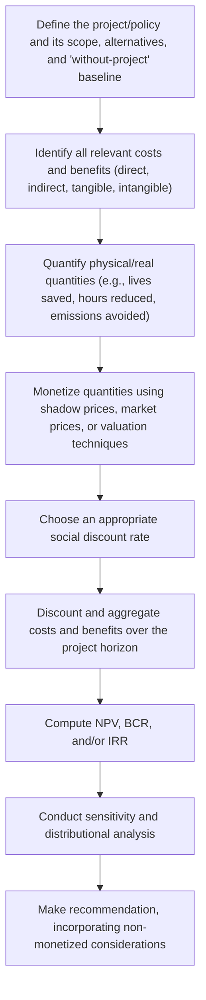

## Cost-Benefit Analysis

### Definition and Conceptual Overview

**Cost-benefit analysis (CBA)** is a systematic framework for evaluating a policy, project, or investment decision by quantifying, monetizing, and comparing its total expected costs against its total expected benefits, typically expressed as a single summary decision criterion (such as net present value or a benefit-cost ratio). CBA extends the microeconomic logic of consumer and producer surplus, opportunity cost, and welfare economics to real-world decision problems, particularly public policy and government project evaluation, where market prices alone may not fully capture social value.

The theoretical foundation of CBA rests on the **potential Pareto improvement** (Kaldor-Hicks) criterion: a policy is deemed worthwhile if the aggregate gains to winners exceed the aggregate losses to losers, such that winners could, in principle, fully compensate losers and still be better off — regardless of whether such compensation is actually paid.

### The Core Decision Rule

#### Net Present Value (NPV)

Because costs and benefits typically occur at different points in time, CBA requires discounting future values to a common present-value basis:

$$NPV = \sum_{t=0}^{T} \frac{B_t - C_t}{(1+r)^t}$$

where $B_t$ is benefits in year $t$, $C_t$ is costs in year $t$, $r$ is the discount rate, and $T$ is the project's time horizon.

**Decision rule**: accept the project if $NPV > 0$; among mutually exclusive alternatives, choose the option with the highest NPV.

#### Benefit-Cost Ratio (BCR)

$$BCR = \frac{\sum_{t=0}^{T} \dfrac{B_t}{(1+r)^t}}{\sum_{t=0}^{T} \dfrac{C_t}{(1+r)^t}}$$

**Decision rule**: accept the project if $BCR > 1$.

**Key Points**

- NPV and BCR generally agree on accept/reject decisions for a single independent project, but can **rank mutually exclusive projects differently**, particularly when projects differ substantially in scale — NPV is generally preferred for ranking mutually exclusive projects because it reflects the absolute magnitude of net social value created, whereas BCR is a ratio that can favor a smaller project with a higher ratio but lower absolute net benefit.
- The **Internal Rate of Return (IRR)** — the discount rate at which $NPV = 0$ — is a third commonly reported metric, useful for comparing a project's implied return against a hurdle rate, but can produce multiple or undefined solutions when cash flows change sign more than once over the project's life.

### The CBA Process

### Identifying and Categorizing Costs and Benefits

| Category | Definition | Example |
| --- | --- | --- |
| **Direct costs/benefits** | Immediate, intended effects of the project on its primary target | Construction costs of a highway; time savings for highway users |
| **Indirect (secondary) costs/benefits** | Spillover effects on parties or markets beyond the immediate target | Increased business activity in towns along a new highway |
| **Tangible costs/benefits** | Effects with a relatively straightforward market price or observable quantity | Fuel savings, construction materials |
| **Intangible costs/benefits** | Effects without an obvious market price, requiring non-market valuation techniques | Improved air quality, reduced noise, aesthetic value, statistical lives saved |
| **Real costs/benefits** | Effects that represent a genuine change in the economy's use of resources or welfare | New output produced, resources consumed |
| **Pecuniary (transfer) costs/benefits** | Effects that merely redistribute existing wealth between parties without changing total resources | A tax that shifts income from one group to another with no change in production |

**Key Points**

- A common analytical error is including **transfer payments** (e.g., taxes, subsidies) as a net social cost or benefit; because a transfer is simply a redistribution (a loss to the payer exactly offset by a gain to the recipient), it does not represent a change in the total resources available to society and should generally be *excluded* from an efficiency-focused CBA (though transfers matter for the separate distributional analysis, discussed below).
- **Double-counting** is another frequent error — for example, counting both a highway's time savings *and* the resulting increase in nearby property values, when the latter may simply be a capitalization of the former into land prices rather than an additional, independent source of social value.

### Opportunity Cost as the Basis for Costing

Consistent with core microeconomic theory, CBA values costs at their **opportunity cost** — the value of resources in their next-best alternative use — rather than at their historical or accounting cost. This is particularly important for:

- **Sunk costs**: costs already incurred and unrecoverable regardless of the current decision must be excluded from a forward-looking CBA, since they do not represent a genuine opportunity cost of proceeding versus not proceeding.
- **Non-market inputs**: e.g., government-owned land used for a project should be valued at its opportunity cost (what it could earn or be sold for in its next-best use), not at zero simply because no cash payment changes hands.
- **Volunteer or unpaid labor**: valued at the opportunity cost of the volunteers' time (e.g., their forgone wage or leisure value), not at zero.

### Non-Market Valuation Techniques

Because many benefits and costs relevant to public policy (health, environmental quality, safety, recreation) lack observable market prices, CBA relies on a range of valuation methodologies to derive **shadow prices** — estimated prices that reflect the true social opportunity cost or value of a good, correcting for market distortions or the complete absence of a market.

#### Revealed Preference Methods

These infer value from observed market behavior related to the non-market good.

- **Hedonic pricing**: decomposes the price of a market good (e.g., housing) into implicit prices for its constituent attributes (e.g., air quality, school quality, noise levels), using the correlation between attribute levels and price across many observed transactions to estimate willingness to pay for the non-market attribute.
- **Travel cost method**: infers the recreational value of a non-market site (e.g., a national park) from the time and money costs visitors incur to travel there, treating "travel cost" as an implicit price and visit frequency as the corresponding quantity demanded.
- **Averting/defensive behavior method**: infers value from spending on averting behaviors (e.g., purchasing bottled water to avoid contaminated tap water), using such expenditures as a lower-bound estimate of the value placed on avoiding the underlying harm.

#### Stated Preference Methods

These directly ask individuals to reveal their valuations through surveys, used when no relevant market behavior exists to observe.

- **Contingent valuation method (CVM)**: surveys respondents directly about their willingness to pay (WTP) for a benefit or willingness to accept (WTA) compensation for a cost, using hypothetical market scenarios.
- **Choice experiments (discrete choice modeling)**: presents respondents with a series of hypothetical alternatives differing in multiple attributes (including price), inferring implicit valuations of each attribute from respondents' choices.

**Key Points**

- Stated preference methods are more flexible (can value goods with no market proxy at all, such as pure existence value of a species) but are more vulnerable to **hypothetical bias** — respondents may answer differently in a hypothetical survey than they would with real money at stake.
- Revealed preference methods are grounded in actual behavior but can only value goods connected to some observable market activity, and can conflate the value of the target attribute with other unobserved factors correlated with it (an omitted-variable concern in hedonic and travel-cost estimation).

### The Value of a Statistical Life (VSL)

A widely used and often controversial valuation concept in health and safety CBA is the **Value of a Statistical Life (VSL)**, which does *not* attempt to price an individual life, but rather estimates the aggregate willingness to pay across a population for a small reduction in mortality risk, divided by the expected number of statistical lives saved.

$$VSL = \frac{\text{Aggregate WTP for risk reduction}}{\text{Expected number of lives saved}}$$

**Example**: If 100,000 people are each willing to pay $50 for a safety improvement that is expected to prevent one death among the group (reducing individual risk by 1-in-100,000), the implied VSL is $100{,}000 \times \$50 = \$5{,}000{,}000$.

**Key Points**

- VSL estimates are typically derived from wage-risk studies (a hedonic pricing application, estimating the wage premium workers require to accept jobs with higher occupational fatality risk) or stated-preference surveys about willingness to pay for small risk reductions.
- Government agencies in many countries use official VSL estimates for regulatory CBA (e.g., in environmental, transportation, and workplace safety regulation), though these values vary substantially by country, agency, and methodology. [Unverified] Specific current official VSL figures used by particular regulatory agencies are subject to periodic revision and should be verified against the relevant agency's current guidance rather than assumed static.
- The concept is ethically and methodologically contested — critics raise concerns about whether it is appropriate to place a monetary value on life at all, whether WTP-based measures adequately reflect distributional and ethical considerations, and whether they are sensitive to respondents' ability to pay (WTP is constrained by income, potentially undervaluing risk reduction benefits for lower-income populations).

### Choosing the Discount Rate

The discount rate $r$ used in NPV calculations has an outsized effect on long-horizon projects (e.g., climate change mitigation, infrastructure with multi-decade lifespans), since it determines how heavily future costs and benefits are downweighted relative to present ones.

**Key Points**

- A commonly used benchmark is the **social opportunity cost of capital** — the rate of return that resources would have earned in their best alternative use, often approximated by the rate of return on private investment.
- An alternative approach uses the **social rate of time preference** — reflecting society's valuation of present versus future consumption, often estimated using components including the pure rate of time preference and the elasticity of marginal utility of consumption combined with expected consumption growth (the **Ramsey formula**).
- The choice of discount rate is especially consequential and contested for very long-horizon policy questions (e.g., climate change), where even small differences in the discount rate can dramatically change whether costs borne by future generations justify present-day mitigation spending — this is a genuinely disputed area in both economic theory and public policy, with reasonable disagreement among economists about the appropriate rate for intergenerational decisions. [Inference] There is no single, universally agreed discount rate appropriate for very-long-horizon or intergenerational CBA; the appropriate choice remains an active area of debate in environmental and public economics.

### Distributional Analysis and Weighting

Because the Kaldor-Hicks criterion underlying standard CBA does not require that compensation actually be paid, a project can pass a CBA test (aggregate benefits exceed aggregate costs) while still making specific groups significantly worse off — directly paralleling the winners-and-losers dynamic discussed in trade policy analysis.

**Key Points**

- Some CBA frameworks incorporate **distributional weights**, adjusting the value of a dollar of cost or benefit based on who bears it (e.g., weighting benefits to lower-income groups more heavily than benefits to higher-income groups), reflecting the idea that the marginal utility of a dollar differs across income levels.
- Applying distributional weights is more common in some regulatory and international development contexts than others, and remains a point of methodological and normative disagreement — using unweighted analysis implicitly treats a dollar of value identically regardless of recipient, while weighting requires an explicit (and contestable) social welfare function.
- Regardless of whether formal distributional weights are applied, best practice in CBA typically includes reporting a **distributional analysis** alongside the aggregate NPV/BCR figures, identifying which groups bear the costs and which capture the benefits, so decision-makers can weigh efficiency and equity considerations separately.

### Sensitivity and Risk Analysis

Because CBA inputs (cost estimates, benefit valuations, discount rates, future demand projections) are inherently uncertain, robust CBA practice includes:

- **Sensitivity analysis**: recalculating NPV/BCR under alternative assumptions for key uncertain parameters (e.g., a range of discount rates, a range of VSL estimates) to assess how sensitive the conclusion is to those assumptions.
- **Scenario analysis**: evaluating outcomes under a small number of distinct, internally consistent future scenarios (e.g., optimistic, baseline, pessimistic).
- **Monte Carlo/probabilistic analysis**: assigning probability distributions to uncertain inputs and simulating the resulting distribution of NPV outcomes, providing a fuller picture of risk than single-point sensitivity analysis.
- **Expected value under uncertainty**: for costs or benefits contingent on uncertain future states, using probability-weighted expected values (connecting to expected utility theory under risk and uncertainty).

### Illustrative Worked Example

Consider a proposed public infrastructure project with the following (simplified) discounted cash flow profile using a discount rate of 5%:

| Year | Costs | Benefits | Net Cash Flow | Discount Factor | Discounted Net Flow |
| --- | --- | --- | --- | --- | --- |
| 0 | $10,000,000 | $0 | −$10,000,000 | 1.000 | −$10,000,000 |
| 1–10 | $500,000/yr | $2,000,000/yr | $1,500,000/yr | (annuity factor ≈ 7.722) | ≈ $11,583,000 |

$$NPV \approx -\$10{,}000{,}000 + \$11{,}583{,}000 = \$1{,}583{,}000$$

$$BCR = \frac{PV(\text{Benefits})}{PV(\text{Costs})} = \frac{\$2{,}000{,}000 \times 7.722}{\$10{,}000{,}000 + (\$500{,}000 \times 7.722)} = \frac{\$15{,}444{,}000}{\$13{,}861{,}000} \approx 1.11$$

**Key Points**

- With $NPV > 0$ and $BCR > 1$, the standard decision rule recommends proceeding with the project, based purely on the efficiency criterion.
- This conclusion would still need to be supplemented with a distributional analysis (who bears the $10 million upfront cost vs. who receives the $2 million/year in benefits) and a sensitivity check on the assumed 5% discount rate and benefit estimates before a full policy recommendation is warranted.

### Limitations and Critiques of Cost-Benefit Analysis

- **Valuation difficulty and subjectivity**: monetizing intangible goods (ecosystems, cultural heritage, statistical lives) inherently involves methodological choices and assumptions that can significantly shift results, and different valuation techniques can produce materially different estimates for the same underlying good.
- **Kaldor-Hicks compensation is hypothetical, not actual**: as noted, a positive CBA result does not guarantee that any actual compensation is paid to those who bear net costs, meaning CBA alone cannot fully substitute for explicit consideration of equity and distributional justice.
- **Incommensurability concerns**: critics argue that reducing all considerations (safety, environmental quality, cultural value, human life) to a single monetary metric can obscure important qualitative distinctions or ethical considerations that resist meaningful quantification.
- **Discount rate sensitivity for long-horizon and intergenerational decisions**: as discussed above, this remains a genuinely disputed area with major practical consequences, particularly for climate and environmental policy.
- **Strategic/political manipulation risk**: because CBA involves numerous methodological choices (discount rate, valuation method, scope of costs/benefits included), it can potentially be manipulated to support a predetermined conclusion, making transparency about assumptions and sensitivity analysis particularly important for CBA credibility.
- **Uncertainty and irreversibility**: standard expected-value CBA may inadequately handle decisions involving potentially catastrophic or irreversible outcomes (e.g., certain environmental risks), motivating alternative or supplementary decision frameworks such as the precautionary principle or real options analysis in some policy contexts. [Inference] The appropriate role of standard CBA relative to these alternative frameworks in high-uncertainty, high-irreversibility contexts remains an actively debated methodological question rather than a settled matter.

### Related Topics

- Consumer and Producer Surplus
- Kaldor-Hicks Compensation Criterion and Welfare Economics
- Externalities and Market Failure
- Public Goods and Government Intervention
- Expected Utility Theory and Risk/Uncertainty
- Discounting and the Social Rate of Time Preference
- Environmental Valuation and the Precautionary Principle
- Regulatory Impact Analysis