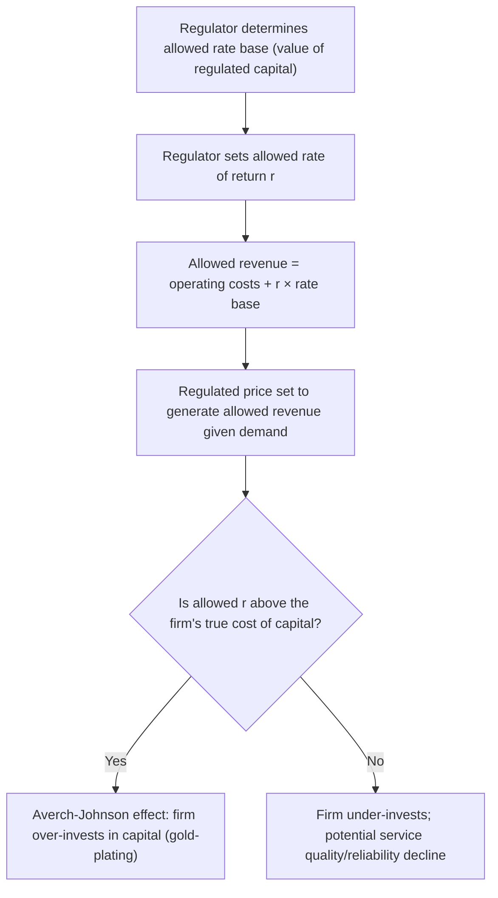

## Regulatory Economics

### Definition and Conceptual Overview

**Regulatory economics** is the branch of applied microeconomics that studies the rationale, design, and effects of government rules governing the behavior of firms and markets — particularly rules addressing market failures such as monopoly power, externalities, and information asymmetries. Unlike broad fiscal or trade policy, regulation typically operates through direct legal constraints on firm conduct (price controls, entry restrictions, quality/safety standards, disclosure requirements) rather than through taxes, subsidies, or tariffs. The field examines both the theoretical justifications for regulation (why intervention might improve on unregulated market outcomes) and the practical difficulties and unintended consequences that arise from regulatory design and implementation.

### Rationales for Regulation

#### Natural Monopoly

A **natural monopoly** arises when a single firm can supply the entire market at lower cost than two or more firms could, due to substantial economies of scale relative to market demand — typically because of very high fixed costs and declining average costs over the relevant range of output (e.g., electricity transmission, water utilities, certain telecommunications infrastructure).

**Key Points**

- In a natural monopoly, average cost declines throughout the relevant output range, meaning marginal cost lies below average cost; unregulated monopoly pricing (where marginal revenue equals marginal cost) would set price above marginal cost, restrict output below the efficient level, and generate deadweight loss, exactly as in standard monopoly analysis — but breaking up the monopoly into competing firms would raise total industry costs by sacrificing scale economies.
- This creates the classic **natural monopoly regulatory dilemma**: efficient pricing (price equal to marginal cost) would require the firm to sell at a loss (since marginal cost is below average cost), making marginal-cost pricing financially unsustainable without a subsidy, while average-cost pricing avoids losses but sacrifices some allocative efficiency.

#### Externalities

As with taxes and subsidies (Pigouvian correction), regulation is often justified as a direct, non-price mechanism for addressing externalities — for example, emissions standards, safety codes, and zoning restrictions that constrain behavior generating negative externalities, in lieu of or alongside price-based corrective taxes.

#### Information Asymmetry

Regulation frequently targets markets where sellers possess information consumers cannot easily verify (product safety, financial product risk, professional service quality), justified on the grounds that unregulated markets in such settings can suffer from adverse selection or systematically fail to provide consumers adequate protection through market mechanisms alone (e.g., licensing requirements for doctors, mandatory financial disclosures, food safety standards).

#### Market Power Beyond Natural Monopoly

Regulation (including antitrust/competition policy, discussed separately from direct rate regulation) can also address market power arising from strategic behavior, barriers to entry, or network effects, even where the underlying cost structure does not strictly require a single-firm outcome.

### Rate-of-Return Regulation

**Rate-of-return regulation** (historically the dominant approach to regulating natural monopoly utilities) sets the regulated price to allow the firm to recover its operating costs plus a specified, "fair" rate of return on its invested capital base.

$$\text{Allowed Revenue} = \text{Operating Costs} + (r \times \text{Rate Base})$$

where $r$ is the allowed rate of return and the rate base is the value of the firm's regulated capital assets.

**Key Points**

- **The Averch-Johnson effect**: if the allowed rate of return $r$ exceeds the firm's true cost of capital, the firm has an incentive to over-invest in capital assets (since a larger rate base directly increases allowed profit) beyond the cost-minimizing level — a form of regulation-induced inefficiency sometimes called "gold-plating."
- Rate-of-return regulation provides **limited incentive for cost efficiency**, since operating costs are effectively passed through to the allowed revenue calculation — a firm that reduces costs does not necessarily retain the resulting savings as additional profit, weakening the incentive to minimize costs relative to an unregulated competitive firm.
- Determining the appropriate "fair" rate of return and the valuation of the rate base itself is subject to significant estimation difficulty and is frequently the focus of regulatory disputes between firms and regulators.

### Price Cap Regulation (Incentive Regulation)

**Price cap regulation** was developed partly in response to the cost-efficiency weaknesses of rate-of-return regulation. Rather than tying allowed revenue to realized costs, it sets a maximum allowable price (or price index) that can rise at a specified rate over time, independent of the firm's actual costs.

A common form is **RPI − X regulation** (Retail Price Index minus X), under which the regulated price is allowed to increase by the general inflation rate minus an efficiency offset $X$:

$$P_t = P_{t-1} \times \left(1 + \frac{RPI - X}{100}\right)$$

**Key Points**

- Because the firm retains any cost savings achieved below the capped price as additional profit (at least until the next price review), price cap regulation provides **stronger incentives for cost efficiency** than rate-of-return regulation.
- The efficiency offset $X$ is typically set based on the regulator's estimate of achievable productivity growth in the industry; setting $X$ too low forfeits potential efficiency gains to the firm, while setting it too high can squeeze the firm's financial viability or discourage investment and service quality.
- A recognized risk of price cap regulation is that firms facing a binding price ceiling with no direct link to costs may respond by **cutting quality** (e.g., reducing service reliability, maintenance, or customer support) rather than genuinely improving efficiency, since quality reductions are not directly penalized by the price formula alone — this motivates the frequent pairing of price caps with explicit quality-of-service standards and penalties.
- Periodic **regulatory reviews** (resetting the price cap and the value of $X$) are necessary, but each review reintroduces some of the information and incentive problems price caps were designed to avoid, since the regulator must again estimate the firm's efficient cost structure to set the new cap.

### Comparison: Rate-of-Return vs. Price Cap Regulation

| Dimension | Rate-of-Return Regulation | Price Cap Regulation |
| --- | --- | --- |
| Basis for allowed revenue | Actual costs plus allowed return on capital | Fixed price path (adjusted for inflation and efficiency offset) |
| Cost efficiency incentive | Weak (costs largely passed through) | Strong (firm retains savings below the cap) |
| Risk of capital over-investment (Averch-Johnson) | Present, if allowed return exceeds true cost of capital | Reduced, since profit is not directly tied to capital base |
| Risk of quality-cutting | Lower (costs closely monitored) | Higher, unless paired with explicit quality standards |
| Regulatory information burden | High (requires ongoing cost and rate-base verification) | High at each periodic review, lower between reviews |
| Financial risk borne by firm vs. consumers | Consumers bear more risk (costs passed through) | Firm bears more risk (fixed price regardless of cost changes) |

### Information Asymmetry Between Regulator and Firm

A pervasive challenge across regulatory approaches is that the **regulated firm typically has better information about its own costs, demand, and technology than the regulator** — a principal-agent problem in which the regulator (principal) must design rules that induce the firm (agent) to reveal or act on its private information in a socially desirable way.

**Key Points**

- This information asymmetry is central to the design of **incentive regulation** mechanisms (including price caps and menu/franchise-based mechanisms), which attempt to elicit efficient behavior without requiring the regulator to directly observe the firm's true cost structure.
- **Regulatory capture** — a phenomenon where the regulatory agency, over time, comes to act in the interest of the industry it regulates rather than the public interest, whether through direct lobbying influence, revolving-door employment relationships, or reliance on industry-provided information — is a widely discussed risk stemming partly from this same information asymmetry, since the regulator often depends on the regulated industry as its primary source of technical information.
- [Inference] The empirical extent and mechanisms of regulatory capture vary significantly across industries, countries, and regulatory institutional designs, and remain an active area of study in political economy and regulatory theory rather than a settled, universally quantified phenomenon.

### Regulation of Entry and Licensing

Beyond price regulation, governments frequently regulate **market entry** through licensing requirements, franchise/concession systems, or certificates of need, particularly in professions (medicine, law) and certain utility or transportation markets.

**Key Points**

- Licensing can be justified on information-asymmetry and quality-assurance grounds (ensuring a minimum competence or safety standard that consumers cannot easily verify themselves), but can also function as a **barrier to entry** that restricts supply and raises prices/incomes for existing license holders beyond what quality assurance alone would require — a concern raised extensively in the regulatory capture and rent-seeking literature.
- **Franchise bidding** (auctioning the exclusive right to serve a natural monopoly market to the firm offering the lowest price or best terms) has been proposed as an alternative to ongoing rate regulation, shifting the regulatory task from continuous cost oversight to a one-time competitive bidding process — though this approach faces its own challenges, including difficulty writing complete long-term contracts and potential for the winning bidder to behave opportunistically once the contract is secured (a hold-up problem), especially where the franchised assets are highly specific and costly to redeploy or transfer to a new operator (relating to concepts from transaction cost economics).

### Deregulation and Its Empirical Record

Beginning in the late 1970s and continuing in various forms, many countries pursued **deregulation** of industries previously subject to extensive rate and entry regulation (e.g., airlines, trucking, telecommunications, energy), motivated partly by growing recognition of the efficiency costs (Averch-Johnson-type distortions, weak cost discipline, entry-barrier rents) associated with traditional rate-of-return and entry-licensing regulation.

**Key Points**

- Deregulation of specific industries (commonly cited examples include U.S. airline and trucking deregulation) has, in various empirical studies, been associated with lower prices and expanded output in the deregulated sectors, consistent with the predicted efficiency gains from removing entry and price restrictions. [Inference] The magnitude and distribution of these gains (including effects on service quality, labor markets, and smaller/rural markets specifically) vary by industry and study, and deregulation's overall welfare record remains an area of ongoing empirical assessment rather than a uniformly settled conclusion across all sectors and countries.
- Deregulation does not eliminate the underlying rationale for regulation in genuine natural monopoly or severe information-asymmetry settings — the empirical debate is generally about calibrating the appropriate scope and form of regulation to the specific market failure at hand, not about the wholesale absence of any market failure rationale.

### Regulatory Impact Analysis (RIA)

Many governments require formal **regulatory impact analysis** before adopting significant new regulations, applying cost-benefit analysis methodology (see Cost-Benefit Analysis) specifically to proposed regulatory rules.

**Key Points**

- RIA typically requires identifying the specific market failure the regulation addresses, quantifying expected compliance costs to firms, estimating expected benefits (often using non-market valuation techniques such as the Value of a Statistical Life for health/safety regulation), and comparing regulatory alternatives (including the option of no new regulation).
- A frequently noted challenge is that regulatory **compliance costs are often more readily quantifiable and immediate** (directly reported by affected firms) than the diffuse, sometimes long-delayed, and harder-to-monetize **benefits** (improved health, safety, environmental quality) — potentially introducing an asymmetric information/measurement bias into the RIA process that regulatory economists work to correct for using the valuation techniques discussed under Cost-Benefit Analysis.

### Regulation and Dynamic Efficiency

Beyond the traditional focus on static allocative efficiency (correct pricing at a point in time), regulatory economics increasingly emphasizes **dynamic efficiency** — the effect of regulatory design on firms' incentives to innovate, invest in infrastructure, and improve productivity over time.

**Key Points**

- Rate-of-return regulation's weak cost-efficiency incentives and price cap regulation's periodic-review "ratchet effect" (where firms achieving efficiency gains anticipate a tighter future price cap based on their revealed lower costs, dampening the incentive to reveal or pursue those gains in the first place) are both cited as potential drags on long-run dynamic efficiency and investment incentives.
- Regulatory design increasingly incorporates mechanisms intended to preserve investment incentives over multi-year regulatory periods (e.g., longer intervals between price reviews, explicit investment allowances), reflecting an evolving understanding that purely short-run cost-minimization incentives can conflict with long-run efficiency and innovation goals.

### Related Topics

- Natural Monopoly and Cost Structures (Economies of Scale)
- Cost-Benefit Analysis
- Externalities and Pigouvian Taxation
- Asymmetric Information, Adverse Selection, and Moral Hazard
- Principal-Agent Theory and Incentive Design
- Antitrust and Competition Policy
- Regulatory Capture and Public Choice Theory
- Transaction Cost Economics