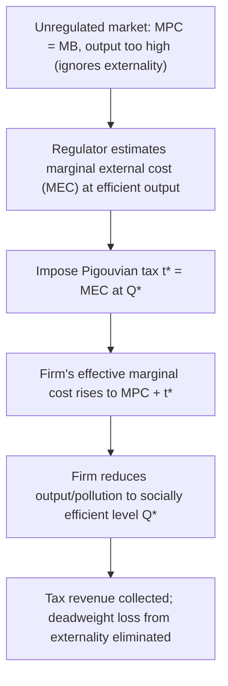

## Environmental Economics Applications

### Definition and Conceptual Overview

Environmental economics applies core microeconomic tools — externalities, public goods theory, property rights, welfare analysis, and cost-benefit analysis — to problems of resource use, pollution, and environmental quality. Its central organizing insight is that most environmental problems arise from **market failure**: environmental resources (clean air, stable climate, biodiversity, fisheries) are frequently unpriced or underpriced because they lack well-defined property rights, generate externalities not reflected in private costs, or possess public-good characteristics that prevent markets from allocating them efficiently on their own. This topic surveys the primary policy instruments developed to correct these failures and the key analytical frameworks used to evaluate them.

### The Externality Foundation

Pollution is the canonical **negative externality**: a firm's production imposes costs (health effects, ecosystem damage, climate impact) on third parties not reflected in the firm's private marginal cost. Absent correction, the firm equates marginal private cost (not marginal social cost) to marginal benefit, producing more pollution-generating output than is socially efficient.

$$MSC = MPC + MEC$$

where $MSC$ is marginal social cost, $MPC$ is marginal private cost, and $MEC$ is marginal external cost (the marginal damage from pollution).

**Key Points**

- The socially efficient level of pollution is generally **not zero** — it occurs where the marginal cost of further abatement equals the marginal benefit (avoided damage) of that abatement, meaning some positive level of pollution is typically efficient once abatement costs are properly weighed against environmental damages.
- This "efficient pollution" framing is a standard economic result but is not universally accepted as the appropriate normative benchmark outside of economics; ethical and precautionary perspectives sometimes argue for stricter standards than the strict marginal-cost-equals-marginal-benefit efficiency criterion would imply, particularly under irreversibility or catastrophic-risk concerns.

### Pigouvian Taxes

A **Pigouvian tax** (named after Arthur Pigou) is a per-unit tax on a polluting activity set equal to the marginal external cost at the socially efficient output level, internalizing the externality by raising the polluter's private marginal cost to match the true social marginal cost.

$$t^* = MEC(Q^*)$$

where $Q^*$ is the socially efficient output/pollution level.

**Key Points**

- A correctly calibrated Pigouvian tax achieves the efficient outcome at **least cost** across heterogeneous polluters: firms with low abatement costs will find it cheaper to reduce pollution than pay the tax, while firms with high abatement costs will prefer to pay the tax and continue polluting, resulting in abatement being undertaken by whichever firms can do it most cheaply — a cost-effectiveness property shared with tradable permit systems (below).
- The central practical challenge is that **the regulator rarely knows the true marginal external cost or the efficient output level with precision**, meaning real-world Pigouvian taxes are calibrated using imperfect damage estimates (often the same non-market valuation techniques used in cost-benefit analysis) rather than a precisely known optimal rate.
- Pigouvian taxes generate **government revenue**, which can be used to reduce other distortionary taxes (a "double dividend" argument — correcting the externality while potentially improving efficiency elsewhere in the tax system) or be rebated to households, though the existence and size of a genuine double dividend is debated in the public finance literature. [Inference] Whether the double-dividend effect is realized in practice depends on how the revenue is used and the broader structure of the tax system, and is not a universally guaranteed outcome of environmental tax reform.

### Tradable Permits (Cap-and-Trade)

A **tradable permit system** (cap-and-trade) sets an aggregate quantity limit ("cap") on total pollution, issues (via allocation or auction) permits summing to that cap, and allows firms to buy and sell permits among themselves.

**Key Points**

- Under cap-and-trade, the **market price of permits emerges endogenously** from trading, in contrast to a Pigouvian tax, which fixes the *price* directly and allows the resulting *quantity* of pollution to emerge endogenously from firms' responses.
- Regardless of the initial allocation of permits (whether given away free to existing firms or auctioned), the **Coase theorem** implies that, absent transaction costs, trading will reallocate permits until they end up with the firms that value them most (i.e., those with the highest abatement costs), achieving the same cost-effective allocation of abatement effort as a Pigouvian tax — though the *initial allocation method* has significant implications for the distribution of costs and windfall gains/losses among firms, even if it does not affect the final efficiency outcome.
- **Grandfathering** (allocating permits free based on historical emissions) versus **auctioning** (selling permits, generating government revenue similar to a tax) represents a key policy design choice, with grandfathering often favored politically (as compensation to existing polluters, easing transition and political acceptability) while auctioning is favored by many economists for generating revenue that can offset other distortionary taxes and for avoiding windfall profits to incumbent firms.

### Price (Tax) vs. Quantity (Permit) Instruments: The Weitzman Comparison

A foundational result in environmental economics, due to Martin Weitzman (1974), addresses the choice between price instruments (taxes) and quantity instruments (tradable permits) under **uncertainty about abatement costs**.

**Key Points**

- When abatement cost uncertainty is significant relative to uncertainty about environmental damages, and the marginal damage curve is relatively **flat** (damages don't rise steeply with small changes in pollution quantity), a **price instrument (tax)** tends to produce a smaller expected welfare loss from getting the calibration wrong, because it caps the cost firms bear per unit of pollution reduced, even if the resulting quantity of pollution differs from the ideal.
- Conversely, when the marginal damage curve is relatively **steep** (small deviations from the target pollution quantity cause large damage changes, as might be argued for certain threshold or tipping-point environmental risks), a **quantity instrument (cap-and-trade)** tends to be preferable, because it guarantees the aggregate pollution quantity regardless of how abatement costs turn out, at the cost of allowing the permit price (and thus compliance cost) to fluctuate.
- This result is frequently invoked in the climate policy debate over carbon taxes versus cap-and-trade systems, since greenhouse gas damage functions and abatement cost functions are both subject to substantial scientific and economic uncertainty. [Inference] Which instrument is empirically preferable for climate policy specifically depends on assumptions about the shape of the (still uncertain) climate damage function, and remains a genuinely disputed question among environmental economists rather than one with a single settled answer.

### Comparison: Pigouvian Tax vs. Tradable Permits

| Dimension | Pigouvian Tax | Tradable Permits (Cap-and-Trade) |
| --- | --- | --- |
| Instrument type | Price-based | Quantity-based |
| Certainty provided | Certain compliance cost per unit; pollution quantity uncertain | Certain aggregate pollution quantity; permit price uncertain |
| Behavior under cost uncertainty | Preferred when marginal damage curve is relatively flat | Preferred when marginal damage curve is relatively steep |
| Government revenue | Yes, if tax is not offset elsewhere | Only if permits are auctioned (not if grandfathered) |
| Adjustment to inflation/growth | Requires periodic legislative/administrative rate revision | Cap can be pre-set on a declining schedule without further price-setting |
| Cost-effectiveness across heterogeneous firms | Achieved (equal marginal abatement cost across firms at the tax rate) | Achieved (equal marginal abatement cost across firms via permit trading) |

### The Coase Theorem and Environmental Property Rights

The **Coase theorem** posits that if property rights over an externality-generating resource are clearly defined and transaction costs are sufficiently low, private bargaining between the affected parties can achieve an efficient outcome regardless of which party is initially assigned the property right — the assignment affects only the *distribution* of costs/benefits, not the *efficiency* of the final allocation.

**Key Points**

- Applied to environmental problems, this suggests that clearly assigning rights (e.g., a right to a clean environment, or conversely a right to pollute up to some level) and allowing bargaining could in principle resolve externalities without government-imposed taxes or quantity limits.
- In practice, the Coase theorem's applicability to most environmental problems is severely limited by **high transaction costs**, particularly when externalities affect large, diffuse, and poorly organized groups (e.g., global climate change affecting billions of people across generations) — the same collective-action problem that complicates diffuse-benefit political economy elsewhere in trade and regulatory policy. This is a primary reason most large-scale environmental problems are addressed through government intervention (taxes, permits, regulation) rather than private Coasian bargaining.

### Common Pool Resources and the Tragedy of the Commons

Many environmental resources (ocean fisheries, groundwater aquifers, grazing land, the atmosphere's capacity to absorb greenhouse gases) are **common pool resources**: non-excludable (difficult to prevent access) but rival in consumption (one user's extraction reduces what remains for others). This combination generates the **tragedy of the commons**: because individual users do not bear the full social cost of their extraction (which is partly borne by all other users), the resource tends to be overexploited relative to the socially efficient extraction rate.

**Key Points**

- Solutions to common pool resource problems generally fall into three broad categories: **government regulation** (harvest quotas, licensing), **market-based instruments** (individual transferable quotas in fisheries, functioning similarly to tradable pollution permits), and **community-based/institutional management** (self-governing arrangements among resource users, extensively documented in the work of Elinor Ostrom, which can succeed under specific institutional conditions without requiring either centralized government control or fully privatized property rights).
- [Inference] The relative effectiveness of these three approaches varies substantially by resource type, the number and organization of users, and monitoring feasibility, and there is no single universally superior solution across all common pool resource contexts.

### Optimal Extraction of Non-Renewable Resources: The Hotelling Rule

For non-renewable resources (fossil fuels, minerals), environmental and resource economics applies the **Hotelling Rule**, which characterizes the efficient extraction path over time for a resource in fixed total supply.

**Statement**: Under competitive markets and efficient extraction, the net price (price minus marginal extraction cost) of a non-renewable resource should rise at a rate equal to the rate of interest (the discount rate):

$$\frac{\dot{P} - \dot{C}}{P - C} = r$$

**Key Points**

- The intuition is that the resource in the ground is an asset; owners will only be willing to hold (rather than extract and invest the proceeds) if its net price is expected to appreciate at the same rate as the return available on alternative investments — otherwise, extraction rates adjust until this condition holds.
- [Inference] Empirical tests of the Hotelling Rule using observed resource price paths have produced mixed results, with many studies finding real-world price paths for exhaustible resources do not closely track the rule's prediction, generally attributed to factors such as changing extraction technology, exploration discoveries revising known reserves, and market power in resource industries — deviations that are actively studied in resource economics rather than fully resolved.

### Optimal Harvesting of Renewable Resources

For renewable resources (fisheries, forests), the analogous efficiency benchmark is the **Maximum Sustainable Yield (MSY)** — the largest harvest that can be sustained indefinitely given the resource's natural growth dynamics — though economically **efficient** harvesting (accounting for the cost of harvesting effort and the discount rate) generally differs from the MSY, since it also weighs the value of resource stock left in place (which continues to grow and can be harvested later) against the discounted value of harvesting now.

**Key Points**

- Open-access renewable resources (no ownership or use restrictions) tend toward an equilibrium where economic profit from harvesting is driven to zero (the "bionomic equilibrium"), typically resulting in a resource stock smaller than either the maximum sustainable yield stock or the economically efficient stock — this is the dynamic, renewable-resource analogue of the static tragedy-of-the-commons overexploitation result.
- Individual Transferable Quotas (ITQs) in fisheries management are a widely studied market-based policy response, assigning tradable harvest rights to reduce the open-access overexploitation problem, with an economic logic closely paralleling tradable pollution permits.

### Environmental Cost-Benefit Analysis and Discounting

Applying cost-benefit analysis to environmental policy (see Cost-Benefit Analysis) raises distinctive issues, particularly around the **long time horizons** and **irreversibility** characteristic of many environmental problems (species extinction, climate tipping points, groundwater depletion).

**Key Points**

- The choice of discount rate is especially consequential for environmental CBA given multi-decade or multi-generational time horizons — this is the same discounting debate discussed under Cost-Benefit Analysis, but with heightened stakes because environmental damages (e.g., climate change) are often concentrated far in the future while mitigation costs are borne largely in the present.
- **Option value** and the **precautionary principle** are frequently invoked supplements (or alternatives) to standard expected-value CBA for environmental decisions involving genuine uncertainty and irreversibility, on the grounds that preserving future flexibility (the option to decide later, once uncertainty resolves) has value that a simple expected-NPV calculation may not fully capture. [Inference] The appropriate formal integration of option value and precautionary considerations into standard CBA frameworks for environmental policy remains a subject of ongoing methodological development rather than a single settled approach.

### Related Topics

- Cost-Benefit Analysis
- Regulatory Economics
- Coase Theorem and Property Rights
- Public Goods and Common Pool Resources
- Tragedy of the Commons
- Hotelling Rule and Non-Renewable Resource Economics
- Value of a Statistical Life and Non-Market Valuation
- Climate Change Economics and Carbon Pricing