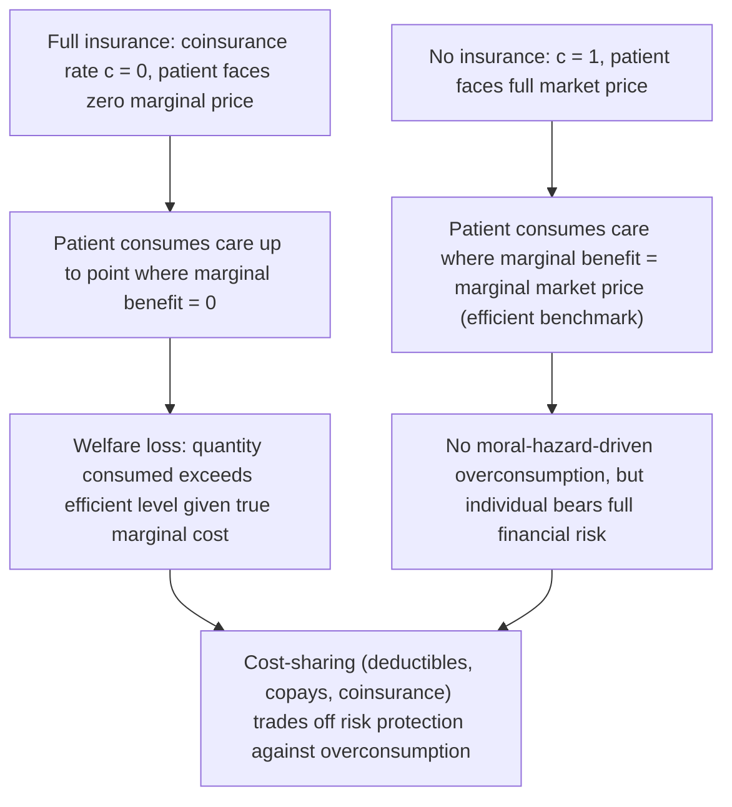

## Health Economics Applications

### Definition and Conceptual Overview

Health economics applies microeconomic theory to the market for health and healthcare, a market distinguished by pervasive and unusually severe departures from the standard competitive market assumptions: profound information asymmetry between patients and providers, extensive third-party payment (insurance), significant externalities (notably in infectious disease), supply-side market power in provider and pharmaceutical markets, and goods (health itself) that are difficult to define, measure, or substitute for. Kenneth Arrow's 1963 paper "Uncertainty and the Welfare Economics of Medical Care" is widely regarded as the founding work of the field, identifying these distinctive features and arguing they justify significant departures from a purely market-based approach to healthcare provision.

### Distinctive Features of Healthcare Markets

**Key Points**

- **Uncertainty**: the incidence, timing, and severity of illness are highly uncertain for individuals, creating a fundamental role for health insurance as a risk-pooling mechanism (see Diversification and State-Preference Theory for the underlying risk-pooling logic).
- **Information asymmetry**: patients typically know far less than providers about diagnosis, appropriate treatment, and treatment quality — a more severe and consequential asymmetry than in most consumer goods markets, since patients often cannot verify or fully evaluate provider recommendations even after the fact.
- **Externalities**: infectious disease treatment and vaccination generate substantial positive externalities (reduced transmission risk to others), providing an efficiency rationale for public subsidy or provision beyond what private individual demand alone would generate.
- **Supplier-induced demand**: because patients rely heavily on provider expertise and recommendations, providers may possess some ability to influence the quantity or type of care demanded — a departure from the standard assumption that demand is determined independently of the seller.
- **Third-party payment**: the prevalence of health insurance means the patient consuming care and the party primarily bearing its marginal financial cost are frequently different economic agents, altering the standard price-quantity relationship at the point of consumption.

### Moral Hazard in Health Insurance

**Moral hazard** in health insurance refers to the tendency for insured individuals to consume more healthcare (or take less care to avoid illness) than they would if bearing the full marginal cost themselves, since insurance reduces the marginal price faced at the point of consumption.

$$P_{\text{patient}} = c \times P_{\text{market}}$$

where $c$ is the coinsurance rate (share of cost paid out-of-pocket) and $P_{\text{market}}$ is the market price of care.

**Key Points**

- **Ex ante moral hazard** refers to reduced preventive effort (e.g., less exercise, worse diet) because insurance cushions the financial consequences of illness; **ex post moral hazard** refers to increased healthcare *utilization* once illness occurs, because insurance lowers the marginal price of treatment — the more commonly emphasized form in health insurance design.
- The **RAND Health Insurance Experiment** (a large-scale randomized study conducted in the U.S. in the 1970s–1980s) remains one of the most frequently cited empirical studies of ex post moral hazard, finding that individuals assigned to plans with higher cost-sharing consumed measurably less healthcare than those with free care, with limited average effects on health outcomes for the general population (though effects on specific vulnerable subgroups, such as low-income individuals with certain chronic conditions, were more mixed). [Inference] The generalizability of these specific findings to different healthcare systems, time periods, and patient populations is a subject of ongoing empirical research, and more recent studies have refined and in some cases qualified aspects of the original results.
- **Cost-sharing mechanisms** (deductibles, copayments, coinsurance) are the standard insurance design response to moral hazard, deliberately reintroducing some marginal price at the point of consumption to curb overutilization — but this creates a fundamental **efficiency-risk-protection tradeoff**: more cost-sharing reduces moral-hazard-driven overconsumption but also reduces the financial risk protection that is insurance's core purpose, particularly burdening insured individuals who experience genuine high-cost illness.

### Adverse Selection in Health Insurance Markets

**Adverse selection** arises because individuals typically have better private information about their own health risk than insurers do, leading higher-risk individuals to be more likely to purchase (or purchase more generous) insurance at any given premium, which can create the classic **adverse selection death spiral**: as higher-risk individuals disproportionately select into a pool, insurers raise premiums to cover higher expected costs, which drives out relatively lower-risk individuals (for whom the higher premium is a worse deal), further raising the average risk of the remaining pool, and repeating until, in the extreme case, the market may unravel entirely or persist only for the highest-risk purchasers.

**Key Points**

- This connects directly to the general theory of **adverse selection** in insurance markets under asymmetric information (formalized by Akerlof's "lemons" framework and later, specifically for insurance, by Rothschild and Stiglitz), where insurers cannot directly observe individual risk type and must design contracts that (imperfectly) sort or pool different risk types.
- Standard policy responses to health insurance adverse selection include: **mandates** (requiring universal or near-universal enrollment, preventing low-risk individuals from opting out and stabilizing the risk pool), **community rating restrictions** (limiting insurers' ability to price based on individual risk factors, though this itself can exacerbate adverse selection if not paired with a mandate or subsidy), **risk adjustment** (transferring funds between insurers based on the risk profile of their enrolled population, reducing insurers' incentive to avoid high-risk enrollees), and **subsidies** (lowering the effective price faced by lower-risk individuals to keep them in the pool).
- Rothschild-Stiglitz-type models show that under adverse selection, competitive insurance markets may fail to reach a stable pooling equilibrium and instead may only sustain a **separating equilibrium** in which different contracts (differing in premium and coverage generosity) are designed to induce different risk types to self-select into different plans — often resulting in high-risk individuals receiving full coverage at an actuarially fair (for their risk type) but high premium, and low-risk individuals accepting only partial coverage in exchange for a lower premium, reflecting a genuine efficiency cost of the underlying information asymmetry (low-risk individuals cannot obtain full coverage at their own fair price, because doing so would attract high-risk individuals to the same contract).

### Supplier-Induced Demand

**Supplier-induced demand (SID)** describes the hypothesis that healthcare providers, due to their informational advantage over patients, may influence the quantity or type of services a patient consumes beyond what the patient's own preferences, fully informed, would dictate — potentially to increase provider income, particularly under fee-for-service payment systems that pay providers per service delivered.

**Key Points**

- SID is more methodologically contested than moral hazard or adverse selection, since it is empirically difficult to distinguish "provider-induced" utilization from utilization that reflects the provider simply supplying medically appropriate care that the patient, lacking clinical knowledge, would not have known to request on their own — both scenarios can produce the same observed correlation between provider recommendations and patient utilization. [Unverified] The overall magnitude and prevalence of true supplier-induced demand (as opposed to legitimate expert-recommended care) across different healthcare systems and specialties remains genuinely disputed in the empirical health economics literature.
- Payment system design is frequently discussed as a policy lever addressing potential SID concerns: **fee-for-service** payment (paying per service) is argued to create incentives for higher service volume, whereas **capitation** (a fixed payment per patient regardless of services delivered) or **bundled/episode-based payment** shift financial risk to providers and may reduce volume-based incentives, though each alternative payment model introduces its own distinct incentive distortions (e.g., capitation potentially incentivizing under-treatment or patient risk-avoidance by providers, an analogous but reversed moral-hazard-type concern on the supply side).

### Quality-Adjusted Life Years (QALYs) and Cost-Effectiveness Analysis

Because health outcomes are multidimensional (affecting both length and quality of life) and difficult to monetize directly in the way standard cost-benefit analysis requires, health economics frequently uses **cost-effectiveness analysis (CEA)** rather than full monetary cost-benefit analysis, with the **Quality-Adjusted Life Year (QALY)** as the standard outcome metric.

A QALY combines length of life and health-related quality of life into a single index, where one year of life in perfect health equals 1 QALY, and quality weights between 0 (death) and 1 (perfect health) adjust for health states of varying severity:

$$QALYs = \sum_{t} Q_t \times Y_t$$

where $Q_t$ is the quality weight in period $t$ and $Y_t$ is the time (in years) spent in that health state.

**Cost-effectiveness** of a health intervention is typically summarized by the **Incremental Cost-Effectiveness Ratio (ICER)**:

$$ICER = \frac{C_{\text{new}} - C_{\text{comparator}}}{QALY_{\text{new}} - QALY_{\text{comparator}}}$$

**Key Points**

- The ICER expresses the additional cost per additional QALY gained from adopting a new intervention relative to an existing comparator, allowing comparison of highly disparate health interventions (a drug, a surgical procedure, a public health campaign) on a common efficiency metric.
- Health systems and regulatory bodies in various countries use an implicit or explicit **cost-effectiveness threshold** (a maximum acceptable cost per QALY) to guide reimbursement or coverage decisions — analogous in structure and function to the Value of a Statistical Life used in broader cost-benefit analysis, but expressed per unit of health gain rather than per statistical life. [Unverified] Specific current threshold values used by particular health systems or regulatory bodies vary by jurisdiction and are subject to periodic revision, and should be verified against current guidance from the relevant body rather than assumed static.
- QALYs face notable ethical and methodological critiques, including: potential bias against treatments primarily benefiting individuals with pre-existing disabilities (since their quality-weight baseline is lower, a treatment may show a smaller absolute QALY gain even if highly valued by the recipient), difficulty capturing values beyond health improvement itself (e.g., dignity, autonomy, caregiver burden), and reliance on population-level quality-weight elicitation methods (e.g., time trade-off or standard gamble surveys) that carry their own measurement uncertainties, paralleling the general non-market valuation challenges discussed under Cost-Benefit Analysis.

### Externalities and Public Health: Vaccination as a Case Study

Vaccination against infectious disease is a canonical example of a **positive externality** in health economics: an individual's vaccination reduces their own risk of infection but also reduces the probability of transmitting the disease to others, a benefit not captured in the individual's own private vaccination decision.

**Key Points**

- Because individuals weigh only their private benefit (protection to themselves) when deciding whether to vaccinate, and ignore the external benefit conferred on others (reduced transmission risk), unregulated private vaccination decisions tend to result in **under-vaccination relative to the socially efficient rate** — the same underprovision logic that applies to positive externalities generally.
- **Herd immunity** — the phenomenon by which sufficiently high vaccination coverage in a population indirectly protects even unvaccinated individuals by suppressing disease transmission — is itself a public-good-like benefit, since it is (imperfectly) non-excludable across the population once achieved, reinforcing the case for public subsidy, mandate, or provision of vaccination to correct the free-rider/externality problem.
- Policy responses mirror the standard externality-correction toolkit: public subsidization or free provision (analogous to a negative Pigouvian tax, i.e., a subsidy, encouraging an activity with positive externalities), school-entry or employment vaccination requirements (a form of quantity mandate), and public health information campaigns (targeting information gaps that may separately depress vaccination demand below even the privately optimal level).

### Health Insurance Market Structure and the Role of Employer-Sponsored Insurance

In many health systems (notably including the United States), a substantial share of health insurance is obtained through **employer-sponsored insurance (ESI)**, a historically contingent arrangement with distinct economic properties.

**Key Points**

- Employer-based pooling can partially mitigate adverse selection relative to individual insurance markets, since employees are grouped for reasons largely unrelated to individual health risk (i.e., their employment decision), producing a risk pool less subject to the self-selection-on-risk dynamics that plague purely voluntary individual insurance markets.
- ESI can create **labor market distortions**, including "job lock" (employees remaining in a job primarily to retain health coverage, even when a different job would otherwise be a better labor market match) and complications for self-employment and small-business formation, since these arrangements often lack easy access to comparably priced group coverage. [Inference] The magnitude of job-lock and related labor-market effects attributable specifically to employer-based insurance, relative to other factors affecting job mobility, varies across empirical studies and depends on the broader availability of individual insurance market alternatives in a given country and time period.

### Related Topics

- Moral Hazard and Adverse Selection (General Insurance Theory)
- Cost-Benefit Analysis and Value of a Statistical Life
- Externalities and Public Goods
- State-Preference Theory and Risk Pooling
- Principal-Agent Theory (Provider-Patient Relationship)
- Regulatory Economics (Health System Regulation)
- Diversification and Insurance Risk Pooling