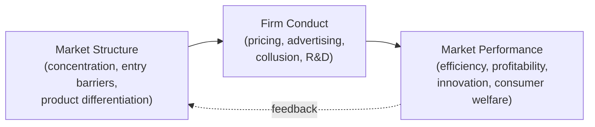
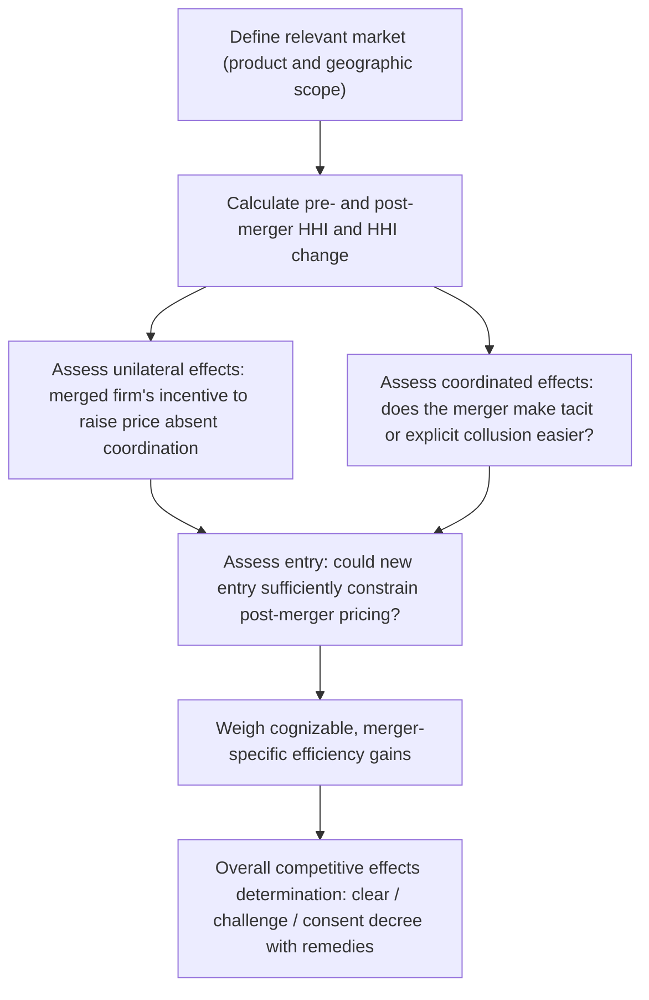

## Industrial Organization Applications

### Definition and Conceptual Overview

Industrial organization (IO) is the field of microeconomics studying the structure, conduct, and performance of firms and markets, with particular attention to imperfect competition — the space between perfect competition and pure monopoly where most real-world markets actually reside. IO applications extend the foundational theory of monopoly, oligopoly, and game theory to practical questions of firm strategy, market structure evolution, and the antitrust/competition policy designed to govern anticompetitive conduct. This topic surveys the primary applied frameworks: the structure-conduct-performance paradigm, strategic entry deterrence, price discrimination, vertical relationships, and merger/antitrust analysis.

### The Structure-Conduct-Performance (SCP) Paradigm

The traditional organizing framework of IO, developed initially by Edward Mason and Joe Bain, posits a causal chain running from **market structure** (number of firms, concentration, entry barriers, product differentiation) to firm **conduct** (pricing, advertising, R&D, collusive behavior) to market **performance** (efficiency, profitability, innovation, consumer welfare).

**Key Points**

- The SCP paradigm's simplest form treats causality as running primarily from structure to conduct to performance (e.g., more concentrated markets → more collusive/less competitive conduct → worse consumer outcomes), which historically motivated a strong emphasis on market concentration measures (e.g., the Herfindahl-Hirschman Index) in antitrust analysis.
- Modern IO, heavily influenced by game theory (the "New Empirical Industrial Organization"), treats this relationship as considerably more complex and bidirectional — conduct itself can shape structure (e.g., strategic entry deterrence, discussed below, is a conduct choice that determines the number of firms in a market), meaning structure and conduct cannot always be treated as cleanly separable, sequential stages.
- Despite these refinements, concentration measures and structural indicators remain widely used as practical screening tools in competition policy, even as more sophisticated conduct-based and game-theoretic analysis has become standard for detailed case evaluation.

### Herfindahl-Hirschman Index (HHI)

The **HHI** is the standard applied measure of market concentration, calculated as the sum of squared market shares (expressed as whole-number percentages) of all firms in a market:

$$HHI = \sum_{i=1}^{n} s_i^2$$

where $s_i$ is firm $i$'s market share (as a percentage, e.g., 25 for 25%).

**Key Points**

- HHI ranges from near 0 (many firms, each with negligible share, approximating perfect competition) to 10,000 (a pure monopoly with 100% market share).
- Competition authorities in multiple jurisdictions use HHI thresholds as initial screens in merger review — markets are commonly categorized as unconcentrated (below roughly 1,500), moderately concentrated (roughly 1,500–2,500), and highly concentrated (above roughly 2,500), with proposed mergers producing large HHI increases in already-concentrated markets facing heightened scrutiny. [Unverified] Specific numerical HHI thresholds and the exact merger-screening methodology differ across jurisdictions and are periodically revised by the relevant competition authorities, so current thresholds should be verified against the applicable agency's current guidelines rather than assumed fixed.
- HHI is a useful but incomplete screening tool: it does not directly capture the ease of entry, the degree of product differentiation, the presence of coordinated effects beyond simple concentration, or dynamic/innovation competition — all of which modern merger analysis typically supplements with additional evidence beyond the HHI calculation alone.

### Strategic Entry Deterrence

Incumbent firms facing potential entry can, under certain conditions, take actions that credibly discourage entrants — a central topic in game-theoretic IO, since credible deterrence requires the incumbent's threatened response to be one it would actually be willing to carry out if entry occurred (a **subgame-perfect** threat, not merely a stated one).

#### Limit Pricing

**Limit pricing** involves the incumbent setting a pre-entry price low enough that a potential entrant, anticipating this price will persist post-entry, expects insufficient profit to justify entering.

**Key Points**

- For limit pricing to be a *credible* deterrent (rather than a threat the incumbent would abandon post-entry, in which case a rational entrant should ignore it), the incumbent's price commitment typically needs to be supported by some structural feature — e.g., asymmetric information about the incumbent's costs (making a low pre-entry price a costly, and therefore credible, "signal" of low costs that would make entry unprofitable) — since absent such a mechanism, a purely non-binding low price is not, by itself, a credible deterrent under a standard sequential game analysis.

#### Capacity Expansion and Excess Capacity

An incumbent can invest in **excess production capacity** beyond what current demand requires, credibly signaling that it could flood the market and depress prices sharply if entry occurred — since sunk capacity investment makes an aggressive post-entry price response credible (the incumbent, having already paid for the capacity, faces a low marginal cost of using it to expand output and depress the post-entry price, making the threat of a price war credible in a way that a mere pricing announcement would not be).

**Key Points**

- This connects to the broader IO concept of **sunk costs as commitment devices**: an irreversible investment can strategically alter the game's structure by making certain future actions credible that would not otherwise be, a foundational insight of Thomas Schelling's and later formalized by economists including Avinash Dixit in entry-deterrence models.

#### Predatory Pricing

**Predatory pricing** involves an incumbent temporarily pricing below cost specifically to drive an existing competitor out of the market (or deter a potential entrant), intending to raise prices back above competitive levels once the rival exits and the threat of renewed competition is diminished.

**Key Points**

- Predatory pricing is analytically distinct from ordinary aggressive competitive pricing (which benefits consumers and is not anticompetitive), and antitrust frameworks in many jurisdictions require evidence both that the price is below an appropriate measure of cost and that the predator has a realistic prospect of **recouping** its losses via later higher prices once competition is suppressed — without a plausible recoupment mechanism, a below-cost pricing episode is generally treated as a transitory competitive event (potentially even pro-competitive) rather than unlawful predation, since a firm unable to recoup its losses has no rational incentive to prey in the first place.
- This recoupment requirement reflects a broader skepticism in modern antitrust economics toward predatory pricing claims, since successfully executing genuine predation requires the predator to sustain losses long enough to drive out a rival and then face limited enough subsequent re-entry threat to recoup those losses — conditions considered relatively difficult to satisfy in practice, though not impossible, and case outcomes vary considerably based on the specific market conditions present.

### Price Discrimination

**Price discrimination** — charging different prices to different customers or for different units that do not reflect proportional differences in production cost — is a common strategic practice in imperfectly competitive markets, requiring market power (the ability to set price above marginal cost) and some ability to prevent resale (arbitrage) between the differently priced groups.

| Degree | Description | Example | Consumer Surplus Captured |
| --- | --- | --- | --- |
| **First-degree (perfect)** | Each unit sold at a different price, ideally each buyer's exact maximum willingness to pay | Highly personalized/negotiated pricing | All consumer surplus extracted by the seller |
| **Second-degree** | Price varies by quantity purchased or product version/quality tier, but buyers self-select | Bulk discounts, "good-better-best" product versioning | Partial; depends on how effectively self-selection sorts buyer types |
| **Third-degree** | Different, fixed prices charged to different identifiable groups | Student/senior discounts, geographic price variation, business vs. leisure airline fares | Partial; depends on the price gap and each group's elasticity |

**Key Points**

- Third-degree price discrimination sets a higher price for the group with **more inelastic demand** and a lower price for the group with **more elastic demand**, following the standard inverse-elasticity pricing rule extended across market segments.
- The welfare effects of price discrimination relative to uniform (single-price) monopoly pricing are **theoretically ambiguous**: discrimination can increase total output (and thus potentially increase total welfare) by enabling the seller to profitably serve lower-willingness-to-pay segments that a single uniform price would exclude, but it can also reduce output in some market configurations and redistributes surplus from consumers to the seller regardless of the output effect — the specific welfare outcome depends on the shape of demand in each segment and cannot be signed in general without more detailed information. [Inference] Whether a specific real-world instance of price discrimination is welfare-improving or welfare-reducing typically requires case-specific empirical analysis rather than a general theoretical presumption in either direction.

### Vertical Relationships and Vertical Restraints

IO also studies relationships **between** firms at different stages of a supply chain (manufacturer-retailer, for example), including practices collectively termed **vertical restraints**.

- **Resale price maintenance (RPM)**: a manufacturer specifies a minimum (or, less commonly, maximum) resale price that downstream retailers must charge.
- **Exclusive dealing**: a manufacturer requires a retailer to sell only its products, or a retailer requires a supplier to sell only to it.
- **Territorial exclusivity**: a manufacturer grants a retailer exclusive rights to sell in a defined geographic area.
- **Two-part tariffs and franchise fees**: pricing structures combining a fixed fee with a per-unit price, often used to extract surplus from downstream firms while preserving efficient per-unit pricing incentives.

**Key Points**

- A key economic rationale for vertical restraints is **eliminating double marginalization**: when both an upstream manufacturer and downstream retailer independently possess market power and each marks up price above their own marginal cost, the resulting final price is higher (and total channel profit lower) than if the vertical chain were integrated or coordinated — RPM, exclusive territories, and similar restraints can, in some circumstances, restore the vertically-integrated (lower, more profitable) price by preventing the downstream firm from independently adding its own markup on top of the upstream firm's markup.
- Vertical restraints can also serve legitimate efficiency purposes beyond double-marginalization correction, such as encouraging retailer investment in service, promotion, or product-specific expertise that might otherwise be under-provided due to free-riding among competing retailers (a retailer investing in costly product demonstrations, for example, may lose the resulting sale to a discount competitor who free-rides on that investment without incurring the cost) — RPM or exclusive territories can protect the investing retailer's margin and thereby preserve the incentive to make such investments.
- The antitrust treatment of vertical restraints has evolved substantially over time in many jurisdictions, generally shifting from a more categorical, structure-based skepticism toward a more case-specific "rule of reason" analysis that weighs potential efficiency justifications (double-marginalization correction, free-rider prevention) against potential anticompetitive effects (facilitating collusion, foreclosing rival manufacturers or retailers) — reflecting the broader IO recognition that vertical restraints are not inherently anticompetitive and can, depending on context, be either welfare-enhancing or welfare-reducing.

### Merger Analysis

Antitrust merger review evaluates whether a proposed merger is likely to substantially lessen competition, weighing anticompetitive **unilateral** and **coordinated effects** against potential **efficiency gains**.

**Key Points**

- **Unilateral effects** analysis asks whether the merged firm alone, without needing to coordinate with remaining competitors, would find it profitable to raise prices post-merger — particularly relevant when the merging firms are each other's closest substitutes (a high **diversion ratio**, meaning a large share of sales lost by one merging firm at a higher price would be recaptured by the other merging firm, rather than lost to outside competitors).
- **Coordinated effects** analysis asks whether the merger, by reducing the number of competitors or otherwise altering market structure, makes tacit or explicit collusion among the remaining firms more likely or more stable (e.g., by increasing transparency, reducing the number of firms that must coordinate, or eliminating a notably disruptive "maverick" competitor).
- **Merger-specific efficiencies** (cost savings or innovation gains achievable only through the merger, not through less anticompetitive alternatives) are typically weighed as a potential offsetting factor, but competition authorities generally require such efficiencies to be well-documented, merger-specific, and of sufficient magnitude to offset the identified anticompetitive risk — vague or unsubstantiated efficiency claims are typically given little weight in formal review.
- **Potential entry** as a competitive constraint is assessed for timeliness, likelihood, and sufficiency — if new entry in response to a post-merger price increase would be too slow, unlikely, or too small in scale to restore competitive pricing, entry is generally not treated as an adequate check on the merger's anticompetitive potential.

### Related Topics

- Monopoly, Oligopoly, and Game Theory in Market Structure
- Regulatory Economics
- Antitrust Law and Competition Policy Institutions
- Herfindahl-Hirschman Index and Market Concentration Measures
- Cournot and Bertrand Competition Models
- Contract Theory and Vertical Integration
- Network Effects and Platform Competition