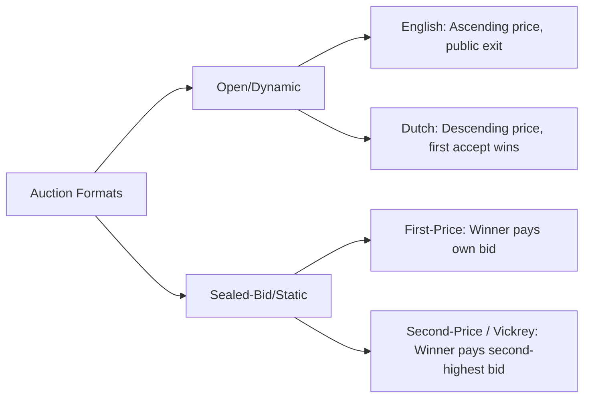
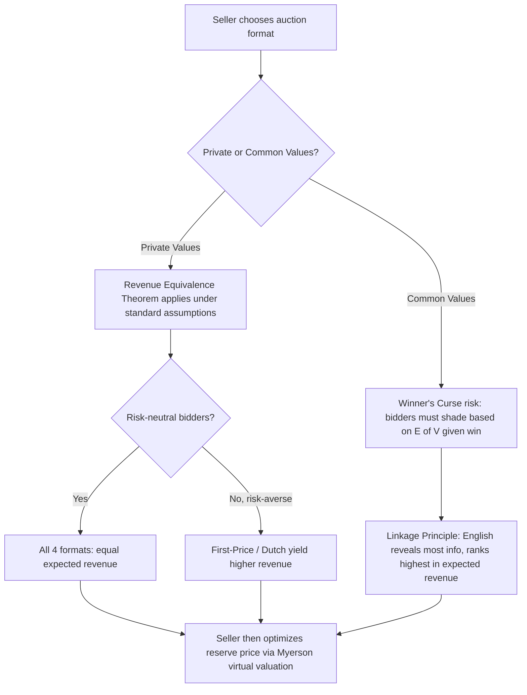

## Auction theory

### Overview and Economic Significance

Auction theory studies the design and analysis of mechanisms through which buyers and sellers determine prices and allocate goods under conditions of incomplete information. It sits at the intersection of microeconomics, game theory, and mechanism design, and provides the theoretical foundation for real-world markets ranging from art auctions and government bond sales to spectrum license allocation and online ad exchanges.

The central problem auction theory addresses is **allocation under private information**: a seller wants to allocate an item (or items) to the bidder who values it most, and extract as much revenue as possible, but does not know each bidder's true valuation. Bidders, in turn, have incentives to misrepresent their valuations if doing so improves their expected payoff. Auction theory formalizes these strategic interactions using Bayesian game theory and derives equilibrium bidding behavior, expected revenue, and efficiency properties under different auction rules.

### Core Assumptions and Setup

Most classical auction models share a common formal structure:

- There are $n$ risk-neutral bidders, indexed $i = 1, \dots, n$.
- Each bidder $i$ has a valuation $v_i$ for the object being sold.
- Valuations are drawn independently from a commonly known distribution $F(v)$ with density $f(v)$ on support $[\underline{v}, \overline{v}]$ — the **Independent Private Values (IPV)** assumption.
- Each bidder knows their own $v_i$ but not the valuations of others.
- The seller commits to an auction format (rules for bidding, allocation, and payment) before bidding begins.

Three broad valuation environments are distinguished:

- **Private Values**: each bidder's valuation is independent of others' information; knowing a rival's valuation would not change your own value for the object (e.g., a painting bought purely for personal enjoyment).
- **Common Values**: the object has the same underlying value to all bidders, but each bidder only observes a noisy private signal of that value (e.g., an oil drilling tract, where the amount of oil is objectively fixed but unknown).
- **Affiliated/Interdependent Values**: a general case blending private and common value elements, where each bidder's valuation depends partly on their own signal and partly on others' signals, and signals are statistically affiliated (positively correlated in a specific technical sense).

### The Four Standard Auction Formats

**Key Points**

- **English Auction (Ascending-Bid)**: Price rises continuously (or in increments) from a low starting point; bidders publicly drop out as the price exceeds their valuation; the last remaining bidder wins and pays the price at which the second-to-last bidder exited.
- **Dutch Auction (Descending-Bid)**: Price starts high and falls continuously; the first bidder to accept the current price wins and pays that price. Used historically for Dutch flower auctions and some Treasury securities.
- **First-Price Sealed-Bid Auction**: All bidders simultaneously submit sealed bids; the highest bidder wins and pays their own bid.
- **Second-Price Sealed-Bid Auction (Vickrey Auction)**: All bidders simultaneously submit sealed bids; the highest bidder wins but pays the second-highest bid, not their own.

### Bidding Strategy: Second-Price (Vickrey) Auctions

**Key Points**

In a second-price sealed-bid auction with private values, bidding your true valuation $b_i = v_i$ is a **weakly dominant strategy** — it is optimal regardless of what other bidders do.

**Proof sketch (Inference-free, standard result):**

Suppose bidder $i$ has valuation $v_i$ and considers bidding $b_i \neq v_i$. Let $p$ denote the highest bid among all other bidders.

- If $b_i > p$: bidder $i$ wins and pays $p$, earning surplus $v_i - p$, regardless of whether $b_i = v_i$ or $b_i > v_i$ (as long as $b_i$ still exceeds $p$). Bidding above $v_i$ risks winning when $p > v_i$, producing negative surplus — a strictly worse outcome than bidding truthfully.
- If $b_i < p$: bidder $i$ loses and earns zero, regardless of the exact value of $b_i$, as long as $b_i$ stays below $p$. Bidding below $v_i$ risks losing when $p$ is between $b_i$ and $v_i$, forgoing profitable surplus $v_i - p > 0$ that truthful bidding would have captured.

Since deviating from $b_i = v_i$ never strictly helps and sometimes strictly hurts, truthful bidding weakly dominates all other strategies.

This result generalizes beyond single-item auctions and underlies the **Vickrey-Clarke-Groves (VCG) mechanism**, a broader class of truthful mechanisms used in multi-item and combinatorial settings, including online ad auctions.

### Bidding Strategy: First-Price Sealed-Bid Auctions

Unlike the second-price auction, bidding truthfully is *not* optimal in a first-price auction, because the winner pays their own bid. Bidders must **shade** their bids below their true valuation to leave a positive margin.

**Symmetric Bayesian Nash Equilibrium (Uniform Distribution Case)**

Assume $n$ bidders with valuations drawn i.i.d. from $U[0, 1]$. The symmetric equilibrium bidding function is:

$$b(v) = \frac{n-1}{n} v$$

**Derivation logic (standard, not inferential):** A bidder chooses bid $b$ to maximize expected surplus $(v - b) \cdot \Pr(\text{win with bid } b)$. Under the conjecture that all other bidders follow a strategy $b(\cdot)$ that is increasing in $v$, the probability of winning equals the probability that all $n-1$ rivals have valuations below $b^{-1}(b)$. Solving the resulting first-order condition for a symmetric equilibrium yields the linear shading rule above. As $n \to \infty$, $b(v) \to v$, meaning bid shading vanishes as competition intensifies — a natural implication of competitive pressure.

**Example**

With $n = 4$ bidders, valuations uniform on $[0,1]$, and $v_i = 0.80$:

$$b(v_i) = \frac{4-1}{4}(0.80) = 0.60$$

The bidder shades their bid down to $0.60 despite valuing the item at $0.80, balancing a higher win probability (from bidding more) against a lower profit margin per win.

### Revenue Equivalence Theorem

**Key Points**

The **Revenue Equivalence Theorem (RET)** is the central unifying result of auction theory. It states that, under the standard assumptions —

- risk-neutral bidders,
- independent private values drawn from a common, strictly increasing, continuous distribution,
- the auction allocates the object to the bidder with the highest valuation,
- any bidder with the lowest possible valuation earns zero expected surplus,

— **all four standard auction formats (English, Dutch, first-price, second-price) yield the same expected revenue to the seller**, and the same expected payment from each bidder type.

**Intuition**: Each format induces different bidding strategies (truthful revelation in second-price/English vs. bid-shading in first-price/Dutch), but these strategic adjustments exactly offset the differences in payment rules, so the *ex ante* expected revenue is identical.

More generally, RET extends to any mechanism satisfying these conditions via the **Myerson revenue equivalence** framework, which shows that a bidder's expected payment is fully pinned down by the allocation rule (who wins as a function of valuations) plus a normalization at the lowest type.

RET's assumptions are restrictive: relaxing risk-neutrality, independence, or symmetry breaks the equivalence, which motivates most of the subsequent theory (below).

### Breakdowns of Revenue Equivalence

**Risk Aversion**

If bidders are **risk-averse** rather than risk-neutral, first-price and Dutch auctions generate *higher* expected revenue than second-price and English auctions. Risk-averse bidders shade their bids less in a first-price auction because doing so reduces the variance of their payoff (a marginal increase in bid lowers the chance of losing, which risk-averse agents value), so the seller benefits from this reduced shading. This asymmetric effect does not arise in second-price auctions, where truthful bidding is dominant regardless of risk attitude.

**Correlated / Affiliated Values**

When valuations are affiliated (positively correlated) rather than strictly independent, the **Linkage Principle** (Milgrom and Weber) implies that auction formats which reveal more information about other bidders' signals during the process generate higher expected revenue. This ranks the formats as:

$$\text{English} \geq \text{Second-Price} \geq \text{First-Price} = \text{Dutch}$$

The English auction reveals the most information (via observed drop-out points), reducing the winner's curse (discussed below) and allowing bidders to bid more aggressively, which raises seller revenue.

**Asymmetric Bidders**

When bidders are drawn from different distributions (e.g., "strong" bidders with high-value distributions vs. "weak" bidders with low-value distributions), revenue equivalence generally fails, and the ranking between first-price and second-price auctions becomes ambiguous — it depends on the specific asymmetry structure. [Inference] In many calibrated asymmetric models, first-price auctions can even yield higher expected revenue than second-price auctions because strong bidders shade less aggressively when they anticipate weaker competition, though this result is sensitive to the specific distributional assumptions and is not a universal law.

**Budget Constraints and Risk of Collusion**

Binding budget constraints on bidders and the possibility of bidder collusion (e.g., bidding rings) also break RET, generally reducing seller revenue relative to the theoretical predictions above.

### The Winner's Curse

**Key Points**

In **common value** settings, the winner's curse describes the phenomenon where the winning bidder, precisely because they had the most optimistic signal among all participants, systematically overestimates the true value of the object if they bid naively on their raw signal.

**Mechanism**: Suppose $n$ bidders each receive an independent noisy signal $s_i$ of a common true value $V$, with $E[s_i] = V$. The winner is the bidder with the highest signal $\max(s_1, \dots, s_n)$. By construction, this maximum is a biased (upward) estimator of $V$ — winning is itself informative that your signal was likely an overestimate.

**Rational response**: Bidders anticipate this selection effect and shade their bids below their raw signal value, conditioning on the *event of winning* rather than on the unconditional expectation of $V$. Formally, a bidder should bid based on:

$$E[V \mid s_i, \text{win}]$$

rather than $E[V \mid s_i]$ alone. Failure to make this adjustment is the behavioral error most commonly labeled "the winner's curse" in empirical and experimental literature — it is frequently observed in laboratory experiments and has been cited as a factor in overbidding in real-world settings such as offshore oil lease auctions and corporate takeover contests. [Unverified] The precise magnitude of winner's-curse effects in any specific real-world market depends on bidder sophistication and experience, and claims about specific historical auctions should be checked against the primary empirical sources.

### Optimal Auction Design (Myerson's Framework)

**Key Points**

Myerson (1981) solved for the **revenue-maximizing** auction mechanism a seller can design, using mechanism design and the revelation principle. The revelation principle allows the seller to restrict attention, without loss of generality, to **direct mechanisms** in which bidders truthfully report their valuations.

The key theoretical construct is the **virtual valuation**:

$$\phi_i(v_i) = v_i - \frac{1 - F_i(v_i)}{f_i(v_i)}$$

**Myerson's Optimal Auction Rule**: allocate the object to the bidder with the highest *virtual valuation*, provided that virtual valuation is non-negative; otherwise, do not sell. This is equivalent to running a standard second-price (or first-price) auction combined with an optimally chosen **reserve price** $r^*$, where $r^*$ satisfies:

$$\phi(r^*) = 0 \quad \Longrightarrow \quad r^* - \frac{1 - F(r^*)}{f(r^*)} = 0$$

**Regularity condition**: this framework requires the distribution $F$ to be "regular," meaning $\phi_i(v_i)$ is increasing in $v_i$. Most common distributions (uniform, exponential, normal truncated to positive support) satisfy regularity; when a distribution is irregular, the optimal mechanism requires an "ironing" procedure to restore monotonicity.

**Example**

For $v \sim U[0, 1]$, $F(v) = v$ and $f(v) = 1$, so:

$$\phi(v) = v - \frac{1-v}{1} = 2v - 1$$

Setting $\phi(r^*) = 0$ gives $r^* = 0.5$. This means a revenue-maximizing seller facing uniformly distributed valuations on $[0,1]$ should set a reserve price of $0.50 — refusing to sell below that price even though this sometimes leaves the item unsold to a willing buyer, sacrificing allocative efficiency for higher expected revenue.

This result explains a broadly observed pattern: **optimal reserve prices are strictly positive** even absent any cost to the seller of holding the unsold item, because the reserve extracts more surplus from high-value bidders by making low-value competition less relevant.

### Multi-Unit and Combinatorial Auctions

**Uniform-Price Auctions**: when $k$ identical units are sold to bidders with unit demand, all winners pay the same market-clearing price (the highest losing bid). Used in U.S. Treasury bill auctions since the 1990s.

**Pay-as-Bid (Discriminatory) Auctions**: each winning bidder pays their own bid, resulting in price discrimination across winners. Historically used alongside uniform-price format debates in Treasury auction design.

**Combinatorial Auctions**: bidders submit bids on *bundles* of heterogeneous items rather than single units, allowing them to express complementarities (e.g., "I want spectrum licenses in both City A and City B, but only if I get both"). Determining the revenue- or efficiency-maximizing allocation is generally NP-hard (the **winner determination problem**), motivating specialized algorithms (branch-and-bound, Lagrangian relaxation) and the design of iterative combinatorial auction formats such as the **Combinatorial Clock Auction**, used in FCC spectrum auctions.

**VCG Mechanism for Multi-Item Settings**: generalizes the Vickrey second-price logic — each winner pays the externality they impose on other bidders (the difference between others' total welfare with and without that winner's participation). VCG is truthful (dominant-strategy incentive compatible) and efficient, but can suffer from low revenue, vulnerability to collusion via shill bidding, and computational intractability in large combinatorial settings. [Inference] These practical drawbacks are the primary reason VCG is used less often in fielded large-scale auctions than its theoretical elegance would suggest, though it remains foundational in mechanism design theory and in some digital advertising contexts.

### Reserve Prices and Entry

Beyond Myerson's optimal reserve, practical auction design must consider:

- **Public vs. secret reserve prices**: a publicly announced reserve can deter low-value bidders from participating (saving entry costs) but also signals seller information in common-value contexts.
- **Endogenous entry**: when bidders must pay a cost to learn their valuation or to participate, the number of entrants becomes an equilibrium object itself, and the seller's optimal reserve price interacts with the entry-deterrence effect — a higher reserve can reduce the number of bidders willing to incur entry costs, potentially lowering revenue despite extracting more from participants who do enter.

### Applications in Applied Microeconomics and Policy

**Key Points**

- **Spectrum Auctions**: national telecom regulators (e.g., FCC, Ofcom) use simultaneous ascending and combinatorial clock auction designs to allocate radio spectrum licenses, directly applying combinatorial auction theory to handle complementarities across geographic license bundles.
- **Treasury Securities**: government debt is sold via multi-unit uniform-price or discriminatory auctions; the choice between formats has been empirically studied for its effect on government borrowing costs.
- **Online Advertising**: search engines historically used generalized second-price (GSP) auctions for keyword ad slots; GSP is not itself dominant-strategy incentive compatible (unlike single-item Vickrey), which has motivated ongoing mechanism redesign research.
- **Procurement Auctions**: governments and firms run reverse auctions (lowest-bid-wins) for contracts, applying mirrored versions of the same theory (bidders are sellers of services, competing to minimize their bid/cost).
- **Antitrust and Merger Review**: auction-theoretic bidding models are used to estimate market power and predict counterfactual outcomes in competition policy analysis, particularly in industries where allocation genuinely occurs via competitive bidding (timber rights, offshore leases, corporate takeovers).

### Diagram: Strategic Logic Across Formats

### Illustrative Diagram: Virtual Valuation and Reserve Price (svg_diagram)

<svg viewBox="0 0 640 400" xmlns="http://www.w3.org/2000/svg">
<rect x="0" y="0" width="640" height="400" fill="#ffffff"/>
<text x="320" y="25" font-size="16" text-anchor="middle" font-family="sans-serif" font-weight="bold">Virtual Valuation φ(v) and Reserve Price (svg_diagram)</text>
<!-- Axes -->
<line x1="80" y1="340" x2="580" y2="340" stroke="black" stroke-width="2"/>
<line x1="80" y1="340" x2="80" y2="60" stroke="black" stroke-width="2"/>
<text x="580" y="360" font-size="13" text-anchor="middle" font-family="sans-serif">v (valuation)</text>
<text x="55" y="60" font-size="13" text-anchor="middle" font-family="sans-serif">φ(v)</text>
<!-- Zero line -->
<line x1="80" y1="230" x2="580" y2="230" stroke="#999999" stroke-width="1" stroke-dasharray="4,4"/>
<text x="65" y="234" font-size="12" text-anchor="end" font-family="sans-serif">0</text>
<!-- phi(v) = 2v - 1 line, scaled: v in [0,1] mapped to x in [80,580], phi in [-1,1] mapped y[340,60] -->
<line x1="80" y1="340" x2="580" y2="60" stroke="#1f77b4" stroke-width="3"/>
<text x="500" y="90" font-size="13" fill="#1f77b4" font-family="sans-serif">φ(v) = 2v - 1</text>
<!-- Reserve price marker at v=0.5 -> x=330 -->
<line x1="330" y1="230" x2="330" y2="340" stroke="#d62728" stroke-width="2" stroke-dasharray="5,3"/>
<circle cx="330" cy="230" r="5" fill="#d62728"/>
<text x="330" y="360" font-size="12" text-anchor="middle" fill="#d62728" font-family="sans-serif">r* = 0.5</text>
<!-- Region labels -->

<text x="180" y="300" font-size="12" text-anchor="middle" fill="`#555555`" font-family="sans-serif">Do not sell</text>

<text x="180" y="315" font-size="12" text-anchor="middle" fill="`#555555`" font-family="sans-serif">(φ < 0)</text>

<text x="470" y="150" font-size="12" text-anchor="middle" fill="`#555555`" font-family="sans-serif">Sell</text>

<text x="470" y="165" font-size="12" text-anchor="middle" fill="`#555555`" font-family="sans-serif">(φ > 0)</text>

<!-- v axis ticks -->

<text x="80" y="358" font-size="11" text-anchor="middle" font-family="sans-serif">0</text>

<text x="580" y="358" font-size="11" text-anchor="middle" font-family="sans-serif">1</text>

</svg>

### Common Pitfalls and Conceptual Distinctions

- **Confusing weak dominance with strict dominance in second-price auctions**: truthful bidding is weakly, not strictly, dominant — a bidder is indifferent between truthful bidding and some deviations in certain off-path scenarios, though truthful bidding never does worse.
- **Assuming Dutch and first-price auctions differ strategically**: they are **strategically equivalent** — in both, a bidder chooses a single number (the price at which to stop/bid) without observing others' choices, and the equilibrium bidding function is identical for both formats under IPV.
- **Assuming English and second-price auctions are strategically identical**: under private values with no jump bidding, they yield the same outcome, but they are *not* identical in common-value or affiliated-value settings, since English auctions reveal information dynamically through observed drop-out points, which the sealed-bid second-price format cannot replicate.
- **Ignoring risk attitudes when comparing formats**: revenue equivalence explicitly requires risk neutrality; many applied comparisons incorrectly cite RET without checking this assumption.

**Related Topics / Next Steps**

- Mechanism Design and the Revelation Principle
- Bayesian Nash Equilibrium in games of incomplete information
- Screening and Signaling models (adverse selection connections to common-value auctions)
- All-Pay Auctions and contests (rent-seeking applications)
- Multi-Unit Auction Design: Uniform-Price vs. Discriminatory formats in Treasury markets
- Combinatorial Clock Auctions and spectrum allocation case studies (FCC Incentive Auction)
- Behavioral Auction Theory: overbidding, the winner's curse in laboratory experiments
- Position Auctions and Generalized Second-Price mechanisms in digital advertising markets
- Optimal Reserve Prices under Endogenous Bidder Entry