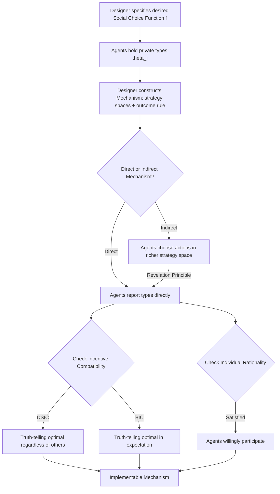

## Mechanism design basics

### Overview and Purpose

Mechanism design is the branch of game theory and microeconomics concerned with **reverse game theory**: rather than analyzing behavior within a given set of rules, mechanism design starts from a desired social or economic outcome and asks how to construct the rules of interaction (the "mechanism") so that self-interested agents, acting strategically on their private information, produce that outcome as an equilibrium result.

This distinguishes mechanism design from standard game-theoretic analysis:

- **Game theory**: rules are given → predict outcomes (equilibrium behavior).
- **Mechanism design**: desired outcome is given → design rules that implement it.

Mechanism design underlies auction design, voting systems, matching markets (school choice, kidney exchange), regulation of monopolies, taxation schemes, and public goods provision. It formalizes the core tension in economics between **efficiency** (achieving the best social outcome) and **incentive compatibility** (agents will not lie or misbehave if it benefits them).

### The Basic Environment

A mechanism design problem is typically specified with the following components:

- A set of $n$ agents, indexed $i = 1, \dots, n$.
- Each agent has private information called their **type**, $\theta_i \in \Theta_i$, drawn from a distribution $F_i$ known to the designer but not the type itself.
- A set of possible **outcomes** $X$ (e.g., who gets an object, what price is charged, which policy is chosen).
- Each agent has a **utility function** $u_i(x, \theta_i)$ over outcomes, depending on their own type.
- A **social choice function** $f: \Theta_1 \times \cdots \times \Theta_n \to X$ specifies the outcome the designer *wants* to implement as a function of the true (but unobserved) types.

The designer's problem: since $\theta_i$ is private, the designer cannot directly compute $f(\theta_1, \dots, \theta_n)$. Instead, the designer must construct a **mechanism** — a set of strategies (message spaces) and an outcome rule — such that when agents play strategically, the resulting equilibrium outcome coincides with $f(\theta)$.

### Mechanisms and the Revelation Principle

A **mechanism** $(S_1, \dots, S_n, g)$ consists of a strategy space $S_i$ for each agent (the set of messages or actions they can send) and an outcome function $g: S_1 \times \cdots \times S_n \to X$ mapping message profiles to outcomes.

**Direct mechanisms** are a special, analytically central case where $S_i = \Theta_i$ for every agent — that is, agents are simply asked to report their type directly, and the outcome function is applied to these reports.

**Key Points**

The **Revelation Principle** states: any outcome implementable by *some* mechanism (with arbitrarily complex strategy spaces) in Bayesian Nash equilibrium can also be implemented by a **direct mechanism** in which truthful reporting is a Bayesian Nash equilibrium.

**Why this matters**: the Revelation Principle allows the designer to search only over the much simpler space of direct, truthful mechanisms without loss of generality when characterizing which social choice functions are implementable. It does not mean real-world mechanisms should always literally ask for truthful reports — indirect mechanisms (like ascending auctions) can be more practical, robust to designer error, or easier for agents to reason about — but the theoretical characterization of *what is achievable* can be done through direct mechanisms.

**Proof sketch (standard construction)**: Suppose mechanism $M$ implements $f$ in Bayesian Nash equilibrium via strategies $s_i^*(\theta_i)$. Construct a direct mechanism $M'$ where agents report $\hat{\theta}_i$ and the designer computes the outcome as if agent $i$ had played $s_i^*(\hat{\theta}_i)$ in $M$. Since $s_i^*$ was an equilibrium in $M$, no agent can profit by deviating to a different report $\hat{\theta}_i \neq \theta_i$ in $M'$, because doing so is equivalent to unilaterally deviating from $s_i^*(\theta_i)$ in the original mechanism $M$, which was not profitable by assumption.

### Incentive Compatibility

**Key Points**

A direct mechanism is **incentive compatible (IC)** if truthful reporting is optimal for every agent. Two standard strengths of this concept are used:

- **Dominant-Strategy Incentive Compatibility (DSIC)**: truth-telling is optimal for agent $i$ *regardless* of what other agents report. This is the strongest and most robust notion — it requires no assumptions about agents' beliefs regarding others' strategies.
- **Bayesian Incentive Compatibility (BIC)**: truth-telling is optimal for agent $i$ *in expectation*, given that all other agents are also truthfully reporting and given the common knowledge distribution over types. This is weaker than DSIC but often the only achievable standard in richer environments.

Formally, a mechanism is DSIC if for every agent $i$, every true type $\theta_i$, every possible misreport $\hat{\theta}_i$, and every possible report profile $\theta_{-i}$ of other agents:

$$u_i(g(\theta_i, \theta_{-i}), \theta_i) \geq u_i(g(\hat{\theta}_i, \theta_{-i}), \theta_i)$$

A mechanism is BIC if the same inequality holds only in expectation over $\theta_{-i}$, given the common prior distribution:

$$E_{\theta_{-i}}[u_i(g(\theta_i, \theta_{-i}), \theta_i)] \geq E_{\theta_{-i}}[u_i(g(\hat{\theta}_i, \theta_{-i}), \theta_i)]$$

**Example**: The second-price sealed-bid (Vickrey) auction is DSIC — bidding your true valuation is optimal no matter what other bidders bid. The first-price sealed-bid auction is *not* DSIC (and not even BIC under truthful reporting) because a bidder's optimal bid depends on the distribution of others' valuations, requiring strategic bid-shading rather than truthful revelation of value.

### Individual Rationality

**Key Points**

A mechanism satisfies **Individual Rationality (IR)** (also called **participation constraint**) if every agent prefers participating in the mechanism (and reporting truthfully) over not participating at all — that is, expected utility from participation must be at least as large as the utility from the outside option (often normalized to zero).

Two common variants:

- **Ex ante IR**: participation is worthwhile in expectation before the agent learns their own type.
- **Interim IR**: participation is worthwhile in expectation after learning one's own type, but before learning others' types. Interim IR is the standard requirement in most auction and regulation models, since agents typically choose whether to participate after already knowing their private information.

Mechanisms lacking IR are not viable in voluntary settings — agents would simply refuse to participate, which is why virtually all applied mechanism design work (auctions, procurement, regulation) imposes IR alongside IC as a baseline feasibility constraint.

### The Gibbard-Satterthwaite Theorem

**Key Points**

The **Gibbard-Satterthwaite Theorem** is a foundational impossibility result: if there are at least three possible outcomes and agents can have any strict preference ordering over them, then the *only* social choice functions that are DSIC and have a full range of possible outcomes are **dictatorial** — the outcome is always whatever a single pre-specified agent prefers.

This result explains why general-purpose voting or social choice mechanisms cannot simultaneously guarantee truthful reporting, non-dictatorship, and full generality over outcomes and preferences. It is the mechanism-design/social-choice analogue of Arrow's Impossibility Theorem, and it motivates why practical mechanism design typically restricts the environment (e.g., to quasilinear utility with money, as in auctions) rather than working with fully general ordinal preferences, since money transfers open up a much richer set of possible truthful mechanisms.

### Quasilinear Environments and the VCG Mechanism

**Key Points**

Most tractable, positive mechanism design results (rather than impossibility results) arise in **quasilinear environments**, where agents' utility takes the additively separable form:

$$u_i(x, t_i, \theta_i) = v_i(x, \theta_i) - t_i$$

where $x$ is the allocation, $t_i$ is a monetary transfer (payment) from agent $i$, and $v_i$ is the agent's valuation for the allocation. This structure — utility linear in money — is what allows money to be used as an incentive-compatibility "lubricant."

**The Vickrey-Clarke-Groves (VCG) Mechanism** is the central positive result in quasilinear mechanism design. It generalizes the second-price auction logic to arbitrary allocation problems:

1. Each agent reports their type (valuation function) $\hat{\theta}_i$.
2. The mechanism selects the **efficient allocation** $x^*$ that maximizes total reported welfare: $x^* = \arg\max_x \sum_i v_i(x, \hat{\theta}_i)$.
3. Each agent $i$ pays a transfer equal to the **externality** they impose on the rest of society — the difference between the total welfare of others under the efficient allocation without $i$, versus their welfare under the allocation chosen when $i$ is included:

$$t_i = \left[\max_x \sum_{j \neq i} v_j(x, \hat{\theta}_j)\right] - \left[\sum_{j \neq i} v_j(x^*, \hat{\theta}_j)\right]$$

**Properties**: VCG is DSIC (truthful reporting is a dominant strategy for every agent) and allocatively efficient. It generalizes the Vickrey second-price auction (which is the VCG mechanism applied to the single-item allocation problem) and underlies combinatorial auction and public-project mechanism designs.

**Limitations**: VCG can generate low or even negative revenue for the designer, is vulnerable to collusion between bidders and to false-name/shill bidding in some environments, may not satisfy budget balance (total transfers may not sum to zero, requiring an outside subsidizer or absorbing a surplus), and can be computationally intractable to run when the efficient-allocation optimization itself is NP-hard, as in large combinatorial auctions. [Inference] These practical drawbacks are generally cited as the reason VCG-style mechanisms, while theoretically central, are less commonly deployed in unmodified form in large real-world markets compared to simpler formats like ascending or sealed-bid auctions.

### The Myerson-Satterthwaite Impossibility Theorem

**Key Points**

The **Myerson-Satterthwaite Theorem** addresses bilateral trade: a single buyer and single seller, each with private valuations for a good, want to trade efficiently. The theorem shows that **no mechanism can simultaneously achieve**: (1) Bayesian incentive compatibility, (2) interim individual rationality, (3) budget balance (no outside subsidy needed), and (4) ex post allocative efficiency (trade occurs whenever the buyer's value exceeds the seller's cost) — when the buyer's valuation and seller's cost have overlapping supports.

**Interpretation**: this is a fundamental impossibility result for decentralized bilateral trade under private information — some efficiency loss (trades that should happen but don't, due to strategic bargaining positions) is unavoidable if the mechanism must be self-financing and voluntary. This underlies why real-world bilateral negotiations frequently fail to reach agreement even when a mutually beneficial trade objectively exists, and it is a cornerstone result explaining bargaining inefficiency in contract theory and negotiation models.

### Diagram: Mechanism Design Problem Structure

### Diagram: VCG Payment Logic (svg_diagram)

<svg xmlns="http://www.w3.org/2000/svg" viewBox="0 0 640 340">
<rect x="0" y="0" width="640" height="340" fill="#ffffff" />
<text x="320" y="25" font-size="16" text-anchor="middle" font-family="sans-serif" font-weight="bold">VCG Payment: Externality Imposed by Agent i (svg_diagram)</text>

<rect x="40" y="70" width="220" height="100" fill="#e8f0fe" stroke="#1f77b4" stroke-width="2" rx="6" />
<text x="150" y="100" font-size="13" text-anchor="middle" font-family="sans-serif" font-weight="bold">With Agent i Included</text>
<text x="150" y="125" font-size="12" text-anchor="middle" font-family="sans-serif">Efficient allocation x*</text>
<text x="150" y="145" font-size="12" text-anchor="middle" font-family="sans-serif">Sum of others' welfare</text>
<text x="150" y="163" font-size="12" text-anchor="middle" font-family="sans-serif">under x*</text>

<rect x="380" y="70" width="220" height="100" fill="#fdecea" stroke="#d62728" stroke-width="2" rx="6" />
<text x="490" y="100" font-size="13" text-anchor="middle" font-family="sans-serif" font-weight="bold">Agent i Excluded</text>
<text x="490" y="125" font-size="12" text-anchor="middle" font-family="sans-serif">Optimal allocation without i</text>
<text x="490" y="145" font-size="12" text-anchor="middle" font-family="sans-serif">Max welfare of remaining</text>
<text x="490" y="163" font-size="12" text-anchor="middle" font-family="sans-serif">agents</text>

<text x="320" y="130" font-size="28" text-anchor="middle" font-family="sans-serif" font-weight="bold">−</text>

<line x1="320" y1="200" x2="320" y2="240" stroke="black" stroke-width="2" marker-end="url(#arrow)" />
<rect x="180" y="245" width="280" height="70" fill="#eafaf1" stroke="#2ca02c" stroke-width="2" rx="6" />
<text x="320" y="275" font-size="13" text-anchor="middle" font-family="sans-serif" font-weight="bold">Agent i's VCG Payment t_i</text>
<text x="320" y="298" font-size="12" text-anchor="middle" font-family="sans-serif">= Externality imposed on others</text>
</svg>

### Applications in Applied Microeconomics and Policy

**Key Points**

- **Auction Design**: mechanism design provides the formal apparatus (IC, IR, revenue maximization subject to constraints) used to derive optimal auctions, as in Myerson's optimal auction theorem.
- **Regulation of Natural Monopolies**: regulators use mechanism design (screening contracts) to induce firms with private cost information to reveal their true costs, balancing productive efficiency against information rents paid to efficient firms — a direct application of IC/IR tradeoffs.
- **Matching Markets**: school choice algorithms (e.g., deferred acceptance) and kidney exchange programs are designed as strategy-proof mechanisms, applying DSIC concepts to non-monetary allocation problems where quasilinear transfers are unavailable or ethically prohibited.
- **Public Goods Provision**: mechanisms like the **Groves-Clarke pivotal mechanism** (a VCG special case) are used to elicit truthful valuations for public projects (e.g., building a bridge) while covering the specified costs, addressing free-rider problems in public economics.
- **Taxation and Optimal Income Tax**: Mirrlees' optimal taxation model is a mechanism design problem where the "type" is an individual's productivity, and the "mechanism" is the tax schedule, subject to IC constraints (individuals can misreport effort/income) — this is a foundational link between mechanism design and public finance.
- **Spectrum and Combinatorial Markets**: as discussed in auction theory, mechanism design principles (particularly VCG-style logic) inform iterative and combinatorial auction formats used by regulators for complex resource allocation.

### Common Pitfalls and Conceptual Distinctions

- **Confusing the Revelation Principle with a practical design recommendation**: the theorem is a *characterization tool* for what social choice functions are theoretically implementable; it does not imply that literal truthful direct-revelation mechanisms are always the best practical choice, since indirect mechanisms can have advantages in robustness, simplicity, or computational tractability.
- **Conflating DSIC and BIC**: DSIC is strictly stronger and more robust (no dependence on beliefs about others), but many practically important mechanisms (e.g., first-price auctions under revenue-maximizing redesign) can only achieve BIC, not DSIC.
- **Assuming efficient allocation and revenue maximization are the same goal**: VCG achieves efficiency but not necessarily high revenue; Myerson's optimal auction is revenue-maximizing but often *not* fully efficient (due to reserve prices excluding low-value trades) — these are generally distinct, sometimes conflicting design objectives.
- **Overlooking budget balance**: an IC and IR mechanism may require an outside subsidy to operate (violating budget balance), which is often infeasible in practice; the Myerson-Satterthwaite theorem shows this tension is sometimes fundamentally unavoidable, not merely a design oversight.

**Related Topics / Next Steps**

- Auction Theory (direct application domain for mechanism design)
- Screening and Adverse Selection (principal-agent contract design)
- Signaling Games and Separating/Pooling Equilibria
- Arrow's Impossibility Theorem and Social Choice Theory
- Matching Theory and the Deferred Acceptance Algorithm (Gale-Shapley)
- Optimal Taxation Theory (Mirrlees Model)
- Public Goods and the Free-Rider Problem
- Contract Theory and Principal-Agent Models
- Combinatorial Auction Design and Winner Determination Algorithms