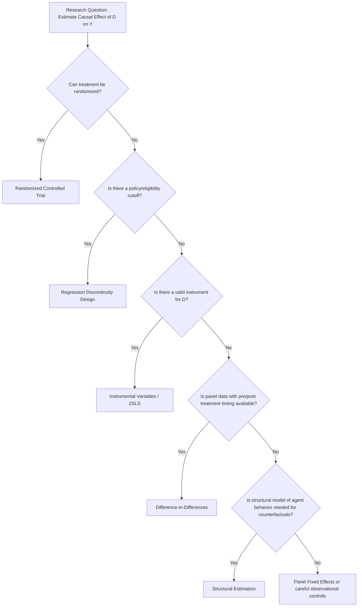

## Empirical methods in microeconomics

### Overview and Purpose

Empirical microeconomics is the set of statistical and econometric methods used to test microeconomic theory, estimate structural relationships (demand, supply, production, preferences), and evaluate the causal effects of policies or interventions using real-world data. Because economic agents self-select into treatments, respond strategically to observed variables, and generate data through processes that are rarely random, the central methodological challenge across this field is **causal identification**: distinguishing correlation from causation in non-experimental (observational) settings.

This body of methods spans two broad traditions:

- **Reduced-form / design-based econometrics**: focuses on estimating causal effects of a specific treatment or policy using research designs that approximate random assignment, without necessarily modeling the full structural/behavioral mechanism.
- **Structural econometrics**: explicitly models agents' optimization problems (utility maximization, profit maximization) and estimates the underlying structural parameters, allowing counterfactual policy simulations beyond the range of observed variation.

### The Fundamental Problem of Causal Inference

**Key Points**

The **potential outcomes framework** (Rubin Causal Model) formalizes causal inference. For each individual $i$, define two potential outcomes:

- $Y_i(1)$: the outcome individual $i$ would experience *if treated*.
- $Y_i(0)$: the outcome individual $i$ would experience *if not treated*.

The individual-level causal effect is $Y_i(1) - Y_i(0)$, but only one of these two outcomes is ever observed for any given individual — this is the **Fundamental Problem of Causal Inference**. Empirical methods are fundamentally strategies for approximating the *unobserved counterfactual*.

The **Average Treatment Effect (ATE)** is defined as:

$$ATE = E[Y_i(1) - Y_i(0)]$$

A naive comparison of treated and untreated group means identifies the ATE only if treatment assignment is **independent of potential outcomes** — a condition virtually never satisfied by simple observational comparisons, due to **selection bias**: individuals who select into treatment often differ systematically from those who do not, in ways correlated with the outcome.

$$\underbrace{E[Y_i \mid D_i = 1] - E[Y_i \mid D_i = 0]}_{\text{Naive comparison}} = \underbrace{ATE}_{\text{causal effect}} + \underbrace{E[Y_i(0) \mid D_i=1] - E[Y_i(0) \mid D_i=0]}_{\text{Selection bias}}$$

### Randomized Controlled Trials (RCTs)

**Key Points**

RCTs randomly assign the treatment $D_i$, ensuring $D_i$ is statistically independent of both potential outcomes $Y_i(0)$ and $Y_i(1)$. This eliminates selection bias by construction, making the simple difference-in-means estimator unbiased for the ATE.

**Design considerations**:

- **Sample size / power calculations**: determining the minimum sample needed to detect an effect of a given size with acceptable statistical power, given expected outcome variance.
- **Randomization unit**: individual-level vs. cluster-level (e.g., randomizing at the village, classroom, or firm level when spillovers between individuals are likely).
- **Attrition**: differential dropout between treatment and control groups can reintroduce selection bias even after successful randomization, requiring bounds analysis (e.g., Lee bounds) to assess robustness.
- **Spillovers/SUTVA violations**: the Stable Unit Treatment Value Assumption requires that one individual's treatment status does not affect another individual's potential outcomes; violated when treatment effects spill over to control units (general equilibrium effects, social interactions), biasing simple estimators.
- **External validity**: RCT results are often criticized for reflecting effects specific to the study population, time, and context, raising questions about generalizability to other settings — a frequently cited tradeoff against the strong internal validity RCTs provide.

RCTs are considered the methodological "gold standard" for internal validity, but are frequently infeasible, unethical, or prohibitively expensive for many economically important questions (e.g., the effect of macroeconomic policy, minimum wage laws at a national scale), motivating the quasi-experimental methods below.

### Difference-in-Differences (DiD)

**Key Points**

DiD estimates causal effects by comparing the **change over time** in outcomes for a treatment group against the change over time for a control group, differencing out both time-invariant group differences and common time trends.

**Canonical two-period, two-group estimator**:

$$\hat{\tau}_{DiD} = \left(\bar{Y}_{treat, post} - \bar{Y}_{treat, pre}\right) - \left(\bar{Y}_{control, post} - \bar{Y}_{control, pre}\right)$$

Equivalently estimated via the regression:

$$Y_{it} = \alpha + \beta \cdot \text{Post}_t + \gamma \cdot \text{Treat}_i + \delta \cdot (\text{Post}_t \times \text{Treat}_i) + \varepsilon_{it}$$

where $\delta$ is the DiD estimate of the treatment effect.

**Key identifying assumption: Parallel Trends**. In the absence of treatment, the treatment and control groups would have followed the same trend over time. This assumption is fundamentally untestable in its exact form (it concerns a counterfactual), but is commonly assessed via:

- **Pre-trend testing**: checking that treatment and control groups had statistically similar trends in the pre-treatment periods, using **event-study specifications** that estimate treatment effects separately for each period relative to treatment timing.

**Modern staggered-adoption complications**: [Inference] a substantial body of recent econometric research (roughly since the late 2010s) has shown that standard two-way fixed effects (TWFE) DiD estimators can be severely biased in settings with staggered treatment timing across units and heterogeneous treatment effects over time, because such estimators implicitly use already-treated units as comparison groups in ways that can generate negative weighting on some genuine treatment effects. This has motivated newer estimators (e.g., Callaway-Sant'Anna, Sun-Abraham, de Chaisemartin-D'Haultfœuille, Borusyak-Jaravel-Spiess) designed to be robust to treatment effect heterogeneity across time and cohort. Given the active and evolving nature of this literature, specific estimator recommendations should be checked against current methodological consensus at the time of application.

### Regression Discontinuity Design (RDD)

**Key Points**

RDD exploits a situation where treatment assignment is a **known, deterministic (or probabilistic) function of a continuous "running variable"** crossing a threshold — for example, students scoring above a cutoff receive a scholarship, or firms above a size threshold face different regulations.

**Sharp RDD**: treatment is a deterministic function of the running variable $X_i$ crossing cutoff $c$: $D_i = \mathbb{1}[X_i \geq c]$. The treatment effect at the cutoff is estimated as:

$$\tau_{RDD} = \lim_{x \downarrow c} E[Y_i \mid X_i = x] - \lim_{x \uparrow c} E[Y_i \mid X_i = x]$$

This is the **Local Average Treatment Effect (LATE) at the cutoff** — it identifies the causal effect only for units near the threshold, not necessarily for the full population.

**Fuzzy RDD**: treatment probability jumps discontinuously at the cutoff but is not deterministic (e.g., crossing the cutoff increases but does not guarantee treatment). Estimated via an instrumental-variables-like ratio of the outcome discontinuity to the treatment-probability discontinuity.

**Key identifying assumption**: units cannot precisely manipulate their running variable to sort across the cutoff; absent such manipulation, units just above and just below the cutoff are comparable in expectation, since they differ only by the (essentially random) luck of falling on one side or the other of an arbitrary threshold.

**Common diagnostic tests**:

- **McCrary density test**: checks for a discontinuity in the density of the running variable itself at the cutoff, which would indicate manipulation/sorting.
- **Covariate balance tests**: checks that pre-determined covariates do not jump discontinuously at the cutoff (they shouldn't, if identification holds).
- **Bandwidth sensitivity**: results should be checked for robustness across different bandwidth choices (how far from the cutoff observations are included) and functional form specifications (linear vs. higher-order polynomial fits on each side).

### Instrumental Variables (IV)

**Key Points**

IV estimation addresses **endogeneity** — cases where the treatment/regressor of interest is correlated with the error term (due to omitted variables, reverse causality, or measurement error) — by finding an **instrument** $Z_i$ that satisfies:

- **Relevance**: $Z_i$ is correlated with the endogenous regressor $D_i$ (testable).
- **Exclusion restriction**: $Z_i$ affects the outcome $Y_i$ *only* through its effect on $D_i$, with no direct channel (fundamentally untestable, requires economic/institutional justification).

**Two-Stage Least Squares (2SLS)** is the standard estimator:

$$\text{First stage: } D_i = \pi_0 + \pi_1 Z_i + \nu_i$$

$$\text{Second stage: } Y_i = \beta_0 + \beta_1 \hat{D}_i + \varepsilon_i$$

where $\hat{D}_i$ is the fitted value from the first stage, isolating variation in $D_i$ driven only by the instrument $Z_i$.

**Weak instrument problem**: when the first-stage relationship between $Z_i$ and $D_i$ is weak (low first-stage F-statistic), 2SLS estimates become biased toward the OLS estimate and standard errors become unreliable; a first-stage F-statistic threshold (historically cited around 10, though this rule of thumb has been refined in subsequent literature) is commonly used as a diagnostic, though it does not guarantee validity.

**Local Average Treatment Effect (LATE) interpretation**: with heterogeneous treatment effects, IV identifies the treatment effect only for **compliers** — the subpopulation whose treatment status is actually changed by the instrument — not the full population ATE. This is formalized by the LATE theorem (Imbens-Angrist).

**Common instrument sources in applied microeconomics**: policy rule changes, geographic variation (distance to a resource), historical/institutional variation, and **judge/examiner leniency designs** (using quasi-random assignment to decision-makers with varying strictness as an instrument for the decision itself).

### Panel Data Methods

**Key Points**

Panel (longitudinal) data — observing the same units over multiple time periods — allows controlling for **time-invariant unobserved heterogeneity** that would otherwise bias cross-sectional estimates.

- **Fixed Effects (FE) Estimator**: includes a dummy variable (or equivalently, demeans the data) for each unit, controlling for any time-invariant unit-specific confounder, whether observed or not. Identification comes purely from **within-unit variation over time**.
- **Random Effects (RE) Estimator**: treats the unit-specific effect as a random variable uncorrelated with regressors, which is more efficient than FE if valid, but yields inconsistent estimates if the unit effect is actually correlated with regressors (tested via the **Hausman test**).
- **First-Differencing**: an alternative to FE that also removes time-invariant heterogeneity by differencing consecutive periods; algebraically equivalent to FE only in the two-period case.

**Limitations**: FE cannot identify the effect of any time-invariant regressor (it is differenced away), and does not by itself resolve endogeneity arising from time-varying omitted variables or reverse causality.

### Structural Estimation

**Key Points**

Structural methods explicitly specify and estimate the parameters of an underlying economic model (utility function, production function, or game-theoretic equilibrium), in contrast to reduced-form methods, which estimate treatment effects without fully specifying the mechanism.

- **Demand Estimation (BLP method)**: the Berry-Levinsohn-Pakes (1995) approach estimates discrete-choice demand systems for differentiated products, addressing the endogeneity of price (correlated with unobserved product quality) using instruments (commonly cost shifters or characteristics of competing products), and recovering own- and cross-price elasticities usable for merger simulation and market power analysis.
- **Production Function Estimation**: methods such as Olley-Pakes and Levinsohn-Petrin address the simultaneity problem in estimating production functions — firms observe their own productivity shocks and adjust input choices (especially labor) in response, biasing naive OLS estimates of input elasticities.
- **Dynamic Discrete Choice Models**: structural models of sequential decision-making under uncertainty (e.g., Rust's bus engine replacement model), typically estimated via maximum likelihood or simulated method of moments, allowing researchers to recover parameters governing forward-looking behavior and simulate counterfactual policies.

**Structural vs. reduced-form tradeoff**: structural models permit **counterfactual policy simulation** outside the range of observed historical variation (a key advantage for ex ante policy evaluation), at the cost of stronger functional-form and behavioral assumptions that, if misspecified, can bias conclusions in ways that are harder to detect than in transparent reduced-form designs.

### Diagram: Identification Strategy Selection Logic

### Diagram: RDD Discontinuity at Cutoff (svg_diagram)

<svg viewBox="0 0 640 380" xmlns="http://www.w3.org/2000/svg">
<rect x="0" y="0" width="640" height="380" fill="#ffffff"/>
<text x="320" y="25" font-size="16" text-anchor="middle" font-family="sans-serif" font-weight="bold">Regression Discontinuity at Cutoff c (svg_diagram)</text>
<!-- Axes -->
<line x1="70" y1="320" x2="590" y2="320" stroke="black" stroke-width="2"/>
<line x1="70" y1="320" x2="70" y2="60" stroke="black" stroke-width="2"/>
<text x="590" y="345" font-size="13" text-anchor="middle" font-family="sans-serif">Running variable X</text>
<text x="45" y="60" font-size="13" text-anchor="middle" font-family="sans-serif">Y</text>
<!-- Cutoff line -->
<line x1="330" y1="60" x2="330" y2="320" stroke="#999999" stroke-width="2" stroke-dasharray="6,4"/>
<text x="330" y="340" font-size="12" text-anchor="middle" font-family="sans-serif">cutoff c</text>
<!-- Below cutoff: control fit -->
<path d="M 90 260 Q 210 240 320 220" fill="none" stroke="#1f77b4" stroke-width="3"/>
<text x="180" y="200" font-size="12" fill="#1f77b4" font-family="sans-serif">Control (X &lt; c)</text>
<!-- Above cutoff: treated fit, discontinuous jump -->
<path d="M 340 150 Q 460 130 580 110" fill="none" stroke="#d62728" stroke-width="3"/>
<text x="440" y="95" font-size="12" fill="#d62728" font-family="sans-serif">Treated (X &ge; c)</text>
<!-- Jump indicator -->
<line x1="330" y1="220" x2="330" y2="150" stroke="#2ca02c" stroke-width="2" marker-end="url(#arrow2)" marker-start="url(#arrow2start)"/>
<defs>
<marker id="arrow2" markerWidth="8" markerHeight="8" refX="4" refY="4" orient="auto">
<path d="M0,0 L8,4 L0,8 z" fill="#2ca02c"/>
</marker>
<marker id="arrow2start" markerWidth="8" markerHeight="8" refX="4" refY="4" orient="auto">
<path d="M8,0 L0,4 L8,8 z" fill="#2ca02c"/>
</marker>
</defs>
<text x="345" y="185" font-size="12" fill="#2ca02c" font-family="sans-serif">τ = LATE at cutoff</text>
<!-- Scattered data points -->
<circle cx="110" cy="270" r="3" fill="#1f77b4"/>
<circle cx="150" cy="255" r="3" fill="#1f77b4"/>
<circle cx="200" cy="250" r="3" fill="#1f77b4"/>
<circle cx="260" cy="235" r="3" fill="#1f77b4"/>
<circle cx="300" cy="222" r="3" fill="#1f77b4"/>
<circle cx="360" cy="145" r="3" fill="#d62728"/>
<circle cx="410" cy="135" r="3" fill="#d62728"/>
<circle cx="470" cy="125" r="3" fill="#d62728"/>
<circle cx="530" cy="115" r="3" fill="#d62728"/>
</svg>

### Applications in Applied Microeconomics and Policy

**Key Points**

- **Labor Economics**: minimum wage effects on employment (canonical DiD applications, e.g., Card-Krueger), returns to education (IV using compulsory schooling law changes as instruments), and the effects of job training programs (RCT evaluations).
- **Public Economics**: tax elasticity estimation (bunching estimators at tax kink points, a specialized RDD-adjacent method), and welfare program impacts (RCTs and RDD around eligibility thresholds).
- **Industrial Organization**: merger simulation using BLP-style structural demand estimation to predict post-merger price effects, a standard tool in antitrust economic analysis.
- **Development Economics**: RCTs are heavily used to evaluate microfinance, health, and education interventions in developing-country contexts, given feasibility of randomized rollout at village or individual level.
- **Health Economics**: RDD around age-based eligibility cutoffs (e.g., Medicare enrollment age) and IV using distance-to-provider as an instrument for treatment receipt.

### Common Pitfalls and Conceptual Distinctions

- **Confusing statistical significance with economic/practical significance**: a precisely estimated small effect may be statistically significant but economically negligible, and vice versa for underpowered studies.
- **Treating IV/RDD/DiD estimates as the ATE for the full population**: these methods generally identify **local** effects (LATE, effect at the cutoff, effect for the specific treated cohort) that may not generalize to units far from the identifying variation.
- **Ignoring the exclusion restriction's untestability**: unlike instrument relevance (directly testable via the first-stage), the exclusion restriction rests on economic argument and institutional knowledge, not a statistical test — a common source of legitimate scholarly disagreement over IV validity.
- **Applying two-way fixed effects DiD naively with staggered treatment timing**: as discussed above, this is now a well-documented source of bias when treatment effects are heterogeneous across cohorts or over time, and applied work increasingly uses heterogeneity-robust estimators instead.
- **Conflating correlation-based control strategies (adding covariates) with genuine identification strategies**: controlling for observables does not address bias from unobserved confounders, which is the core justification for RCTs, IV, RDD, and DiD as distinct identification strategies.

**Related Topics / Next Steps**

- Panel Data Econometrics: Fixed Effects, Random Effects, and Dynamic Panel Models
- Instrumental Variables: Weak Instrument Diagnostics and the LATE Theorem in Depth
- Structural Industrial Organization: BLP Demand Estimation Walkthrough
- Bunching Estimators and Tax Elasticity Identification
- Synthetic Control Methods for Comparative Case Studies
- Heterogeneity-Robust Difference-in-Differences Estimators (Callaway-Sant'Anna, Borusyak-Jaravel-Spiess)
- Machine Learning Methods in Causal Inference (Double/Debiased Machine Learning, Causal Forests)
- Survey and Revealed-Preference Data Methods in Applied Microeconomics
- Dynamic Discrete Choice Estimation (Rust-style Models)