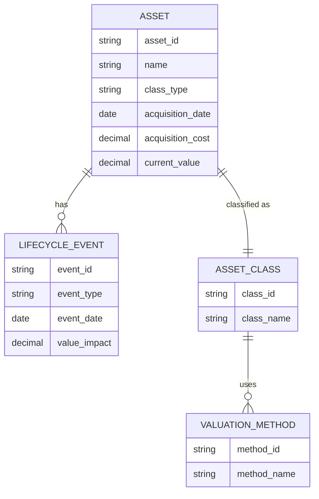

## Defining an Asset across Physical, Financial, and Digital Classes

### Overview

An **asset** is any resource controlled by an entity as a result of past events, from which future economic benefit is expected to flow to the entity. This definition, rooted in accounting frameworks such as IFRS and GAAP, underpins Asset Lifecycle Management (ALM) regardless of the asset's form. ALM extends the accounting definition into an operational one: an asset is anything with a lifecycle — acquisition, deployment, maintenance, and disposal — that must be tracked, valued, and optimized over time.

The classification of an asset into **Physical**, **Financial**, or **Digital** determines which lifecycle processes, valuation methods, and compliance regimes apply to it.

### Core Definitional Criteria

For an item to qualify as an asset under ALM, it typically must satisfy:

- **Control/Ownership**: The entity has the right to obtain benefits and restrict others' access.
- **Past Transaction or Event**: The asset arose from a completed acquisition, construction, or creation event (not merely a future intention).
- **Future Economic Benefit**: The item is expected to generate cash flow, cost savings, service potential, or strategic value.
- **Measurability**: The asset's cost or value can be reliably determined at a point in time.

These four criteria are common across all three classes, but the mechanics of each criterion differ substantially by class.

### Physical Assets (Tangible Assets)

Physical assets are tangible, have a physical form, and are subject to physical degradation.

**Key Points**

- Subcategorized into **fixed assets** (buildings, machinery, vehicles) and **movable/mobile assets** (tools, IT hardware, fleet).
- Governed by **depreciation** accounting — the systematic allocation of cost over useful life.
- Lifecycle events include acquisition, installation/commissioning, preventive/corrective maintenance, condition monitoring, and disposal/decommissioning.
- Identification typically relies on physical tagging: barcodes, QR codes, RFID tags, or asset nameplates.

**Depreciation Models**

Straight-line depreciation, the most common method for physical assets in ALM systems:

$$D_t = \frac{C - S}{n}$$

Where $C$ is the acquisition cost, $S$ is the salvage value, and $n$ is the useful life in periods.

Declining balance (accelerated depreciation):

$$D_t = BV_{t-1} \times r$$

Where $BV_{t-1}$ is the book value at the end of the prior period and $r$ is the depreciation rate.

**Example**

A CNC milling machine acquired for $120,000, salvage value $20,000, useful life 10 years:

$$D_t = \frac{120000 - 20000}{10} = 10000 \text{ per year}$$

### Financial Assets

Financial assets derive value from a contractual claim rather than physical substance. They include cash, receivables, equity instruments, bonds, and derivatives.

**Key Points**

- Valued via **fair value**, **amortized cost**, or **historical cost**, depending on classification (IFRS 9 categories: FVTPL, FVOCI, amortized cost).
- Lifecycle stages differ from physical assets: origination/issuance, mark-to-market revaluation, coupon/dividend accrual, impairment testing, and settlement/maturity.
- No physical depreciation; instead, financial assets are subject to **impairment** (expected credit loss models) and **market risk revaluation**.
- Custody and control are typically represented digitally (ledger entries, custodian records) even though the asset class is "financial" rather than "digital" — the distinguishing factor is the nature of the claim (a right to future cash flows), not the storage medium.

**Example**

A corporate bond with face value $1,000, coupon rate 5%, purchased at a discount for $950. Amortized cost accretion per period using the effective interest method:

$$\text{Interest Income} = BV_{t-1} \times r_{effective}$$

### Digital Assets

Digital assets are non-physical items that exist in binary/electronic form and derive value from information content, licensing rights, or cryptographic ownership rather than physical substance or contractual cash flow claims alone.

**Key Points**

- Subclasses include: **software licenses**, **datasets/data assets**, **digital media/IP**, and **crypto/tokenized assets** (cryptocurrencies, NFTs, tokenized securities).
- Ownership verification mechanisms vary widely: license keys and entitlement servers (software), access control lists (data), or distributed ledger records (crypto assets).
- Lifecycle events include provisioning, version control, entitlement renewal/expiration, obsolescence (technical or licensing), and secure decommissioning (including data destruction/right-to-erasure compliance).
- Valuation is the most heterogeneous of the three classes: software may be capitalized and amortized like a physical intangible asset (per ASC 350-40 / IAS 38), while cryptographic tokens are typically marked to market using observable exchange prices.
- [Inference] Organizations that treat data itself as a balance-sheet asset are still uncommon in mainstream financial reporting; most jurisdictions currently expense data acquisition/curation costs rather than capitalizing them, though this is an area of active accounting policy debate.

**Example**

An enterprise SaaS license bundle costing $50,000/year, capitalized under ASC 350-40 as an intangible asset with a 3-year amortization schedule, contrasted with a Bitcoin holding of 2 BTC, which is remeasured to fair value each reporting period with gains/losses recognized directly, per ASU 2023-08 crypto asset guidance.

### Comparative Classification Table

| Dimension | Physical | Financial | Digital |
| --- | --- | --- | --- |
| Form | Tangible | Contractual claim | Binary/electronic |
| Value driver | Utility, condition | Cash flow rights, market rate | Licensing, information, cryptographic scarcity |
| Degradation | Physical wear | Credit/market risk | Obsolescence, license expiry |
| Valuation method | Depreciation (cost-based) | Fair value / amortized cost | Amortization (IP) or mark-to-market (crypto) |
| Identification | Tags, serial numbers | Account/CUSIP/ISIN | License keys, hashes, wallet addresses |
| Disposal | Physical decommission, salvage | Sale, maturity, write-off | Deprovisioning, secure data deletion |

### Cross-Class Boundary Cases

Some assets resist clean classification, and ALM practitioners must apply judgment:

- **Embedded software in physical equipment** (e.g., firmware in an industrial sensor): typically bundled into the physical asset's capitalized cost rather than tracked as a separate digital asset, unless the software has a distinct, separable value and lifecycle.
- **Tokenized real-world assets (RWA)**: a digital token representing fractional ownership of a physical building blurs the physical/digital/financial boundary — the underlying economic right is financial/physical, but the transfer mechanism and custody are digital.
- **Right-of-use assets** (leased equipment under IFRS 16): a physical asset controlled without ownership, capitalized as an intangible-like right-of-use asset on the balance sheet.

### Unified Asset Data Model (Illustrative)

The following diagram represents a generalized entity-relationship structure for an ALM system tracking assets across all three classes.

### Asset Classification Decision Flow (svg_diagram)

<svg xmlns="http://www.w3.org/2000/svg" viewBox="0 0 900 480">
<text x="450" y="25" font-size="18" font-weight="bold" text-anchor="middle" font-family="Arial">Asset Classification Decision Flow (svg_diagram)</text>
<rect x="370" y="45" width="160" height="50" rx="8" fill="#e8eef7" stroke="#333" />
<text x="450" y="75" font-size="13" text-anchor="middle" font-family="Arial">Does it have physical form?</text>
<line x1="410" y1="95" x2="220" y2="150" stroke="#333" marker-end="url(#arrow)" />
<text x="290" y="115" font-size="12" font-family="Arial">Yes</text>
<rect x="120" y="150" width="200" height="50" rx="8" fill="#dff0d8" stroke="#333" />
<text x="220" y="180" font-size="13" text-anchor="middle" font-family="Arial">Physical Asset</text>
<line x1="490" y1="95" x2="650" y2="150" stroke="#333" marker-end="url(#arrow)" />
<text x="590" y="115" font-size="12" font-family="Arial">No</text>
<rect x="550" y="150" width="220" height="50" rx="8" fill="#e8eef7" stroke="#333" />
<text x="660" y="175" font-size="13" text-anchor="middle" font-family="Arial">Is it a contractual claim</text>
<text x="660" y="190" font-size="13" text-anchor="middle" font-family="Arial">to cash flows?</text>
<line x1="600" y1="200" x2="450" y2="255" stroke="#333" marker-end="url(#arrow)" />
<text x="500" y="220" font-size="12" font-family="Arial">Yes</text>
<rect x="350" y="255" width="200" height="50" rx="8" fill="#fcf3cf" stroke="#333" />
<text x="450" y="285" font-size="13" text-anchor="middle" font-family="Arial">Financial Asset</text>
<line x1="720" y1="200" x2="800" y2="255" stroke="#333" marker-end="url(#arrow)" />
<text x="740" y="220" font-size="12" font-family="Arial">No</text>
<rect x="700" y="255" width="180" height="50" rx="8" fill="#f2e0f7" stroke="#333" />
<text x="790" y="280" font-size="13" text-anchor="middle" font-family="Arial">Digital Asset</text>
<rect x="700" y="330" width="180" height="60" rx="8" fill="#fdebd0" stroke="#333" />
<text x="790" y="355" font-size="12" text-anchor="middle" font-family="Arial">Subclass: software /</text>
<text x="790" y="372" font-size="12" text-anchor="middle" font-family="Arial">data / crypto / media</text>
<line x1="790" y1="305" x2="790" y2="330" stroke="#333" marker-end="url(#arrow)" />
<rect x="150" y="230" width="200" height="60" rx="8" fill="#fdebd0" stroke="#333" />
<text x="250" y="255" font-size="12" text-anchor="middle" font-family="Arial">Track: depreciation,</text>
<text x="250" y="272" font-size="12" text-anchor="middle" font-family="Arial">condition, maintenance</text>
<line x1="220" y1="200" x2="240" y2="230" stroke="#333" marker-end="url(#arrow)" />
</svg>

### Regulatory and Standards References

- **IFRS**: IAS 16 (Property, Plant & Equipment), IAS 38 (Intangible Assets), IFRS 9 (Financial Instruments), IFRS 13 (Fair Value Measurement).
- **US GAAP**: ASC 360 (PP&E), ASC 350 (Intangibles), ASC 320/321 (Investments), ASC 350-40 (Internal-Use Software), ASU 2023-08 (Crypto Assets).
- [Unverified] Jurisdiction-specific tax depreciation schedules (e.g., MACRS in the US) may differ materially from book depreciation methods described above; consult local tax codes for precise treatment.

### Practical ALM Implication

Correct class assignment at asset intake time determines:

1. Which lifecycle workflow template applies (maintenance-driven vs. mark-to-market-driven vs. license-renewal-driven).
2. Which valuation engine computes book/fair value on each reporting cycle.
3. Which compliance and disposal procedures apply (physical decommissioning vs. contractual settlement vs. secure data erasure).

Misclassification at intake is a common root cause of downstream valuation errors and audit findings in ALM systems, since correcting an asset's class after lifecycle events have accrued against the wrong valuation model typically requires manual restatement.

**Related Topics**

- Asset Identification and Tagging Standards (barcode, RFID, GS1)
- Depreciation and Amortization Methods in Depth
- Impairment Testing and Expected Credit Loss (ECL) Models
- Right-of-Use Assets and Lease Accounting (IFRS 16 / ASC 842)
- Tokenization of Real-World Assets (RWA)
- Data as a Balance Sheet Asset: Emerging Accounting Treatments
- Asset Master Data Governance and Data Quality