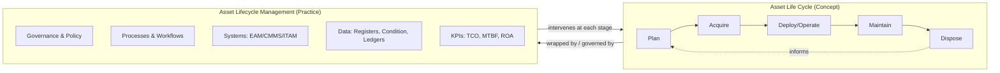

## The Asset Life Cycle as Concept versus Asset Lifecycle Management as Practice

### Overview

The **Asset Life Cycle** and **Asset Lifecycle Management (ALM)** are frequently conflated, but they occupy different conceptual layers. The Asset Life Cycle is a **descriptive model** — it describes the stages an asset naturally passes through from creation to retirement, independent of whether anyone is actively managing it. ALM is a **prescriptive discipline** — a set of processes, governance structures, tools, and decision frameworks deliberately applied to influence how an asset moves through that life cycle in order to maximize value and minimize risk.

An asset has a life cycle whether or not an organization tracks it. An organization only has *asset lifecycle management* if it is actively intervening in that life cycle.

### The Asset Life Cycle (Concept)

The life cycle is a **phase model**, typically expressed as a linear or cyclical sequence of stages.

**Key Points**

- Canonical stages: **Plan → Acquire → Deploy/Operate → Maintain → Dispose/Retire**.
- Some frameworks (e.g., PAS 55, ISO 55000) frame it as a continuous loop rather than a linear path, since retired assets inform planning for replacements.
- The life cycle is **asset-class-agnostic in structure** but **class-specific in content** — a physical machine's "maintain" phase involves preventive maintenance scheduling, while a financial instrument's equivalent phase involves mark-to-market revaluation, and a digital asset's equivalent phase involves patching or license renewal.
- The life cycle exists as an observable phenomenon: even an unmanaged asset (e.g., a forgotten server, an unmonitored piece of equipment) still passes through acquisition, use, degradation, and eventual failure or obsolescence — it simply does so without deliberate oversight.

**Standard Life Cycle Stages**

| Stage | Description | Physical Example | Financial Example | Digital Example |
| --- | --- | --- | --- | --- |
| Plan | Needs identification, budgeting, forecasting | Capacity planning for new machinery | Investment strategy formulation | Software requirements definition |
| Acquire | Procurement, capitalization | Purchase order, delivery, commissioning | Purchase/issuance of security | License purchase, provisioning |
| Deploy/Operate | Asset placed into productive use | Installed and running | Held in portfolio, accruing returns | Deployed to production environment |
| Maintain | Sustaining condition/value | Preventive/corrective maintenance | Revaluation, coupon collection | Patching, version upgrades |
| Dispose/Retire | Removal from active use | Salvage, decommission | Sale, maturity, write-off | Deprovisioning, data destruction |

### Asset Lifecycle Management (Practice)

ALM is the organizational discipline that wraps around the life cycle concept. It answers: *who* makes decisions at each stage, *what* data informs those decisions, *which* tools execute them, and *how* performance is measured.

**Key Points**

- ALM encompasses **governance** (policies, ownership, accountability — who approves disposal, who owns maintenance budgets), **processes** (workflows, approval chains, escalation paths), **systems** (CMMS, EAM, ERP, ITAM platforms), and **data** (asset registers, condition data, financial ledgers).
- ALM introduces feedback loops absent from the raw life cycle concept: condition monitoring data feeds back into maintenance scheduling; disposal outcomes feed back into future procurement decisions (total cost of ownership analysis).
- ALM is measured through KPIs that have no meaning at the pure "life cycle" conceptual level: Mean Time Between Failures (MTBF), Return on Assets (ROA), Total Cost of Ownership (TCO), asset utilization rate, and compliance audit pass rate.
- Standards bodies formalize ALM practice distinctly from the life cycle concept itself — **ISO 55000/55001/55002** define an asset management *system* (policy, strategic asset management plan, organizational objectives), not merely the stages an asset goes through.

**Key Distinction Summary**

| Dimension | Asset Life Cycle (Concept) | Asset Lifecycle Management (Practice) |
| --- | --- | --- |
| Nature | Descriptive | Prescriptive |
| Exists without action? | Yes | No |
| Unit of analysis | The asset itself | The organization's processes around the asset |
| Artifacts | Stages, phases | Policies, workflows, systems, KPIs, registers |
| Standards | Implicit in accounting/engineering | ISO 55000, PAS 55, ITIL (for IT assets) |
| Failure mode when absent | Asset still ages/depreciates/degrades naturally | Value leakage, compliance risk, unplanned downtime |

### Total Cost of Ownership as an ALM-Specific Construct

TCO is a concept that only has operational meaning within ALM practice, not within the life cycle concept alone, because it requires deliberate cost aggregation across stages that the life cycle model does not itself perform.

$$TCO = C_{acquisition} + \sum_{t=1}^{n} \left( C_{operating,t} + C_{maintenance,t} \right) + C_{disposal} - S$$

Where $C_{acquisition}$ is the initial purchase/setup cost, $C_{operating,t}$ and $C_{maintenance,t}$ are recurring costs in period $t$, $C_{disposal}$ is the cost to retire the asset, and $S$ is residual/salvage value.

**Example**

A physical asset with:

- Acquisition cost: $50,000
- Annual maintenance: $3,000 over 8 years
- Disposal cost: $1,500
- Salvage value: $5,000

$$TCO = 50000 + (8 \times 3000) + 1500 - 5000 = 70500$$

The life cycle concept tells you the asset *will* be maintained and eventually disposed of. ALM practice is what actually computes, tracks, and acts on the $70,500 figure to inform whether a competing asset with a lower acquisition cost but higher maintenance profile is the better investment.

### Relationship Diagram

### Governance Layer Structure (svg_diagram)

<svg viewBox="0 0 850 420" xmlns="http://www.w3.org/2000/svg">
<text x="425" y="25" font-size="18" font-weight="bold" text-anchor="middle" font-family="Arial">ALM Practice Layered Over Life Cycle Concept (svg_diagram)</text>
<rect x="150" y="60" width="550" height="70" rx="10" fill="#dff0d8" stroke="#333" stroke-width="2"/>
<text x="425" y="90" font-size="14" text-anchor="middle" font-family="Arial" font-weight="bold">Asset Life Cycle (Concept)</text>
<text x="425" y="112" font-size="12" text-anchor="middle" font-family="Arial">Plan → Acquire → Operate → Maintain → Dispose</text>
<line x1="425" y1="130" x2="425" y2="165" stroke="#333" stroke-width="2" marker-end="url(#arrowhead2)"/>
<defs>
<marker id="arrowhead2" markerWidth="10" markerHeight="10" refX="8" refY="3" orient="auto">
<path d="M0,0 L0,6 L9,3 z" fill="#333"/>
</marker>
</defs>
<rect x="100" y="170" width="650" height="220" rx="10" fill="#e8eef7" stroke="#333" stroke-width="2"/>
<text x="425" y="195" font-size="14" text-anchor="middle" font-family="Arial" font-weight="bold">Asset Lifecycle Management (Practice)</text>
<rect x="120" y="210" width="180" height="50" rx="6" fill="#fcf3cf" stroke="#333"/>
<text x="210" y="240" font-size="12" text-anchor="middle" font-family="Arial">Governance & Ownership</text>
<rect x="335" y="210" width="180" height="50" rx="6" fill="#fcf3cf" stroke="#333"/>
<text x="425" y="240" font-size="12" text-anchor="middle" font-family="Arial">Process Workflows</text>
<rect x="550" y="210" width="180" height="50" rx="6" fill="#fcf3cf" stroke="#333"/>
<text x="640" y="240" font-size="12" text-anchor="middle" font-family="Arial">Systems (EAM/ITAM)</text>
<rect x="120" y="280" width="290" height="50" rx="6" fill="#f2e0f7" stroke="#333"/>
<text x="265" y="310" font-size="12" text-anchor="middle" font-family="Arial">Asset Data & Condition Registers</text>
<rect x="425" y="280" width="305" height="50" rx="6" fill="#f2e0f7" stroke="#333"/>
<text x="577" y="310" font-size="12" text-anchor="middle" font-family="Arial">KPIs: TCO, MTBF, ROA, Utilization</text>

<text x="425" y="365" font-size="12" text-anchor="middle" font-family="Arial" font-style="italic">Practice governs and intervenes across every stage of the concept above</text>

</svg>

### Why the Distinction Matters Operationally

- **Auditing**: Auditors assess whether ALM *practice* (documented policy, evidence of maintenance execution, disposal authorization trails) exists — not merely whether assets pass through life cycle stages, which they will regardless.
- **Maturity modeling**: ISO 55001 maturity assessments score an organization's *management system* around assets, not the assets' inherent life cycles. Two organizations can hold identical physical assets with wildly different ALM maturity scores.
- **Tooling procurement**: Buying an EAM/CMMS platform is a *practice* investment; it does not change the underlying life cycle stages an asset goes through, but it changes how well the organization observes, controls, and optimizes movement through those stages.
- [Inference] Organizations that describe themselves as having "asset lifecycle management" but cannot articulate governance ownership, documented workflows, or measurable KPIs are more accurately described as having only informal awareness of the life cycle concept, not a functioning ALM practice.

**Related Topics**

- ISO 55000 / 55001 / 55002 Asset Management System Standards
- Total Cost of Ownership (TCO) Modeling Techniques
- Enterprise Asset Management (EAM) vs. IT Asset Management (ITAM) Platforms
- Asset Register Design and Data Governance
- Maintenance Strategy Frameworks (Reactive, Preventive, Predictive, Prescriptive)
- Asset Disposal and End-of-Life Decision Frameworks
- Organizational Roles in ALM: Asset Owner, Asset Manager, Custodian