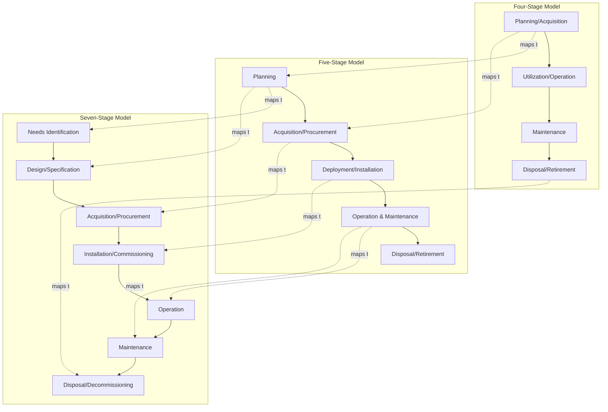

## Comparing the Four-Stage, Five-Stage, and Seven-Stage Lifecycle Models

### Overview

Asset Lifecycle Management literature does not use a single universal stage count. Different frameworks — often tied to different industries, standards bodies, or vendor methodologies — compress or expand the life cycle into **four**, **five**, or **seven** stages. The differences are largely a matter of **granularity**, not disagreement about substance: a seven-stage model typically decomposes stages that a four-stage model treats as a single phase. Understanding all three lets a practitioner map between frameworks when integrating standards, tools, or reporting requirements from different sources.

[Inference] No single body has declared one stage count as globally authoritative; the choice of model is generally driven by industry convention, the granularity needed for reporting, and the specific ALM software platform in use.

### The Four-Stage Model

The most compressed and widely cited model, common in introductory ALM and general financial asset management contexts.

**Stages**

1. **Planning/Acquisition** — needs assessment, procurement, capitalization
2. **Utilization/Operation** — the asset is in active productive use
3. **Maintenance** — sustaining activities across the operational period
4. **Disposal/Retirement** — decommissioning, sale, or write-off

**Key Points**

- Maintenance is often folded into "Utilization" in even more compressed variants, producing a de facto three-stage model — but four stages is the common floor for meaningful ALM discussion.
- This model suits **high-level financial reporting** and **executive dashboards**, where stakeholders need to see capital allocated, in-use, and retired, without operational granularity.
- It underrepresents nuance in the planning phase (no separate treatment of design vs. procurement) and in disposal (no separate treatment of decommissioning vs. sale execution vs. environmental compliance).

### The Five-Stage Model

Adds a distinct **Design/Development** or **Deployment** stage, separating "deciding to acquire" from "acquiring" or separating "acquiring" from "putting into service."

**Stages** (most common variant)

1. **Planning** — needs identification, feasibility, budgeting
2. **Acquisition/Procurement** — sourcing, purchasing, contracting
3. **Deployment/Installation** — commissioning, configuration, go-live
4. **Operation & Maintenance** — combined active-use and sustaining phase
5. **Disposal/Retirement** — decommissioning and removal

**Key Points**

- This is the most common model in **physical/industrial asset management** (facilities, fleet, industrial equipment), because "deployment" (installation, commissioning, testing) is operationally distinct from "acquisition" (the purchase transaction) and carries its own risk and cost profile.
- Some five-stage variants instead split **Disposal** into disposal-planning and disposal-execution rather than splitting acquisition — the fifth-stage split point is not standardized across sources.
- Balances granularity against reporting complexity — commonly implemented in mid-tier CMMS (Computerized Maintenance Management System) platforms.

### The Seven-Stage Model

The most granular model, typically used in **engineering asset management**, **capital project governance**, and **ISO 55000-aligned strategic asset management plans (SAMPs)**, where each stage maps to a distinct governance gate or budget line.

**Stages** (representative variant)

1. **Needs Identification / Planning** — demand forecasting, business case development
2. **Design/Specification** — technical requirements, engineering specification
3. **Acquisition/Procurement** — sourcing, tendering, purchase execution
4. **Installation/Commissioning** — physical or logical deployment and testing
5. **Operation** — active productive use
6. **Maintenance** — preventive, corrective, and predictive maintenance activities
7. **Disposal/Decommissioning** — removal, sale, recycling, or destruction

**Key Points**

- Separates **Operation** from **Maintenance** as distinct stages (rather than combining them), reflecting that maintenance is often budgeted, staffed, and scheduled independently of operational use.
- Separates **Design** from **Acquisition**, which matters for capital-intensive assets (e.g., infrastructure, custom industrial equipment) where specification errors are a major cost driver if caught late.
- Aligns closely with **capital project stage-gate methodologies** (e.g., front-end engineering design/FEED gates in engineering firms), where each of the seven stages corresponds to a formal governance checkpoint requiring sign-off before proceeding.
- Higher administrative overhead: seven-stage tracking requires more granular data capture and is typically justified only for high-value or high-risk assets (major infrastructure, regulated equipment, mission-critical IT systems).

### Comparative Mapping Table

| Four-Stage | Five-Stage | Seven-Stage |
| --- | --- | --- |
| Planning/Acquisition | Planning | Needs Identification/Planning |
| Planning/Acquisition | — | Design/Specification |
| Planning/Acquisition | Acquisition/Procurement | Acquisition/Procurement |
| Utilization/Operation | Deployment/Installation | Installation/Commissioning |
| Utilization/Operation | Operation & Maintenance | Operation |
| Maintenance | Operation & Maintenance | Maintenance |
| Disposal/Retirement | Disposal/Retirement | Disposal/Decommissioning |

### Stage Alignment Diagram

### Granularity Comparison (svg_diagram)

<svg viewBox="0 0 900 380" xmlns="http://www.w3.org/2000/svg">
<text x="450" y="25" font-size="18" font-weight="bold" text-anchor="middle" font-family="Arial">Granularity Increase Across Models (svg_diagram)</text>

<text x="60" y="70" font-size="13" font-weight="bold" font-family="Arial">4-Stage</text>

<rect x="150" y="55" width="180" height="35" fill="`#dff0d8`" stroke="#333"/>

<text x="240" y="77" font-size="11" text-anchor="middle" font-family="Arial">Planning/Acquisition</text>

<rect x="330" y="55" width="180" height="35" fill="`#e8eef7`" stroke="#333"/>

<text x="420" y="77" font-size="11" text-anchor="middle" font-family="Arial">Utilization/Operation</text>

<rect x="510" y="55" width="150" height="35" fill="`#fcf3cf`" stroke="#333"/>

<text x="585" y="77" font-size="11" text-anchor="middle" font-family="Arial">Maintenance</text>

<rect x="660" y="55" width="170" height="35" fill="`#f2e0f7`" stroke="#333"/>

<text x="745" y="77" font-size="11" text-anchor="middle" font-family="Arial">Disposal/Retirement</text>

<text x="60" y="150" font-size="13" font-weight="bold" font-family="Arial">5-Stage</text>

<rect x="150" y="135" width="120" height="35" fill="`#dff0d8`" stroke="#333"/>

<text x="210" y="157" font-size="10" text-anchor="middle" font-family="Arial">Planning</text>

<rect x="270" y="135" width="130" height="35" fill="`#dff0d8`" stroke="#333" opacity="0.7"/>

<text x="335" y="157" font-size="10" text-anchor="middle" font-family="Arial">Acquisition</text>

<rect x="400" y="135" width="130" height="35" fill="`#e8eef7`" stroke="#333"/>

<text x="465" y="157" font-size="10" text-anchor="middle" font-family="Arial">Deployment</text>

<rect x="530" y="135" width="150" height="35" fill="`#e8eef7`" stroke="#333" opacity="0.7"/>

<text x="605" y="157" font-size="10" text-anchor="middle" font-family="Arial">Op & Maintenance</text>

<rect x="680" y="135" width="150" height="35" fill="`#f2e0f7`" stroke="#333"/>

<text x="755" y="157" font-size="10" text-anchor="middle" font-family="Arial">Disposal</text>

<text x="60" y="230" font-size="13" font-weight="bold" font-family="Arial">7-Stage</text>

<rect x="150" y="215" width="95" height="35" fill="`#dff0d8`" stroke="#333"/>

<text x="197" y="237" font-size="9" text-anchor="middle" font-family="Arial">Needs ID</text>

<rect x="245" y="215" width="95" height="35" fill="`#dff0d8`" stroke="#333" opacity="0.7"/>

<text x="292" y="237" font-size="9" text-anchor="middle" font-family="Arial">Design</text>

<rect x="340" y="215" width="95" height="35" fill="`#dff0d8`" stroke="#333" opacity="0.5"/>

<text x="387" y="237" font-size="9" text-anchor="middle" font-family="Arial">Acquisition</text>

<rect x="435" y="215" width="95" height="35" fill="`#e8eef7`" stroke="#333"/>

<text x="482" y="237" font-size="9" text-anchor="middle" font-family="Arial">Install</text>

<rect x="530" y="215" width="95" height="35" fill="`#e8eef7`" stroke="#333" opacity="0.7"/>

<text x="577" y="237" font-size="9" text-anchor="middle" font-family="Arial">Operation</text>

<rect x="625" y="215" width="95" height="35" fill="`#fcf3cf`" stroke="#333"/>

<text x="672" y="237" font-size="9" text-anchor="middle" font-family="Arial">Maintenance</text>

<rect x="720" y="215" width="110" height="35" fill="`#f2e0f7`" stroke="#333"/>

<text x="775" y="237" font-size="9" text-anchor="middle" font-family="Arial">Decommission</text>

<text x="450" y="300" font-size="12" text-anchor="middle" font-family="Arial" font-style="italic">Each row spans the same total life span; increasing stage count subdivides, does not extend, the timeline</text>

</svg>

### Choosing a Model in Practice

| Selection Factor | Favors Four-Stage | Favors Five-Stage | Favors Seven-Stage |
| --- | --- | --- | --- |
| Reporting audience | Executive/financial | Operational management | Engineering/capital projects |
| Asset value/risk | Low-to-medium | Medium | High-value, high-risk, regulated |
| Data capture maturity | Low | Moderate | High |
| Governance requirement | Minimal gates | Some gates | Formal stage-gate sign-off |
| Typical domain | Corporate finance, general IT | Facilities, fleet, industrial CMMS | Infrastructure, engineering, capital projects |

**Conclusion**

The stage count is a **reporting and governance granularity choice**, not a difference in underlying asset behavior. An organization can — and often does — maintain a seven-stage internal engineering process while reporting externally against a four-stage financial model, provided the mapping table between the two is documented and consistently applied. The critical practice requirement is not which model is chosen, but that stage definitions are explicit, mapped against any other model the organization also uses, and applied consistently across the asset register to avoid inconsistent lifecycle-stage tagging.

**Related Topics**

- ISO 55000 Strategic Asset Management Plan (SAMP) Stage Gates
- Stage-Gate Methodology in Capital Project Governance
- Front-End Engineering Design (FEED) Process
- CMMS vs. EAM Platform Data Models
- Asset Lifecycle Stage Tagging and Data Governance
- Mapping Lifecycle Models Across Merged/Acquired Organizations