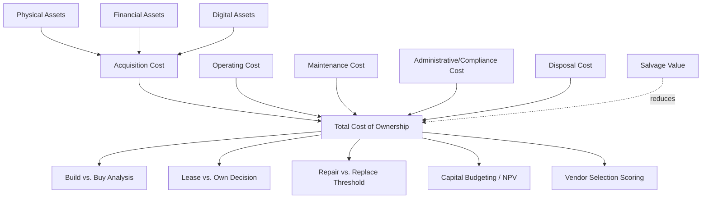

## Total Cost of Ownership as the Unifying Principle

### Overview

**Total Cost of Ownership (TCO)** is the aggregation of all direct and indirect costs incurred over an asset's entire life span — from acquisition through disposal. Within Asset Lifecycle Management, TCO functions as a **unifying principle** because it is the one construct that spans every lifecycle stage and every asset class (physical, financial, digital) using a common unit of measure: cost, expressed in currency terms, normalized over time. Where individual lifecycle stages have class-specific metrics (depreciation for physical assets, mark-to-market for financial assets, amortization for digital IP), TCO is the aggregating framework that lets decision-makers compare fundamentally different asset types on equal financial footing.

### Why TCO Unifies Rather Than Merely Measures

**Key Points**

- TCO forces cross-stage visibility: a decision made in the **acquisition** stage (e.g., choosing a cheaper vendor) has consequences in the **maintenance** stage (e.g., higher failure rates) and the **disposal** stage (e.g., lower resale value). No single-stage metric captures this; TCO does by construction.
- TCO forces cross-class comparability: a $40,000 physical machine, a $40,000 software license, and a $40,000 bond cannot be compared using their native valuation methods (depreciation vs. amortization vs. yield), but they can be compared once each is expressed as a full-lifecycle TCO figure alongside expected benefit.
- TCO is the input to nearly every higher-order ALM decision framework: **build vs. buy**, **lease vs. own**, **repair vs. replace**, and **capital budgeting/NPV analysis** all require TCO as a foundational input.
- Because TCO decomposes into cost categories that map directly onto lifecycle stages, it also functions as an organizing schema for asset data models — an asset register that captures acquisition cost, operating cost, maintenance cost, and disposal cost by construction supports TCO calculation without additional data engineering.

### The General TCO Formula

$$TCO = C_{acq} + \sum_{t=1}^{n} \frac{C_{op,t} + C_{maint,t} + C_{admin,t}}{(1+r)^{t}} + \frac{C_{disp}}{(1+r)^{n}} - \frac{S}{(1+r)^{n}}$$

Where:

- $C_{acq}$ = acquisition cost (purchase price, installation, initial setup, training)
- $C_{op,t}$ = operating cost in period $t$ (energy, consumables, licensing fees, staffing)
- $C_{maint,t}$ = maintenance cost in period $t$ (parts, labor, service contracts)
- $C_{admin,t}$ = administrative/overhead cost in period $t$ (insurance, compliance, monitoring)
- $C_{disp}$ = disposal/decommissioning cost
- $S$ = salvage/residual value at end of life
- $r$ = discount rate
- $n$ = useful life in periods

Discounting future costs to present value is what elevates a naive cost summation into a financially rigorous TCO model — without it, TCO improperly treats a dollar spent in year 10 as equivalent to a dollar spent today.

### TCO Cost Category Breakdown by Asset Class

| Cost Category | Physical Asset | Financial Asset | Digital Asset |
| --- | --- | --- | --- |
| Acquisition | Purchase price, freight, installation | Purchase price, brokerage/transaction fees | License fee, implementation/integration cost |
| Operating | Energy, consumables, operator labor | Custody fees, management fees | Hosting/compute cost, subscription renewal |
| Maintenance | Spare parts, service contracts, inspections | Portfolio rebalancing cost | Patching, version upgrades, technical support |
| Administrative | Insurance, regulatory compliance | Custodial/administrative fees, audit cost | Security compliance, license audits |
| Disposal | Decommissioning, removal, environmental compliance | Transaction cost on sale, exit fees | Data destruction, deprovisioning, migration cost |
| Residual Value | Salvage/resale value | Redemption/maturity value | Rarely material (occasionally resale of hardware bundled with license) |

### Worked Example: Build vs. Buy Comparison

Two competing physical assets for the same operational function, evaluated over a 5-year horizon at a 6% discount rate:

**Option A** — Lower upfront cost, higher maintenance:

- Acquisition: $30,000
- Annual operating + maintenance: $8,000/year
- Disposal: $1,000; Salvage: $2,000

**Option B** — Higher upfront cost, lower maintenance:

- Acquisition: $45,000
- Annual operating + maintenance: $4,500/year
- Disposal: $1,200; Salvage: $3,500

Present value of the 5-year annuity of operating/maintenance costs uses:

$$PV_{annuity} = C \times \frac{1 - (1+r)^{-n}}{r}$$

For Option A: $PV_{annuity} = 8000 \times \frac{1-(1.06)^{-5}}{0.06} \approx 8000 \times 4.2124 \approx 33{,}699$

For Option B: $PV_{annuity} = 4500 \times \frac{1-(1.06)^{-5}}{0.06} \approx 4500 \times 4.2124 \approx 18{,}956$

Disposal and salvage, discounted at year 5 ($(1.06)^{-5} \approx 0.7473$):

Option A: $(1000 - 2000) \times 0.7473 \approx -747$

Option B: $(1200 - 3500) \times 0.7473 \approx -1{,}971$

**Total TCO:**

$$TCO_A = 30000 + 33699 - 747 \approx \$62{,}952$$

$$TCO_B = 45000 + 18956 - 1971 \approx \$61{,}985$$

Despite Option B's 50% higher acquisition cost, its lower TCO over five years makes it the more cost-effective choice once maintenance, discounting, and salvage are unified into a single comparable figure — the calculation the acquisition-price comparison alone would never surface.

### TCO as the Central Node in ALM Decision Frameworks

### TCO Unification Across Asset Classes (svg_diagram)

<svg xmlns="http://www.w3.org/2000/svg" viewBox="0 0 880 400">
<text x="440" y="25" font-size="18" font-weight="bold" text-anchor="middle" font-family="Arial">TCO as Unifying Layer Across Asset Classes (svg_diagram)</text>
<rect x="60" y="60" width="220" height="90" rx="8" fill="#dff0d8" stroke="#333" />
<text x="170" y="90" font-size="13" font-weight="bold" text-anchor="middle" font-family="Arial">Physical Asset</text>
<text x="170" y="110" font-size="11" text-anchor="middle" font-family="Arial">Depreciation, maintenance,</text>
<text x="170" y="126" font-size="11" text-anchor="middle" font-family="Arial">salvage value</text>
<rect x="330" y="60" width="220" height="90" rx="8" fill="#fcf3cf" stroke="#333" />
<text x="440" y="90" font-size="13" font-weight="bold" text-anchor="middle" font-family="Arial">Financial Asset</text>
<text x="440" y="110" font-size="11" text-anchor="middle" font-family="Arial">Mark-to-market, custody fees,</text>
<text x="440" y="126" font-size="11" text-anchor="middle" font-family="Arial">transaction cost</text>
<rect x="600" y="60" width="220" height="90" rx="8" fill="#f2e0f7" stroke="#333" />
<text x="710" y="90" font-size="13" font-weight="bold" text-anchor="middle" font-family="Arial">Digital Asset</text>
<text x="710" y="110" font-size="11" text-anchor="middle" font-family="Arial">Amortization, hosting cost,</text>
<text x="710" y="126" font-size="11" text-anchor="middle" font-family="Arial">license renewal</text>
<line x1="170" y1="150" x2="400" y2="220" stroke="#333" stroke-width="1.5" />
<line x1="440" y1="150" x2="400" y2="220" stroke="#333" stroke-width="1.5" />
<line x1="710" y1="150" x2="480" y2="220" stroke="#333" stroke-width="1.5" />
<rect x="290" y="225" width="260" height="70" rx="10" fill="#e8eef7" stroke="#333" stroke-width="2" />
<text x="420" y="252" font-size="14" font-weight="bold" text-anchor="middle" font-family="Arial">Total Cost of Ownership</text>
<text x="420" y="272" font-size="11" text-anchor="middle" font-family="Arial">Common discounted-cost basis</text>
<line x1="420" y1="295" x2="420" y2="330" stroke="#333" stroke-width="1.5" marker-end="url(#arrow3)" />
<rect x="260" y="335" width="320" height="50" rx="8" fill="#fdebd0" stroke="#333" />
<text x="420" y="365" font-size="12" text-anchor="middle" font-family="Arial">Cross-class investment comparison &amp; decisions</text>
</svg>

### Common TCO Modeling Pitfalls

- **Omitting administrative/overhead costs**: insurance, compliance monitoring, and audit costs are frequently excluded, understating true TCO — particularly material for regulated physical assets and licensed digital assets.
- **Ignoring the discount rate**: summing nominal costs without discounting overstates the relative cost of long-lived assets and understates the relative cost of short-lived assets when comparing options with different useful lives.
- **Static maintenance cost assumptions**: real maintenance cost typically increases with asset age (a bathtub or increasing hazard-rate curve); flat-lining $C_{maint,t}$ across all periods understates late-life TCO for physical assets.
- **Neglecting disposal/decommissioning cost**: for regulated or hazardous physical assets and for digital assets with data-destruction compliance obligations (e.g., GDPR right-to-erasure), disposal cost can be non-trivial and is often omitted entirely from naive models.
- [Inference] Organizations that compare assets on acquisition price alone, without a TCO model, are more likely to systematically underinvest in higher-quality, higher-upfront-cost assets that would have produced lower total cost over the full life span — though the magnitude of this effect is asset- and context-dependent and not universally quantifiable.

**Conclusion**

TCO earns its status as the unifying principle of ALM not because it is the most precise metric for any single lifecycle stage, but because it is the only metric that aggregates coherently **across** all stages and **across** all asset classes. Every other lifecycle-stage-specific metric (depreciation schedules, mark-to-market valuations, amortization tables, maintenance KPIs) feeds into TCO as an input; TCO itself feeds into the organization's highest-level capital allocation and asset strategy decisions.

**Related Topics**

- Net Present Value (NPV) and Discounted Cash Flow in Asset Investment Decisions
- Build vs. Buy Decision Frameworks
- Lease vs. Own Analysis
- Repair vs. Replace Threshold Modeling
- Maintenance Cost Curves and Hazard Rate Modeling
- Vendor Total Cost Scoring in Procurement
- Capital Budgeting and Asset Portfolio Optimization