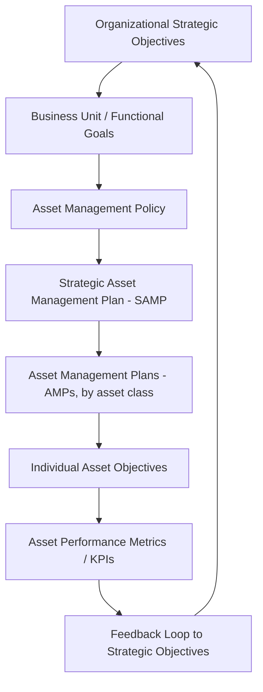

## Value Realization and Line of Sight to Organizational Objectives

### Definition and Conceptual Overview

Value realization in Asset Lifecycle Management (ALM) refers to the systematic process of ensuring that an asset delivers the intended benefits—financial, operational, strategic, or societal—that justified its original acquisition or creation. "Line of sight to organizational objectives" describes the traceable, documented linkage between an individual asset (or asset class) and the higher-level strategic goals of the organization, such that decision-makers at every level can articulate *why* an asset exists and *how* it contributes to enterprise success.

These two concepts are interdependent: without line of sight, value realization becomes anecdotal and unmeasurable; without a value realization framework, line of sight remains a theoretical mapping exercise with no feedback loop to confirm whether the connection actually produces results.

This pairing sits at the foundation of ISO 55000 series thinking, which defines an asset as an item, thing, or entity that has potential or actual value to an organization, explicitly tying the definition of "asset" itself to value delivery rather than mere ownership or physical existence.

### Why This Matters in Asset Lifecycle Management

**Key Points**

- Asset management is frequently reduced to maintenance scheduling or depreciation tracking; value realization reframes it as a value-delivery discipline.
- Organizations often own assets that are technically functional but strategically obsolete (no line of sight), leading to capital misallocation.
- Conversely, assets can be strategically vital but poorly maintained (line of sight exists, but value realization fails operationally).
- The gap between "asset performs" and "asset delivers organizational value" is where most ALM programs fail to mature past reactive states.

### The Value Chain: From Objective to Asset

A structured line of sight typically follows a cascading hierarchy:

Each layer in this chain should be traceable both downward (decomposition of strategy into asset-level tasks) and upward (aggregation of asset performance into strategic reporting). This bidirectional traceability is what ISO 55001 auditors and mature asset management organizations refer to as "golden thread" documentation.

### Core Components of Value Realization

#### 1. Value Definition

Before an asset can "realize value," value itself must be explicitly defined for that asset or asset class. Common value dimensions include:

- **Financial value**: NPV, ROI, total cost of ownership (TCO) reduction, revenue enablement
- **Operational value**: uptime, throughput, capacity utilization
- **Risk value**: reduction in probability or consequence of failure, regulatory compliance
- **Social/environmental value**: sustainability targets, community service levels, ESG contribution
- **Strategic value**: enabling future capability, optionality, competitive positioning

Different stakeholders will weight these dimensions differently, which is why a documented value framework (rather than an assumed one) is essential.

#### 2. Value Mapping / Line of Sight Documentation

This is the explicit artifact—often a matrix, hierarchy diagram, or traceability register—that connects:

$$\text{Strategic Objective} \rightarrow \text{Service/Business Outcome} \rightarrow \text{Asset Function} \rightarrow \text{Specific Asset}$$

**Example**

A water utility's strategic objective is "ensure uninterrupted potable water supply to 99.98% of customers." This decomposes to a service outcome ("minimize unplanned main breaks"), which maps to an asset function ("pipe network integrity"), which maps to specific assets (a cast-iron main installed in 1985 in a corrosive soil zone). The line of sight allows a capital planner to justify replacing that specific main by tracing its failure risk directly back to the customer-service strategic KPI.

#### 3. Value Realization Metrics and Tracking

Once mapped, value realization requires measurable indicators tracked over the asset lifecycle phases (plan, acquire, operate, maintain, renew/dispose). Typical metrics include:

| Lifecycle Phase | Value Realization Indicator |
| --- | --- |
| Planning | Business case NPV/IRR vs. projected |
| Acquisition | Cost/schedule variance vs. approved budget |
| Operation | Actual output/utilization vs. planned capacity |
| Maintenance | Availability/reliability vs. target SLA |
| Renewal/Disposal | Residual value captured vs. book value; disposal cost vs. avoided liability |

#### 4. Governance and Review Cadence

Value realization is not a one-time assessment; it requires periodic re-validation because organizational objectives shift over time (mergers, regulatory change, market disruption, technology substitution). Best-practice frameworks embed value realization reviews into:

- Annual Strategic Asset Management Plan (SAMP) refresh cycles
- Stage-gate reviews during major capital projects
- Post-implementation reviews (PIRs) after asset commissioning
- Mid-life reassessments for long-lived assets (e.g., infrastructure with 30+ year lifespans)

### The "Line of Sight" Gap Problem

**Key Points**

- A common failure mode is *vertical line-of-sight loss*: front-line asset managers know how to keep an asset running but cannot articulate its strategic contribution.
- A second failure mode is *horizontal line-of-sight loss*: an asset's value to one business unit is understood, but its cross-functional value (e.g., shared IT infrastructure supporting multiple product lines) is invisible to individual owners.
- [Inference] Organizations lacking a documented SAMP are statistically more likely to experience line-of-sight gaps, since there is no canonical artifact forcing the strategic-to-asset decomposition; this is a reasonable inference from ISO 55000 adoption literature rather than a universally quantified finding.

### Illustrative Framework: Value Realization Scorecard

The following diagram shows a simplified structural relationship between strategic tiers and value scoring dimensions, useful for building an internal value realization dashboard.

<svg xmlns="http://www.w3.org/2000/svg" viewBox="0 0 800 420" font-family="Arial, sans-serif">
<text x="400" y="30" text-anchor="middle" font-size="18" font-weight="bold" fill="#1a1a2e">Value Realization Scorecard Structure (svg_diagram)</text>
<rect x="40" y="60" width="720" height="60" rx="8" fill="#2b6cb0" />
<text x="400" y="95" text-anchor="middle" font-size="15" fill="#ffffff">Organizational Strategic Objective</text>
<line x1="400" y1="120" x2="400" y2="150" stroke="#333" stroke-width="2" marker-end="url(#arrow)" />
<rect x="60" y="150" width="200" height="55" rx="8" fill="#38a169" />
<text x="160" y="182" text-anchor="middle" font-size="13" fill="#ffffff">Financial Value</text>
<rect x="300" y="150" width="200" height="55" rx="8" fill="#38a169" />
<text x="400" y="182" text-anchor="middle" font-size="13" fill="#ffffff">Operational Value</text>
<rect x="540" y="150" width="200" height="55" rx="8" fill="#38a169" />
<text x="640" y="182" text-anchor="middle" font-size="13" fill="#ffffff">Risk / Compliance Value</text>
<line x1="160" y1="205" x2="160" y2="240" stroke="#333" stroke-width="2" marker-end="url(#arrow)" />
<line x1="400" y1="205" x2="400" y2="240" stroke="#333" stroke-width="2" marker-end="url(#arrow)" />
<line x1="640" y1="205" x2="640" y2="240" stroke="#333" stroke-width="2" marker-end="url(#arrow)" />
<rect x="60" y="240" width="200" height="55" rx="8" fill="#dd6b20" />
<text x="160" y="272" text-anchor="middle" font-size="13" fill="#ffffff">ROI / TCO Metrics</text>
<rect x="300" y="240" width="200" height="55" rx="8" fill="#dd6b20" />
<text x="400" y="272" text-anchor="middle" font-size="13" fill="#ffffff">Uptime / Throughput</text>
<rect x="540" y="240" width="200" height="55" rx="8" fill="#dd6b20" />
<text x="640" y="272" text-anchor="middle" font-size="13" fill="#ffffff">Failure Rate / Audit Findings</text>
<line x1="160" y1="295" x2="400" y2="330" stroke="#333" stroke-width="2" marker-end="url(#arrow)" />
<line x1="400" y1="295" x2="400" y2="330" stroke="#333" stroke-width="2" marker-end="url(#arrow)" />
<line x1="640" y1="295" x2="400" y2="330" stroke="#333" stroke-width="2" marker-end="url(#arrow)" />
<rect x="250" y="330" width="300" height="60" rx="8" fill="#805ad5" />
<text x="400" y="365" text-anchor="middle" font-size="14" fill="#ffffff">Aggregate Asset Value Realization Score</text>
</svg>

### Practical Implementation Approach

**Example**

A manufacturing firm implementing line-of-sight documentation might follow this sequence:

1. **Extract strategic objectives** from the corporate strategy document (e.g., "reduce unplanned downtime by 20% over 3 years")
2. **Identify contributing asset classes** (e.g., CNC machining centers, conveyor systems)
3. **Assign asset-level KPIs** that ladder up to the objective (e.g., mean time between failures, OEE — Overall Equipment Effectiveness)
4. **Establish data capture mechanisms** (CMMS/EAM system tagging, IoT sensor integration)
5. **Build a traceability register** linking each asset's KPI dashboard to the strategic KPI it supports
6. **Review quarterly**, adjusting asset investment priorities based on realized vs. targeted value contribution

$$\text{OEE} = \text{Availability} \times \text{Performance} \times \text{Quality}$$

Where a persistent gap between target OEE and actual OEE at the asset level, once aggregated across the fleet, directly explains variance against the strategic downtime-reduction objective—this is the mechanical essence of line of sight.

### Common Anti-Patterns

- **Vanity metrics**: tracking asset uptime without connecting it to any strategic outcome ("uptime for uptime's sake")
- **Objective drift**: strategic goals change but asset management plans are not updated, leaving line of sight stale
- **Siloed value definitions**: finance defines value as TCO reduction while operations defines it as throughput, with no reconciliation, causing conflicting investment signals
- **One-way traceability**: strategy is decomposed to assets but asset performance data never flows back up to inform strategic review (broken feedback loop)

### Relationship to ISO 55000 and Governance Frameworks

ISO 55000 explicitly requires organizations to demonstrate the linkage between organizational objectives and asset management activities through the Strategic Asset Management Plan (SAMP) and organizational policy documents. Value realization assessment is typically an auditable requirement under ISO 55001 certification, where auditors specifically probe whether asset managers can articulate the strategic rationale behind operational decisions—this is a common certification audit technique.

**Conclusion**

Value realization and line of sight function as the connective tissue between tactical asset operations and strategic organizational success. Without this linkage, asset management remains a cost center focused on upkeep; with it, asset management becomes a demonstrable value-generation function capable of justifying investment, prioritizing capital allocation, and defending budget decisions with traceable evidence back to organizational goals. [Unverified] The specific financial magnitude of improved decision-making attributable to formal line-of-sight practices will vary significantly by industry, asset intensity, and organizational maturity, and should not be assumed to generalize across sectors without organization-specific validation.

**Related Topics**

- Strategic Asset Management Plans (SAMP) and Policy Development
- Asset Management Objectives and KPI Cascading Frameworks
- ISO 55000/55001/55002 Governance Requirements
- Total Cost of Ownership (TCO) and Lifecycle Costing Models
- Risk-Based Asset Investment Prioritization
- Asset Criticality Assessment Frameworks
- Balanced Scorecard Approaches in Asset Management
- Post-Implementation Review (PIR) Methodologies
- Data Governance for Asset Performance Traceability