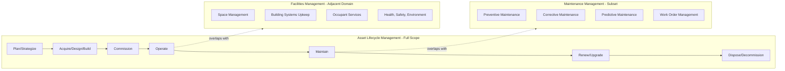
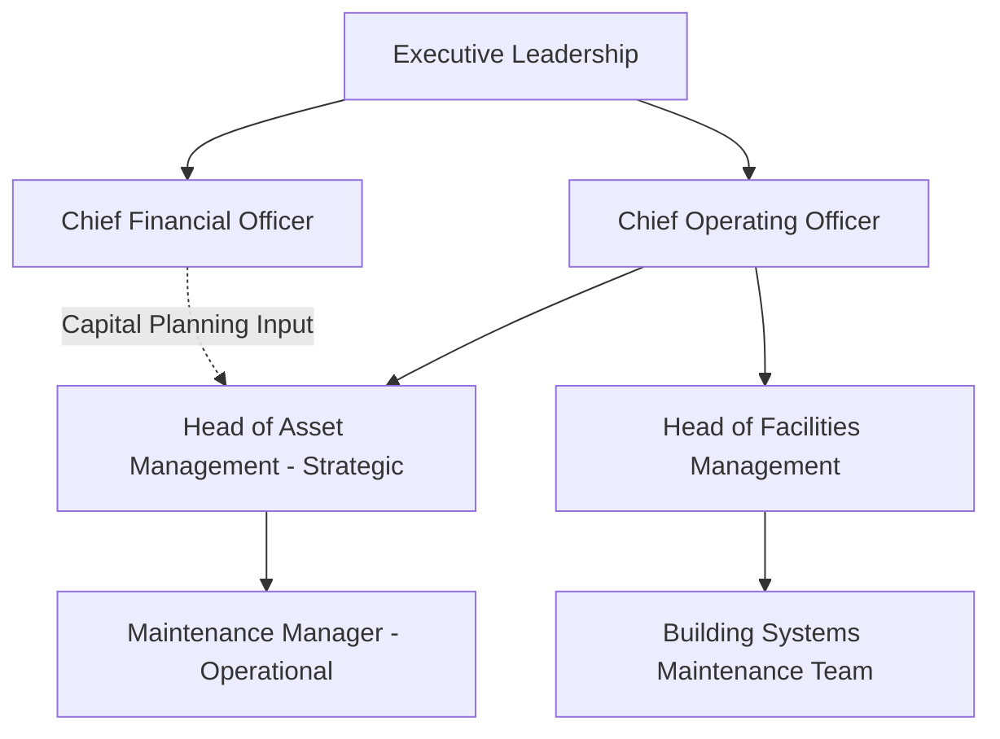

## Distinguishing Asset Lifecycle Management from Maintenance Management and Facilities Management

### Definition and Conceptual Overview

Asset Lifecycle Management (ALM), Maintenance Management, and Facilities Management (FM) are frequently used interchangeably in practice, yet they represent distinct disciplines with different scopes, time horizons, and objectives. Understanding their boundaries—and their overlaps—is foundational to correctly structuring organizational responsibilities, software system selection, and governance frameworks.

At a high level:

- **Asset Lifecycle Management** is the strategic, end-to-end discipline governing an asset from concept/planning through acquisition, operation, maintenance, and disposal, with the goal of optimizing value delivery against organizational objectives across the entire lifespan.
- **Maintenance Management** is a subset discipline focused specifically on sustaining asset functionality and reliability during the operational phase of the lifecycle.
- **Facilities Management** is a discipline focused on the built environment (buildings, grounds, workplace services) and the people/processes that occupy or use that environment, often blending physical asset upkeep with space management, safety, and occupant experience.

### Scope Comparison

### Asset Lifecycle Management: Defining Characteristics

**Key Points**

- Time horizon: full cradle-to-grave (or "cradle-to-cradle" in circular-economy contexts), often spanning decades for infrastructure or heavy industrial assets
- Governance level: strategic and tactical, tied directly to organizational objectives (see line-of-sight concept)
- Financial scope: full total cost of ownership (TCO), including capital expenditure (CapEx), operational expenditure (OpEx), and disposal/residual value
- Standards alignment: ISO 55000/55001/55002 series
- Decision focus: what assets to acquire, when to renew/replace, how to allocate capital across a portfolio, and how to balance risk, cost, and performance

ALM asks strategic questions such as: *"Should we replace this fleet of pumps now or defer capital for three more years given failure risk?"* or *"Does this asset class still serve our strategic objectives, or should it be divested?"*

### Maintenance Management: Defining Characteristics

**Key Points**

- Time horizon: operational phase only—typically day-to-day, weekly, monthly, or annual maintenance cycles
- Governance level: operational and tactical, rarely strategic
- Financial scope: primarily OpEx (labor, parts, contracted services); does not typically address acquisition or disposal costs
- Standards alignment: often governed by CMMS (Computerized Maintenance Management System) workflows, ISO 9001 quality processes, or reliability-centered maintenance (RCM) methodologies
- Decision focus: how to keep existing assets functioning reliably and safely within their current operational envelope

Maintenance management asks tactical questions such as: *"Is this pump due for its scheduled bearing replacement?"* or *"What caused last week's unplanned downtime, and how do we prevent recurrence?"*

**Example**

A maintenance manager tracks that a compressor requires oil changes every 500 operating hours and schedules a technician accordingly. This is maintenance management. An asset lifecycle manager evaluates whether, given rising maintenance costs and declining efficiency data trending over five years, that same compressor should be replaced with a newer, more energy-efficient model within the next capital planning cycle. This is asset lifecycle management drawing on maintenance data as an input.

### Facilities Management: Defining Characteristics

**Key Points**

- Time horizon: primarily operational and tactical, sometimes extending into space planning (which has a longer horizon)
- Governance level: operational, often reporting into corporate real estate or workplace services functions
- Financial scope: OpEx-heavy (utilities, cleaning, security, minor repairs), though major capital projects (renovations, retrofits) may fall partially under FM
- Standards alignment: ISO 41001 (Facility Management Systems), building codes, health and safety regulations
- Decision focus: ensuring the physical environment supports occupant needs, safety, compliance, and organizational productivity

FM asks questions such as: *"Is the HVAC system maintaining code-compliant air quality?"* or *"How do we reconfigure office space for a department reorganization?"* FM often incorporates maintenance management as one of its functional components (building systems maintenance) alongside non-asset-centric activities like space allocation, catering, security, and cleaning services.

### Structural Relationship Between the Three Disciplines

The three disciplines are not mutually exclusive; rather, they nest and overlap depending on organizational context.

| Dimension | Asset Lifecycle Management | Maintenance Management | Facilities Management |
| --- | --- | --- | --- |
| Primary time horizon | Full lifecycle (years to decades) | Operational phase only | Operational + tactical |
| Governance level | Strategic/tactical | Operational | Operational |
| Financial scope | Full TCO (CapEx + OpEx + disposal) | OpEx (labor, parts) | OpEx (services, minor CapEx) |
| Primary standard | ISO 55000 series | RCM, CMMS best practices | ISO 41001 |
| Core question | "What should we own and for how long?" | "How do we keep it running?" | "How do we support the people/space using it?" |
| Typical system of record | EAM (Enterprise Asset Management) | CMMS | IWMS (Integrated Workplace Management System) |
| Scope of assets covered | All organizational assets (physical, sometimes digital/intangible) | Physical operational assets | Buildings, grounds, workplace infrastructure |

### Software and Systems Distinction

**Key Points**

- **EAM (Enterprise Asset Management)** systems are built to support full ALM: asset registers, capital planning, lifecycle costing, condition assessment, and strategic reporting.
- **CMMS (Computerized Maintenance Management System)** systems focus narrowly on work order management, preventive maintenance scheduling, spare parts inventory, and technician dispatch. [Inference] Many organizations begin with a CMMS and later expand into EAM capabilities as asset management maturity increases, though this progression is not universal and depends heavily on organizational size and asset intensity.
- **IWMS (Integrated Workplace Management System)** systems focus on space management, lease administration, move/add/change tracking, and facility services—overlapping with CMMS functionality for building-system maintenance but extending into non-asset domains like real estate portfolio management.

Some vendors offer converged platforms that blur these lines commercially, but the underlying functional distinctions remain useful for scoping requirements and avoiding misaligned system selection.

### Organizational Reporting Lines (Typical Patterns)

[Inference] This reporting structure is a common pattern in mid-to-large organizations with mature asset governance, but smaller organizations frequently collapse these functions into a single role or department, meaning the structural distinction may exist conceptually without existing organizationally.

### Common Points of Confusion

**Key Points**

- **"Asset management" as a term is overloaded.** In financial services, "asset management" refers to managing investment portfolios—entirely unrelated to physical/infrastructure asset lifecycle management. Context must always disambiguate.
- **Maintenance management is often mistaken for the entirety of asset management.** Organizations that only track work orders and PM schedules, without a capital planning or strategic renewal framework, are practicing maintenance management, not full ALM, even if they label their department "Asset Management."
- **Facilities management sometimes fully absorbs maintenance management** in organizations where physical assets are primarily building-related (e.g., commercial real estate, universities, hospitals), making the FM/maintenance boundary organizationally invisible even though it remains conceptually distinct.
- **ALM extends beyond buildings and equipment.** Unlike FM, which is inherently tied to physical premises, ALM can encompass IT assets, fleet vehicles, linear infrastructure (roads, pipelines), and in some frameworks, intangible or digital assets—domains FM does not typically address.

### Practical Decision Framework: Which Discipline Owns This Decision?

**Example**

Consider a hospital deciding what to do about an aging MRI machine:

1. *"Should we replace this MRI machine now, refurbish it, or run it to failure?"* → **ALM decision** (capital planning, TCO analysis, strategic clinical capacity alignment)
2. *"The MRI's coolant system needs quarterly inspection per manufacturer specification."* → **Maintenance management decision** (scheduled task execution)
3. *"The room housing the MRI needs improved HVAC to meet updated humidity requirements."* → **Facilities management decision** (building systems, code compliance)

All three decisions relate to the same physical asset but are owned by different functional disciplines, often requiring cross-functional coordination to execute coherently.

### Conclusion

Asset Lifecycle Management, Maintenance Management, and Facilities Management differ primarily along the axes of time horizon, governance level, and financial scope. ALM provides the strategic umbrella under which maintenance management operates as an essential operational subset; Facilities Management is a parallel, partially overlapping discipline centered on the built environment rather than the asset itself. Organizations that conflate these disciplines—particularly by treating maintenance management as a complete substitute for ALM—typically underinvest in strategic capital planning and lack the line-of-sight traceability described in foundational ALM frameworks. [Unverified] The precise organizational boundary between these functions varies considerably across industries and cannot be generalized into a single universal structure without accounting for sector-specific asset intensity and regulatory context.

**Related Topics**

- Enterprise Asset Management (EAM) vs. CMMS vs. IWMS System Selection Criteria
- Reliability-Centered Maintenance (RCM) Methodology
- ISO 55000 vs. ISO 41001 Standards Comparison
- Total Cost of Ownership (TCO) and Lifecycle Costing Models
- Value Realization and Line of Sight to Organizational Objectives
- Capital Planning and Renewal Decision Frameworks
- Asset Register and Data Governance Structures
- Organizational Design for Asset Management Functions