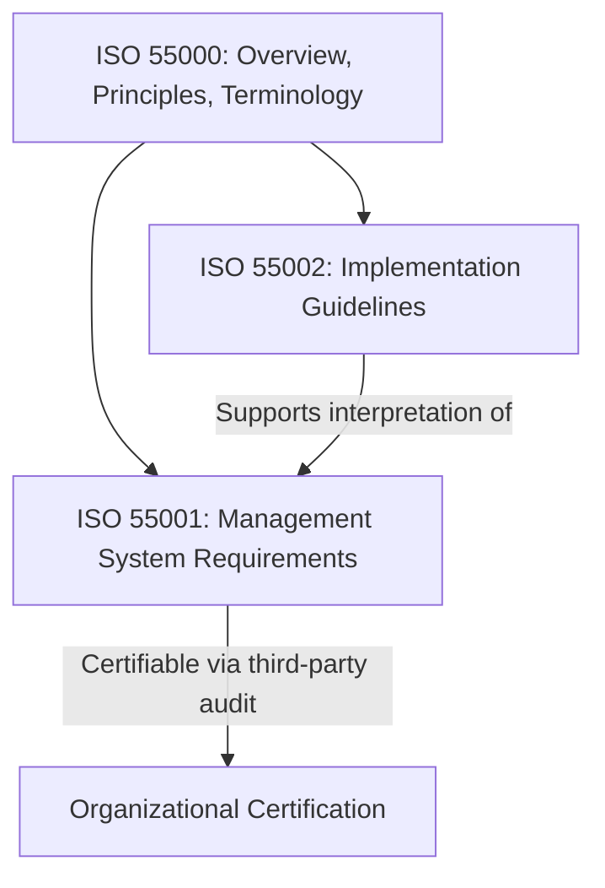
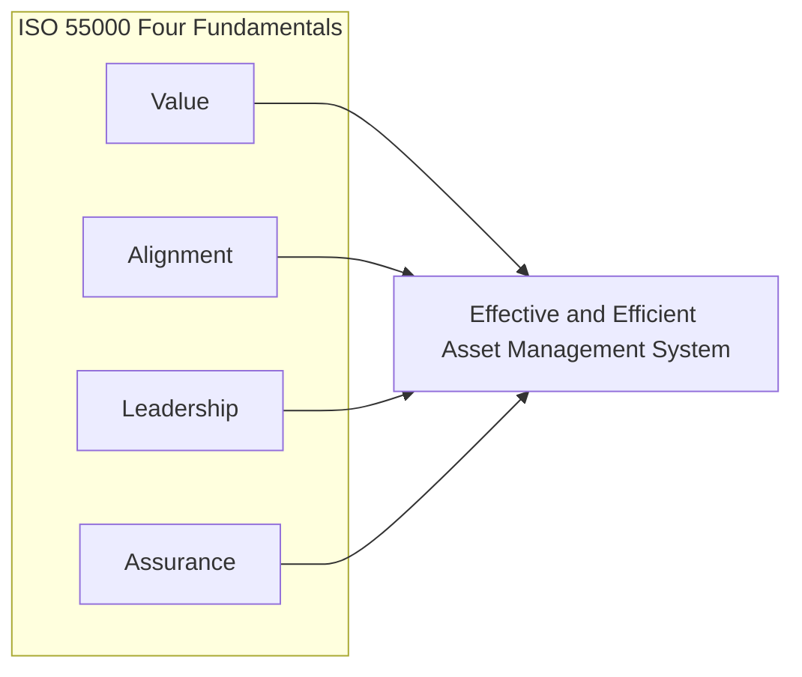
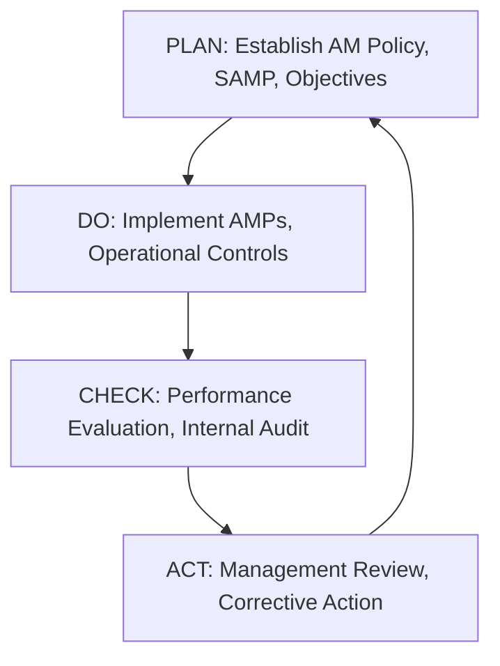

## ISO 55000 Terminology, Scope, and Guiding Principles

### Overview of ISO 55000 within the Standards Family

ISO 55000 is the foundational document in a three-part family of international standards for asset management, published by the International Organization for Standardization (ISO), first released in 2014. It establishes the vocabulary, overview, and conceptual foundation that the other two standards in the family build upon:

- **ISO 55000** — Overview, principles, and terminology (non-certifiable; conceptual foundation)
- **ISO 55001** — Requirements specification (the certifiable/auditable standard)
- **ISO 55002** — Guidelines for the application of ISO 55001 (implementation guidance)

ISO 55000 itself is not a certification standard; organizations cannot be "certified to ISO 55000." Certification applies only to ISO 55001. ISO 55000 exists to establish shared understanding and consistent terminology across the family and across organizations adopting asset management systems globally.

### Core Terminology Defined by ISO 55000

**Key Points**

- **Asset**: An item, thing, or entity that has potential or actual value to an organization. This definition is deliberately broad—value, not physical form, is the defining characteristic. Assets can be physical, financial, intangible, digital, or human/informational depending on organizational scope.
- **Asset Management**: The coordinated activity of an organization to realize value from assets. Note that "value" realization is embedded directly in the definition, tying back to the value-realization concept foundational to ALM.
- **Asset Management System**: A set of interrelated and interacting elements of an organization whose function is to establish asset management policy, asset management objectives, and processes to achieve those objectives.
- **Asset Portfolio**: The assets that are within the scope of the asset management system.
- **Line of Sight**: The relationship between organizational objectives and asset management decision-making, ensuring alignment from strategy down to operational execution (a term whose practical mechanics were covered in the value realization and line-of-sight foundations topic).
- **Strategic Asset Management Plan (SAMP)**: Documented information that specifies how organizational objectives are to be converted into asset management objectives, and the approach for developing asset management plans.
- **Asset Management Plan (AMP)**: Documented information that specifies the activities, resources, and timescales required for an individual asset, or a grouping of assets, to achieve the organization's asset management objectives.
- **Asset Management Objectives**: Specific, measurable outcomes that asset management activities are intended to achieve, derived from and aligned with organizational objectives.
- **Stakeholder**: A person or organization that can affect, be affected by, or perceive itself to be affected by a decision or activity related to assets.
- **Life Cycle**: The stages involved in the management of an asset, which can begin with conception of the need and extend through disposal.
- **Value**: Can be tangible or intangible, financial or non-financial, and is determined by the organization and its stakeholders, consistent with organizational objectives.

### Scope of ISO 55000

**Key Points**

- Applicable to **all types of assets**: physical infrastructure, equipment, IT systems, vehicles, buildings—though the standard is most frequently adopted by asset-intensive sectors (utilities, transportation, energy, manufacturing, local government).
- Applicable to **all types of organizations**: regardless of size, industry, or sector—public, private, and non-profit.
- Provides **guidance, not prescription**: the standard does not dictate specific tools, technologies, or organizational structures; it establishes principles and outcomes an asset management system should achieve, leaving implementation methods to the organization.
- Explicitly acknowledges the interconnection between asset management and other management systems (quality — ISO 9001; environmental — ISO 14001; occupational health and safety — ISO 45001), supporting integrated management system approaches.

### The Four Fundamentals / Guiding Principles

ISO 55000 articulates asset management around what are commonly referred to as the "four fundamentals" — value, alignment, leadership, and assurance. These serve as the conceptual pillars underpinning the entire standards family.

#### 1. Value

Assets exist to provide value to the organization and its stakeholders. Asset management does not focus on the asset itself as an end goal, but on the value the asset delivers. This principle requires organizations to clearly articulate what value means in their specific context (financial return, service delivery, risk reduction, sustainability, etc.) before asset management decisions can be meaningfully evaluated.

#### 2. Alignment

Asset management translates organizational objectives into technical and financial decisions, plans, and activities. This is the formal expression of "line of sight": asset management plans, objectives, and daily operational decisions must be demonstrably traceable back to organizational strategy, not developed in isolation by technical or operational teams.

#### 3. Leadership

Leadership and workplace culture are determinants of value realization. This principle recognizes that asset management systems fail without genuine organizational commitment—leadership must establish asset management policy, allocate resources, and cultivate a culture where asset management responsibilities are understood and embraced at all levels, not merely delegated to a technical department.

#### 4. Assurance

Asset management gives assurance that assets will fulfill their required purpose. This encompasses governance, risk management, and the ongoing verification (via audits, performance monitoring, and management review) that the asset management system is functioning as intended and continuously improving.

### Relationship to the Plan-Do-Check-Act (PDCA) Cycle

ISO 55001 (which operationalizes ISO 55000's principles) follows the same high-level structure (Annex SL) common to modern ISO management system standards, enabling integration with other certified management systems.

### Structural Relationship Between SAMP, Policy, and Objectives

**Example**

A municipal water authority's organizational objective is "provide safe, reliable, and affordable water services to residents." Under ISO 55000 terminology, this cascades as follows:

1. **Asset Management Policy** — a high-level statement of intent and direction, approved by top management, committing the organization to sound asset management practice
2. **Strategic Asset Management Plan (SAMP)** — translates the policy and organizational objectives into specific asset management objectives (e.g., "reduce water main failure rate by 15% over five years")
3. **Asset Management Plans (AMPs)** — developed for specific asset classes (e.g., a distribution pipe network AMP, a treatment plant AMP) detailing activities, budgets, and timelines needed to meet the SAMP's objectives
4. **Asset Management Objectives** — specific measurable targets embedded within the AMPs, monitored and reported against over time

This layered structure is the formal ISO 55000 expression of the strategic-to-tactical decomposition chain.

### Why Terminology Consistency Matters

**Key Points**

- Organizations undergoing multi-departmental or cross-jurisdictional asset management initiatives frequently experience friction when different teams use "asset," "value," or "asset management plan" inconsistently; ISO 55000's terminology section exists specifically to prevent this.
- Certification auditors (for ISO 55001) will assess whether an organization's internal documentation uses these terms consistently and correctly, since terminology drift is often a proxy indicator of conceptual misunderstanding of the broader system.
- [Inference] Organizations that adopt ISO 55000 terminology organization-wide, rather than confining it to a single asset management department, likely experience smoother cross-functional alignment, though the standard itself does not mandate organization-wide terminology adoption as a formal requirement.

### Common Misconceptions

- **"ISO 55000 is only for physical/industrial assets."** The standard's definition of "asset" is deliberately non-physical-specific; organizations have applied ISO 55000 principles to IT asset portfolios and, in some documented cases, to broader intangible asset classes, though physical infrastructure remains the dominant adoption context.
- **"ISO 55000 tells you how to maintain your assets."** It does not. The standard governs the *management system* around assets (policy, planning, governance, review)—it explicitly does not prescribe specific maintenance strategies, which remain the domain of standards like reliability-centered maintenance frameworks.
- **"Getting ISO 55000 certified" is a valid goal.** As noted, ISO 55000 is not certifiable. Only ISO 55001 supports third-party certification.

### Conclusion

ISO 55000 provides the conceptual scaffolding—terminology, scope boundaries, and guiding fundamentals (value, alignment, leadership, assurance)—upon which the certifiable ISO 55001 requirements and the implementation guidance of ISO 55002 are built. Its primary contribution to the discipline of Asset Lifecycle Management is establishing a common language and a principle-based (rather than prescriptive) framework that allows the standard to be applied consistently across radically different industries and asset types. [Unverified] The degree to which strict terminological adherence to ISO 55000 correlates with measurably improved asset management outcomes has not been comprehensively quantified across industries and should be treated as a reasonable but unproven assumption underlying the standard's design philosophy.

**Related Topics**

- ISO 55001 Requirements: Management System Structure and Certification Process
- ISO 55002 Implementation Guidelines and Practical Application
- Strategic Asset Management Plan (SAMP) Development
- Asset Management Policy Design and Governance
- Value Realization and Line of Sight to Organizational Objectives
- Integration with ISO 9001, ISO 14001, and ISO 45001 Management Systems
- Annex SL High-Level Structure for Management Standards
- Asset Management Maturity Models and Gap Assessments